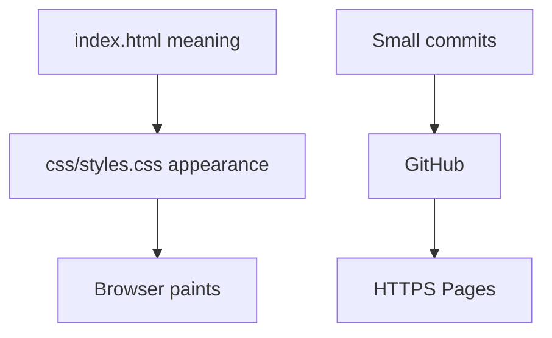

# Project 1 · Step 1
# Welcome: What You Will Ship

**Workshop:** [Project 1](README.md)  
**Spec:** [Accessible Responsive Portfolio](../../full_stack_project_requirements_2026/project_01_accessible_responsive_portfolio.md)  
**Textbook:** [Month 2](../../textbook/month-02/README.md)  
**Time:** 45–60 minutes (read, sketch, decide your name)

---

## The job

You will publish a **personal developer portfolio**: one HTML document, CSS you wrote, Git from the first commit, HTTPS on the public web.

It must work for:

- a mouse,
- a **keyboard-only** visitor,
- a phone near **375px**,
- a laptop near **1024px**,
- a wide desktop.

No backend. The contact form is **honest**: labeled fields, a submit control, and a sentence that nothing is sent yet.



---

## The finished shape

```
~/portfolio/
  .gitignore
  README.md
  index.html
  404.html
  css/
    styles.css
    print.css
  assets/
    favicon.svg
```

That is a **2026-friendly** static site: tokens in CSS, print as its own sheet, a real 404, SVG favicon, no `css/style.css` dumping next to ten unused folders.

On the page, in this order:

1. Skip link  
2. Sticky header: name, section links, dark-mode checkbox  
3. Hero: your name as **one** `h1`, role, two CTAs  
4. About  
5. Skills in **groups** — never “JavaScript 95%”  
6. At least **three** project cards  
7. Contact form  
8. Footer with profile links  

---

## Example vs you

The complete reference uses a teaching person: **Sam Rivera**. You will type the same **structure** with **your** name, **your** sentences, **your** GitHub URLs.

If you ship “Sam Rivera” unchanged, you failed the workshop even if the CSS is perfect.

Write now, on paper or in `NOTES.md`:

| Prompt | Your answer |
|---|---|
| Your name as it should appear | |
| One-line role | |
| Two sentences of about | |
| Three skill groups | |
| Three pieces of work (labs count) | |
| Public GitHub URL | |
| Email you are willing to publish | |

---

## How this workshop talks

I am your professor in the room. I will show **full files**. You type them. After Step 9 you may open `reference/` and diff. Until then, **your repo is empty except what you typed**.

Month 2 day files stay the theory book. If a CSS idea is foggy, repair from **this month’s textbook**, then come back here to build.

---

## Today's gate

Closed-book:

> Project 1 is one semantic page plus CSS, Git from commit one, keyboard usable, responsive at four widths, deployed on HTTPS. I will not use a framework. Sam Rivera is an example, not my identity.

When that sentence is yours, open [02-environment.md](02-environment.md).
