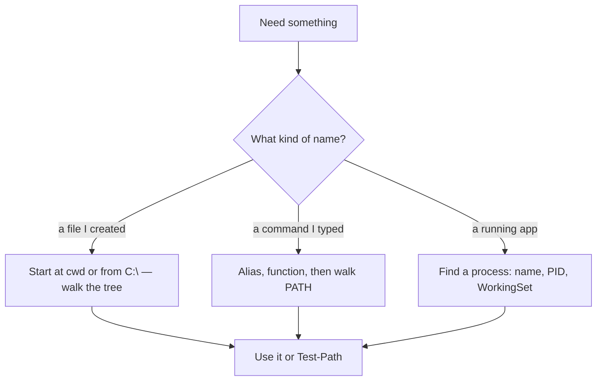

# Month 1 · Week 1 · Day 3
# Implement From Memory: The Machine and the Shell

**Program:** Full-Stack Mastery · 18 months  
**Phase:** 1 — Foundations  
**Month index:** [../../README.md](../../README.md)  
**Week 1:** [1](day-01.md) · [2](day-02.md) · Day 3 (today) · [4](day-04.md) · [5](day-05.md) · [6](day-06.md) · [7](day-07.md)  
**Week rhythm today:** Implement from memory  
**Student state:** Days 1–2 taught the machine model and the shell. Today those ideas must come out of *your* terminal, not yesterday’s open file.  
**Study time:** 3–4 focused hours  
**Machine today:** Windows PowerShell  
**Prereq:** Day 2 gate passed.

**This week covers:** operating systems, CPU, memory, storage, files/directories, paths, processes, programs vs processes, terminal, environment variables, PATH.

Today is a **closed-book recap**. You rebuild a tree, inspect processes and PATH, and write `inspect-machine.ps1` from memory. Day 4 turns that script into a small tool. Do not skip the debugging block.

Labs: `~\fullstack-lab\week-01\`.

---

## How to use this textbook

1. Read a section. Close it. Say the idea in a full sentence.
2. Type every lab. Do not paste Day 1’s tree or Day 2’s PATH notes.
3. Predict what a command will do **before** you run it. Then run it.
4. Optional review links at the end are for later rechecking — not for first learning.

---

## How to read this chapter

Days 1–2 taught three systems that share English words and must not share a mental drawer:

- **A path** is how you point at a **file** in the directory tree (`C:\Users\...` or `.\alpha\one.txt`).
- **PATH** (all caps) is an **environment variable**: an ordered list of **directories** the shell searches for **programs**.
- **A process** is a **running** program, with a PID and RAM. The `.exe` on disk is not the process.

If you mix them, you will “fix” a missing file by editing PATH, or “fix” `git is not recognized` by `cd` into a random folder. Both look busy. Both miss the system that actually failed.



The recap below **is** the lesson. The drills and script spec at the bottom are the exam. Read until you can teach a path, PATH, and a PID without peeking.

Days 1–2 stay **closed during drills**. Repair from **this recap** first. If you are stuck 25 minutes, open **those files in this textbook** — not a blog, not a paste of yesterday’s lab.

---

## Today's contract

Rebuild Week 1 skills as if you were asked in a lab exam.

By the end of this day you will be able to:

1. Build a small directory tree with **relative** paths only, then prove it.
2. Start two processes of the same program and write both PIDs.
3. Prove where `git.exe` lives and how many PATH entries you have.
4. Write `inspect-machine.ps1` from memory so a human can read the report.

**Today's gate**

> Using only the terminal and your notes, produce a machine report file that includes OS, CPU, RAM, disk, current path, git location, and PATH entry count — and explain each line.

---

## Time box

| Block | Minutes | Work |
|---|---|---|
| A | 20 | Closed-book oral review (no typing yet) |
| B | 60 | Memory drills (filesystem + processes) |
| C | 80 | Build `inspect-machine.ps1` from memory |
| D | 40 | Broken-script debugging |
| E | 15 | Recall what you looked up |

---

# Complete explanation — the machine you must still own

## 1. Four parts, not one blob

A computer **stores data** and **follows instructions**. Almost every machine you will use has the same shape:

| Part | Job |
|---|---|
| **CPU** | Executes instructions (fetch, decode, execute) |
| **RAM** | Holds what is being used *right now* — fast, volatile |
| **Storage** | Holds files when power is off |
| **I/O** | Keyboard, screen, disk, network |

**The CPU can only work on data that is in RAM.** A file on disk is stored, not used, until the OS copies some of it into RAM.

The **operating system** owns the machine. The desktop wallpaper is not the OS. The **kernel** talks to hardware. Ordinary programs (browser, PowerShell, later FastAPI) live in **user space** and ask the kernel for files, memory, and network.

> **Wrong belief:** “The OS is the desktop.”  
> **Correct:** the desktop is an app. The OS is the kernel plus system programs that manage CPU, RAM, files, and devices.

## 2. Files, directories, and paths

A **file** is a named sequence of bytes plus metadata (size, timestamps). A **directory** holds names of files and other directories. The filesystem is a **tree**. On Windows the usual root of your main disk is `C:\`.

A **path** is how you point:

- **Absolute** — starts from a drive root. It does not depend on where you currently are. Example: `C:\Users\Universe\fullstack-lab\week-01`.
- **Relative** — starts from the **current working directory**. If you are in `week-01\memory`, then `alpha\one.txt` means that file under `memory`.

Special names you must still own:

| Symbol | Meaning |
|---|---|
| `.` | this directory |
| `..` | parent directory |
| `~` | home directory (PowerShell understands this) |

The terminal always has a current location. If a command “cannot find a file,” ask: **Where am I, and what path did I actually type?** `Get-Location` answers the first half. `Test-Path` answers whether that name exists.

Copy, move, rename, and delete are **name operations**. `Copy-Item` leaves the original. `Move-Item` relocates or renames. `Remove-Item` has no undo. Do those only inside `fullstack-lab` folders you created.

> **Wrong belief:** “The file is wherever I last clicked in Explorer.”  
> **Correct:** the file is at a path. Explorer and the shell see the same tree. The shell is more precise.

## 3. Program vs process

A **program** is a file on storage: `notepad.exe`, `git.exe`, later `python.exe`. A **process** is that program **currently running**. It has:

- a **PID** (process identifier) for this run
- **RAM** (WorkingSet is the bytes currently in physical memory for that process)
- a copy of **environment variables** from when it started
- a current directory and open handles (files, network)

One program, many processes: two Notepad windows are two processes, two PIDs, same program file. Close them and `Get-Process notepad` fails — the processes are gone; `notepad.exe` is still on disk.

**Do not** kill unknown processes. Inspect only, unless you started it.

> **Wrong belief:** “The program on disk *is* the running app.”  
> **Correct:** the file is the recipe. The process is the cooking.

## 4. Terminal, environment, PATH

The **terminal** (PowerShell today) reads a line, finds a program, starts a process, and shows output.

**Environment variables** are named strings (`USERNAME`, `USERPROFILE`, `PATH`). Child processes inherit them. `$env:FOO = "x"` in this window is **session-only**. Close the window and it is gone unless you persisted it in Windows settings.

**PATH** is a list of directories, separated by `;` on Windows. When you type `git`, the shell does **not** search the whole disk. It checks aliases and functions, then walks PATH **in order**. The first match wins.

If Git was installed while this window was open, this window’s PATH may still be old. **Reopen the terminal.**

On Windows, a script in the current directory is `.\script.ps1`. Bare `script.ps1` is not how PATH works for local scripts. That is a security design: a random download must not hijack `git`.

If scripts are blocked, `Get-ExecutionPolicy -List` inspects policy. A reasonable student fix is `Set-ExecutionPolicy -Scope CurrentUser RemoteSigned` — local scripts you wrote can run; you did not disable policy for every user on the machine.

Debugging order when a command fails:

1. Exact error — read it.
2. `Get-Location` — where am I?
3. `Test-Path` — does that name exist?
4. Typo in the command name?
5. `Get-Command` — is the program found?
6. PATH — is the install directory on the list?
7. Right shell (PowerShell, not CMD by accident)?
8. Execution policy?

> **Wrong belief:** “PATH is my current folder.”  
> **Correct:** PATH is a search list for **programs**. Your current folder is a **working directory** for **files**.

## 5. What `inspect-machine.ps1` is for

You are not writing a product for strangers yet. You are writing a **labeled report** of *this* machine: who you are, where the shell is, what OS and CPU you have, how much RAM, what drives exist, how many processes, where `git` is, how long PATH is.

`Get-CimInstance` asks Windows for hardware and OS facts. `Get-Process` lists processes. `Get-PSDrive` lists drives. `Get-Command` finds a program the same way the shell would. `Get-Location` is the **shell’s** current directory — not “where the script file lives.” (Day 4 will name `$PSScriptRoot` for the script folder.)

Output must be human-readable **labels**, not a raw dump of objects. A number without a unit or a name is not a report.

`Out-File` writes what would have gone to the screen into a file. Seeing output on the screen is a stream to the host. Redirecting captures that stream. If a line is empty, fix the script and re-run. Do not edit the report by hand and call it a test.

---

# Block A — Speak first

Out loud, no notes:

1. CPU vs RAM vs storage.
2. Program vs process.
3. Absolute vs relative path.
4. What PATH is.
5. What happens if you type a command that is not an alias, not a function, and not on PATH.

If any answer is mush, write a two-sentence correction in `week-01/day-03-notes.txt` **after** you try. Then go to Block B.

---

# Block B — Memory drills

Work in `~\fullstack-lab\week-01`.

### Drill 1 — Tree from nothing

Create this exact tree. No copy from Day 1.

```
week-01/memory/
  alpha/
    one.txt
  beta/
    two.txt
```

`one.txt` contains `alpha`. `two.txt` contains `beta`.

Then, using **relative** paths only from `week-01/memory`:

- copy `alpha/one.txt` to `beta/one-copy.txt`
- rename `beta/two.txt` to `beta/two-renamed.txt`
- move `beta/one-copy.txt` to `alpha/`
- delete `beta/two-renamed.txt`

Prove the final tree with `Get-ChildItem -Recurse`. It should be:

```
memory/alpha/one.txt
memory/alpha/one-copy.txt
memory/beta/          (empty of files)
```

If that is not what you have, stop. `Get-Location`. `Test-Path`. Fix. Do not delete `fullstack-lab`.

### Drill 2 — Two processes

Start two Notepad processes. Write both PIDs into `week-01/day-03-notes.txt`. Close them. Confirm `Get-Process notepad` fails.

### Drill 3 — PATH proof

Without looking at Day 2, produce:

- the path of `git.exe`
- the number of PATH directories
- whether `curl.exe` exists (`Get-Command curl.exe`)

Write the three facts in the notes file.

---

# Block C — Independent implementation

Create `~\fullstack-lab\week-01\inspect-machine.ps1`.

The script must print a readable report with **labels**:

1. Username
2. Computer name
3. Current location (absolute)
4. OS caption and architecture
5. CPU name, cores, logical processors
6. Total RAM in GB (rounded)
7. Filesystem drives (name + free space)
8. Number of running processes
9. Full path to `git` if available, otherwise a clear `git not found`
10. Number of PATH entries

Constraints:

- You may use `Get-CimInstance`, `Get-Process`, `Get-PSDrive`, `Get-Command`, `Get-Location`, environment variables.
- You may not call a script you already wrote except by rewriting it.
- Output must be understandable to a human. Not a raw dump of objects with no labels.

Run it:

```powershell
cd ~\fullstack-lab\week-01
.\inspect-machine.ps1
```

Redirect a copy into the repo:

```powershell
.\inspect-machine.ps1 | Out-File -FilePath machine-report.txt -Encoding utf8
```

Open `machine-report.txt`. If a line is empty or wrong, fix the script. Re-run.

**Test claims** (write yes/no in notes):

| ID | Claim | How you check |
|---|---|---|
| T1 | Script runs without error | Exit: no red error |
| T2 | Location is an absolute path | Starts with `C:\` or another drive |
| T3 | RAM number is plausible | Matches Day 1 inspection roughly |
| T4 | Git line is a real path or `not found` | `Test-Path` on that path |
| T5 | Process count > 0 | Obviously |

A failed claim is a failed test. Fix the script, not the claim.

---

# Block D — Debugging challenge

Create `~\fullstack-lab\week-01\broken-report.ps1` by typing this **broken** file exactly:

```powershell
Write-Host "User: $env:USERNAM"
Write-Host "Here: Get-Location"
Get-Process notapad | Select-Object Id
Get-Content C:\this\path\is\wrong\notes.txt
```

Run it. It will fail.

Your job:

1. For **each** line, write: what is wrong, what evidence you have, what the fix is.
2. Copy to `broken-report.fixed.ps1` and make it work:
   - correct username variable
   - actually print the location (not the string `Get-Location`)
   - either start notepad and then query it, or query a process that exists (for example `explorer`)
   - do not read a fake path; read a file that exists in `fullstack-lab`

Do not “fix” by deleting all four lines. Each intended behavior must remain.

This is the Month 4 debugging habit, started now: **regression means the report still does its job after the fix.**

---

# Block E — Commit and recall

```powershell
cd ~\fullstack-lab
git add week-01
git status
git diff --cached
git commit -m "Week 1 Day 3: inspect-machine script and debugging fixes."
```

Read `git diff --cached` before you commit. If a secret appeared, abort: do not commit it. (There should be none.)

Closed-book:

1. Which Day 3 task forced you to look something up? Write it.
2. Explain one error you saw today as if to a beginner.
3. What is the difference between `Out-File` and seeing output on the screen?

---

## Definition of done

- [ ] Memory tree drill matches the expected final tree.
- [ ] `inspect-machine.ps1` runs and writes `machine-report.txt`.
- [ ] Five test claims checked.
- [ ] Broken script diagnosed line by line and fixed in a separate file.
- [ ] Work committed.
- [ ] Look-up list written (even if empty).

---

## Tomorrow — Day 4

You will turn these scripts into a small **lab product**: structure, a real feature, the start of a README. Still not Project 1.

---

## Optional review links

Paths, processes, and PATH are explained in this chapter. These pages are for later checking, not for first learning.

- [PowerShell: about_Locations](https://learn.microsoft.com/en-us/powershell/module/microsoft.powershell.core/about/about_locations)
- [PowerShell: about_Environment_Variables](https://learn.microsoft.com/en-us/powershell/module/microsoft.powershell.core/about/about_environment_variables)
- [PowerShell: Get-Process](https://learn.microsoft.com/en-us/powershell/module/microsoft.powershell.management/get-process)
