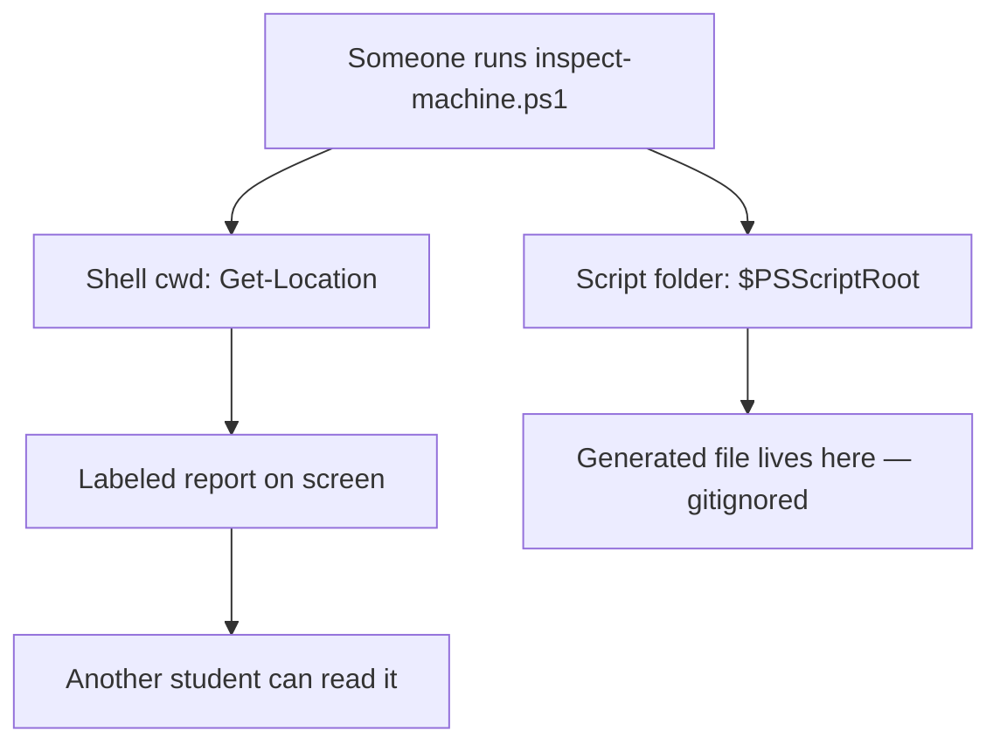

# Month 1 · Week 1 · Day 4
# Lab Feature: A Machine Inspector You Can Hand to Someone

**Program:** Full-Stack Mastery · 18 months  
**Phase:** 1 — Foundations  
**Month index:** [../../README.md](../../README.md)  
**Week 1:** [1](day-01.md) · [2](day-02.md) · [3](day-03.md) · Day 4 (today) · [5](day-05.md) · [6](day-06.md) · [7](day-07.md)  
**Week rhythm today:** Add a real project feature  
**Student state:** You have `inspect-machine.ps1` from Day 3. Today it becomes a small tool: layout, two features, a README, and a commit that names the feature.  
**Study time:** 3–4 focused hours  
**Machine today:** Windows PowerShell  

This is **not** Roadmap Project 1 (that is Month 2, HTML/CSS portfolio).  
This is the weekly “project work” the roadmap requires: a real artifact in `~\fullstack-lab\`.

**This week covers:** OS, CPU, RAM, storage, files, paths, processes, PATH — now packaged so another student could run the inspector without you standing there.

---

## How to use this textbook

1. Read a section. Close it. Say the idea in a full sentence.
2. Write the design file **before** you edit the script.
3. Type the feature yourself. `Get-Help Select-Object -Examples` is allowed. Day 2 textbook is not.
4. Optional review links at the end are for later rechecking — not for first learning.

---

## How to read this chapter

A **feature** is a behavior a person can name: “show the eight heaviest processes” is a feature. “I tweaked the script” is not.

Two locations will fight you if you mix them:

- **Current working directory** — where the **shell** is (`Get-Location`). That is where relative paths in the *session* point.
- **Script directory** — where the **`.ps1` file** lives (`$PSScriptRoot`). That is where the tool itself lives.

If the script uses `Get-Location` to mean “next to me,” then `cd ~` and running the full path writes the report in the wrong place. Print **both**. Use `$PSScriptRoot` when you mean the script’s folder.



> **Wrong belief:** “The script always runs ‘in its folder.’”  
> **Correct:** the process starts with the caller’s working directory unless you change it. `$PSScriptRoot` is the folder that contains the file.

The teaching below **is** the lesson. The layout, features, README, and git blocks are the exam.

---

## Today's contract

Turn yesterday’s script into a small tool with:

- a clear folder layout
- a new **feature**: top processes by RAM + a PATH diagnostic
- a README another student could follow
- Git history that shows the feature as a commit

**Today's gate**

> Someone who is not you can clone this folder (later, from GitHub) and know what to run, what it prints, and what it does not do.

---

## Time box

| Block | Minutes | Work |
|---|---|---|
| A | 30 | Design the layout and the feature (on paper / in notes) |
| B | 50 | Implement the feature in the script |
| C | 70 | README + run instructions + limitations |
| D | 35 | Git commit that describes the feature |
| E | 15 | Explain the tool aloud |

---

# Complete explanation — a tool, not a pile of commands

## 1. Requirements before typing

Engineering starts with **who, problem, out of scope, inputs, outputs, how you know it works**. If you skip that, you grope in the script and cannot explain the product.

This inspector is for **you, in a later week**, when you forgot how this machine is set up. The problem is: one command to snapshot OS, CPU, RAM, disk, git, PATH, and heavy processes. It does **not** fix the machine, send data anywhere, or require administrator rights. Inputs today: none. Outputs: labeled text on the screen; optional file.

That is the same habit Month 18 still uses. The scale changes. The order does not.

## 2. `$PSScriptRoot` vs `Get-Location`

`$PSScriptRoot` is a string PowerShell sets while a script runs: the directory that contains that script file. It does not change when you `cd`.

`Get-Location` is the shell’s current directory. It **does** change when you `cd`.

When you run:

```powershell
cd ~
~\fullstack-lab\week-01\inspect-machine.ps1
```

the **script file** is still under `week-01`. The **cwd** is your home folder. Print both labels. If you write a report file, join it with `$PSScriptRoot`:

```powershell
$reportPath = Join-Path $PSScriptRoot "machine-report.txt"
```

`Join-Path` builds a path the OS understands. Do not glue strings with `\` by guesswork if you can join.

## 3. Top processes by RAM

`Get-Process` returns objects. Each has `ProcessName`, `Id`, and `WorkingSet` (bytes of physical RAM the process is using *now*). That is not “how big the program file is on disk.”

To show the eight heaviest:

1. Sort descending by `WorkingSet`.
2. Take 8.
3. Print name, PID, and RAM in **MB** (WorkingSet / 1MB, rounded).

You will need `Sort-Object`, `Select-Object`, and a calculated property. A calculated property is a hashtable with `Name` and `Expression` so you can print `RAM_MB` instead of a huge byte count.

System processes will appear. That is honest. The feature is a snapshot, not a verdict that those processes are “bad.”

> **Wrong belief:** “WorkingSet is the size of the `.exe` on disk.”  
> **Correct:** WorkingSet is RAM the **process** is using now. The file on storage can be small while the process holds a lot of data.

## 4. PATH diagnostic

You already know PATH is an ordered list of directories. A **diagnostic** answers: how many entries, are the tools we care about found, and what are the **first** few directories (the whole PATH is long and noisy).

`Get-Command git -ErrorAction SilentlyContinue` is the same lookup the shell uses, without throwing a red error if git is missing. If git is missing, print a one-line hint: install Git for Windows and **reopen** the terminal — a new install does not rewrite PATH in a window that was already open.

Use `curl.exe`, not `curl`. In PowerShell, `curl` can be an alias for `Invoke-WebRequest`. The real program is `curl.exe`.

## 5. Generated output is not source

`machine-report.txt` contains machine-specific facts (username, paths). That is not a password, but it is **personal environment data**. Prefer **not** committing generated reports. Add `machine-report.txt` to `.gitignore`. The script can always regenerate it.

**Source** is what you wrote (the `.ps1`, the README). **Generated** is what a run produced. Git tracks source. That instinct will matter for build folders, logs, and later `.env` files.

Recommended: do **not** silently overwrite files until the README says so. Printing to screen is enough; the user can redirect with `Out-File`. If you do write a file, say so in the README so reality and docs match.

## 6. README as a test of understanding

If you cannot write how to run it, what it prints, and what it does **not** do, you do not understand the tool yet. A command in the README must work if typed in a **new** PowerShell. Use `~\fullstack-lab` or say “your path.”

Commit messages: imperative (“Add …”), say what the snapshot is. `git add .` is allowed only after you read `git status`. Never blindly add secrets.

---

# Block A — Design before typing

Write `week-01/design-day-04.txt` first. If you skip this, you will grope in the script.

Answer:

1. **Who is it for?** (You, in Week 4, when you forgot how this machine is set up.)
2. **What problem does it solve?** (One command to snapshot OS / CPU / RAM / disk / git / PATH / heavy processes.)
3. **What is out of scope?** (It does not fix the machine. It does not send data anywhere. It does not require admin.)
4. **Inputs?** (None for now — no parameters.)
5. **Outputs?** (Labeled text on the screen; optional file.)
6. **How will you know it works?** (The test claims from Day 3 plus two new ones.)

This is engineering, not “just coding.” Month 18 still starts here: requirements before implementation.

Target layout:

```
fullstack-lab/
  README.md                 (you may start a stub today; finish Day 5)
  .gitignore
  week-01/
    inspect-machine.ps1     (main tool)
    env-report.ps1          (smaller tool from Day 2)
    machine-report.txt      (generated; decide if Git should track it)
    day-03-notes.txt
    ...
```

**Design decision:** should `machine-report.txt` be committed?

It contains machine-specific facts (username, paths). That is not a password, but it is **personal environment data**. Prefer **not** committing generated reports. Add `machine-report.txt` to `.gitignore`. The script can always regenerate it.

That is a professional instinct: generated output ≠ source.

---

# Block B — Feature implementation

Open `inspect-machine.ps1`. Keep all Day 3 output. **Add** two sections.

### Feature 1 — Top 8 processes by RAM

Print a table:

- ProcessName
- Id
- RAM in MB (WorkingSet / 1MB, rounded)

Sort descending by WorkingSet. Take 8.

You will need `Sort-Object`, `Select-Object`, and a calculated property. If you forgot the syntax, `Get-Help Select-Object -Examples` is allowed. Day 2 textbook is not.

### Feature 2 — PATH diagnostic

Print:

- PATH entry count
- Whether `git` is found (`Get-Command git -ErrorAction SilentlyContinue`)
- Whether `curl.exe` is found
- The first 5 PATH directories (not the whole PATH — it is long and noisy)

If `git` is missing, print a one-line hint: install Git for Windows and reopen the terminal.

### Feature 3 — Optional output file

At the end of the script, also write the same screen output to `week-01/machine-report.txt` **or** document that the user should pipe to `Out-File`. Pick one and make the README match reality.

Recommended: do **not** silently overwrite files until you say so in the README. Printing to screen is enough; the user can redirect. If you do write a file, write it next to the script using `$PSScriptRoot`:

```powershell
$reportPath = Join-Path $PSScriptRoot "machine-report.txt"
```

`$PSScriptRoot` is the folder that contains the script, not “wherever the shell happens to be.” Use it. Otherwise `cd ~` then running the script writes the report in the wrong place.

### Run from another directory (this is the feature check)

```powershell
cd ~
~\fullstack-lab\week-01\inspect-machine.ps1
```

If the script uses `Get-Location` to mean “where the script lives,” that is a bug. Location is where the **shell** is. Script folder is `$PSScriptRoot`. Print **both**:

- Current working directory
- Script directory

That distinction will matter for every future tool.

---

# Block C — Documentation

Create or replace `~\fullstack-lab\README.md`. This is the communication skill from the roadmap. Type it yourself.

Minimum sections:

```markdown
# fullstack-lab

Personal lab repository for the Full-Stack Mastery program (Month 1).

## What this is

Scripts and notes from computer, network, HTTP, and Git labs.
This is not the HTML portfolio (Project 1).

## Setup

- Windows PowerShell
- Git
- Execution policy: CurrentUser RemoteSigned (see below)

## Run the machine inspector

```powershell
cd path\to\fullstack-lab\week-01
.\inspect-machine.ps1
```

## What it prints

(list the sections)

## What it does not do

- Does not change PATH
- Does not send data to a network
- Does not require administrator rights

## Layout

(explain folders)

## License / privacy

Reports may include your username and paths. Do not publish generated reports.
```

Fill every parenthesis with real sentences.

Also update `.gitignore`:

```
Thumbs.db
.DS_Store
week-01/machine-report.txt
```

If `.gitignore` already has lines, add, do not blindly overwrite.

---

# Block D — Git as a feature history

```powershell
cd ~\fullstack-lab
git status
git diff
git add README.md .gitignore week-01/inspect-machine.ps1
git status
git commit -m "Add process and PATH diagnostics to machine inspector."
git log --oneline
```

Commit message rules (start now):

- Imperative: “Add …” not “Added …” or “I did …”
- Say **why / what** the snapshot is, not “update files”

`git add .` is allowed only after you read `git status`. Never blindly add secrets.

---

# Block E — Explain the product

Closed-book, speak:

1. How do I run it?
2. Why `$PSScriptRoot` vs `Get-Location`?
3. Why is the report gitignored?
4. What would you add next week (and what would you refuse to add)?

Write a four-line `week-01/limitations.txt`: known limitations. The roadmap requires known limitations on serious work. Start the habit.

Examples of honest limitations:

- Windows-only
- RAM rounding is approximate
- Top processes include system processes
- PATH list is truncated

---

## Definition of done

- [ ] Design file written **before** the feature was coded (or you redid design because you skipped it — be honest).
- [ ] Inspector prints top processes and PATH diagnostic.
- [ ] Running the script from `~` still makes sense (cwd vs script dir).
- [ ] README can be followed by a beginner.
- [ ] Generated report is gitignored.
- [ ] One focused commit for the feature.

---

## Tomorrow — Day 5

Tests (claims that can fail), refactor, documentation pass. You will make this tool boring and reliable.

---

## Optional review links

`$PSScriptRoot`, parameters, and help are explained in this chapter. These pages are for later checking, not for first learning.

- [PowerShell: about_Automatic_Variables (`$PSScriptRoot`)](https://learn.microsoft.com/en-us/powershell/module/microsoft.powershell.core/about/about_automatic_variables)
- [PowerShell: Select-Object](https://learn.microsoft.com/en-us/powershell/module/microsoft.powershell.utility/select-object)
- [Git: gitignore](https://git-scm.com/docs/gitignore)
