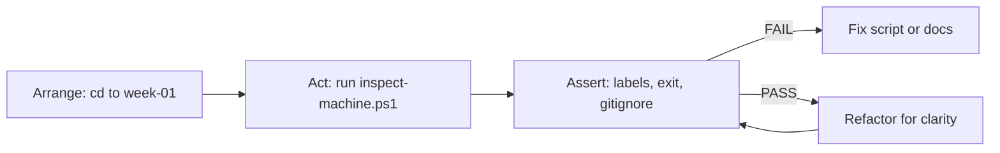

# Month 1 · Week 1 · Day 5
# Tests, Refactor, Documentation

**Program:** Full-Stack Mastery · 18 months  
**Phase:** 1 — Foundations  
**Month index:** [../../README.md](../../README.md)  
**Week 1:** [1](day-01.md) · [2](day-02.md) · [3](day-03.md) · [4](day-04.md) · Day 5 (today) · [6](day-06.md) · [7](day-07.md)  
**Week rhythm today:** Tests + refactor + documentation  
**Student state:** The inspector has features. Today those features must be **checkable**, then the script gets clearer **without** changing behavior.  
**Study time:** 3–4 focused hours  
**Machine today:** Windows PowerShell  

The roadmap: testing is not a Month-14-only skill. You do not have pytest or Vitest yet. You still test.

Labs: `~\fullstack-lab\week-01\`.

---

## How to use this textbook

1. Read a section. Close it. Say the idea in a full sentence.
2. Fill `TESTS.md` by **running**, not by wishing.
3. Commit the test plan before you refactor, so `git diff` on the second commit is only structure.
4. Optional review links at the end are for later rechecking — not for first learning.

---

## How to read this chapter

A **test** is a claim about behavior that **can fail**. “I ran it and it looked fine” is not a test. “The output contains the label `User:`” is a test.

**Refactor** means change the **structure** of code without changing **what it does**. If a test fails after a rename, the refactor changed behavior — fix the code, not the claim.



> **Wrong belief:** “Tests are for later, when we have a framework.”  
> **Correct:** a framework only **runs** claims automatically. The claim is the test. You can write claims today.

The teaching below **is** the lesson. The table in Block B is the exam.

---

## What “test” means today

A **test** is a claim about behavior that can fail.

Not a test:

- “I ran it and it looked fine.”
- “I watched a tutorial.”

A test:

- “When I run `.\inspect-machine.ps1`, the process exits with code 0.”
- “The output contains the label `User:`.”
- “`machine-report.txt` is not tracked by Git.”

Later, a test framework will run claims automatically. Today **you** run them and record pass/fail. Same idea.

---

## Today's contract

1. Write a test plan for the inspector.
2. Run every claim. Fix failures.
3. Refactor the script for clarity **without** changing behavior (tests still pass).
4. Finish documentation: README, how to test, limitations.

**Today's gate**

> I can break one line of the script on purpose and show which claim fails.

---

## Time box

| Block | Minutes | Work |
|---|---|---|
| A | 35 | Theory: test anatomy, refactor meaning, docs |
| B | 50 | Write and run `week-01/TESTS.md` |
| C | 70 | Refactor `inspect-machine.ps1` |
| D | 40 | Documentation pass |
| E | 15 | Deliberate-break drill |

---

# Block A — Theory

## 1. Test anatomy (you will see this in JavaScript and Python later)

Every useful test has:

1. **Arrange** — set up (here: `cd` to the script folder).
2. **Act** — run the thing (`.\inspect-machine.ps1`).
3. **Assert** — check a claim (output contains `Git`, exit code 0).

If you cannot name the assert, you do not have a test.

Arrange is not optional. If you run the script from a random folder and a relative path breaks, you have not tested the tool — you have tested your cwd. Day 4 already taught `$PSScriptRoot`. Today’s tests should still `cd` to `week-01` so the arrange is honest and repeatable.

## 2. Kinds of checks this month

| Kind | Example |
|---|---|
| Smoke | The script starts and finishes |
| Output contract | Labels exist |
| Invariant | PATH count is an integer ≥ 1 |
| Negative | A missing file produces an error you understand |
| Process | Git does not track generated reports |

A **smoke** test answers “does it even run?” An **output contract** answers “does it still speak the language the README promised?” An **invariant** is a fact that should stay true on every healthy machine (you have at least one PATH entry). A **negative** test is allowed to fail the *program under test* in a **known** way — you still pass the *claim* if the error is the one you expected. A **process** test is about Git or docs, not about CPU.

You cannot honestly assert “RAM is always 16 GB.” That is a fact about *your* laptop, not about the script. Test **your** behavior: the script prints a RAM line with a number.

## 3. Exit codes and red text

Exit code note: some native commands set `$LASTEXITCODE`. A PowerShell script that only uses cmdlets may still end cleanly even if a command inside wrote an error. **Also** look for red errors. Both matter.

`$LASTEXITCODE` is the exit code of the last **native** program (`git.exe`, `curl.exe`). Cmdlets like `Get-Process` use a different error stream. A script can print red and still leave `$LASTEXITCODE` empty. Your smoke test is: no unexpected red, and the report looks complete.

```powershell
cd ~\fullstack-lab\week-01
.\inspect-machine.ps1
echo "LASTEXITCODE=$LASTEXITCODE"
```

## 4. Refactor

**Refactor** means change the structure of code **without** changing what it does.

Allowed today:

- Better names
- Comments that explain *why*
- Grouping related `Write-Host` lines
- Using `$PSScriptRoot` consistently

Not a refactor (do these only if tests still make sense):

- New features
- Deleting the PATH section because it is ugly

Roadmap Rule 7: correctness → clarity → measurement → optimization. Today is **clarity**. Do not micro-optimize process listing.

Commit tests first if they are ready. Then refactor in a **second** commit. That way `git diff` on the second commit is only structure. If you mix “add TESTS.md” and “rewrite the script” in one commit, you cannot tell whether a failure came from the refactor.

> **Wrong belief:** “Refactor means make it faster or add a flag.”  
> **Correct:** refactor means the same report, easier to read. Speed and features wait until tests still pass.

## 5. Documentation as a test of understanding

If you cannot write “how to run / how to test / what fails,” you do not understand the tool yet.

Roadmap communication for serious work:

- README
- setup
- what it is
- limitations
- testing instructions

We have no architecture diagram yet (Week 4). Do not fake one.

A command in the README must work if typed in a new PowerShell. If you write a path, say “your path” or use `~\fullstack-lab`.

## 6. Security (this week’s slice)

- Scripts do not upload data.
- README warns not to publish reports.
- `.gitignore` excludes generated reports.
- No passwords in scripts.

If you put an API key in an environment variable later, `env-report.ps1` must **not** print it. Today the script prints usernames and paths only — acceptable for a local lab, not for a public gist of the report file.

`git check-ignore -v` prints **why** a path is ignored (which line of `.gitignore`). If it prints nothing, the file is **not** ignored. Fix `.gitignore`, then re-test. Ignoring a file after it was already committed does not un-track it — you would still need to remove it from the index. Prefer ignoring **before** the first add.

---

# Block B — Test plan you will actually run

Create `~\fullstack-lab\week-01\TESTS.md` and fill it by **running**, not by wishing.

Copy this structure, then replace `PASS/FAIL` with reality:

```markdown
# Week 1 tests — inspect-machine.ps1

## Setup
cd to week-01. Execution policy allows local scripts.

## Claims

| ID | Claim | Command / check | Result |
|----|--------|-----------------|--------|
| T1 | Script file exists | Test-Path .\inspect-machine.ps1 |  |
| T2 | Script runs, no error | .\inspect-machine.ps1 ; echo LASTEXIT |  |
| T3 | Output includes User | Run and read |  |
| T4 | Output includes a current directory | Run and read |  |
| T5 | Output includes script directory or $PSScriptRoot usage | Read script + output |  |
| T6 | Output includes top processes | Run and read |  |
| T7 | Output includes PATH count | Run and read |  |
| T8 | git is found or explicitly not found | Run and read |  |
| T9 | machine-report.txt is ignored if gitignored | git check-ignore -v week-01/machine-report.txt |  |
| T10 | README exists at repo root | Test-Path ..\README.md |  |

## Deliberate break
(filled in Block E)
```

Run T1–T10. Any FAIL: fix the script or the docs, re-run, do not edit the claim to make it “nicer.”

```powershell
cd ~\fullstack-lab\week-01
.\inspect-machine.ps1
echo "LASTEXITCODE=$LASTEXITCODE"
```

`git check-ignore`:

```powershell
cd ~\fullstack-lab
git check-ignore -v week-01/machine-report.txt
```

If it prints nothing, the file is **not** ignored. Fix `.gitignore`, then re-test.

---

# Block C — Refactor

Before you touch the script:

```powershell
cd ~\fullstack-lab
git diff
git add -A
git status
git commit -m "Record Week 1 test plan before inspector refactor."
```

Commit tests first if they are ready. Then refactor in a **second** commit. That way `git diff` on the second commit is only structure.

Refactor checklist:

1. Top of script: a comment block — what it does, what OS it expects, how to run it.
2. Variables with names: `$os`, `$cpu`, `$gitCmd` instead of repeating long pipelines inline if that helps you read.
3. Sections separated by `Write-Host "=== Title ==="`.
4. Remove dead code (commented-out experiments).
5. Do not add `any`-style chaos: no unused variables.

After refactor, **re-run T1–T10**. If a test fails, the refactor changed behavior. Fix it.

```powershell
git add week-01/inspect-machine.ps1
git commit -m "Refactor machine inspector for clearer sections."
```

---

# Block D — Documentation pass

Edit `README.md` so it includes:

1. Setup (Git, PowerShell, execution policy command)
2. How to run the inspector
3. How to run the tests (`TESTS.md` — open it and perform the table)
4. Layout
5. Limitations (from Day 4, improved)
6. Privacy note

Also add `week-01/README.md` with one paragraph: “This folder is the computer-fundamentals lab.”

**Quality rule:** a command in the README must work if typed in a new PowerShell. If you write a path, say “your path” or use `~\fullstack-lab`.

---

# Block E — Deliberate break (roadmap exam skill, early)

1. In `inspect-machine.ps1`, rename a label `User:` to `Usr:` temporarily — or break `Get-Command git` on purpose.
2. Re-run the test table.
3. Record in `TESTS.md` which ID failed and why.
4. **Revert the break.** `git checkout -- week-01/inspect-machine.ps1` if you committed the good version, or undo by hand.
5. Re-run tests. All pass.

This is the seed of Month 14’s gate: *break a feature and show which test catches it.*

If **no** claim fails when you break `User:`, your tests were too vague. Add a claim that names the label, then break it again. A test suite that cannot fail is decoration.

---

## Security (this week’s slice)

- Scripts do not upload data.
- README warns not to publish reports.
- `.gitignore` excludes generated reports.
- No passwords in scripts.

If you put an API key in an environment variable later, `env-report.ps1` must **not** print it. Today the script prints usernames and paths only — acceptable for a local lab, not for a public gist of the report file.

---

## Definition of done

- [ ] `TESTS.md` exists with real PASS/FAIL, not blank.
- [ ] Refactor commit is separate from feature commit.
- [ ] Tests still pass after refactor.
- [ ] README includes setup, run, test, limitations.
- [ ] Deliberate break caught by a named claim, then reverted.

---

## Tomorrow — Day 6

Independent work. Specs only. The textbook will not give you the script.

---

## Optional review links

Arrange / act / assert and refactor are explained in this chapter. These pages are for later checking, not for first learning.

- [PowerShell: about_Redirection](https://learn.microsoft.com/en-us/powershell/module/microsoft.powershell.core/about/about_redirection)
- [Git: git check-ignore](https://git-scm.com/docs/git-check-ignore)
- [PowerShell: about_Comment_Based_Help](https://learn.microsoft.com/en-us/powershell/module/microsoft.powershell.core/about/about_comment_based_help)
