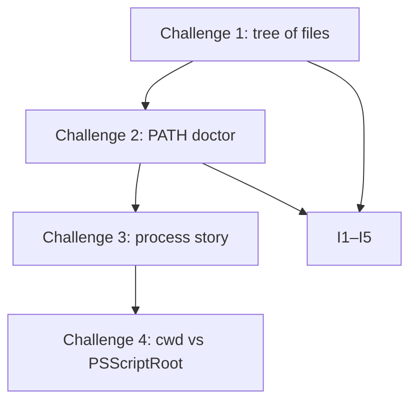

# Month 1 · Week 1 · Day 6
# Independent Lab: Own the Machine

**Program:** Full-Stack Mastery · 18 months  
**Phase:** 1 — Foundations  
**Month index:** [../../README.md](../../README.md)  
**Week 1:** [1](day-01.md) · [2](day-02.md) · [3](day-03.md) · [4](day-04.md) · [5](day-05.md) · Day 6 (today) · [7](day-07.md)  
**Week rhythm today:** Independent project work  
**Student state:** Days 1–5 taught the machine, the shell, a small inspector, and tests. Today you build a **new** tree from this chapter — not by opening those labs.  
**Study time:** 3–4 focused hours  
**Machine today:** Windows PowerShell  
**Day 1–5 files:** closed during challenges. Repair from **this file** first. If you are stuck 25 minutes, open **Week 1 Days 1–2 in this book**, not a cheat site.

Labs: `~\fullstack-lab\week-01\independent\`.

---

## How to use this textbook

This is not a video transcript and not a tutorial to skim.

1. Read the complete explanation. Close it. Say each idea in a full sentence.
2. Type every challenge. Do not paste Day 3’s script and rename it.
3. Record I1–I5 by running, not by wishing.
4. If a command fails, read the error. Then fix it. That *is* the lesson.
5. Optional review links at the end are for later rechecking — not for first learning.

If you finish early, do Challenge 4 — not another article.

---

## How to read this chapter

Today is **independent**: the challenges are the exam. This file is the teacher. You may not open Days 1–5 while you build. You **may** re-read the explanation below as often as you need.

Three names still must not share a drawer:

- **Path** — where a file lives in the tree.
- **PATH** — where the shell looks for programs.
- **Process** — a running instance of a program file.



> **Wrong belief:** “Independent day means I should search the web.”  
> **Correct:** independent means you build from **this** explanation. The web is not the course.

> **Wrong belief:** “If I can see the file in Explorer, the shell will find the command.”  
> **Correct:** seeing a file is a **path** problem. Finding `git` is a **PATH** problem. They are different lookups.

> **Wrong belief:** “Copy and move are the same if the file appears in the new folder.”  
> **Correct:** copy leaves the original. Move relocates it. I4 and I5 exist so you cannot pass by copying.

---

## Complete explanation (machine + shell)

A later review of this day must not require another page. The physics of Week 1 is here again, in full sentences, with the mistakes this lab is designed to catch.

### The machine

A **computer** stores data and follows instructions. Almost every machine you will use has the same four parts. The **CPU** fetches, decodes, and executes instructions. It can only work on data that is in **RAM**. RAM is fast, limited, and **volatile**: when power is gone, it is empty. **Storage** holds files when the computer is off. **I/O** is how the machine talks to the outside world: keyboard, screen, disk controller, network card.

The **operating system** owns the machine. Windows, Linux, and macOS are operating systems. The desktop, Start menu, and wallpaper are programs. They are not the OS. The **kernel** is privileged and talks to hardware. Ordinary programs — browser, editor, terminal, later a web API — live in **user space** and ask the kernel for files, memory, and devices.

When a site is slow, the cause is never “the computer is bad” as a vague feeling. The cause is one of these: the CPU is busy, RAM is full or data is in the wrong place, the disk is slow, the network is slow, the program is waiting, or the program is doing unnecessary work. You cannot debug a blob. You name the part.

### Files, directories, and paths

A **file** is a named sequence of bytes plus metadata (size, timestamps, permissions). A **directory** holds names of files and other directories. The filesystem is a **tree**. On Windows the usual root of your main disk is `C:\`.

A **path** is how you point at a name in that tree.

- **Absolute** — starts from a drive root. It does not depend on where the shell currently is. Example: `C:\Users\Universe\fullstack-lab\week-01\independent\TOOLS.txt`.
- **Relative** — starts from the **current working directory**. If you are in `~\fullstack-lab\week-01\independent` and you write `work\readme.txt`, that is relative. The same file’s absolute path still starts with `C:\` (or another drive) and does not care where the shell was yesterday.

Special names you must still own:

| Symbol | Meaning |
|---|---|
| `.` | this directory |
| `..` | parent directory |
| `~` | home directory (PowerShell understands this) |

`Get-Location` tells you the cwd. `Test-Path` tells you whether a name exists. `Get-ChildItem -Force` shows names that start with `.` — hidden by convention, still real files. `-Force` is not “admin.” It means “show names the listing usually hides.”

Copy leaves the original. Move relocates or renames. Delete has no undo. Do those only inside `fullstack-lab` folders you created.

Worked example for Challenge 1. Suppose you are here:

```text
C:\Users\Universe\fullstack-lab\week-01\independent
```

Then `inbox\readme.txt` means that file under `independent`. `..\inspect-machine.ps1` means a file in `week-01`, the parent. `C:\Users\Universe\fullstack-lab\week-01\independent\work\readme.txt` is the same `work\readme.txt` spoken as an absolute path. If `Move-Item` “fails,” the first question is still: where am I, and what path did I actually type?

### Program vs process

A **program** is a file on disk: `notepad.exe`, `git.exe`, later a `.py` file that a Python interpreter will run. A **process** is a running instance of a program. It has a **PID** (process identifier for this run), **RAM** (WorkingSet is how much physical RAM that process is using *now*, not the size of the `.exe`), a copy of environment variables from when it started, and open handles.

One program, many processes: two Notepad windows are two processes, two PIDs, same program file. Close them and those PIDs are finished. The program file remains. Do not kill random processes — you did not start them, you do not know what they own.

Later, an API server will be a process. If that process dies, the API is down even though the source files are still on disk. That is program vs process in production language. You are not writing that server this month. You are owning the distinction so Month 9 is not a surprise.

### Terminal, environment, PATH

The **terminal** reads a line, finds a program, starts a process, shows output.

**Environment variables** are named strings inherited by child processes (`USERNAME`, `USERPROFILE`, `PATH`). A `$env:FOO = "x"` in this window is **session-only** unless you persist it in Windows settings. Do not dump `Get-ChildItem Env:` into a public gist — values can be secrets.

**PATH** is a list of directories, separated by `;` on Windows. When you type `git`, the shell walks PATH in order and runs the first match. It does not search the whole disk. If Git was installed while this window was open, this window’s PATH may still be old — **reopen the terminal**.

On Windows, run a script in the current directory as `.\script.ps1`. Bare `script.ps1` is not how PATH works for local scripts (security). A random download must not hijack `git`. Execution policy may block scripts: `Get-ExecutionPolicy -List`; a reasonable student fix is `Set-ExecutionPolicy -Scope CurrentUser RemoteSigned`.

`$PSScriptRoot` is the folder that contains the running script. `Get-Location` is the shell’s cwd. They differ when you run a script by full path from another directory. `Test-Path .\inspect-machine.ps1` asks “is that name in **cwd**?” `Test-Path (Join-Path $PSScriptRoot '..\inspect-machine.ps1')` asks “is that name next to **this script’s parent**?” Both answers can be true, both false, or mixed. That is the stretch lesson.

`Get-Command git` is the same lookup the shell uses. It does **not** need the script’s folder. A PATH doctor that only works when you `cd` into `independent\` is wrong. That is why Challenge 2 requires a run from `C:\`.

Debugging order: exact error → `Get-Location` → `Test-Path` → typo → `Get-Command` → PATH → right shell → policy.

Use `curl.exe`, not `curl`, when you mean the real program. PowerShell’s `curl` may be an alias for `Invoke-WebRequest`. You will need the real program in Week 2.

### Office hours — the four mistakes this lab exists to catch

**Copy instead of move.** After Challenge 1, `inbox\readme.txt` must **not** exist, and `work\inbox-readme-moved.txt` must exist. If both exist, you copied. If neither exists, you deleted. Stop. `Get-Location`. `Test-Path`. Fix. Do not invent a third file and call the test passed.

**PATH doctor that cheats on cwd.** If `path-doctor.ps1` uses `.\git.exe` or `Test-Path git`, it is testing the **tree**, not PATH. `Get-Command git` walks PATH. Run from `C:\` so a relative cheat fails in front of you.

**Killing a process you did not start.** Two Notepads you opened are yours to close. `explorer`, `csrss`, random names in `Get-Process` are not a lab. Inspect. Do not `-Force` kill the machine.

**Secrets in git.** `TOOLS.txt` lists commands. It does not paste the output of `Get-ChildItem Env:`. Usernames in a local lab file are one thing. Tokens and passwords are another. There should be none.

> **Wrong belief:** “PATH is my current folder, so `cd` into Git’s folder to make `git` work.”  
> **Correct:** PATH is a search list for **programs**. Your current folder is a **working directory** for **files**. Put Git’s directory on PATH, or call it by absolute path. Do not live inside the install folder.

---

## Today's contract

By the end of this day you will have a new folder you can explain file by file from the explanation above.

**Today's gate**

I built `week-01/independent/` myself, I can explain every file using the explanation above, and I can operate the shell without a website.

---

## Time box

| Block | Minutes | Work |
|---|---|---|
| A | 25 | Read this explanation; speak path vs PATH vs process |
| B | 50 | Challenge 1 — file manager without a GUI |
| C | 45 | Challenge 2 — PATH doctor + PATH-NOTES.txt |
| D | 35 | Challenge 3 — process story |
| E | 30 | Challenge 4 stretch + tests I1–I5 + git |

---

# Challenge 1 — File manager without a GUI (required)

Create under `~\fullstack-lab\week-01\independent\`:

```
independent/
  inbox/readme.txt
  work/readme.txt
  archive/
  TOOLS.txt
```

Type the tree. Do not paste a script from Day 3.

```powershell
cd ~\fullstack-lab\week-01
New-Item -ItemType Directory -Force -Path independent\inbox, independent\work, independent\archive | Out-Null
```

Then create the files in the editor or with `Set-Content`. Contents:

- `inbox/readme.txt` — what a directory is (your words, from this chapter). A directory holds names. It is not a pile of bytes the way a photo is. It is a place in the tree.
- `work/readme.txt` — absolute vs relative path, with an example from **this** tree. Write one absolute path that starts with `C:\` (or your drive) and one relative path that only makes sense from `independent`.
- `TOOLS.txt` — 8 PowerShell commands you used this week: command + purpose (from Days 1–2, not from a cheat site). `Get-Location`, `Test-Path`, `Get-ChildItem`, `Get-Process`, `Get-Command`, `Get-CimInstance`, `Copy-Item`, `Move-Item` are the sort of list this file wants. Purpose in a sentence each.

Then operate on the tree:

```powershell
cd ~\fullstack-lab\week-01\independent
Move-Item .\inbox\readme.txt .\work\inbox-readme-moved.txt
Copy-Item .\TOOLS.txt .\archive\TOOLS-copy.txt
Set-Content -Path .\work\.keep-hidden.txt -Value "hidden by convention, still a file"
Get-ChildItem -Force .\work
```

After the move, `inbox\readme.txt` must **not** exist. `work\inbox-readme-moved.txt` must exist. That is I4 and I5.

```powershell
Test-Path .\inbox\readme.txt
Test-Path .\work\inbox-readme-moved.txt
Test-Path .\archive\TOOLS-copy.txt
```

You want `False`, `True`, `True`. If both inbox and work copies exist, you copied instead of moved. If neither exists, you deleted. Stop. `Get-Location`. `Test-Path`. Fix.

The hidden file is still a file. `-Force` is not “admin.” It means “show names the listing usually hides.”

---

# Challenge 2 — PATH doctor (required)

`independent/path-doctor.ps1` prints: PATH entry count; whether `git`, `curl.exe`, `notepad` are found; source path or `MISSING`; final `OK` if git found else `NOT OK`.

The script should split `$env:PATH` on `;`, count the entries, and use `Get-Command` for each program. A sketch of the lookup (you type a complete script; this is the idea, not a paste-to-submit):

```powershell
$names = @('git', 'curl.exe', 'notepad')
foreach ($n in $names) {
  $cmd = Get-Command $n -ErrorAction SilentlyContinue
  if ($cmd) { Write-Host "$n : $($cmd.Source)" }
  else { Write-Host "$n : MISSING" }
}
```

Run it from `C:\` using a full/`~\` path. If it depends on cwd wrongly, fix it (`Get-Command` does not need the script’s folder).

```powershell
cd C:\
~\fullstack-lab\week-01\independent\path-doctor.ps1
```

If this only works after `cd ~\fullstack-lab\week-01\independent`, the script is looking at **files in cwd**, not at PATH. That is a failed doctor.

`PATH-NOTES.txt`: what PATH is (5–8 sentences from this file); why a new terminal sees a newly installed program; first check if `python` is “not recognized.”

If `python` is not recognized, the first check is not “reinstall Windows.” It is: is Python installed, is its directory on PATH in **this** window, and are you in PowerShell not a broken alias. Write that in your own sentences.

---

# Challenge 3 — Process story (required)

`independent/process-story.txt`: program vs process; two PIDs of the same program; WorkingSet meaning; why not kill random processes; a later API server is a process — if it dies the API is down though `.py` files remain.

Start two Notepads (or two instances of another program you started):

```powershell
notepad
notepad
Get-Process notepad | Select-Object Id, ProcessName, WorkingSet
```

Write the two PIDs. Close them. Confirm `Get-Process notepad` fails. The story must still make sense when those PIDs are gone — because PIDs do not survive.

WorkingSet is bytes in physical RAM *now*. It is not the size of `notepad.exe` on disk. If you confuse those, you will think “the program is 8 MB so it cannot be using 40 MB.” The process can.

---

# Challenge 4 — Stretch

`where-am-i.ps1`: current location; `Test-Path .\inspect-machine.ps1`; `Test-Path (Join-Path $PSScriptRoot '..\inspect-machine.ps1')`. Explain in `STRETCH.txt` why the two results can differ (cwd vs `$PSScriptRoot`).

```powershell
cd C:\
~\fullstack-lab\week-01\independent\where-am-i.ps1
cd ~\fullstack-lab\week-01
~\fullstack-lab\week-01\independent\where-am-i.ps1
```

Write both outcomes. From `C:\`, `.\inspect-machine.ps1` should be false unless you actually have that file at the root of `C:\` (you should not). The `Join-Path $PSScriptRoot '..\inspect-machine.ps1'` check asks about `week-01\inspect-machine.ps1` next to the script’s parent — that can be true even when cwd is `C:\`. The stretch is the **difference**, not a pretty script.

# Tests

| ID | Claim |
|---|---|
| I1 | `path-doctor.ps1` runs from `C:\` |
| I2 | prints OK or NOT OK |
| I3 | `archive/TOOLS-copy.txt` exists |
| I4 | `work/inbox-readme-moved.txt` exists |
| I5 | `inbox/readme.txt` no longer exists |

Write PASS/FAIL in `independent/TESTS.md` (create it). A failed claim is a failed test. Fix the files, not the claim.

```powershell
cd C:\
~\fullstack-lab\week-01\independent\path-doctor.ps1
cd ~\fullstack-lab\week-01\independent
Test-Path .\archive\TOOLS-copy.txt
Test-Path .\work\inbox-readme-moved.txt
Test-Path .\inbox\readme.txt
```

Root README: short Week 1 independent section.

```powershell
cd ~\fullstack-lab
git add week-01/independent README.md
git commit -m "Add Week 1 independent filesystem and PATH lab."
```

Read `git status` before `git add`. Do not add `machine-report.txt` if it is generated. There should be no secrets.

---

## Definition of done

- [ ] Required challenges complete
- [ ] Every file explainable from this chapter
- [ ] Tests I1–I5 recorded
- [ ] Commit exists

---

## Tomorrow — Day 7

Week review: speak every Week 1 topic, mini-build, debug, repair. Do not start Week 2 because the calendar moved.

---

## Optional review links

The machine and the shell are explained in this chapter. These pages are for later checking, not for first learning.

- [PowerShell: about_Path_Syntax](https://learn.microsoft.com/en-us/powershell/module/microsoft.powershell.core/about/about_path_syntax)
- [PowerShell: Get-Command](https://learn.microsoft.com/en-us/powershell/module/microsoft.powershell.core/get-command)
- [PowerShell: about_Automatic_Variables](https://learn.microsoft.com/en-us/powershell/module/microsoft.powershell.core/about/about_automatic_variables)
