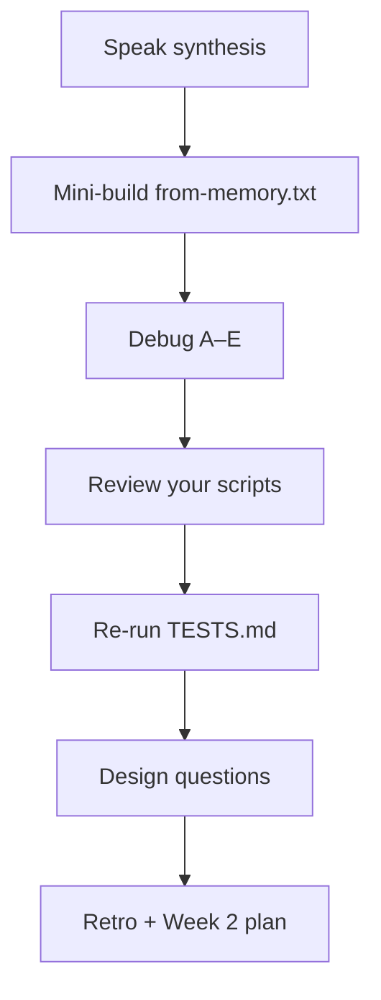

# Month 1 · Week 1 · Day 7
# Week Review, Repair, Plan

**Program:** Full-Stack Mastery · 18 months  
**Phase:** 1 — Foundations  
**Month index:** [../../README.md](../../README.md)  
**Week 1:** [1](day-01.md) · [2](day-02.md) · [3](day-03.md) · [4](day-04.md) · [5](day-05.md) · [6](day-06.md) · Day 7 (today)  
**Week rhythm today:** Review, explain concepts aloud, fix weak areas, plan next week  
**Student state:** You operated the shell all week. Today those ideas must still live in your head — from **this file**.  
**Study time:** 3–4 focused hours  
**Machine today:** Windows PowerShell  

Do not start Week 2 because the calendar moved. Start Week 2 because this file’s gate is true.

Labs: `~\fullstack-lab\week-01\review\`.

---

## How to use this textbook

This is not a video transcript and not a tutorial to skim.

1. Read the synthesis. Close it. Speak it in full sentences.
2. Textbook files for Days 1–6 stay closed during blocks 2–5. Repair from **this** recap.
3. Repair the weakest topic **today**, not “someday.”
4. Type every command yourself. Do not paste yesterday’s tree.
5. Optional review links at the end are for later rechecking — not for first learning.

If an oral topic is mush, write it as a weak area immediately. The leftover time is for that topic, not for browsing.

---

## How to read this chapter

This is a **closed-book teaching day**. The synthesis **is** the Week 1 lesson. The seven blocks are the weekly exam the roadmap asked for, scaled to one week.



> **Wrong belief:** “PATH is my current folder, and memory means disk space.”  
> **Correct:** PATH is a program search list. Memory is RAM. Disk is storage. Cwd is where **files** are relative to.

> **Wrong belief:** “If I survived the week, I can start Week 2 on Monday.”  
> **Correct:** you start Week 2 when this file’s gate is true. A calendar is not a gate.

> **Wrong belief:** “The program on disk *is* the running app, so deleting notepad.exe is how you close Notepad.”  
> **Correct:** the file is the recipe. The process is the cooking. Close the process. The `.exe` stays.

---

## Week synthesis (this book)

This is the whole Week 1 lesson in one place. Review **this**, not a tutorial site. If you go blank during a block, re-read the matching paragraph here, then try again.

**Operating system.** The OS owns the machine: hardware, processes, files, permissions. The **kernel** is privileged and talks to devices. Ordinary programs live in **user space**. The desktop, Start menu, and wallpaper are **not** the OS — they are programs. Windows, Linux, and macOS are different skins on the same job. Without an OS you would write hardware-specific code for every task. With an OS you write “open this file” and the kernel decides whether that is allowed, then does the work. Isolation is the point: a crashed editor should not, by itself, destroy the operating system.

**CPU.** The CPU **fetches, decodes, and executes** instructions from RAM. Cores are independent engines; the OS time-slices many processes. A “fast CPU” can do more of those loops per second, and/or do more of them in parallel. More CPU does not always make a website faster. CPU helps CPU-bound work. Most web slowness is **waiting** — disk, network, database, or a stuck program. “The app froze” usually means *your program is waiting or stuck*, not that electricity stopped.

**RAM.** Fast, **volatile**, limited. The CPU can only work on data that is in RAM. When RAM is under pressure, the OS may swap idle pages to disk and the machine crawls, because disk is not RAM. Unsaved work lives in RAM; it dies with the process. A saved file survives a restart because it is on storage. WorkingSet on a process is how much physical RAM that process is using *now*, not the size of the `.exe` on disk.

**Storage.** Files survive restart. A file is a name, bytes, and metadata. A directory holds names. Source code, Git history, later databases and logs — all files. If you cannot navigate a filesystem, you cannot deploy anything. Copy leaves the original. Move relocates or renames. Delete has no undo.

**Paths.** The filesystem is a tree. **Absolute** paths start at a root (`C:\...`) and do not depend on cwd. **Relative** paths start at the current working directory. `.` this folder, `..` parent, `~` home. If a command cannot find a file: `Get-Location`, then `Test-Path`. Explorer and the shell see the same tree. The shell is more precise. Seeing a file in Explorer does not put its folder on PATH.

**Program vs process.** A **program** is a file on disk. A **process** is a running instance: PID, WorkingSet (RAM now), environment copy, open handles. One program, many processes. Killing a process does not delete the program. Do not kill processes you did not start. Later, an API server will be a process. If that process dies, the API is down even though the source files remain.

**Terminal.** PowerShell reads a line, finds a program, starts a process, shows output. `.\script.ps1` runs a local script. Bare `script.ps1` is not PATH for local scripts (security). Execution policy: `Get-ExecutionPolicy -List`; user-scoped `RemoteSigned` is a reasonable student fix. Use `curl.exe`, not `curl`, when you mean the real program — PowerShell’s `curl` may be an alias.

**Environment variables.** Named strings inherited by children (`USERNAME`, `USERPROFILE`, `PATH`). Session assignment dies with the window. Do not paste `Get-ChildItem Env:` into a gist — values can be secrets.

**PATH.** Ordered list of directories. The shell walks it for `git`; first match wins. It does not search the whole disk. A new install often needs a **new terminal**. `$PSScriptRoot` is the script’s folder; `Get-Location` is the shell’s cwd. They are not the same. `Get-Command git` is the same lookup the shell uses.

**Debugging order.** Exact error → cwd → `Test-Path` → typo → `Get-Command` → PATH → right shell → policy. Skip a step and you will “fix” a missing file by editing PATH, or “fix” `git is not recognized` by `cd` into a random folder. Both look busy. Both miss the system that actually failed.

---

## Today's contract

The roadmap’s monthly exam has seven parts. Today you run a **weekly** version of that exam on computer fundamentals.

**Today's gate**

> Closed-book, I can teach Week 1 to a beginner at a whiteboard, operate the shell, and name my weak spots with a repair plan.

---

## Time box

| Block | Minutes | Work |
|---|---|---|
| 1 | 40 | Closed-book explanation |
| 2 | 40 | Independent mini-build |
| 3 | 30 | Debugging challenge |
| 4 | 25 | Review yesterday’s scripts |
| 5 | 20 | Testing challenge |
| 6 | 20 | Architecture / design question |
| 7 | 30 | Retrospective + Week 2 plan |
| | 15 | Weak-area repair (the leftover time is for this) |

---

# 1. Closed-book explanation

Close all textbook files. Speak aloud (record on your phone if it helps). Cover **every** roadmap Week 1 topic, using the synthesis. If an item is under 60 seconds of true content, it is weak — re-read that paragraph **in this file**.

1. Operating system — kernel vs the desktop UI  
2. CPU — fetch/decode/execute; why more CPU does not always mean a faster website  
3. Memory (RAM) — volatile, working set  
4. Storage — files survive restart  
5. Files and directories — tree  
6. Paths — absolute, relative, `.`, `..`  
7. Processes — PID; one program, many processes  
8. Program vs process  
9. Terminal / shell  
10. Environment variables  
11. PATH  

If you cannot do one topic in under two minutes, it is a weak area. Write it down immediately. If you say “and then the computer…” you are not done. Name the part: CPU, RAM, storage, I/O, kernel, process, path, or PATH.

---

# 2. Independent mini-build

New PowerShell window. Textbook closed.

Create `~\fullstack-lab\week-01\review\` and inside it a file `from-memory.txt` that contains:

- your OS name
- your total RAM (approx is fine if you re-inspect)
- path to `git.exe`
- today’s date

You may use commands. You may not open Day 1–6 markdown.

```powershell
cd ~\fullstack-lab
New-Item -ItemType Directory -Force -Path week-01\review | Out-Null
Get-CimInstance Win32_OperatingSystem | Select-Object Caption, TotalVisibleMemorySize
Get-Command git
Get-Date
```

Write those facts into `from-memory.txt` yourself. Then delete `from-memory.txt` and recreate it. The second time should be faster. If it is not, PATH and `Get-CimInstance` are still foreign — repair in section 7.

`TotalVisibleMemorySize` is in kilobytes on many Windows machines. Divide by `1MB` in your head (or by `1GB` after converting) until the number looks like RAM you would tell a friend — 8, 16, 32 — not 16 million. A number without a unit is not a report.

---

# 3. Debugging challenge

Without looking at Day 2, diagnose these. Write answers in `week-01/review/debug-answers.txt`. Full sentences. A one-word label is not an answer.

**A.** Student types `cd fullstack-lab` from `C:\Windows\System32` and gets “cannot find path.” Why? What should they run first?

**B.** Student types `inspect-machine.ps1` (no `.\`) in the folder that contains the file. What happens on Windows and why?

**C.** `git` works in Git Bash but not in a PowerShell that has been open since before installing Git. Why?

**D.** `Get-Content notes.txt` fails. `ls` shows `Notes.txt`. On Windows this may still work (case-insensitive). On Linux later it will fail. What concept is that?

**E.** Execution policy error when running a `.ps1`. What command inspects policy? What is a *user-scoped* fix?

Use the synthesis. A is cwd vs relative path — they should `Get-Location` then `cd ~\fullstack-lab` or an absolute path. From `C:\Windows\System32`, `fullstack-lab` means `C:\Windows\System32\fullstack-lab`, which does not exist. The folder they want is under their home directory.

B is the local-script security rule. Bare `inspect-machine.ps1` is not how PATH works for local scripts. The fix is `.\inspect-machine.ps1` after `Get-Location` confirms you are in the folder that contains the file.

C is a stale PATH in an old process. Git Bash was started after install, or has its own path. The old PowerShell still has the environment it inherited at launch. Reopen the terminal. Do not reinstall Git as the first move.

D is that names are exact on Linux; Windows often folds case. The concept is the filesystem **namespace**: a name is a name. Later cloud servers will be Linux. Practice being precise now.

E is `Get-ExecutionPolicy -List` and `Set-ExecutionPolicy -Scope CurrentUser RemoteSigned`. That is a student-scoped fix, not “turn off security for the machine.”

Office-hours story for A: a student once “fixed” the missing folder by creating `C:\Windows\System32\fullstack-lab`. That is the wrong tree, and it is a privileged location. `Get-Location` first. Always.

---

# 4. Code review (your own)

Open `inspect-machine.ps1` and `path-doctor.ps1`.

Write `week-01/review/code-review.txt`:

- one thing that is clear
- one thing that is messy
- one thing that could leak personal data if published
- one rename that would help

Then make **one** small clarity improvement. Commit it:

```text
Clarify machine inspector section labels.
```

Do not rewrite the world. The roadmap: repair deliberately, do not repeat an entire week for one smell. A label that says `RAM (GB):` is better than a bare number. A dump of every environment variable is a leak if the report is published.

---

# 5. Testing challenge

Re-run `week-01/TESTS.md` and `week-01/independent/TESTS.md`.

Add one new claim that did not exist before. Example: “`path-doctor.ps1` contains the string `MISSING` as a possible output.”

```powershell
cd ~\fullstack-lab\week-01
Select-String -Path independent\path-doctor.ps1 -Pattern 'MISSING'
```

If a test fails, fix the code or the test — whichever is wrong — and record which. A claim that cannot fail is not a test. If independent I5 fails because `inbox\readme.txt` still exists, you copied instead of moved on Day 6. Fix the tree today.

---

# 6. Architecture / design question

Write `week-01/review/design.txt`.

Question:

> When you open a browser, which parts of the computer are involved, and what is the difference between the Chrome program on disk, the Chrome process, and a file you download with Chrome?

Then a second question:

> Why is PATH an environment variable instead of “the shell just knows all programs on the disk”?

There is a design trade-off: searching the whole disk would be slow and surprising; PATH is an explicit, ordered list. Security: a random folder is not searched unless it is on PATH (and `.` is not silently used for `.ps1` names).

Answer in full sentences from the synthesis. The downloaded file is **storage**. The running Chrome is a **process** using **RAM** and **CPU**. The `.exe` is the **program**. Opening the browser also uses **I/O** (screen, keyboard, later the network — Week 2). The kernel is involved the whole time: it schedules the process, maps memory, and talks to devices. You are not drawing Week 4’s frontend/backend boxes yet. You are naming the machine.

---

# 7. Retrospective and Week 2 plan

Write `week-01/review/retro.md`:

```markdown
# Week 1 retrospective

## What is solid
-

## What is weak
-

## What I had to look up
-

## Repair plan (specific, not “study more”)
- Topic:
- Exercise I will redo:
- When: before Week 2 Day 3

## Hours this week (honest)
-

## Week 2 preview
Internet: client/server, IP, DNS, ports, TCP, TLS, HTTPS, the URL journey.
I need a working browser and this same terminal.
```

**Repair now**, not “someday”: spend the remaining session on the weakest topic. Redo one lab from Day 2 or 3. If PATH is weak, re-run `path-doctor.ps1` from `C:\` and rewrite PATH-NOTES.txt from this synthesis. If paths are weak, rebuild a tiny tree with relative `Move-Item` and prove it with `Test-Path`.

---

## Week 1 definition of done

The roadmap Week 1 practice list — all true:

- [ ] Navigate the filesystem without Explorer
- [ ] Create, move, copy, delete files on purpose
- [ ] Run a program from the terminal
- [ ] Inspect processes (PID, name, RAM)
- [ ] Inspect environment variables and PATH
- [ ] Explain OS, CPU, RAM, storage
- [ ] Git repo exists with a real history (not one giant dump commit if you can help it)
- [ ] README + tests exist for the inspector

If a box is false, stay in Week 1 repair. The internet week assumes the shell is not the hard part.

---

## Tomorrow

Week 2 Day 1: client, server, IP, ports. Same PowerShell. Same machine model. New layer: the network. Do not open that file until this gate is true.

---

## Computer science this week (named)

You already touched:

- **Process** vs **program**
- **Volatile vs persistent** memory
- **Namespace** (paths as names in a tree)
- **Search path** (PATH) as an ordered lookup

Big-O, trees as data structures, graphs: later. Do not grind algorithms this week.

---

## Plan next week

Week 2 Day 1 file: `../week-02/day-01.md`.

You need:

- Internet access
- A browser (Edge or Chrome)
- PowerShell
- Willingness to draw: `Browser → DNS → TCP → TLS → HTTP → server → response`

Do not install extra networking tools yet. We will use what Windows already has (`Resolve-DnsName`, `Test-NetConnection`, `Get-NetIPAddress`). If a command is missing, the day file will say so.

Week 2 will still use `curl.exe`, not `curl`. If `Get-Command curl.exe` was `MISSING` on Day 6, fix that before Day 1 of Week 2 — install or locate the real program, reopen the terminal, prove it with `Get-Command`.

---

## Commit the review

```powershell
cd ~\fullstack-lab
git add week-01/review README.md week-01/inspect-machine.ps1
git commit -m "Record Week 1 review, debug answers, and retrospective."
```

---

## Optional review links

Week 1 is explained in this chapter. These pages are for later checking, not for first learning.

- [PowerShell: about_Environment_Variables](https://learn.microsoft.com/en-us/powershell/module/microsoft.powershell.core/about/about_environment_variables)
- [PowerShell: about_Execution_Policies](https://learn.microsoft.com/en-us/powershell/module/microsoft.powershell.core/about/about_execution_policies)
- [Microsoft: CIM / Get-CimInstance](https://learn.microsoft.com/en-us/powershell/module/cimcmdlets/get-ciminstance)
