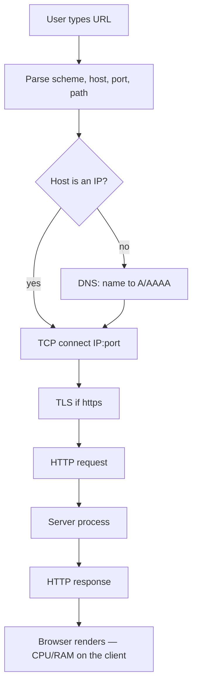

# Month 1 · Week 2 · Day 3
# The URL Journey — From Memory

**Program:** Full-Stack Mastery · 18 months  
**Phase:** 1 — Foundations  
**Month index:** [../../README.md](../../README.md)  
**Week 2:** [1](day-01.md) · [2](day-02.md) · Day 3 (today) · [4](day-04.md) · [5](day-05.md) · [6](day-06.md) · [7](day-07.md)  
**Week rhythm today:** Implement from memory  
**Student state:** Days 1–2 taught client/server, IP, ports, DNS, TCP, TLS, and HTTPS. Today that chain must come out of *your* sentences and *your* terminal.  
**Study time:** 3–4 focused hours  
**Machine today:** Windows PowerShell (`curl.exe`, not `curl`)  
**Textbook files for Days 1–2:** closed during Blocks A–C. Repair from **this recap** first. If you are stuck 25 minutes, open **those files in this textbook**.

Labs: `~\fullstack-lab\week-02\`.

---

## How to use this textbook

1. Read a section. Close it. Say the idea in a full sentence.
2. Write the journey **before** you run commands. Then prove each arrow.
3. Use `curl.exe`. PowerShell’s `curl` can be an alias for `Invoke-WebRequest`.
4. Optional review links at the end are for later rechecking — not for first learning.

---

## How to read this chapter

The Month 1 gate needs this chain as a real explanation, not a slogan:

**Browser → DNS → TCP → TLS → HTTP → server process → response → browser**

Each arrow is a **different** failure. If you mix them, you will call a DNS typo “the site is down,” or call HTTP 404 “the connection failed.” Both look busy. Both miss the layer that actually stopped.



The recap below **is** the lesson. The writeup, evidence pack, and failure catalog are the exam.

---

## Complete explanation — the journey you must still own

## 1. Parse the URL first

A URL is not “the internet.” It is a string the **browser process** splits:

| Piece | Example | Meaning |
|---|---|---|
| Scheme | `https` | How to talk; default port 443 |
| Host | `example.com` | Name (or already an IP) |
| Port | omitted → 443 | Which process on that machine |
| Path | `/` | What resource (Week 3 deepens this) |

`http://` defaults to port **80**. `https://` defaults to **443**. `localhost:8000` is this machine, port 8000 — nothing to do with example.com.

The browser is a **client** process. The thing that answers is a **server** process. Both are programs with RAM and a PID, as in Week 1. “The cloud” is still someone else’s computers running processes.

> **Wrong belief:** “The URL is the website.”  
> **Correct:** the URL is an address slip. The website is a process that may or may not be listening when you arrive.

## 2. DNS — name to IP

If the host is not already an IP, **DNS** answers: which IPv4 (**A**) and/or IPv6 (**AAAA**) should I use for this name?

Your machine asks a **resolver** (often the router or ISP). An **authoritative** server for the domain is who ultimately knows. DNS is not HTTP. Port **53** (often UDP) is not port 443.

Failure here: **NXDOMAIN** (name does not exist — often a typo) or timeout (resolver unreachable). If DNS fails, TCP to the website never starts. `ping` to `8.8.8.8` can still work: that tests reachability of a public resolver IP, not “Google the website,” and not your typed name.

> **Wrong belief:** “DNS is the website loading.”  
> **Correct:** DNS only maps a name to an address. Loading has not started.

## 3. TCP — a connection to IP:port

**TCP** opens a connection to that **IP** and **port**. Connection **refused** means nothing accepted that port (local classic: you forgot to start FastAPI). **Timeout** means packets dropped or filtered (firewall). Neither is an HTTP status code.

`Test-NetConnection example.com -Port 443` proves TCP to 443, not that HTML is pretty.

## 4. TLS, then HTTP

If the scheme is `https`, **TLS** runs **before** HTTP. TLS gives encryption, a certificate check (name + public key + CA signature), and integrity. **HTTPS** is HTTP over TLS. Default port 443.

A certificate is for a **hostname**, not a raw IP. `curl.exe -I https://<ip>/` may fail the name check. That is a feature.

TLS does **not** mean the site is honest. A phishing page can have HTTPS. TLS is not a login system.

Then the client sends an **HTTP request** (method, path, headers — Week 3 names them). A **server process** bound to that port reads it and sends an **HTTP response** (status, headers, body).

**404** means the whole chain worked and the **application** said “no such path.” **500** means the process ran and failed internally. Celebrate: you had TCP and TLS. Do not call that “DNS is down.”

The browser may then request CSS, JS, and images. **Each is a new journey** (often a reused connection). **Render** uses CPU, RAM, and GPU on the **client** machine — Week 1’s picture.

> **Wrong belief:** “HTTPS means the site is safe and trustworthy.”  
> **Correct:** HTTPS protects the pipe and checks the name on the certificate. It does not vouch for the business.

Use `curl.exe -vI` to see TLS then an HTTP status. Use `curl.exe -I http://example.com` for cleartext HTTP or a redirect. Do not port-scan ranges. One hostname, ports 80 and 443.

---

## Today's contract

The Month 1 gate requires this sentence, expanded into a real explanation:

**Browser → DNS → network connection → TLS → HTTP → server → response → browser**

You will write it, draw it, and prove each arrow with a command on a real hostname.

**Today's gate**

> I can narrate the journey for `https://example.com` without notes, then justify each step with evidence from my terminal.

---

## Time box

| Block | Minutes | Work |
|---|---|---|
| A | 25 | Closed-book writeup (no commands yet) |
| B | 80 | Evidence pack: one command per arrow |
| C | 50 | Failure catalog from memory |
| D | 40 | Draw + README section |
| E | 15 | Speak the journey in 90 seconds |

---

# Block A — Write the journey closed-book

Create `week-02/url-journey.md`. Write from memory. Minimum one short paragraph per stage:

1. User types or clicks a URL. Browser parses **scheme, host, port, path**.
2. If host is not an IP, **DNS** resolves host → IP.
3. Browser (or OS) opens a **TCP** connection to `IP:port` (443 if `https` and port omitted).
4. If HTTPS, **TLS** handshake; certificate must match the hostname.
5. Client sends an **HTTP request** (Week 3 will name methods/headers; today: “a request with a method, path, headers”).
6. **Server process** (bound to that port) reads the request, produces an **HTTP response** (status, headers, body).
7. Browser reads the response: if HTML, it may request more URLs (CSS, JS, images) — **each is a new journey** (often reused connection).
8. Browser **renders**. That uses CPU, RAM, GPU on the **client** machine (Week 1).

Add a section **What this is not:** DNS is not HTTP. TLS is not a login system. The “server” is a process, not “the cloud.”

Do not copy a tutorial. If you cannot fill a stage, leave `TODO` and return after Block B — then you will know which lecture you faked.

---

# Block B — Evidence pack

Same file, section `## Evidence for example.com`.

You must run commands. Paste **your** outputs’ meaningful lines (not 200 lines of noise). Redact nothing important except if a tool printed a cookie (it should not here).

| Arrow | Command you must run | What you are proving |
|---|---|---|
| DNS | `Resolve-DnsName example.com -Type A` | Name became IPv4 |
| TCP 443 | `Test-NetConnection example.com -Port 443` | Port accepts TCP |
| TLS + HTTP | `curl.exe -vI https://example.com` | TLS then HTTP status |
| HTTP on 80 | `curl.exe -I http://example.com` | Cleartext HTTP or redirect |
| Client render | (no command) | One sentence: HTML arrives as bytes; the browser process paints pixels using CPU/RAM |

If `example.com` is blocked on your network, use `https://example.org` or `https://www.wikipedia.org` and say so.

**Reuse:** `curl.exe -I https://<ip>/` may fail TLS hostname check. That is a feature. Write one sentence: certificates are for **names**, not raw IPs.

---

# Block C — Failure catalog

In `week-02/url-journey-failures.md`, for each failure, write: **where the chain stops** and **what the user sees**.

1. Typo in domain (`examplle.com`) — DNS NXDOMAIN.
2. DNS resolver down — name lookup timeout; IP ping might still work.
3. Server process not listening — TCP connection refused (local: forgot to start FastAPI).
4. Firewall drops packets — timeout (different from refused).
5. TLS cert expired / wrong host — browser interstitial; curl error.
6. HTTP 404 — TCP+TLS+HTTP all worked; **application** said no such path.
7. HTTP 500 — server process ran and crashed internally or returned error.
8. Using `http://` on a site that only speaks TLS on 443 — connection may hang or reset on port 80.

This catalog is debugging (roadmap horizontal skill). Week 3 will add HTTP status fluency. Do not mix “site is down” with “I cannot resolve the name.”

---

# Block D — Draw

In `week-02/url-journey-diagram.md` (ASCII is enough; a scanned notebook photo is allowed if you store it in the repo **without** personal clutter):

```
[User]
   |
[Browser process]  --parse URL--
   |
[DNS resolver]  --A/AAAA--
   |
[TCP connect IP:443]
   |
[TLS handshake]
   |
[HTTP request] -----> [Server process]
   |
[HTTP response] <-----
   |
[Browser render]
```

Label ports 53 (DNS, often UDP) and 443 (HTTPS). You may note DNS uses a resolver, not the website’s port 443.

Add three boxes from Week 1: the **server host** has OS, CPU, RAM, disk; the **database** is not in this diagram yet (Week 4). Do not draw a database this week if you cannot explain it — Week 4 will.

---

# Block E — Ninety-second speech

Record or speak:

> You type a URL. The browser splits host and path. DNS turns the host into an IP. We open TCP to that IP on 443. TLS encrypts the connection and checks the certificate. Then we send HTTP. A process on the server answers. The browser draws the page.

If you cannot do this without saying “and then the internet… uh…”, rewrite Block A.

Commit:

```powershell
cd ~\fullstack-lab
git add week-02
git commit -m "Week 2 Day 3: URL journey writeup, evidence, and failure catalog."
```

---

## Definition of done

- [ ] `url-journey.md` has every stage, no empty TODOs.
- [ ] Evidence commands actually run by you.
- [ ] Failure catalog has all 8 rows.
- [ ] Diagram exists.
- [ ] 90-second speech done once without notes.

---

## Tomorrow

Turn this into a **lab product**: a repeatable “trace this URL” document template and a filled example for a site you choose. Still not Project 1.

---

## Optional review links

The URL journey is explained in this chapter. These pages are for later checking, not for first learning.

- [MDN: How the Internet works](https://developer.mozilla.org/en-US/docs/Learn/Common_questions/Web_mechanics/How_does_the_Internet_work)
- [PowerShell: Resolve-DnsName](https://learn.microsoft.com/en-us/powershell/module/dnsclient/resolve-dnsname)
- [curl: command line](https://curl.se/docs/manpage.html)
