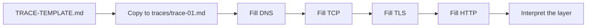

# Month 1 · Week 2 · Day 4
# Feature: A Repeatable URL Trace

**Program:** Full-Stack Mastery · 18 months  
**Phase:** 1 — Foundations  
**Month index:** [../../README.md](../../README.md)  
**Week 2:** [1](day-01.md) · [2](day-02.md) · [3](day-03.md) · Day 4 (today) · [5](day-05.md) · [6](day-06.md) · [7](day-07.md)  
**Week rhythm today:** Add a real project feature  
**Student state:** You wrote the URL journey from memory. Today that journey becomes a **procedure** another engineer can repeat.  
**Study time:** 3–4 focused hours  
**Machine today:** Windows PowerShell (`curl.exe`, not `curl`)

Labs: `~\fullstack-lab\week-02\`.

You are not building a website. You are building a **procedure + filled report**.

---

## How to use this textbook

1. Read a section. Close it. Say the idea in a full sentence.
2. Design empty fields **before** you fill a trace. Empty fields are the product; a one-off note is not.
3. Type the helper script. Do not paste a scanner.
4. Optional review links at the end are for later rechecking — not for first learning.

---

## How to read this chapter

A **trace** is a dated record: this URL, these commands, this evidence, this layer if anything failed. You will reuse the template in Week 3 (HTTP) and Month 16 (deployment). Repeatability beats a clever paragraph you cannot run again.

Keep the layers in order in the file, even when a layer is “N/A — failed earlier.” Inventing a TCP success after DNS failed is fiction, not engineering.



> **Wrong belief:** “I already understand the journey, so a template is paperwork.”  
> **Correct:** the template is how you **prove** the journey on a new URL without inventing steps.

---

## Complete explanation — why a trace is a feature

## 1. Procedure vs one-off note

Yesterday you explained `https://example.com`. Next month you will debug a deploy URL at 11 p.m. A blank template with required fields forces the same order: parse URL, DNS, TCP, TLS, HTTP, client, interpretation, security. That is the feature.

**Operator** and **date** matter. Networks change. A trace without a date is a rumor.

## 2. Fields that look boring and are not

**Scheme** decides TLS and the default port. **Host** is what DNS looks up — not the full URL. **Port** is 443 if `https` omitted it. **Path** is not used by DNS; it is used by HTTP. If you put the path in the DNS box, you have mixed layers.

**Resolver** is who *you* asked (`Get-DnsClientServerAddress` or `ipconfig /all`), not the website’s NS records. Mixing those is a common muddle. You can mention both; label which is which.

## 3. curl vs the browser

`curl.exe -I` is **one** request (headers / HEAD-like). A browser follows redirects, then fetches HTML, then CSS, JS, images — **many** journeys. They can “disagree” without either being broken. Write that difference in interpretation. That is honesty.

If a redirect happens, record **both** the first status (`Location`) and the final URL. Do not dump full `-v` key material. Summarize: handshake succeeded, then the status line.

Use `curl.exe`. In PowerShell, `curl` may be `Invoke-WebRequest`.

## 4. The helper script

`trace-url.ps1` takes `-HostName` because DNS and TCP want a **host**, not a full URL. `param(...)` at the top of a PowerShell script is how it receives inputs. `$HostName` is a script parameter, not a Windows PATH entry, and not an environment variable unless you assign it there.

`Test-NetConnection` is **slow**. That is OK. Document it. Do not loop hosts. Do not scan IP ranges. Only names you have a reason to inspect (this course’s examples, or a site you use for learning).

This first version does not parse `https://`. Stretch later (Day 6) can add scheme and port. Today: one host, DNS + TCP 443 + `curl.exe -I https://$HostName/`.

## 5. Security starts at the first request

Section 7 of the template is required. Did you send credentials? (Should be no.) Did you use HTTP on a non-localhost network for anything sensitive? (Should be no.) HTTPS encrypts the HTTP bytes; it still does not make a phishing site honest.

Traces must not include cookies, tokens, or other people’s personal data.

> **Wrong belief:** “A helper script that hits port 443 on one name is a port scanner.”  
> **Correct:** one host, ports you already use for the web, for a lab you can explain, is inspection. Ranges and surprise ports are out of scope.

---

## Today's contract

Add a **URL trace** template to `fullstack-lab` that you will reuse in Week 3 (HTTP) and Month 16 (deployment).

**Today's gate**

> Given any ordinary `https` URL, I can fill the template using only the terminal and a browser, and another engineer can repeat it.

---

## Time box

| Block | Minutes | Work |
|---|---|---|
| A | 25 | Design the template (fields first) |
| B | 90 | Fill one complete trace for a real URL |
| C | 50 | Optional helper script (print DNS + curl -I) |
| D | 30 | README + git |
| E | 15 | Explain the product |

---

# Block A — Template design

Create `week-02/TRACE-TEMPLATE.md` with **empty** fields. Required fields (roadmap complete):

```markdown
# URL trace

- Date:
- Operator (you):
- URL:
- Scheme (http/https):
- Host:
- Port (explicit or default):
- Path:

## 1. DNS
- Command:
- A records:
- AAAA records:
- Resolver (from ipconfig / Get-DnsClientServerAddress):
- Failure? (yes/no + error):

## 2. TCP
- Command (Test-NetConnection host -Port):
- TcpTestSucceeded:

## 3. TLS / HTTPS
- Used TLS? (yes if https)
- curl verbose notes (cert OK / error):

## 4. HTTP (preview — Week 3 deepens this)
- Command:
- Status line:
- Response `Location` if redirect:
- Response `Content-Type` if present:

## 5. Client
- Browser used:
- What the user would see:

## 6. Interpretation
- First point of failure if any:
- Is this a DNS, TCP, TLS, or HTTP application issue?

## 7. Security
- Credentials sent? (should be no)
- HTTP used on a non-localhost network? (should be no for logins)
```

Do not skip section 7. Security begins with the first network request.

---

# Block B — Fill one real trace

Copy the template to `week-02/traces/trace-01.md` and fill it for:

**`https://example.com/`**

If blocked, `https://www.cloudflare.com/` or `https://example.org/`.

Rules:

- Commands you ran belong in the file.
- Do not dump full `-v` TLS keys; summarize “handshake succeeded, HTTP/1.1 200” (or whatever you got).
- If a redirect happens, record **both** the first response and the final URL.

Browser check: open the same URL. Does it match curl’s status story? (Browsers follow redirects and fetch extra files. Curl `-I` is one request.)

Write that difference in the interpretation section. That is engineering honesty.

---

# Block C — Helper script (feature)

Write `week-02/trace-url.ps1`.

Behavior:

- Parameter: `-HostName` (example: `example.com`)
- Prints:
  1. `Resolve-DnsName $HostName`
  2. `Test-NetConnection $HostName -Port 443` (this is slow — that is OK)
  3. `curl.exe -I "https://$HostName/"`

Skeleton you may type and complete:

```powershell
param(
  [Parameter(Mandatory = $true)]
  [string]$HostName
)

Write-Host "=== DNS ==="
Resolve-DnsName $HostName

Write-Host "=== TCP 443 ==="
Test-NetConnection -ComputerName $HostName -Port 443

Write-Host "=== HTTP HEAD (HTTPS) ==="
curl.exe -I "https://$HostName/"
```

Run:

```powershell
cd ~\fullstack-lab\week-02
.\trace-url.ps1 -HostName example.com
```

If `param` is new: it is how PowerShell scripts take inputs. `$HostName` is an environment of the script, not Windows PATH.

Do not loop over the whole internet. One host per run.

Add a claim to tests tomorrow. Today: script runs.

---

# Block D — Documentation

Update `week-02/README.md`:

- How to copy the template
- How to run `trace-url.ps1`
- Warning: `Test-NetConnection` is slow
- This lab does not attack other systems; only names you have a reason to inspect

Root `README.md`: add a Week 2 bullet.

```powershell
cd ~\fullstack-lab
git add week-02 README.md
git commit -m "Add URL trace template, first filled trace, and helper script."
```

---

# Block E — Explain

Aloud:

1. Why a template (repeatability) beats a one-off note.
2. Why curl and the browser can disagree (redirects, extra requests).
3. Why the script takes a hostname, not a full URL, in this first version — and what you would add (parse scheme/port). Optional stretch: accept a full URL later on Day 6.

---

## Definition of done

- [ ] Template has all required fields.
- [ ] One filled trace with real command evidence.
- [ ] `trace-url.ps1` runs for one hostname.
- [ ] README explains how to repeat the procedure.

---

## Tomorrow

Tests for the tracer, refactor the script (parameters, help, error if DNS fails), documentation polish.

---

## Optional review links

The trace procedure is explained in this chapter. These pages are for later checking, not for first learning.

- [PowerShell: about_Functions_Advanced_Parameters](https://learn.microsoft.com/en-us/powershell/module/microsoft.powershell.core/about/about_functions_advanced_parameters)
- [PowerShell: Test-NetConnection](https://learn.microsoft.com/en-us/powershell/module/nettcpip/test-netconnection)
- [curl: --head / -I](https://curl.se/docs/manpage.html)
