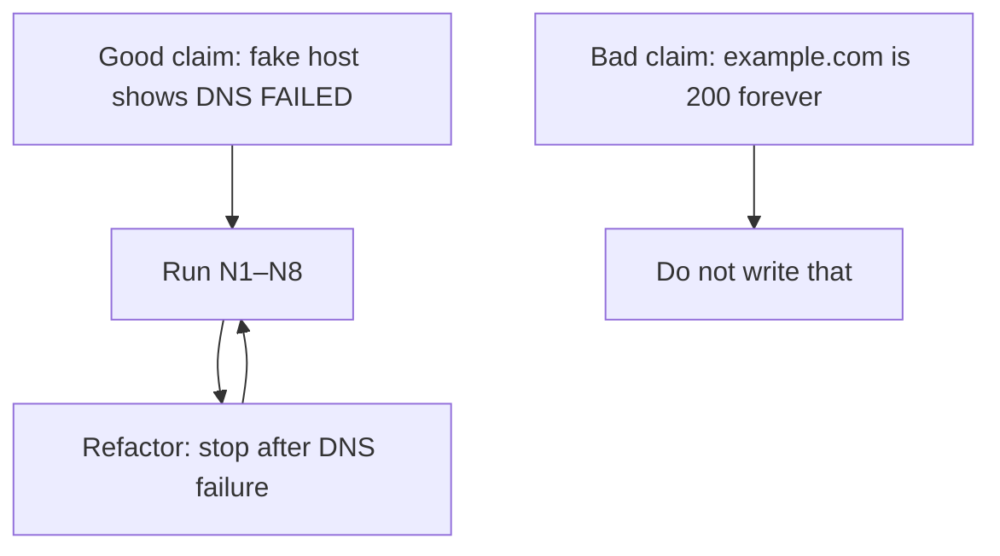

# Month 1 · Week 2 · Day 5
# Tests, Refactor, Documentation — Networking Lab

**Program:** Full-Stack Mastery · 18 months  
**Phase:** 1 — Foundations  
**Month index:** [../../README.md](../../README.md)  
**Week 2:** [1](day-01.md) · [2](day-02.md) · [3](day-03.md) · [4](day-04.md) · Day 5 (today) · [6](day-06.md) · [7](day-07.md)  
**Week rhythm today:** Tests + refactor + documentation  
**Student state:** You have a URL trace template and `trace-url.ps1`. Today the tracer must be **checkable**, then clearer, without becoming a scanner.  
**Study time:** 3–4 focused hours  
**Machine today:** Windows PowerShell (`curl.exe`, not `curl`)

Labs: `~\fullstack-lab\week-02\`.

---

## How to use this textbook

This is not a video transcript and not a tutorial to skim.

1. Read a section. Close it. Say the idea in a full sentence.
2. Fill `TESTS.md` by running. A claim that cannot fail is not a test.
3. Commit tests before refactor when you can, so the second commit is structure.
4. Type every command. Do not paste a “green” table you did not run.
5. Optional review links at the end are for later rechecking — not for first learning.

---

## How to read this chapter

You cannot honestly assert “example.com will always return 200.” The network is not your unit test. You **do** own: the script file exists, `-HostName` is mandatory, a fake name fails **visibly** at DNS, and the markdown has the headings you promised.

That is the seed of “test doubles” in Month 14: you do not own the other server. You test **your** behavior.



> **Wrong belief:** “If the internet is up, my tests passed.”  
> **Correct:** tests passed if **your** script and files behaved. The internet is a dependency, not a grade.

> **Wrong belief:** “I ran it and it looked fine.”  
> **Correct:** that is a demo. N1–N8 are tests only if you recorded a claim that can fail.

> **Wrong belief:** “Refactor means add `-Port` and scan more hosts.”  
> **Correct:** refactor means the same parameters, a clearer DNS failure path, and a comment that this is not a scanner. Features wait.

---

## Complete explanation — testing a network script

A **test** is a claim about behavior that can fail. Later, a framework will run claims automatically. Today **you** run them and record pass/fail. Same idea. Arrange: `cd` to `week-02`. Act: run the script or `Test-Path`. Assert: the claim is true or it is not.

### 1. What to test (and what not to)

| Good claims | Bad claims |
|---|---|
| Script file exists | `example.com` is 200 forever |
| `-HostName` is mandatory (script errors if missing) | The internet is up |
| Fake hostname produces a DNS error | Your ISP never fails |
| Trace markdown has the required headings | TLS ciphers of example.com |

A **mandatory parameter** in PowerShell (`[Parameter(Mandatory = $true)]`) should error if you run `.\trace-url.ps1` with no `-HostName`. That error is a **pass** for claim N4. If the script silently uses a blank host and prints confusing DNS noise, N4 fails — fix the script.

You are not grading IANA. You are grading *your* tracer: does it refuse to lie after DNS fails?

### 2. Visible DNS failure

`Resolve-DnsName` on a name that should not exist must not look like a successful skip. Red text or a `catch` block that prints `DNS FAILED` is visible. Empty output and then a slow TCP attempt is a lie: TCP cannot succeed if you have no IP.

Week 2 physics, because the test is about layers. **DNS** maps a name to A (IPv4) and/or AAAA (IPv6) records. You ask a **resolver**; **authoritative** servers know the zone. Failure at this step is NXDOMAIN or a resolver error — there is no HTTP status yet, and there is no TCP to port 443 yet. **TCP** opens a connection to `IP:port`. **TLS** wraps that connection for HTTPS. **HTTP** is the language *after* those. If you let the script proceed to `Test-NetConnection` after DNS failed, you taught yourself the wrong order.

Detecting failure (one approach):

```powershell
try {
  $dns = Resolve-DnsName -Name $HostName -ErrorAction Stop
  $dns
} catch {
  Write-Host "DNS FAILED for $HostName"
  Write-Host $_
  return
}
```

`-ErrorAction Stop` turns a failing cmdlet into a terminating error so `catch` runs. Then **`return`** — do not pretend TCP will work.

N6 uses a hostname that should not exist. If N6 still “looks fine,” your script swallowed the error. That is the gate.

Worked example. You run:

```powershell
cd ~\fullstack-lab\week-02
.\trace-url.ps1 -HostName this-name-should-not-exist-abcxyz-123.com
```

A passing N6 looks like a clear `DNS FAILED` (or equivalent red resolver error) and then the script **stops**. A failing N6 looks like a pause of many seconds while `Test-NetConnection` tries a port, or like a blank line and then “TcpTestSucceeded : False” with no admission that you never had an IP. False on TCP after a missing name is not a DNS test. It is a confused later layer.

### 3. Refactor vs feature

**Refactor** means change the **structure** of code without changing **what it does**. If a test fails after a rename, the refactor changed behavior — fix the code, not the claim.

Refactor today: comment header (purpose, usage, “does not scan networks”), clear DNS failure path, same parameters. Do **not** add `-Port` during refactor unless N6 needs it. Day 6 stretch can add `-Port`.

Commit `TESTS.md` first, then the script change. Two commits if possible. If you mix them, you cannot tell whether N6 failed because of the refactor.

Re-run N1–N8 after the change. If a heading claim fails, you deleted a file or renamed a section — that is behavior, not “just comments.”

Roadmap Rule 7, early: correctness → clarity → measurement → optimization. Today is **clarity**. Do not micro-optimize `Test-NetConnection`. It is slow. Document that.

### 4. Documentation and ethics

`week-02/README.md` must tell a beginner: the one-line journey, how to copy the template to `traces/trace-NN.md`, how to run tests, that `Test-NetConnection` is slow, that the lab depends on a live network, that this is **not** a security scanner.

The journey one-liner, so the README is not a list of tool names:

```text
Browser → DNS → TCP → TLS → HTTP → server process → response → browser
```

Ethics: only inspect hosts you have a reason to connect to (websites you use, or examples in this course). Do not port-scan IP ranges. A tracer that takes `-HostName example.com` is a lab. A loop from 1 to 65535 is a scanner. You are not writing a scanner.

Security checklist: no secrets in git; HTTP vs HTTPS for credentials (Week 2 Day 2); no other people’s personal data in traces. `curl.exe -I` is one request; a browser fetches more. Say so if your README mentions curl.

Use `curl.exe` in docs and scripts, not `curl`. PowerShell’s `curl` may be an alias for `Invoke-WebRequest`.

### 5. Deliberate break

Temporarily remove `-ErrorAction Stop` / try-catch — or misspell `Resolve-DnsName`. Run N6. Record which claim fails. Restore. Re-run. If nothing fails, your claim was too weak. Tighten N6 until a broken DNS path is caught.

A test you never saw fail is a souvenir. Month 14’s gate is the same idea with a framework. Today the runner is you.

### Office hours — N4 and N6

**N4 looks like a failure but is a pass.** PowerShell prompting for `-HostName` or throwing that a mandatory parameter is missing **is** the desired behavior. Do not “fix” N4 by giving the script a default hostname. A default of `example.com` makes the parameter optional and N4 fails.

**N6 and captive portals.** Some networks answer every unknown name with a portal IP. If that happens, write what actually happened. Do not invent NXDOMAIN. Then pick a name that still fails in a way you can see, or record “resolver returned an IP for a fake name — filtered network” as the actual result and still refuse to call it HTTP 404.

**`Test-NetConnection` is slow.** That is not a failed test. It is a limitation. Put it in the README so a future you does not think the script hung.

---

## Today's contract

Make the URL tracer **checkable**. A claim must be able to fail.

**Today's gate**

> If I pass a hostname that does not exist, the script’s DNS step fails visibly, and my test plan records that.

---

## Time box

| Block | Minutes | Work |
|---|---|---|
| A | 25 | What to test (and what not to) |
| B | 50 | Write and run `week-02/TESTS.md` |
| C | 70 | Refactor `trace-url.ps1` |
| D | 40 | Docs |
| E | 15 | Deliberate bad hostname |

---

# Block A — Testing a network script

You cannot honestly assert “example.com will always return 200.” The network is not your unit test. Test **your** behavior:

| Good claims | Bad claims |
|---|---|
| Script file exists | `example.com` is 200 forever |
| `-HostName` is mandatory (script errors if missing) | The internet is up |
| Fake hostname produces a DNS error | Your ISP never fails |
| Trace markdown has the required headings | TLS ciphers of example.com |

This is the seed of “test doubles” in Month 14: you do not own the other server.

Speak, closed-book, before you type TESTS.md: what happens at DNS, what happens at TCP, why a missing name must `return` before `Test-NetConnection`. If that speech is mush, re-read section 2 of this file.

---

# Block B — Test plan

Create `week-02/TESTS.md` and run it.

| ID | Claim | How |
|---|---|---|
| N1 | `TRACE-TEMPLATE.md` exists | `Test-Path` |
| N2 | `traces/trace-01.md` exists and contains `## 1. DNS` | `Select-String` |
| N3 | `trace-url.ps1` exists | `Test-Path` |
| N4 | Running without `-HostName` errors | `.\trace-url.ps1` |
| N5 | `.\trace-url.ps1 -HostName example.com` produces DNS output | run; see records or a clear error |
| N6 | `.\trace-url.ps1 -HostName this-name-should-not-exist-abcxyz-123.com` does not look like a successful silent skip | run; DNS error visible |
| N7 | `url-journey.md` exists (Day 3) | `Test-Path` |
| N8 | README explains how to run the script | read it |

```powershell
cd ~\fullstack-lab\week-02
Test-Path .\TRACE-TEMPLATE.md
Test-Path .\trace-url.ps1
Test-Path .\url-journey.md
Select-String -Path traces\trace-01.md -Pattern '## 1. DNS'
```

Then the two runs that actually exercise the script:

```powershell
cd ~\fullstack-lab\week-02
.\trace-url.ps1
.\trace-url.ps1 -HostName example.com
.\trace-url.ps1 -HostName this-name-should-not-exist-abcxyz-123.com
```

Record PASS/FAIL. Fix missing files. N4’s error is a pass. N6’s visible DNS failure is a pass. A silent skip is a fail.

If N2 fails because you renamed `## 1. DNS` to `## Name lookup`, the template contract broke. Restore the heading or update the claim **only** if the course template itself changed — it did not. Keep `## 1. DNS`.

---

# Block C — Refactor

If TESTS.md is ready, commit it **before** you touch the script:

```powershell
cd ~\fullstack-lab
git add week-02/TESTS.md
git commit -m "Record Week 2 tracer test plan before refactor."
```

Then:

1. Add a comment header: purpose, usage, “does not scan networks.”
2. After DNS, if resolution failed, **print a clear message** and `return` (do not pretend TCP will work).

Detecting failure in PowerShell (one approach):

```powershell
try {
  $dns = Resolve-DnsName -Name $HostName -ErrorAction Stop
  $dns
} catch {
  Write-Host "DNS FAILED for $HostName"
  Write-Host $_
  return
}
```

3. Add a second optional parameter later only if tests still pass — do not add features during refactor unless N6 needs it.
4. Re-run N1–N8.

Commit tests, then refactor, as two commits if possible.

```powershell
git add week-02/trace-url.ps1
git commit -m "Stop URL tracer after DNS failure."
```

---

# Block D — Documentation

`week-02/README.md` must include:

- URL journey one-liner
- How to fill a new trace (copy template → `traces/trace-NN.md`)
- How to run tests (`TESTS.md`)
- Limitations: slow `Test-NetConnection`; depends on live network; not a security scanner
- Ethics: only inspect hosts you have a reason to connect to (websites you use, or examples in this course)

A command in the README must work if typed in a new PowerShell:

```powershell
cd ~\fullstack-lab\week-02
.\trace-url.ps1 -HostName example.com
```

Say `curl.exe`, not `curl`. Say what DNS is in a sentence if you mention it — a name-to-address lookup — not a link to a glossary.

Root README: link to Week 2.

---

# Block E — Deliberate break

Temporarily remove `-ErrorAction Stop` / try-catch if you added it — or misspell `Resolve-DnsName`. Run N6. Record which claim fails. Restore. Re-run.

Example of a break you can see: rename `Resolve-DnsName` to `Resolve-DnsNam`. N5 and N6 should both complain. Write one line in TESTS.md: what you changed, which IDs failed, that you restored. Then N1–N8 must pass again.

If **no** claim fails when DNS is broken, N6 was too vague. Tighten it until “silent skip” is a fail you can point at.

---

## Security checklist (Week 2)

- [ ] I did not commit secrets.
- [ ] I understand HTTP vs HTTPS for credentials.
- [ ] I did not port-scan IP ranges.
- [ ] Trace files do not include other people’s personal data.

HTTPS encrypts HTTP messages on the path. HTTP on a café network does not. That is Week 2 Day 2, restated so the README’s security sentence is not cargo-cult. HTTPS is not a guarantee the site is honest. It is encryption plus a certificate name check.

---

## Definition of done

- [ ] TESTS.md filled with real results
- [ ] Fake hostname is a visible DNS failure
- [ ] README is enough to repeat the lab
- [ ] Two-commit habit: tests/docs vs refactor if you changed the script

---

## Tomorrow

Independent traces: two new URLs, including one failure, without this week’s type-along labs.

---

## Optional review links

Testing your script — not the internet — is explained in this chapter. These pages are for later checking, not for first learning.

- [PowerShell: about_Try_Catch_Finally](https://learn.microsoft.com/en-us/powershell/module/microsoft.powershell.core/about/about_try_catch_finally)
- [PowerShell: about_CommonParameters (`-ErrorAction`)](https://learn.microsoft.com/en-us/powershell/module/microsoft.powershell.core/about/about_commonparameters)
- [PowerShell: Select-String](https://learn.microsoft.com/en-us/powershell/module/microsoft.powershell.utility/select-string)
