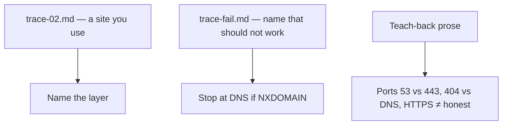

# Month 1 · Week 2 · Day 6
# Independent Networking Work

**Program:** Full-Stack Mastery · 18 months  
**Phase:** 1 — Foundations  
**Month index:** [../../README.md](../../README.md)  
**Week 2:** [1](day-01.md) · [2](day-02.md) · [3](day-03.md) · [4](day-04.md) · [5](day-05.md) · Day 6 (today) · [7](day-07.md)  
**Week rhythm today:** Independent project work  
**Student state:** You traced `example.com` with a template. Today you trace a site you pick and a name that **must** fail — from this chapter, not from Days 1–5 open on the side.  
**Study time:** 3–4 focused hours  
**Machine today:** Windows PowerShell (`curl.exe`, not `curl`)  
**Days 1–5 textbook files:** closed for the *challenges*. If you cannot recall a fact, re-open **Day 1 or Day 2 of this week in this book**, not a random website.

Labs: `~\fullstack-lab\week-02\`.

---

## How to use this textbook

This is not a video transcript and not a tutorial to skim.

1. Read the complete explanation. Close it. Say each layer in a full sentence.
2. Fill traces by running commands. Do not copy `trace-01.md` and change the title.
3. Teach-back is prose, 400–700 words, **your** wording — not a bullet dump.
4. If a command fails, read the error against the layer order. Then fill the template honestly.
5. Optional review links at the end are for later rechecking — not for first learning.

---

## How to read this chapter

Today is **independent**. The challenges are the exam. This file is the teacher.

You will produce two filled traces and a teach-back. The failure trace is not optional. A student who only traces happy URLs cannot debug.



> **Wrong belief:** “Independent means I should look up a networking tutorial.”  
> **Correct:** independent means you fill the template from **this** explanation and your terminal.

> **Wrong belief:** “If the padlock is there, the site is trustworthy, and 404 means the internet is broken.”  
> **Correct:** the padlock is TLS. 404 is an application answer after the pipe worked.

> **Wrong belief:** “A failed name still has a TCP result I should invent so the template looks complete.”  
> **Correct:** many sections will be “N/A — failed at DNS.” Honesty is the skill.

---

## Complete explanation (this book is the lesson)

You already practiced these ideas. Here they are again in full, so a later review never requires another page.

### Client, server, address, port

**Client and server** are processes. The browser is a client. The process listening on a port is a server. One machine can run both. Your laptop can be a client of `example.com` and, later, a server when a local API listens on `127.0.0.1:8000`. “The cloud” is still processes on someone else’s OS, with CPU, RAM, and disk (Week 1).

**IP** answers “which interface / machine.” **Port** answers “which process.” `127.0.0.1` is this machine (IPv6 loopback is `::1`). `192.168.x.x` (and `10.` / `172.16–31.`) is private LAN — not unique on the public internet. A public IP is what the internet sees (often your **router**, because of NAT). Your `192.168` address is not what a public website sees.

`https://example.com` uses port **443** when the port is omitted; `http://` uses **80**. Dev servers often use 3000, 5173, 8000 — you must write those ports in the URL. If nothing listens, connection **refused** — the files on disk did not become a server. That is Week 1’s program vs process, spoken in network language.

### DNS

**DNS** maps a **name** to A (IPv4) and/or AAAA (IPv6) records. A typo becomes NXDOMAIN — there is no HTTP yet. A **resolver** (often your router or ISP) is who you ask; the **authoritative** server for the domain is who ultimately knows. DNS often uses port **53** (UDP). That is not the website’s 443.

A **domain** is a human name, registered, read right-to-left (`www.example.com`: TLD `com`, registered name `example`, subdomain `www`). A URL is scheme + host + port + path + more. The domain is only the host part. Do not call the whole URL “the DNS name.”

If a site works by raw IP but fails by name, that is DNS (or TLS name check — certificates are for names). If `Resolve-DnsName` fails, stop talking about 404.

Worked example. You pick `https://en.wikipedia.org/` (allowed: a learning site, not a bank). You run `Resolve-DnsName en.wikipedia.org`. You write the A and/or AAAA records you actually see. You label **your** resolver using `Get-DnsClientServerAddress` — those IPs are who *you* asked, not Wikipedia’s web server. Then you test TCP 443 against an address DNS gave you. Then `curl.exe -I https://en.wikipedia.org/`. If you skip DNS and only curl, you cannot say which layer worked.

### TCP, TLS, HTTPS, HTTP

**TCP** opens a connection to `IP:port`. Connection **refused** = nothing accepted that port. **Timeout** = packets dropped or filtered. Neither is an HTTP status code. If you forgot to start a local server, you get refused — the source files on disk do not listen.

**TLS** wraps that connection: encryption, certificate (name + public key + CA signature), integrity. **HTTPS** is HTTP over TLS. A phishing site can still have HTTPS. TLS is not login. Certificates are for **names**. Hitting `https://` plus a raw IP may fail the name check. That is a feature.

HTTP on port 80 is cleartext — café Wi-Fi can read passwords. Localhost HTTP for development is a common honest exception. Production websites are HTTPS. The padlock is not a character reference.

**Order:** parse URL → DNS if needed → TCP → TLS if https → HTTP request → server process → HTTP response → browser may start more requests → render (CPU/RAM on the client).

**404** means the whole chain worked and the **application** said “no such resource.” Do not call that “DNS is down.” **500** means the process ran and failed inside. **Connection refused** never produced a status line.

When you fill a failure trace, many sections will be “N/A — failed at DNS.” Do not invent TCP success. Honesty is the skill.

Do not log in. Do not record cookies or tokens. Not a bank. `curl.exe -I` is one request; a browser fetches more. Say so in interpretation.

Stretch: `-Port` defaulting to 443 lets you test port 80 without pretending it is TLS. Document it in the Week 2 README in this repo.

### Office hours — three ways students invent later layers

**Invented TCP after NXDOMAIN.** The template has a TCP heading, so they write “port 443 closed.” There was no IP. Write `N/A — failed at DNS`.

**curl.exe vs curl.** PowerShell `curl` may be `Invoke-WebRequest`. Status fields look different. Headers look different. Always type **`curl.exe`**. Quote URLs that contain `?` because PowerShell treats `?` as a wildcard — you will need that in Week 3; start the habit now.

**Captive portal / corporate filter.** A surprising A record for a nonsense name is still a result. Name the layer: you got an IP from *your* resolver. TLS or HTTP after that may be a portal page, not the site you typed. Write what happened. Do not force NXDOMAIN.

Layer test you will use all month: if `Resolve-DnsName` fails, stop talking about 404. If TCP fails, HTTP never started. If TLS fails, you never got a status line. If you got 404, the protocol worked.

### Filling the template without lying

A trace is a lab notebook, not a story you wish were true. Every heading in `TRACE-TEMPLATE.md` stays. Empty is not the same as deleted. “None” for AAAA is honest. Deleting the AAAA heading is not.

Worked fill for a **happy** name, in the order you run commands:

1. **URL you typed** — scheme, host, path. Example: `https://en.wikipedia.org/`. Port omitted means 443 because the scheme is `https`.
2. **DNS** — `Resolve-DnsName` output: A and/or AAAA. Resolver IPs from `Get-DnsClientServerAddress`, labeled “my resolver,” not “Wikipedia’s server.”
3. **TCP** — `Test-NetConnection host -Port 443`. `TcpTestSucceeded` true or false. Slow is normal.
4. **TLS / HTTPS** — you asked for `https`, so TLS must succeed before HTTP. `curl.exe -I` failing with a certificate error is TLS, not 404.
5. **HTTP** — status line from `curl.exe -I`. Headers only (`-I`). Interpretation: first failure if any.

Worked fill for a **failing** name:

1. URL with a host that should not exist.
2. DNS: NXDOMAIN or resolver error. Stop.
3. TCP: `N/A — failed at DNS`.
4. TLS: `N/A — failed at DNS`.
5. HTTP: `N/A — failed at DNS`. Not 404.

NAT, restated so the teach-back has something true to say. Your laptop’s `192.168.x.x` is unique on *your* LAN and meaningless as a public identity. Many home machines share one public IP on the router. A website sees the router, not your private address. Loopback `127.0.0.1` never leaves this machine. If you trace `https://example.com`, you are not tracing loopback. If you later run a local server, you will. Do not mix those in one trace.

Ports, restated so 53 vs 443 cannot collapse. DNS queries usually go to port **53** on the resolver. The website listens on **443** (HTTPS) or **80** (HTTP). Writing “the site uses port 53” in a teach-back is a failed layer map. Writing “I asked DNS on 53, then I opened TCP 443 to the A record” is the map.

`curl.exe -I` vs a browser, restated so interpretation is not mush. One `curl.exe -I` is one request, usually to the document URL, headers only. A browser reload of the same URL starts the document request and then more requests for CSS, images, and scripts. Each of those is its own DNS (sometimes cached), TCP, TLS, HTTP chain. If your teach-back says “the browser did one HTTP,” you under-counted. You do not need to trace every subresource today. You do need to say that they exist.

Do not log in. Do not record cookies or tokens. Not a bank. A documentation site, GitHub without signing in, or Wikipedia is enough.

---

## Today's contract

Trace a URL you pick and a URL that fails, and say which **layer** failed, using the explanation above.

**Today's gate**

I can trace a URL I pick and a URL that fails, and I can say which **layer** failed, using the explanation above.

---

## Time box

| Block | Minutes | Work |
|---|---|---|
| A | 20 | Speak the explanation; draw the order |
| B | 55 | Challenge 1 — trace-02.md |
| C | 40 | Challenge 2 — trace-fail.md |
| D | 45 | Challenge 3 — teach-back |
| E | 30 | Stretch optional + tests I1–I3 + git |

---

# Challenge 1 — Trace a site you actually use (required)

Copy `TRACE-TEMPLATE.md` to `week-02/traces/trace-02.md`.

```powershell
cd ~\fullstack-lab\week-02
Copy-Item .\TRACE-TEMPLATE.md .\traces\trace-02.md
```

Fill it for **one** `https://` site you use for learning (documentation, GitHub, Wikipedia). Not a bank. Do not log in. Do not record cookies or tokens.

Run DNS, TCP 443, and `curl.exe -I` yourself. Example shape (replace the host with **your** choice):

```powershell
Resolve-DnsName wikipedia.org
Get-DnsClientServerAddress
Test-NetConnection wikipedia.org -Port 443
curl.exe -I https://wikipedia.org
```

`Test-NetConnection` is slow. That is a limitation, not a failed trace. Paste meaningful lines into the template, not 200 lines of TLS noise.

Interpretation: first failure if any; DNS vs TCP vs TLS vs HTTP.

Every template heading stays. If AAAA is empty, write “none,” do not delete the field. Resolver is **your** DNS servers, labeled as such.

Do not copy `trace-01.md` and change the title. A copied A record from `example.com` is a failed independent day even if the headings look pretty.

### Interpretation worksheet (write this into the trace, in sentences)

After the commands, your `trace-02.md` should be able to answer these without another file:

- What **name** did I type, and what **A** (and AAAA if any) did DNS return?
- Who did I ask? (resolver IPs, labeled as mine)
- Did TCP 443 succeed to an address DNS gave me?
- Did `curl.exe -I` print a status line? Which class — 2xx, 3xx, 4xx, 5xx?
- If anything failed, which **first** layer failed? What did I *not* get to?

If the site redirects (301/302), that is still HTTP. Write `Location`. Do not call a redirect “the site is down.” Follow it in a second `curl.exe -I` if you want; say that you followed it. A browser follows redirects automatically. curl `-I` may show the first hop only, depending on flags. You are not required to chase a chain today. You are required to name the status you actually saw.

Private vs public, if you also inspect your own machine today (optional, useful for the teach-back): `Get-NetIPAddress` will show `127.0.0.1` and a `192.168` or similar. Those are not the IPs in Wikipedia’s A record. Mixing “my Wi-Fi address” into the DNS section of a public trace is a confused notebook. Wikipedia’s A record is *their* interface (or a CDN’s). Your resolver IPs are *your* DNS servers. Three different roles. Label them.

IPv6: if you see AAAA and `Test-NetConnection` still uses IPv4, write that. You do not need to force IPv6 this month. You do need to not delete the AAAA heading.

---

# Challenge 2 — A failure trace (required)

`week-02/traces/trace-fail.md` for a hostname that **should not work**, for example `https://this-name-should-not-exist-abcxyz-123.com/`

```powershell
cd ~\fullstack-lab\week-02
Copy-Item .\TRACE-TEMPLATE.md .\traces\trace-fail.md
Resolve-DnsName this-name-should-not-exist-abcxyz-123.com
```

Fill every template section. Many will be “N/A — failed at DNS.” Do not invent TCP success. Do not run `curl.exe -I` and then write 404 because you wish HTTP had started.

If something surprising happens (captive portal, corporate filter that returns an IP for unknown names), write **what actually happened** and which layer that is. Do not force the story to say NXDOMAIN if you did not see NXDOMAIN.

If DNS *does* fail, you may still type `curl.exe -I` once to see the resolver error in curl’s language. Record it as DNS/curl error, not as an HTTP status.

---

# Challenge 3 — Teach-back (required)

`week-02/independent-teachback.md`

400–700 words, **your** wording, covering the complete explanation above (ports 53 vs 443, 404 vs DNS, HTTPS ≠ trustworthy, server is a process with RAM and a disk). Prose, not a bullet dump.

Count words after you write. If you are under 400, you skipped a layer. If you are over 700, you wandered — cut examples, keep the chain.

A teach-back that only says “DNS finds the IP then TCP then HTTPS” is under the bar. Expand: who you ask (resolver vs authoritative), why 404 is success of the pipe, why a padlock is not honesty, why a dead process is not a missing file, why `127.0.0.1` is this machine. Use full sentences.

Teach-back checklist (not a substitute for prose — tick these after you write):

- Client and server are **processes**. One machine can run both.
- IP vs port, with 80 / 443 / 53 named as jobs.
- Loopback vs private vs public / NAT in at least two sentences.
- DNS: resolver vs authoritative; NXDOMAIN is not 404.
- TCP refused vs timeout vs “HTTP started.”
- TLS: encryption, name check, not login, not honesty.
- HTTPS = HTTP over TLS. Café HTTP is cleartext.
- Lifecycle order, including render using CPU/RAM on the client (Week 1).
- `curl.exe -I` is one request; a browser reload is many.

If any bullet has no sentence in the file, you are under 400 for a reason. Add the missing layer. Do not pad with autobiography.

# Challenge 4 — Stretch

Improve `trace-url.ps1` to accept `-Port` defaulting to 443. Test `-Port 80` on `example.com`. Document in the Week 2 README (in this repo, not on a vendor site).

If you add `-Port`, DNS still runs first. A failed name must still `return` before TCP. Re-run Week 2 `TESTS.md` if you touch the script.

```powershell
cd ~\fullstack-lab\week-02
.\trace-url.ps1 -HostName example.com -Port 80
.\trace-url.ps1 -HostName this-name-should-not-exist-abcxyz-123.com -Port 80
```

The second command must still fail at DNS, not attempt port 80 on a missing IP. Port 80 on `example.com` is HTTP, not TLS. Do not call a cleartext port a padlock.

### What “layer” means when you write I2

I2 is not “the website is broken.” I2 is a sentence: “DNS did not return an A/AAAA for this name, so TCP and HTTP are N/A.” If your filter returned an IP, I2 is a different honest sentence: “Resolver returned an address for a nonsense name; first surprising layer was DNS (or the portal after TLS).” Either can PASS. Invented 404 cannot.

I1 needs a real A record **or** an honest failure on a site you actually use. A copied `example.com` A record from an earlier trace is not independent work.

I3 fails if `independent-teachback.md` is empty or is a bullet dump under 400 words. Prose means paragraphs.

# Tests

| ID | Claim |
|---|---|
| I1 | `traces/trace-02.md` exists and includes a real A record or an honest failure |
| I2 | `traces/trace-fail.md` states failure at DNS (or whatever actually happened) |
| I3 | teachback file is not empty |

Write PASS/FAIL in `week-02/independent/TESTS.md` or at the bottom of `week-02/TESTS.md`. A failed claim is a failed test.

```powershell
cd ~\fullstack-lab\week-02
Test-Path .\traces\trace-02.md
Test-Path .\traces\trace-fail.md
Test-Path .\independent-teachback.md
Select-String -Path traces\trace-02.md -Pattern 'A '
```

```powershell
cd ~\fullstack-lab
git add week-02
git commit -m "Add independent URL traces and networking teach-back."
```

Read `git status` first. No cookies, no tokens, no HAR files with sessions.

---

## Definition of done

- [ ] `trace-02.md` filled from commands you ran
- [ ] `trace-fail.md` does not invent later-layer success
- [ ] Teach-back is 400–700 words of prose
- [ ] I1–I3 recorded
- [ ] Commit exists

If I1 fails, the PATH doctor of Week 1 is the same lesson as “run the tracer from a full path.” The script must not require `cd` into `traces`. DNS lookup is not a file in cwd.

---

## Tomorrow

Week review: speak every Week 2 topic, mini-trace, debug layers, plan Week 3.
Do not start Week 3 because the calendar moved.

I1–I3 are claims. A pretty template with invented TCP after NXDOMAIN fails I2.
A copied `trace-01` with a new title fails I1. An empty teach-back fails I3.

---

## Optional review links

Not required. The explanation is in this file and in Week 2 Days 1–2.

- [MDN: How the Internet works](https://developer.mozilla.org/en-US/docs/Learn/Common_questions/Web_mechanics/How_does_the_Internet_work)
- [PowerShell: Resolve-DnsName](https://learn.microsoft.com/en-us/powershell/module/dnsclient/resolve-dnsname)
- [PowerShell: Get-DnsClientServerAddress](https://learn.microsoft.com/en-us/powershell/module/dnsclient/get-dnsclientserveraddress)
