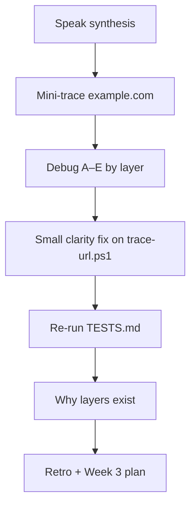

# Month 1 · Week 2 · Day 7
# Week Review — Internet and Networking

**Program:** Full-Stack Mastery · 18 months  
**Phase:** 1 — Foundations  
**Month index:** [../../README.md](../../README.md)  
**Week 2:** [1](day-01.md) · [2](day-02.md) · [3](day-03.md) · [4](day-04.md) · [5](day-05.md) · [6](day-06.md) · Day 7 (today)  
**Week rhythm today:** Review, repair, plan Week 3  
**Student state:** You traced URLs all week. Today those layers must still live in your head — from **this file**.  
**Study time:** 3–4 focused hours  
**Machine today:** Windows PowerShell (`curl.exe`, not `curl`)

Do not start Week 3 because the calendar moved. Start Week 3 because this file’s gate is true.

Labs: `~\fullstack-lab\week-02\review\`.

---

## How to use this textbook

This is not a video transcript and not a tutorial to skim.

1. Read the synthesis. Close it. Speak it in full sentences.
2. Days 1–6 stay closed during the mini-trace and debug blocks. Repair from **this** recap.
3. Repair the weakest **layer** today by re-reading that day’s theory in this book.
4. Type every command. Do not copy `trace-01.md` into the review folder.
5. Optional review links at the end are for later rechecking — not for first learning.

---

## How to read this chapter

This is a **closed-book teaching day**. The synthesis **is** the Week 2 lesson. The seven blocks are the weekly exam.

Layer test you will use all month: if `Resolve-DnsName` fails, stop talking about 404. If TCP fails, HTTP never started. If TLS fails, you never got a status line. If you got 404, the protocol worked.



> **Wrong belief:** “The site is down” is one problem.  
> **Correct:** name, TCP, TLS, and HTTP application are four problems. Name the layer.

> **Wrong belief:** “If I survived the week, I can start Week 3 on Monday.”  
> **Correct:** you start Week 3 when this file’s gate is true. A calendar is not a gate.

> **Wrong belief:** “HTTPS means the site is honest, and 404 means DNS failed.”  
> **Correct:** HTTPS is HTTP over TLS. 404 is an application answer after the pipe worked. NXDOMAIN is DNS.

---

## Week synthesis (study from here)

This is the whole Week 2 lesson in one place. Review **this**, not a tutorial site. If you go blank, re-read the matching numbered item here, then try the block again.

1. **Client/server** — two programs; request then response. The browser is a client process. The listener on a port is a server process. One machine can run both. A later API can be a client of a database. “The cloud” is still processes on hosts with OS, CPU, RAM, and disk (Week 1). The box in a basement is the host. The **process** is the server.

2. **IP** — machine/interface address. Loopback `127.0.0.1` / `::1` is this computer. Private ranges (`10.`, `172.16–31.`, `192.168.`) are not unique on the public internet. Public IP often on the router (NAT). Your `192.168` address is not what a public website sees. IPv4 looks like four decimal numbers. IPv6 is longer and uses hex. You do not need to memorize allocation charts. You need to read an address and say whether it is loopback, private, or public.

3. **Port** — 16-bit number 0–65535. 80 HTTP, 443 HTTPS, 53 DNS. `localhost:3000` is this computer, process on 3000. If nothing listens, connection **refused** — the files on disk did not become a server. That is program vs process again. Two processes cannot usefully own the same TCP port on the same address at once; the second bind fails.

4. **Domain** — human name, registered, read right-to-left (`www.example.com`: TLD `com`, registered name `example`, subdomain `www`). A URL is scheme + host + port + path + more. The domain is only the host part. `https://example.com/path?q=1` is a URL. `example.com` is the host. `/path` is not DNS.

5. **DNS** — name → A/AAAA (and other record types: CNAME alias, MX mail, NS authority). You ask a **resolver**; **authoritative** servers know the zone. Failure: NXDOMAIN vs resolver down. Works by IP but fails by name is DNS, not “the web server died.” DNS often uses port **53**. That is not the website’s 443. `Get-DnsClientServerAddress` shows **your** resolvers. Those IPs are not `example.com`.

6. **TCP** — connection to IP:port; refused vs timeout vs “HTTP started.” TCP is the usual pipe under HTTP. Handshake exists; you do not debug packet flags this month. You **do** refuse to call a timeout a 404. Connection refused means nothing accepted that port. Timeout means packets dropped or filtered. Neither produced a status line.

7. **TLS** — encryption + certificate hostname check + integrity. Happens **before** HTTP on HTTPS. Cert is for a **name**. Raw IP + HTTPS often warns. Expired or wrong-host cert: browser interstitial; `curl.exe` error. A phishing site can still have a valid certificate for *its* name. TLS is not login.

8. **HTTPS** — HTTP over TLS, default port 443. Not a guarantee the site is honest. HTTP on port 80 is cleartext — café Wi-Fi can read passwords. Localhost HTTP for development is a common honest exception. Production websites are HTTPS. Use `curl.exe`. PowerShell `curl` may be an alias.

9. **Lifecycle** — Browser → DNS → TCP → TLS → HTTP → server process → response → browser (then more requests, then render with CPU/RAM). `curl.exe -I` is one request. A browser reload is many journeys: document, CSS, images, scripts. Say so when you interpret.

Layer test: if `Resolve-DnsName` fails, stop talking about 404. If TCP fails, HTTP never started. If TLS fails, you never got a status line. If you got 404, celebrate: the protocol worked. The application said “no such resource.”

Office-hours story. A student reports “the internet is down” because `https://exmaple.com` fails. `ping` to a working site succeeds. `Resolve-DnsName exmaple.com` is NXDOMAIN. The layer is DNS for the **name they typed**. Another student reports 404 as “the server is offline.” `curl.exe -I` shows `HTTP/1.1 404`. The server is online. The path is wrong. A third student runs `curl.exe https://example.com:80` and calls it a TLS outage. Port 80 is HTTP. TLS on 443. Name the layer.

### What you should still be able to do on this machine

Closed-book, in PowerShell, you should be able to:

- Print **your** addresses with `Get-NetIPAddress` or the inspection you used on Day 1 of this week, and say which are loopback, private, or public-facing.
- Ask DNS for `example.com` and read an A or AAAA record.
- Test TCP 443 to that name and not call a slow cmdlet a failure.
- Run `curl.exe -I https://example.com` and point at a status line.
- Explain why `curl` without `.exe` is the wrong program in many PowerShell sessions.

If any of those five is still a website search, you are not at the gate. Repair from this synthesis, then from Week 2 Days 1–2 in this book.

NAT in one paragraph, because it is the usual mush. Many devices on a home LAN share one public IPv4 address. The router rewrites packets (Network Address Translation). A server on the internet sees the router’s public IP, not your `192.168` address. That is why “my IP” in a web “what is my IP” page disagrees with `Get-NetIPAddress` on Wi-Fi. Both can be true. They are different interfaces and different sides of NAT.

Loopback in one paragraph. `127.0.0.1:8000` is a process on **this** computer. It does not use DNS for `localhost` in a way you need to debug this month (Windows will resolve `localhost` to loopback). Connection refused there means nothing is listening. It is not “the internet is down.” It is Week 1: no process.

What `curl.exe -I` is, again. `-I` asks for headers, typically a HEAD-like request. You see status and headers. You do not need the HTML body to know 200 vs 301 vs 404. `-v` adds TLS and the request lines. Use `-I` for the mini-trace. Save `-v` for when TLS is the question.

---

## Today's contract

Closed-book, you can perform the Month 1 URL explanation (networking half) and diagnose which **layer** failed.

**Today's gate**

Closed-book, you can perform the Month 1 URL explanation (networking half) and diagnose which **layer** failed.

---

## Time box

| Block | Minutes | Work |
|---|---|---|
| 1 | 40 | Closed-book explanation |
| 2 | 40 | Independent mini-trace |
| 3 | 30 | Debugging challenge |
| 4 | 25 | Code review |
| 5 | 20 | Testing |
| 6 | 20 | Design |
| 7 | 30 | Retrospective + Week 3 plan |

---

# 1. Closed-book explanation (40 min)

Speak every Week 2 roadmap item, using the synthesis. If an item is under 60 seconds of true content, it is weak — re-read Days 1–2 **in this textbook**.

Cover: client/server, IP, ports, domain vs URL, DNS, TCP, TLS, HTTPS, the full journey. If you say “and then the internet…” you are not done. Rewrite that sentence from the lifecycle line above.

Write weak topics in `week-02/review/weak.txt` as you go. Do not wait until the retro to discover you cannot explain NAT.

---

# 2. Independent mini-trace (40 min)

Textbook closed. New shell. Trace `https://example.com/` into `week-02/review/mini-trace.md` (DNS IPs, port 443 true/false, curl status). Do not copy trace-01.

```powershell
cd ~\fullstack-lab
New-Item -ItemType Directory -Force -Path week-02\review | Out-Null
Resolve-DnsName example.com
Test-NetConnection example.com -Port 443
curl.exe -I https://example.com
```

Commands you already own: `Resolve-DnsName`, `Test-NetConnection ... -Port 443`, `curl.exe -I https://example.com`. Paste meaningful lines, not 200 lines of TLS noise.

`Test-NetConnection` is slow. Wait. `TcpTestSucceeded : True` is the line you want for port 443. `curl.exe -I` should show a status line if TLS and HTTP started. If DNS failed, stop. Do not invent a status.

---

# 3. Debugging challenge (30 min)

`week-02/review/debug-answers.txt` — write the **layer** and the **reason**, from the synthesis. Full sentences. “TLS” alone is not an answer for A — say the certificate is bound to a hostname.

**A.** Site loads by raw IP but certificate warning. (TLS name check vs IP.)  
**B.** `ping example.com` works, browser NXDOMAIN for a **different** typo. (DNS for the name you actually typed.)  
**C.** `curl.exe http://localhost:8000` connection refused; files exist on disk. (No process listening — program vs process.)  
**D.** `curl.exe https://example.com:80` fails strangely. (Port 80 is HTTP; TLS on 443.)  
**E.** Password on `http://` café Wi-Fi. (No TLS; HTTP is cleartext.)

Expand each in your file. For A: certificates are issued to names, not to “whoever answers this number.” Browsers check the name in the URL against the certificate. A raw IP does not match `example.com` on the cert. That warning is TLS doing its job.

For B: `ping` proved *some* name works. The browser asked DNS for a *different* string. NXDOMAIN is about the string you typed. Do not debug TCP on the working name.

For C: Week 1. The `.py` files (or any files) are a program on disk. Nothing is a server until a process binds the port. Connection refused is TCP. It is not HTTP 404.

For D: you asked for TLS (`https://`) on the cleartext port. The other side may speak HTTP, or nothing useful. Use `http://example.com:80` if you mean HTTP, or `https://example.com` (443) if you mean TLS.

For E: without TLS, anyone on that network who can see the packets can read the password. HTTPS encrypts the HTTP messages. HTTPS still does not make a phishing site honest.

**F (stretch if A–E were easy).** `curl.exe -I https://127.0.0.1/` from a laptop that is not running a local web server. Layer? You may skip DNS for a literal IP. TCP to 443 on loopback is likely refused. That is not “the internet.” That is no process on this machine. Write it.

**G.** Browser shows a padlock; the page is a login clone of a bank. Layer that *worked*: TLS to *that* hostname. Layer that *cannot* save you: honesty. Do not log in. This is a thought experiment, not a lab URL.

Debug answers that fail the review: one-word labels; “network issue”; “try again”; mixing B’s typo with A’s certificate. Each letter is a different first question.

Closed-book speak, extra bar: if you cannot explain NAT vs loopback in four sentences, write it in `weak.txt` and repair from the synthesis before Block 7’s retro claims “solid.” Week 3 will assume 127.0.0.1 is this machine and 192.168 is not public.

---

# 4. Code review (25 min)

Read `trace-url.ps1`. One improvement you will **not** do yet (scope). One small clarity fix you **will** do. Commit only the small fix.

Examples of “not yet”: parsing full URLs, scanning ports 1–1024, following every redirect in a loop. Examples of “yes”: a clearer `DNS FAILED` line, a comment that `Test-NetConnection` is slow.

Do not add `-Port` here unless Day 6 stretch already did and tests still pass. Today is review, not a feature day.

---

# 5. Testing (20 min)

Re-run `week-02/TESTS.md`. Add one claim: a journey file mentions TLS.

```powershell
cd ~\fullstack-lab\week-02
Select-String -Path url-journey.md -Pattern 'TLS'
```

If a test fails, fix the code or the test — whichever is wrong — and record which. N6 must still be a visible DNS failure, not a silent skip. If live `example.com` is oddly down, N5 may show a clear error — record reality. You still do not own the internet. You own the script’s honesty.

---

# 6. Design (20 min)

`week-02/review/design.txt`

Why split DNS, TCP, TLS, and HTTP into layers? What can you debug because they are split?

When would you **not** use HTTPS? Honest beginner answer: localhost development. Not production websites.

Because they are split, you can stop at the first failure. A combined “web is broken” blob cannot tell you to reopen DNS vs start the process vs fix a certificate vs change a path. That is the design payoff.

Write full sentences. A design answer that only lists the four names is a glossary, not a design. Say what you *stop doing* when DNS fails (you stop talking about 404). Say what you *start doing* when TCP is refused on localhost (you start the process, you do not buy a new domain).

Why not one giant “connect to the website” API? Because the failure modes are different owners. DNS is often the registrar, the resolver, or a typo. TCP is a process and a firewall. TLS is a certificate file and a name. HTTP 404 is application routing. If you file one ticket “website broken,” four teams shrug. If you file “NXDOMAIN for this exact name,” DNS can work. That is why this week’s tracer prints DNS before TCP.

HTTPS exception, restated. Local development on `http://127.0.0.1:8000` is common because the packets never leave the machine and you are not putting passwords on café Wi-Fi. Production sites that collect credentials use HTTPS. “I turned off HTTPS everywhere to make curl easier” is not an honest exception.

---

# 7. Retrospective (30 min)

`week-02/review/retro.md` — solid / weak / look-ups (which **day file** you re-read) / repair / hours / Week 3 preview.

Week 3: HTTP methods, headers, body, JSON, query/path params, cookies, status codes, caching headers, REST; Network tab, curl, API client. All of that will be **explained in the Week 3 day files**.

Repair the weakest layer **today** by re-reading that day’s theory in this book. If TLS is mush, re-read Week 2 Day 2 in this textbook and rewrite debug A in your own words. If ports are mush, explain 53 vs 443 vs 80 aloud until the numbers are jobs, not trivia.

### Mini-trace quality bar

`week-02/review/mini-trace.md` should contain: the URL; A and/or AAAA you actually saw; `TcpTestSucceeded` true or false for 443; the `curl.exe -I` status line or the error if HTTP never started; one sentence naming the first failure if any. Do not paste a full TLS dump. Do not copy `trace-01.md`.

If DNS failed for `example.com`, your network is unusual today. Write that. Then try once more. You still do not own IANA. You own honesty.

If `curl.exe` is missing, that is Week 1 PATH, not a Week 2 mystery. `Get-Command curl.exe`. Repair before you invent HTTP statuses.

Week 3 preview, so the retro is not a slogan: you will read HTTP as text — methods, statuses, headers, JSON — on top of this pipe. If you cannot name the pipe, every 404 next week will feel like weather.

```powershell
cd ~\fullstack-lab
git add week-02/review week-02/trace-url.ps1 week-02/TESTS.md
git commit -m "Record Week 2 review and networking debug answers."
```

---

## What “expand each arrow” means (definition of done, item 1)

Reciting `Browser → DNS → TCP → TLS → HTTP → server → response → browser` is not enough. Expand:

- **Browser** — client process on the user’s machine (CPU, RAM).
- **DNS** — name to A/AAAA; you asked a resolver; NXDOMAIN is here.
- **TCP** — connect to IP:port; refused vs timeout.
- **TLS** — encryption and certificate **name**; not honesty; not login.
- **HTTP** — method, path, headers, body; then status, headers, body.
- **Server** — a process listening; files on disk are not enough.
- **Response** — comes back on that connection (then the browser may start more requests).
- **Render** — CPU and RAM on the client again (Week 1).

If any arrow is still “the internet,” you are not at the gate. Repair from the synthesis, then from Days 1–2 in this book.

---

## Week 2 definition of done

- [ ] I can recite the URL journey and expand each arrow **from this book’s explanation**
- [ ] I can inspect IP, DNS, ports on my machine
- [ ] I can use curl `-I` and `-v` (flags explained in Week 3 Day 1; `-I`/`-v` already used)
- [ ] I can tell DNS failure from TCP failure from HTTP 404
- [ ] Traces + script + tests exist in git

If a box is false, stay in Week 2 repair. Week 3 assumes the journey is not the hard part.

Port numbers as jobs, once more: 53 is how you usually ask DNS; 80 is HTTP without TLS; 443 is HTTPS. `localhost:8000` is this computer and a process you must start. Mixing those four numbers is the most common oral failure on this day.

`curl.exe -I` vs `-v`: `-I` is enough for a status line. `-v` is for TLS and the request lines. The definition of done asks you to *use* both this week; Week 3 Day 1 will name the flags in a table. You already typed them.

NAT vs loopback vs public, once more: 127.0.0.1 is this OS.
192.168/10/172.16–31 are private LAN. The public address is often the router.
Wikipedia’s A record is not your Wi-Fi.

A 404 you can point at in `curl.exe -I` means TLS already succeeded.
A refused connection never printed `HTTP/`. An NXDOMAIN never reached TCP.
If those three sentences are still interchangeable in your mouth, repair
from the synthesis before you open Week 3.

`Test-NetConnection` being slow is not a failed mini-trace. Wait for it.
Paste `TcpTestSucceeded`, not a screenshot of the whole cmdlet.

If `Resolve-DnsName example.com` works and `curl.exe -I https://example.com`
does not, name TLS or HTTP next — not DNS. Read the error. Certificate
problems are TLS. A status line is HTTP. Refused is TCP. Keep the order.

Do not start Week 3 with a mush layer test. If debug A–E are one-word
labels, rewrite them in full sentences from the synthesis today.

Week 3 will not reteach NXDOMAIN vs 404. Gate first, then that file.
Stay in Week 2 if the layer test is still weather.

---

## Tomorrow

Week 3 Day 1: HTTP methods, status codes, request and response as text. You will still use `curl.exe` and the Network tab. You will not drop the layer test. If today’s gate is false, do not open that file yet.

---

## Optional review links

Week 2 is explained in this chapter. These pages are for later checking, not for first learning.

- [MDN: How the Internet works](https://developer.mozilla.org/en-US/docs/Learn/Common_questions/Web_mechanics/How_does_the_Internet_work)
- [PowerShell: Test-NetConnection](https://learn.microsoft.com/en-us/powershell/module/nettcpip/test-netconnection)
- [PowerShell: Resolve-DnsName](https://learn.microsoft.com/en-us/powershell/module/dnsclient/resolve-dnsname)
