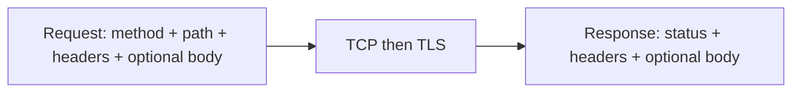

# Month 1 · Week 3 · Day 1
# HTTP: Methods, Status Codes, Request and Response

**Month index:** [../../README.md](../../README.md)  
**Week 3:** Day 1 (today) · [2](day-02.md) · [3](day-03.md) · [4](day-04.md) · [5](day-05.md) · [6](day-06.md) · [7](day-07.md)  
**Week rhythm today:** Learn + small exercises  
**Study time:** 3–4 focused hours  
**Prereq:** You can explain Browser → DNS → TCP → TLS → HTTP.

---

## This week in the roadmap

Learn: HTTP methods, headers, body, JSON, query parameters, path parameters, cookies, status codes, caching headers (conceptual), REST basics.

Practice: browser **Network tab**, **curl**, **API client**.

Today: what an HTTP message is; methods; status codes; first Network tab and curl. Headers/body/JSON/params/cookies/REST deepen on Day 2.

---

## How to read this chapter

This file is the lesson for HTTP messages. Type every `curl.exe` command yourself. The Network tab is a lab, not a video. If a command fails, read the error against Week 2 layers (DNS / TCP / TLS) before you invent an HTTP status.



Days 2–7 assume you can draw that picture closed-book. AI may explain a failed command; it may not run the lab for you.

---

## Today's contract

1. Describe an HTTP **request** and **response** as text with structure (not “the website loads”).
2. Use the methods **GET, POST, PUT, PATCH, DELETE, HEAD, OPTIONS** at a working level.
3. Interpret status codes by **class** (1xx–5xx) and memorize a core set.
4. Capture a real request in DevTools and with `curl.exe`.

**Today's gate**

> HTTP is a request/response protocol on top of the connection you already learned. A method is a verb. A status is the server’s short result. 404 means HTTP worked.

---

## Time box

| Block | Minutes | Work |
|---|---|---|
| A | 45 | Theory |
| B | 55 | Network tab + curl labs |
| C | 70 | Independent captures |
| D | 30 | Notes in git |
| E | 15 | Recall |

---

# Block A — Theory

## 1. Where HTTP sits

You already have:

```
DNS → TCP → TLS (if https) → HTTP messages
```

**HTTP** (Hypertext Transfer Protocol) is the language of the request and response: method, URL, headers, optional body; then status, headers, optional body.

Versions: HTTP/1.1 is the mental model you need. HTTP/2 and HTTP/3 multiplex and change framing; they still have methods, paths, headers, status. Do not start Month 1 inside HTTP/3 internals.

---

## 2. The request (shape)

A simplified HTTP/1.1 request looks like:

```http
GET /index.html HTTP/1.1
Host: example.com
User-Agent: curl/8.0
Accept: */*

```

Parts:

1. **Request line:** `METHOD` + `path` (and maybe query) + `HTTP version`
2. **Headers:** `Name: value` lines
3. **Empty line**
4. **Body** (optional) — GET usually has none; POST often has one

The **host** is a header in HTTP/1.1 (`Host:`). The browser also used that host for DNS and TLS. They must agree.

---

## 3. The response (shape)

```http
HTTP/1.1 200 OK
Content-Type: text/html; charset=UTF-8
Content-Length: 1256
Cache-Control: max-age=604800

<!doctype html>...
```

Parts:

1. **Status line:** version + **status code** + reason phrase
2. **Headers**
3. **Empty line**
4. **Body** (optional) — `204 No Content` has none; `HEAD` responses must not include a body

---

## 4. Methods

The **method** is the client’s intent. Servers may reject methods they do not support (`405 Method Not Allowed`).

| Method | Intent | Typical body | Typical success |
|---|---|---|---|
| **GET** | Read a resource | No | 200 |
| **HEAD** | Like GET, headers only | No | 200 |
| **POST** | Submit / create / trigger (server-defined) | Often yes | 201 or 200 |
| **PUT** | Replace the resource at this URL | Yes | 200 or 204 |
| **PATCH** | Partial update | Yes | 200 or 204 |
| **DELETE** | Delete the resource | Sometimes | 200 or 204 |
| **OPTIONS** | What methods/headers are allowed (CORS uses this) | No | 200 or 204 |

**Idempotent** (beginner): repeating GET/PUT/DELETE should not keep changing the world in surprising ways; repeating POST might create **two** orders. You will need this for APIs and later retries (Month 17). Remember the word.

**Wrong belief:** “POST is send, GET is open a page.”  
**Correct:** GET is read. POST is “process this payload” — which might create a user, log you in, or send a form. Browsers use GET for most navigations and POST for many forms.

---

## 5. Status codes

Read the **first digit**:

| Class | Meaning | Client should think |
|---|---|---|
| **1xx** | Informational | Rare in app code you write now |
| **2xx** | Success | It worked |
| **3xx** | Redirect | Look at `Location`; try another URL |
| **4xx** | Client error | **Your** request is wrong or unauthorized |
| **5xx** | Server error | The server failed; your request may be fine |

**Memorize these:**

| Code | Meaning | Typical cause |
|---|---|---|
| 200 | OK | GET succeeded |
| 201 | Created | POST created a resource |
| 204 | No Content | Success, empty body |
| 301 | Moved Permanently | Old URL retired |
| 302 | Found (temporary redirect) | Often after a form POST |
| 304 | Not Modified | Caching (Day 2) |
| 400 | Bad Request | Malformed JSON, missing fields |
| 401 | Unauthorized | Not authenticated (poorly named: means “not logged in”) |
| 403 | Forbidden | Authenticated but not allowed |
| 404 | Not Found | No such path/resource |
| 405 | Method Not Allowed | GET on a POST-only URL |
| 409 | Conflict | Duplicate, version clash |
| 429 | Too Many Requests | Rate limit |
| 500 | Internal Server Error | Unhandled exception |
| 502 | Bad Gateway | Proxy/upstream dead |
| 503 | Service Unavailable | Overloaded or down |

**401 vs 403:** 401 = we do not know who you are (or credentials missing/wrong). 403 = we know who you are and still no. Week 4 will name authentication vs authorization; these codes are the HTTP shadow of that pair.

**404 vs connection refused:** 404 is an HTTP response. Connection refused is **no HTTP**.

---

## 6. URLs: path vs query (preview)

```
https://api.example.com/users/42?include=posts
```

- Path: `/users/42` — often **path parameters** (`42` is an id)
- Query: `include=posts` — **query parameters**

Day 2 treats both fully.

---

## 7. Security today

- GET URLs are stored in history, logs, Referer. **Never put passwords in the query string.**
- Prefer HTTPS so headers and bodies are not cleartext on the network.
- `curl.exe -I` is safe for public URLs. Do not send your account cookie to a site you do not mean to.

---

# Block B — Guided lab

**Windows:** use `curl.exe`, not `curl`. In PowerShell 5, `curl` is often an alias for `Invoke-WebRequest` and will confuse you.

```powershell
Get-Command curl
Get-Command curl.exe
```

If `curl` is `Invoke-WebRequest`, always type `curl.exe`.

---

### Lab 1 — GET with curl

```powershell
curl.exe -I https://example.com/
curl.exe https://example.com/
```

`-I` = headers (HEAD-like). Second command = body too (HTML).

**Write:** status code, one header name you recognize (`Content-Type`).

---

### Lab 2 — Verbose request line

```powershell
curl.exe -v https://example.com/ -o nul
```

`-o nul` discards the body on Windows. Look for `>` (request) and `<` (response) lines.

**Write:** the method and path curl sent. The `Host:` header.

---

### Lab 3 — Choose a method

```powershell
curl.exe -I -X GET https://example.com/
curl.exe -I -X OPTIONS https://example.com/
```

`-X` sets the method. OPTIONS may return 200, 405, or 301. **Write what you got.** Do not assume the textbook’s server matches live `example.com` forever.

---

### Lab 4 — Network tab

1. Open Edge or Chrome.
2. `F12` (or Ctrl+Shift+I) → **Network**.
3. Check **Disable cache** while DevTools is open (fair traces).
4. Visit `https://example.com/`.
5. Click the first document request (type `document` or name `example.com`).
6. Read **Headers**: Request URL, method, status, request headers, response headers.

**Write in notes:**

- method
- status
- request `User-Agent` (what it means: the browser identifying itself)
- response `Content-Type`

This is the roadmap’s Network tab practice. You will do it every remaining day this week.

---

### Lab 5 — Many requests

Still in Network tab, reload. Count requests. A “page” is often **HTML + CSS + JS + images + fonts**. Each is HTTP. That is why performance later is not one number.

**Write:** how many requests? How many were `200`? Any `304`?

---

# Block C — Independent work

Create `week-03/http-basics.md`.

1. Draw a request and response as boxes (method, URL, headers, body / status, headers, body).
2. Table: GET vs POST vs PUT vs PATCH vs DELETE — one sentence each, in your words.
3. Table: 200, 201, 301, 304, 400, 401, 403, 404, 500 — one sentence each.
4. Paste **redacted** screenshots **or** written copies of:
   - curl `-I` output for `https://example.com/`
   - Network tab fields for the document request
5. Answer: why is 404 not proof that DNS failed?

---

# Block D — Git

```powershell
cd ~\fullstack-lab
mkdir week-03 -ErrorAction SilentlyContinue
git add week-03
git commit -m "Week 3 Day 1: HTTP methods, status codes, Network tab, curl."
```

`week-03/README.md` stub: HTTP and APIs lab.

---

# Block E — Recall

1. Parts of a request. Parts of a response.
2. Why GET should not carry secrets in the URL.
3. 401 vs 403 vs 404 vs 500.
4. Why we type `curl.exe` on Windows PowerShell.
5. Connection refused vs 404.

---

## Definition of done

- [ ] I can sketch request/response structure
- [ ] Core methods and status codes explained in my notes
- [ ] curl.exe and Network tab both used
- [ ] I never confused TCP failure with HTTP 4xx

---

## 8. `curl.exe` flags — complete for this month

On Windows PowerShell, the command `curl` is often **not** curl. It is an alias for `Invoke-WebRequest`, which has different flags and prints objects instead of raw HTTP. Always type **`curl.exe`**.

What each flag you will use this month **means** (learn them here):

| Flag | Meaning |
|---|---|
| (URL only) | GET that URL, print the **body** to the screen |
| `-I` | Fetch **headers only** (sends HEAD if the server allows; some servers still GET). Good to see status and `Location` without a huge HTML body |
| `-i` | Include **response headers** then the body |
| `-v` | **Verbose**: shows TLS, the request lines curl sends (`>`), and response lines (`<`). Use this to *see* HTTPS happening |
| `-X GET` (or POST, …) | Set the **method** explicitly |
| `-H "Name: value"` | Add a **request header** |
| `-d "{...}"` or `--data-binary "@file.json"` | Send a **request body** |
| `-o file` | Write the body to a file (`-o nul` discards it on Windows) |
| `--connect-timeout 5` | Give up connecting after 5 seconds |
| `--max-redirs 0` | Do not follow redirects; you see the first status (`301`) instead of the final page |

curl talks HTTP on top of the TCP/TLS you already learned. A curl failure that says it could not resolve the host is **DNS**. “Connection refused” is **TCP**. A certificate error is **TLS**. A `404` printed after `< HTTP/1.1 404` is **HTTP succeeding as a protocol**.

---

## Optional review links

The methods, statuses, and curl flags are explained in this chapter. These links are for later checking, not for first learning.

- [MDN: HTTP overview](https://developer.mozilla.org/en-US/docs/Web/HTTP/Overview)
- [MDN: HTTP methods](https://developer.mozilla.org/en-US/docs/Web/HTTP/Methods)
- [MDN: HTTP status codes](https://developer.mozilla.org/en-US/docs/Web/HTTP/Status)
- [curl manual](https://curl.se/docs/manual.html)

---

## Tomorrow

Headers, body, JSON, query/path parameters, cookies, caching headers, REST.
