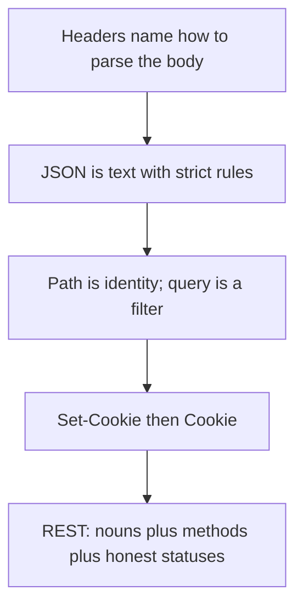

# Month 1 · Week 3 · Day 2
# Headers, Body, JSON, Parameters, Cookies, Cache, REST

**Month index:** [../../README.md](../../README.md)  
**Week 3:** [1](day-01.md) · Day 2 (today) · [3](day-03.md) · [4](day-04.md) · [5](day-05.md) · [6](day-06.md) · [7](day-07.md)  
**Week rhythm today:** Exercises + debugging  
**Study time:** 3–4 focused hours

---

## How to read this chapter

Day 1 taught the envelope (method, path, status). Today is the contents: headers, body, JSON, path vs query, cookies, cache, REST. Repair from **this file**, not from MDN.



Type the JSON and curl commands. Do not paste cookie values into git.

---

## Today's contract

Cover the rest of the Week 3 learn list:

- headers
- body
- JSON
- query parameters
- path parameters
- cookies
- caching headers (conceptual)
- REST basics

**Today's gate**

> I can read a URL and say what is path vs query; I can say what JSON is; I can explain Cookie vs Set-Cookie; I can explain REST as resource + HTTP methods, not as “a library.”

---

## Time box

| Block | Minutes | Work |
|---|---|---|
| A | 50 | Theory |
| B | 55 | JSON + httpbin/jsonplaceholder labs |
| C | 60 | Independent JSON file + cookie/cache notes |
| D | 30 | Git |
| E | 15 | Recall |

---

# Block A — Theory

## 1. Headers

**Headers** are metadata: name/value pairs. They are not the main document. They tell the other side **how to interpret** the message or **how to handle** caching, cookies, auth, content type.

Common **request** headers:

| Header | Role |
|---|---|
| `Host` | Which site (HTTP/1.1) |
| `User-Agent` | Client identification |
| `Accept` | What media types the client can handle |
| `Content-Type` | How to parse the **body** (if any) |
| `Authorization` | Credentials (Bearer token, etc.) — later |
| `Cookie` | Cookies the browser stores for this site |
| `Cache-Control` | Caching preferences |

Common **response** headers:

| Header | Role |
|---|---|
| `Content-Type` | What the body is (`text/html`, `application/json`) |
| `Content-Length` | Body size in bytes |
| `Set-Cookie` | Server asks browser to store a cookie |
| `Location` | Redirect target |
| `Cache-Control`, `ETag`, `Expires` | Caching |
| `Access-Control-Allow-Origin` | CORS (Month 9/12); recognize the name |

**Wrong belief:** “Headers are optional decoration.”  
**Correct:** `Content-Type` is how the other side knows JSON from HTML. Wrong `Content-Type` is a bug.

---

## 2. Body

The **body** is the payload.

- HTML page: body is HTML
- API: body is often JSON
- File upload: later (Month 12); multipart bodies exist
- GET: body should be empty in normal use

The body is **bytes**. `Content-Type` tells you how to decode them.

---

## 3. JSON

**JSON** (JavaScript Object Notation) is a text format for structured data. APIs use it because it maps cleanly to objects in JS and dicts in Python.

Types:

| JSON | Example |
|---|---|
| object | `{ "id": 1, "name": "Ada" }` |
| array | `[1, 2, 3]` |
| string | `"hello"` (always double quotes) |
| number | `42`, `3.14` |
| boolean | `true` / `false` (not `True`) |
| null | `null` |

Rules that bite beginners:

- No comments
- No trailing commas
- Keys are strings in double quotes
- This is **not** a JavaScript object literal (JS allows unquoted keys and `'single quotes'`)

You will write JSON by hand today. Later, TypeScript and Pydantic will **model** it. Garbage JSON is a 400 from FastAPI.

---

## 4. Query parameters

The query is the part after `?`. Pairs `&`-separated.

```
https://api.example.com/search?q=fastapi&limit=10
```

| Name | Value |
|---|---|
| `q` | `fastapi` |
| `limit` | `10` |

Uses: search, filters, pagination (`page=2`), sorting.

They are **visible** in logs and history. Do not put tokens there.

Encoding: spaces become `%20` or `+`. You do not need to memorize the whole percent-encoding table; know that special characters get encoded.

---

## 5. Path parameters

Parts of the **path** that identify a resource:

```
/users/42/orders/9
```

`42` and `9` are path parameters (user id, order id).

REST style: the path names the **resource**; query **adjusts** the representation (fields, filters).

---

## 6. Cookies

A **cookie** is a small piece of data the **server** asks the **browser** to store and send back later.

1. Response: `Set-Cookie: session=abc; Path=/; HttpOnly; Secure`
2. Browser stores it (rules apply: domain, path, expiry).
3. Later requests to that site include `Cookie: session=abc`.

This is how **sessions** often work (Month 13). Today:

- Cookies are **credentials** if they represent a login.
- `HttpOnly` means JavaScript cannot read it (helps against XSS — Month 13).
- `Secure` means send only on HTTPS.
- You can see cookies in DevTools → Application → Cookies, and in Network → request headers.

**Wrong belief:** “Cookies are just ‘remember this ad.’”  
**Correct:** they are a general client-side storage mechanism for **that origin**, heavily used for auth. Treat them as sensitive.

Do not copy `Cookie:` headers out of DevTools into Git or chat.

---

## 7. Caching headers (conceptual)

**Caching** means “reuse a previous response instead of fetching again.”

Who might cache: the browser, a CDN, a proxy.

Headers (recognize; do not implement a CDN):

| Header | Idea |
|---|---|
| `Cache-Control: max-age=...` | How long it may be reused |
| `Cache-Control: no-store` | Do not save (private data) |
| `ETag` | Fingerprint of the body; client can send `If-None-Match` |
| `304 Not Modified` | “Your cached copy is still good; no body” |
| `Expires` | Older expiration datetime |

Why it matters: a “I deployed but I still see the old site” bug is often **cache**, not Git. `Disable cache` in DevTools prevents the browser cache from lying to you while you learn.

You do not need to design cache policy this month. You need to **see** these headers and know what problem they solve: extra network trips vs freshness vs privacy.

---

## 8. REST basics

**REST** (Representational State Transfer) is a **style** for HTTP APIs, not a W3C protocol and not FastAPI itself.

Working rules for this program:

1. Think in **resources** (nouns): `/users`, `/users/42`, `/orders`.
2. Use HTTP **methods** as the verbs: GET read, POST create, PUT replace, PATCH patch, DELETE delete.
3. Use **status codes** honestly.
4. Send **JSON** (typical for this stack) with `Content-Type: application/json`.
5. **Statelessness** (idea): each request carries what the server needs (often a cookie or token). The server does not depend on “this is the third request in a phone call” at the HTTP layer.

REST is not:

- “We use JSON” (SOAP can too; lots of non-REST JSON RPCs exist)
- “We have a `/api` folder”
- GraphQL (optional later; different model)

**RPC style** would be `/getUser?id=42` or `/createUser`. You will see both in the wild. This program’s default is resource-oriented REST.

---

# Block B — Guided lab

Public APIs used here are for **learning**. Be polite (few requests). They can change; if one is down, use the other.

### Lab 1 — JSON by hand

Create `week-03/sample-user.json` by typing (validate commas):

```json
{
  "id": 1,
  "name": "Ada Lovelace",
  "active": true,
  "roles": ["student", "builder"],
  "profile": {
    "city": null,
    "hoursPerDay": 3
  }
}
```

Broken version exercise: copy to `sample-user.broken.json`, add a trailing comma after the last property, then we will fail to parse later. Today, open both in the editor. The broken one may show a squiggle. **Write:** what rule you broke.

### Lab 2 — GET JSON from the network

[JSONPlaceholder](https://jsonplaceholder.typicode.com/) is a fake REST API.

```powershell
curl.exe -i https://jsonplaceholder.typicode.com/users/1
```

`-i` includes response headers + body.

**Write:** status, `Content-Type`, whether the body is JSON, the user’s `name` field.

Query parameter:

```powershell
curl.exe -i "https://jsonplaceholder.typicode.com/posts?userId=1"
```

Quotes matter in PowerShell because `?` can be special.

Path parameter: `users/1` — `1` is the id.

### Lab 3 — POST JSON

```powershell
curl.exe -i -X POST "https://jsonplaceholder.typicode.com/posts" `
  -H "Content-Type: application/json" `
  -d "{\"title\":\"week3\",\"body\":\"hello\",\"userId\":1}"
```

PowerShell quoting is painful. Alternative — body from file:

```powershell
Set-Content -Path week-03\post-body.json -Value '{"title":"week3","body":"hello","userId":1}'
cd ~\fullstack-lab
curl.exe -i -X POST "https://jsonplaceholder.typicode.com/posts" -H "Content-Type: application/json" --data-binary "@week-03/post-body.json"
```

**Write:** status (often 201), returned `id`. This API **fakes** create; data does not persist. That is fine for learning methods.

### Lab 4 — httpbin (echo)

[httpbin.org](https://httpbin.org) echoes requests. Good for seeing headers.

```powershell
curl.exe -i https://httpbin.org/get
curl.exe -i "https://httpbin.org/get?course=fullstack&day=2"
curl.exe -i -X POST https://httpbin.org/post -H "Content-Type: application/json" --data-binary "@week-03/post-body.json"
```

If httpbin is slow or down, skip and note it. JSONPlaceholder is enough.

### Lab 5 — Cookies in the browser

1. Open DevTools → Network, visit `https://example.com/` or GitHub (do **not** paste cookies).
2. See if a `Set-Cookie` appears on any response (example.com may have none).
3. Open **Application** (Chrome) / **Storage** (Firefox) → Cookies.
4. **Write:** definition of Set-Cookie vs Cookie in your own words. Do **not** commit cookie values.

### Lab 6 — Cache headers

On the example.com document request in Network tab, find `Cache-Control` or `ETag` if present.

**Write:** one sentence: what the browser is allowed to do with this response, as far as you can tell. If headers are missing, write “no cache headers on this response.”

---

# Block C — Independent

`week-03/rest-and-data.md`:

1. REST in your words (resources + methods + status + JSON).
2. Draw `/users/42?include=orders` and label path param vs query.
3. Why `Content-Type: application/json` must match the body.
4. Cookie security: HttpOnly, Secure, no secrets in git.
5. Caching: what problem `304` solves.

---

# Block D — Git

Do **not** add files that contain cookies or Authorization headers.

```powershell
cd ~\fullstack-lab
git add week-03
git status
git commit -m "Week 3 Day 2: JSON, REST, parameters, cookies, cache notes."
```

---

# Block E — Recall

1. Header vs body.
2. JSON types; why trailing commas fail.
3. Path vs query.
4. Set-Cookie vs Cookie.
5. REST vs “we used JSON.”
6. What `Cache-Control: no-store` is for.

---

## Optional review links

Headers, cookies, caching, JSON, and REST are explained in this chapter. These pages are for later checking, not for first learning.

- [MDN: HTTP headers](https://developer.mozilla.org/en-US/docs/Web/HTTP/Headers)
- [MDN: HTTP cookies](https://developer.mozilla.org/en-US/docs/Web/HTTP/Cookies)
- [MDN: HTTP caching](https://developer.mozilla.org/en-US/docs/Web/HTTP/Caching)
- [JSON.org](https://www.json.org/json-en.html)
- [MDN: REST](https://developer.mozilla.org/en-US/docs/Glossary/REST)

---

## Tomorrow

From memory: inspect an API with curl and DevTools; write JSON; explain REST. No notes from today.
