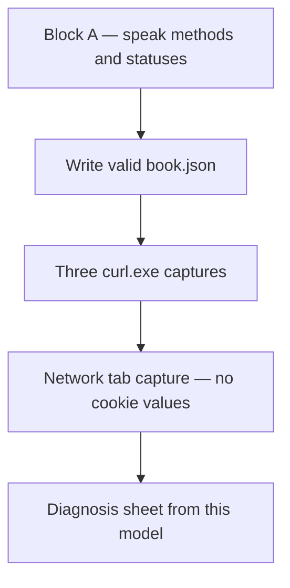
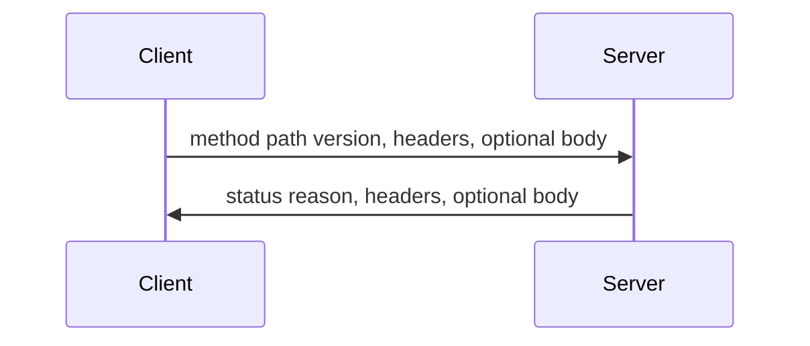

# Month 1 · Week 3 · Day 3
# HTTP From Memory

**Program:** Full-Stack Mastery · 18 months  
**Phase:** 1 — Foundations  
**Month index:** [../../README.md](../../README.md)  
**Week 3:** [1](day-01.md) · [2](day-02.md) · Day 3 (today) · [4](day-04.md) · [5](day-05.md) · [6](day-06.md) · [7](day-07.md)  
**Week rhythm today:** Implement from memory  
**Study time:** 3–4 focused hours  
**Day 1–2 textbook:** closed during the drills. Repair by re-reading **this recap first**, then those two files, not MDN.

---

## How to use this textbook

This is not a video transcript and not a tutorial to skim.

1. Read the complete explanation. Close it. Say each idea in a full sentence.
2. Type every command yourself. Do not paste Day 1’s curl line and change the URL.
3. Predict status **class** before you run. Then run.
4. Do not keep an explanation you cannot repeat without looking.
5. Optional review links at the end are for later rechecking — not for first learning.

---

## How to read this chapter

Days 1–2 stay closed while you speak and type. This file is the lesson you are allowed to look at: a complete HTTP recap, then labs you run without a tutorial.



If you go blank, re-read **this complete explanation**, then Days 1–2 only after a 25-minute stuck timer. AI may not fill `diagnose.md` or type curl for you.

> **Wrong belief:** “No status in the terminal means the site returned 404.”  
> **Correct:** no status means HTTP never started. Name the layer: DNS, TCP, or TLS.

> **Wrong belief:** “JSON is JavaScript, so comments and trailing commas are fine.”  
> **Correct:** JSON is a separate text format. Trailing commas fail parsers.

> **Wrong belief:** “The Network tab is a different protocol from curl.”  
> **Correct:** both send HTTP. The GUI is a client. curl is a client. The language on the connection is the same.

---

## Complete explanation (self-contained)

This recap is enough to relearn Week 3 Days 1–2. The drills below are the exam.

### Where HTTP sits

HTTP is the language on the connection **after** DNS, TCP, and (for `https`) TLS. A 404 is HTTP succeeding as a protocol. Connection refused is TCP. NXDOMAIN is DNS. A certificate error is TLS. Do not record those last three as HTTP statuses.



**Request:** method + path (and query) + version, then headers, then optional body.  
**Response:** status + reason, then headers, then optional body.

A simplified HTTP/1.1 request looks like:

```http
GET /index.html HTTP/1.1
Host: example.com
User-Agent: curl/8.0
Accept: */*

```

The **host** is a header in HTTP/1.1 (`Host:`). The browser also used that host for DNS and TLS. They must agree. HTTP/1.1 is the mental model you need this month. HTTP/2 and HTTP/3 change framing; they still have methods, paths, headers, and status.

### Methods

| Method | Job | Repeat it? |
|---|---|---|
| GET | Read | Should not create a second order |
| HEAD | Like GET, no body | Same idea as GET |
| POST | Process or create | Not idempotent in general — repeating might create two |
| PUT | Replace the resource | Repeating should leave the same result |
| PATCH | Partial update | Depends on the API; say “partial,” not “replace” |
| DELETE | Remove | Repeating a delete may 404 the second time — still HTTP |
| OPTIONS | What is allowed | Discovery, CORS later |

Browsers navigate with GET. HTML forms often POST. `curl.exe` and an API client can send any method. Repeating GET should not create a second order. Repeating POST might.

### Status classes

**2xx** success. **3xx** look at `Location`. **4xx** your request. **5xx** server.

Memorize this core: 200 OK; 201 created; 204 success with empty body; 301 moved (follow `Location`); 304 cache: reuse a previous body; 400 bad request; **401** not authenticated; **403** authenticated but forbidden; **404** no such resource; 405 method not allowed; **500** unhandled failure.

404 is not “TCP failed.” 204 success with empty body — do not parse JSON. 304 is not an error; it is “use what you already have.” 401 vs 403 will matter in Week 4 architecture and again in Month 13. Learn the words now: who are you vs what may you do.

### Headers vs body

**Headers** are metadata (`Content-Type`, `Host`, `Cache-Control`, `Set-Cookie`, `Location`, `User-Agent`, `Authorization`). **Body** is the payload (HTML page, JSON object, empty). If a client `JSON.parse`s HTML, it ignored `Content-Type` or ignored a 4xx/5xx HTML error page.

`Content-Type: application/json` must match a JSON body. `Content-Type: text/html` is a page. Wrong type is a bug, not decoration.

### JSON

**JSON** is text for structured data: object `{}`, array `[]`, string `""`, number, `true`/`false`, `null`. Double quotes. No comments, no trailing commas. Keys are strings. `ConvertFrom-Json` throwing is the file being invalid JSON, not “Windows is broken.”

Worked valid object:

```json
{
  "title": "The Internet",
  "pages": 320,
  "authors": ["Ada", "Alan"],
  "inPrint": true
}
```

A trailing comma after `true` makes this illegal. Single quotes around keys make this illegal. `// a comment` makes this illegal. Fix the file before you POST it.

### Query vs path

**Query** after `?`, `key=value` joined by `&` — filters, search, pagination. Visible in logs, history, Referer. No passwords.  
**Path parameters** are pieces of the path (`/users/42`). Identity belongs in the path; filters belong in the query.

`/users/42?include=posts` — `42` is identity; `include=posts` is a filter. `GET /getUser?id=42` names an action (RPC style). This program prefers `/users/42`.

PowerShell treats `?` as a wildcard. **Quote** URLs that contain `?`.

### Cookies, cache, REST

**Cookies:** `Set-Cookie` on the response asks the browser to store; later requests send `Cookie`. Treat as credentials. Do not commit them. Do not paste values into notes.

**Cache headers (idea):** `Cache-Control`, `ETag`, `304 Not Modified` mean “reuse a previous body.” Privacy: `no-store` for sensitive responses. You are not implementing a CDN today.

**REST (working rules):** resources as nouns in URLs; methods as verbs; honest statuses; JSON with matching `Content-Type: application/json`; each request carries what it needs (stateless idea). REST is not “we used JSON.” REST is not “we have `/api`.”

**Stateless idea (beginner):** each request carries what the server needs (path, query, headers, body). A session cookie is still sent **on the request** — the client carrying a credential, not a hidden server conversation. You will implement sessions in Month 13.

### curl.exe flags and three clients

**curl.exe flags:** `-I` headers; `-i` headers+body; `-v` TLS and request lines; `-X` method; `-H` header; `--data-binary @file` body. PowerShell: `curl` alias vs `curl.exe`. Always type **`curl.exe`**.

**Three clients, one protocol:** the browser (address bar + Network tab), `curl.exe`, and an API client (Day 4) all send HTTP. The GUI is not REST by itself.

Office hours. A student runs `curl https://jsonplaceholder.typicode.com/todos/1` in PowerShell and pastes an object that is not the raw HTTP message. That is `Invoke-WebRequest` shape. Type `curl.exe`. Another student records connection refused as 404. Re-read Week 2 in this book. A third student POSTs JSON with a trailing comma, gets 400 or a parse error, and blames the network. Fix the file. `ConvertFrom-Json` locally first.

### Worked request and response (read this closed-book later)

You GET `/todos/1` on JSONPlaceholder. The request, simplified:

```http
GET /todos/1 HTTP/1.1
Host: jsonplaceholder.typicode.com
User-Agent: curl/8.0
Accept: */*

```

There is no body. GET usually has none. The response, simplified:

```http
HTTP/1.1 200 OK
Content-Type: application/json; charset=utf-8

{"userId":1,"id":1,"title":"...","completed":false}
```

Point at three things in every capture today: the **status line**, at least two **header names**, and whether the **body** is JSON, HTML, or empty. If you cannot point, you did not inspect. You glanced.

POST with `book.json` adds a body and must advertise it. `-H "Content-Type: application/json"` is how the server knows to parse JSON. `--data-binary "@week-03/memory/book.json"` is the body. Without the header, a strict API may 400. JSONPlaceholder is fake and may be sloppy. You still send the header. That is the habit.

Query example: `GET /posts?userId=1` — path `/posts` is the collection; `userId=1` is a filter. Identity of one post would be `/posts/17`. Do not put a password in `?userId=` or anywhere else in the query. Quote the URL in PowerShell.

Status class drill you can speak without the table: 2xx means the server accepted the request as success; 3xx means look at `Location`; 4xx means look at *your* URL, headers, or body; 5xx means look at *their* process. 404 is 4xx after the pipe worked. Connection refused is not a class. It is TCP.

---

## Today's contract

Using curl, DevTools, and a JSON file you write yourself, inspect HTTP without a tutorial.

**Today's gate**

> I can write valid JSON, capture three HTTP exchanges with `curl.exe`, read the Network tab without pasting cookies, and pick the first diagnostic question from this chapter’s model — not from a guess.

---

## Time box

| Block | Minutes | Work |
|---|---|---|
| A | 20 | Speak methods, statuses, JSON, REST |
| B | 70 | Memory implementation: JSON + three curl captures |
| C | 40 | Network tab capture |
| D | 40 | Diagnosis sheet |
| E | 15 | Git + honest gaps list |

---

# Block A — Speak (20 min)

GET, POST, PUT, PATCH, DELETE, HEAD; 200, 301, 400, 401, 403, 404, 500; JSON; query vs path; cookie purpose; REST in four sentences. Write gaps in `week-03/day-03-gaps.txt`.

If a topic is under two true sentences, it is a gap. Do not skip it silently. REST in four sentences should name nouns, methods, honest statuses, and `Content-Type` — not “JSON API.”

---

# Block B — Memory implementation

Create `week-03/memory/`:

```powershell
cd ~\fullstack-lab
New-Item -ItemType Directory -Force -Path week-03\memory | Out-Null
```

1. `book.json` — `title` string, `pages` number, `authors` array of strings, `inPrint` boolean. Valid JSON.
2. GET `https://jsonplaceholder.typicode.com/todos/1` with `curl.exe -i -o memory/todo-1.txt`. Flags are in the table above, not in `--help`.
3. POST `book.json` to `https://jsonplaceholder.typicode.com/posts` with `Content-Type: application/json` and `--data-binary "@path"`. Save to `memory/post-result.txt`.
4. GET posts for `userId=1` (query). Save to `memory/posts-user1.txt`. Quote the URL in PowerShell because `?` is special.

Example shape for step 2:

```powershell
cd ~\fullstack-lab
curl.exe -i "https://jsonplaceholder.typicode.com/todos/1" -o week-03/memory/todo-1.txt
```

Example shape for step 3 (adjust the path if your working directory is `~\fullstack-lab`):

```powershell
cd ~\fullstack-lab
curl.exe -i -X POST "https://jsonplaceholder.typicode.com/posts" -H "Content-Type: application/json" --data-binary "@week-03/memory/book.json" -o week-03/memory/post-result.txt
```

Example shape for step 4:

```powershell
curl.exe -i "https://jsonplaceholder.typicode.com/posts?userId=1" -o week-03/memory/posts-user1.txt
```

Open each capture. Confirm you can point at: status line, at least two header names, and whether the body is JSON. If POST returns `201` or `200` plus an `id`, that is the fake API creating a post — still HTTP.

Prove `book.json` locally **before** you POST:

```powershell
Get-Content ~\fullstack-lab\week-03\memory\book.json -Raw | ConvertFrom-Json
```

If this throws, fix the JSON before you POST it. A trailing comma is the usual cause.

---

# Block C — Network tab

Fill `week-03/memory/devtools-capture.md`: URL, method, status; 3 request header **names and jobs** (not cookie values); 3 response headers; path vs query; Content-Type HTML or JSON; request count on reload.

Use a public page (`https://example.com/` is enough). Reload once with Network open. Count requests. The document is one; CSS, images, and scripts are more journeys.

Jobs you may use (from this recap, in your sentences): `Host` names the site for HTTP/1.1; `User-Agent` identifies the client; `Accept` says what media types you can handle; `Content-Type` says how to parse a body; `Cache-Control` talks about reuse; `Set-Cookie` asks the browser to store a credential-like value.

Do **not** paste `Cookie:` values, `Authorization` headers, or a HAR file into git.

---

# Block D — Diagnosis sheet

`week-03/memory/diagnose.md` — for each symptom, first question (from the complete explanation):

| Symptom | First question you ask |
|---|---|
| NXDOMAIN | |
| Connection refused | |
| Certificate error | |
| 301 | |
| 404 | |
| 500 | |
| Empty body, 204 | |
| JSON parse error in client | |

Fill the right column.

Hints from this chapter (write **your** sentences, not these labels): NXDOMAIN → did DNS find a name? Connection refused → is anything listening on that IP:port? Certificate → did TLS accept the hostname? 301 → what is `Location`? 404 → HTTP ran; is the path wrong? 500 → server code failed. 204 → success with no body; do not parse JSON. JSON parse error → did you check `Content-Type` and status before parsing?

```powershell
cd ~\fullstack-lab
git add week-03/memory week-03/day-03-gaps.txt
git commit -m "Week 3 Day 3: HTTP inspection from memory."
```

---

## Definition of done

- [ ] Valid `book.json`
- [ ] Three curl captures on disk
- [ ] DevTools capture without cookie secrets
- [ ] Diagnosis sheet filled from this chapter’s model
- [ ] Gaps list honest

---

## Optional review links

Repair from this chapter and Week 3 Days 1–2. These pages are for later checking, not for first learning.

- [Week 3 Day 1](day-01.md) — methods, status, curl flags
- [Week 3 Day 2](day-02.md) — headers, JSON, cookies, cache, REST
- [MDN: HTTP overview](https://developer.mozilla.org/en-US/docs/Web/HTTP/Overview)

---

## Tomorrow

An API client (GUI) plus a reusable HTTP log. Same protocol as curl and the browser — a different program sending the bytes.
