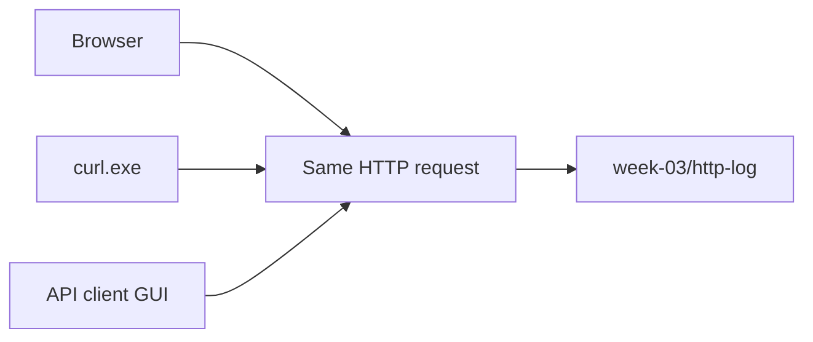
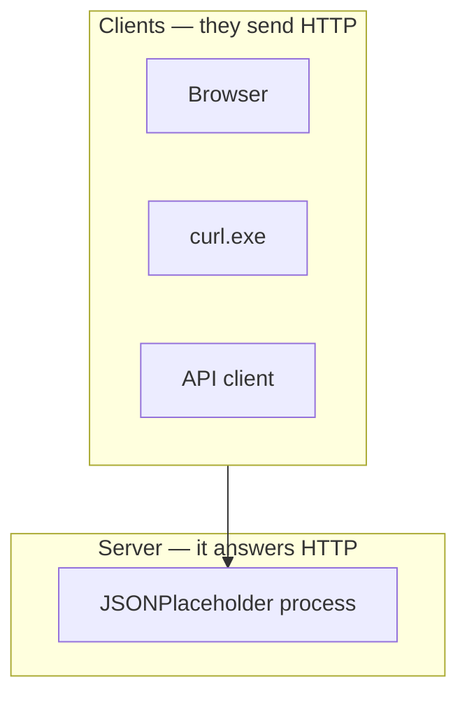

# Month 1 · Week 3 · Day 4
# Feature: HTTP Inspector Notes + API Client

**Program:** Full-Stack Mastery · 18 months  
**Phase:** 1 — Foundations  
**Month index:** [../../README.md](../../README.md)  
**Week 3:** [1](day-01.md) · [2](day-02.md) · [3](day-03.md) · Day 4 (today) · [5](day-05.md) · [6](day-06.md) · [7](day-07.md)  
**Week rhythm today:** Add a real project feature  
**Study time:** 3–4 focused hours

The roadmap requires three tools: **Network tab**, **curl**, **API client**. Today you add the third and a reusable inspection log.

---

## How to use this textbook

This is not a video transcript and not a tutorial to skim.

1. Read a section. Close it. Say the idea in a full sentence.
2. Type every `curl.exe` command yourself. The GUI click is yours too — AI may not click Send.
3. The product is `week-03/http-log/` in git, not a screenshot collection of a cloud workspace you do not understand.
4. Do not put `Authorization` headers or cookies in the repo.
5. Optional review links at the end are for later rechecking — not for first learning.

---

## How to read this chapter

Install **one** client. Send the same GET three ways. The product is the `http-log/` folder in git.



> **Wrong belief:** “The GUI is REST.”  
> **Correct:** REST is how you design URLs and methods. The GUI is an HTTP **client**, like the browser and like curl.

> **Wrong belief:** “I need a cloud Postman account to learn APIs.”  
> **Correct:** a local client is enough. JSONPlaceholder needs no login.

> **Wrong belief:** “If the three tools show different JSON, HTTP is nondeterministic and I should pick the prettiest screenshot.”  
> **Correct:** the same GET to the same URL should show the same resource. If they differ, you called different URLs, cached an old body, or compared a GUI pretty-print to a failed curl alias.

---

## Today's contract

1. Install **one** API client (Bruno, Insomnia, Thunder Client in VS Code/Cursor, or Postman).
2. Send GET and POST against JSONPlaceholder from that client.
3. Keep a structured **HTTP log** in the repo (no secrets).

**Today's gate**

> I can inspect the same request three ways — browser, curl, API client — and explain why all three are HTTP.

---

## Time box

| Block | Minutes | Work |
|---|---|---|
| A | 25 | Pick and install an API client |
| B | 70 | Same requests in all three tools |
| C | 60 | `week-03/http-log/` product |
| D | 30 | README |
| E | 15 | Explain tool choice |

---

# Block A — What an API client is (full explanation)

An **API client** is a program with a form for HTTP:

- **Method** — GET, POST, …
- **URL** — scheme, host, path, query
- **Headers** — e.g. `Content-Type: application/json`
- **Body** — the JSON (or empty)
- **Send** — it opens TCP/TLS and writes the same kind of bytes `curl.exe` writes

It is a **client**, like the browser and like curl. It is not a server. It is not “REST” by itself; REST is how you design the URLs and methods. A later application server (Month 9) will be a **server**. This tool talks to servers.



Week 2 still sits under every click. The GUI does not skip DNS, TCP, or TLS. If Send fails with a name error, that is DNS. If it fails with connection refused, that is TCP. If the certificate is wrong, that is TLS. If you get 404, HTTP ran. The GUI may hide those layers behind a red banner. That is why you still learned `curl.exe -v`.

### Pick one client

Pick **one**: Thunder Client (Cursor/VS Code extension), Bruno (files on disk, easy to Git), Insomnia, or Postman. You do not need a cloud account for a local-only client. Do not send lab requests through a shared cloud workspace you do not understand.

If no GUI will install, use `curl.exe` plus a markdown list of requests (method, URL, headers, body). The roadmap asked for an API client; try a GUI first.

When you click Send, look at **status**, **response headers**, and **body**. That is the same information as `curl.exe -i`. The GUI may hide TLS details that `curl.exe -v` shows — that is why you still learned curl.

A **collection** is a saved list of requests (name, method, URL, headers, body). It is a notebook, not a server. Bruno stores collections as files; those files may go in git **only if they have no secrets**. Thunder Client / Postman exports can contain tokens — audit before add.

**Windows notes:** the GUI does not replace `curl.exe`. Scripts, CI (Month 16), and today’s COMPARE.md still need the command-line client. PowerShell’s `curl` alias is still not curl. Quote URLs that contain `?`.

JSON recap, because you will POST from the GUI: JSON is text. Objects `{}`, arrays `[]`, double-quoted keys and strings, no comments, no trailing commas. If the GUI’s JSON editor is “friendly” and lets you leave a trailing comma, the server may still reject it. Prove a body file with `ConvertFrom-Json` when in doubt.

REST recap, because the GUI will tempt you to say the word: resources as nouns, methods as verbs, honest statuses, JSON with matching `Content-Type`. Saving a request named `get-user-1` is not REST. Designing `GET /users/1` as a noun plus GET is closer.

> **Wrong belief:** “I used Postman so I know REST.”  
> **Correct:** you used an HTTP client. REST is the resource design, which you will write in prose on Day 6.

### What Send actually does

Clicking Send is not magic and it is not REST. The GUI:

1. Parses the URL (scheme, host, port, path, query).
2. Resolves the host if needed (DNS — Week 2).
3. Opens TCP to that IP and port.
4. If the scheme is `https`, performs TLS (certificate name check included).
5. Writes an HTTP request: method, path, headers you configured, optional body.
6. Reads the HTTP response: status, headers, body.
7. Pretty-prints the body if it believes the `Content-Type`.

That is the same chain `curl.exe` uses. The browser uses it too, then may start more requests for CSS and images. JSONPlaceholder GET `/users/1` is one resource. A documentation page in the browser is many.

Environments and variables in GUI tools (if your client has them) are substitutions: `{{baseUrl}}/users/1`. They are convenience. They are not a server. Do not put a real token in an environment file and `git add` it. JSONPlaceholder needs none.

What you must record in COMPARE.md, as full sentences:

- **Same resource?** All three GETs should show the same `id` and `email` for `/users/1`. If not, you hit different URLs.
- **Same protocol?** All three are HTTP after TLS. The GUI is not a different internet.
- **What curl `-v` showed that the GUI hid.** Typical: TLS handshake lines, the exact `>` request header list, SNI hostname. You do not need to understand every TLS cipher line. You need to know those lines exist and that the padlock in a GUI is a summary.
- **When you will use each tool.** Browser: looking at pages and the Network tab. `curl.exe`: scripts, later CI, anything you must repeat without a mouse. GUI: exploratory work — changing a header and sending again.

Worked POST from the GUI, so Block B is not a blank form. Method POST. URL `https://jsonplaceholder.typicode.com/posts`. Header `Content-Type: application/json`. Body from `post-body.json`, for example:

```json
{
  "title": "week-03-lab",
  "body": "independent http log",
  "userId": 1
}
```

No trailing comma. Send. Status often 201 on this fake API, sometimes 200. The returned JSON often echoes your fields and adds an `id`. Copy that **response body** into `client-post.md`. That is HTTP. It is not a database you own. The fake API will not keep your post as a real library.

If the GUI offers “generate code,” you may look. You still type the `curl.exe` replay in the README yourself. Generated code that says `curl` without `.exe` is wrong for this PowerShell course. Fix it when you paste into README.

### Why the log folder is the feature

Screenshots rot. Cloud workspaces vanish. `week-03/http-log/` in git is the product another engineer can clone. They can run the `curl.exe -i` line without your GUI. They can read COMPARE.md and know you understood the three clients. That is documentation as a test of understanding — the same idea as Week 1’s README, now for HTTP.

A clone-and-follow failure: COMPARE.md says “all good” with no `id` or `email`. Another: `curl-get-user1.txt` is empty because `-o` was pointed at a folder that did not exist. Create `http-log` first. Another: a 2 MB PNG of the whole desktop including an unrelated logged-in site. Crop. Or write markdown instead of a screenshot.

---

# Block B — One request, three tools

Target: `GET https://jsonplaceholder.typicode.com/users/1`

Create the log folder first:

```powershell
cd ~\fullstack-lab
New-Item -ItemType Directory -Force -Path week-03\http-log | Out-Null
```

1. **Browser:** paste URL in the address bar (JSON may display as text). Also Network tab. Write method, status, `Content-Type` into notes you will file in COMPARE.md. Do not paste cookies.
2. **curl.exe:** `-i` save to `week-03/http-log/curl-get-user1.txt`
3. **API client:** create a request named `get-user-1`. Send. Screenshot **or** export (if the tool can) to `week-03/http-log/`. If you screenshot, crop secrets; JSONPlaceholder has none.

```powershell
cd ~\fullstack-lab
curl.exe -i "https://jsonplaceholder.typicode.com/users/1" -o week-03/http-log/curl-get-user1.txt
```

Open the capture. Point at the status line, at `Content-Type`, and at `"id": 1` in the body. If you see a PowerShell object dump instead of `HTTP/`, you used `curl` not `curl.exe`. Delete the file. Run the command again.

Then: `POST https://jsonplaceholder.typicode.com/posts` with JSON body from `post-body.json` in the API client. Save the status and returned JSON to `http-log/client-post.md` (copy the **response body**, not a session token — there isn’t one).

If you do not already have `week-03/post-body.json` from Day 2, write a small valid object (`title`, `body`, `userId`) and use that. Still no trailing commas.

```powershell
Get-Content ~\fullstack-lab\week-03\post-body.json -Raw | ConvertFrom-Json
```

If this throws, fix the JSON before you Send.

Write `http-log/COMPARE.md`:

- Did all three GETs show the same `id` and `email`?
- What did the GUI hide that curl `-v` showed (TLS, exact request header list)?
- When will you use each tool over the next 17 months? (Browser: pages; curl: scripts/CI; GUI: exploratory API work.)

Optional: run verbose curl once to see what the GUI hid:

```powershell
curl.exe -v "https://jsonplaceholder.typicode.com/users/1" -o nul
```

You should see TLS and `>` request lines. Do not commit a dump that contains a real cookie. JSONPlaceholder should not set one that matters.

Office hours. A student compares browser JSON (maybe wrapped by a pretty-printer or an extension) to curl and declares “the API is inconsistent.” Check the URL, including trailing slashes. Check that curl used `https` not `http`. Check that you did not GET `/users/2` in one tool. Another student exports a Postman collection with a Bearer token from a different project and `git add`s it. Audit. There should be no token. A third student skips curl “because the GUI is enough.” COMPARE.md then cannot answer what TLS looked like. Run `-v` once.

---

# Block C — HTTP log product

Structure:

```
week-03/http-log/
  README.md
  COMPARE.md
  curl-get-user1.txt
  client-post.md
  collection-notes.md
```

`collection-notes.md`: list every saved request in the GUI (name, method, URL). This is your “collection.” If Bruno stores files, you may add that folder **only if it has no secrets**.

What to write for each saved request: name (`get-user-1`), method (GET), full URL, headers you set (names only, plus `Content-Type: application/json` for POST), whether the body came from `post-body.json`. That list is how a clone knows what the GUI contains without opening your editor.

If you use Thunder Client, the collection may live in VS Code/Cursor state, not in the repo. Then `collection-notes.md` **is** the collection as far as git is concerned. Do not assume a teammate has your extension data.

If you use Bruno and the files are clean, you may add the Bruno folder. Open each file and search for `Bearer`, `Cookie`, `token`. If you find a real value, do not add the folder. Markdown notes only.

`http-log/README.md` must include the replay commands so the GUI is optional:

```powershell
cd ~\fullstack-lab
curl.exe -i "https://jsonplaceholder.typicode.com/users/1"
curl.exe -i -X POST "https://jsonplaceholder.typicode.com/posts" -H "Content-Type: application/json" --data-binary "@week-03/post-body.json"
```

Windows: if `-o` fails because `week-03/http-log` does not exist, create the folder first (`New-Item` above). If execution policy is unrelated — curl.exe is not a `.ps1`. PATH still matters: `Get-Command curl.exe`. If missing, install or locate it; do not fall back to the alias and call the lab done.

The log is the Week 3 **feature**: a folder another engineer can clone and re-run.

Worked README paragraph (write **your** sentences, this is the bar): this folder records the same GET three ways so you can see that the browser, `curl.exe`, and an API client all speak HTTP. To replay the GET, run the `curl.exe -i` command above from any directory. To replay the POST, use `--data-binary "@week-03/post-body.json"` and `-H "Content-Type: application/json"`. JSONPlaceholder is a fake API; statuses are still real HTTP.

---

# Block D — Root README

Add Week 3: HTTP labs, JSON samples, http-log, which API client you chose.

The README is documentation **from this month’s explanations**, not a list of tool homepages. Say that HTTP is the language after DNS/TCP/TLS. Say `curl.exe` not `curl`. Say the GUI is a client.

```powershell
git add week-03 README.md
git status
git commit -m "Add HTTP log and API client comparison for Week 3."
```

Read `git status` first. Do not add a HAR file. Do not add a screenshot that shows a cookie or a token.

Root README sentences that belong in Week 3 (your words): HTTP is the language after DNS, TCP, and TLS. This week’s folder has JSON samples, `http-log/` (browser + `curl.exe` + API client), and TESTS.md on Day 5. Always type `curl.exe` in PowerShell. The GUI is a client, not a server, and not REST by itself.

If Day 2’s `post-body.json` is missing, write it today before the POST. Valid JSON. Prove with `ConvertFrom-Json`. The feature folder should not depend on a file only you remember.

httpbin is allowed as an alternative target if JSONPlaceholder is down. Same rules: no secrets, record status and `Content-Type`, use `curl.exe`. Do not switch targets mid-COMPARE without saying so.

---

# Block E

Aloud: what an API client is (an HTTP client with a UI). It is not REST by itself. A later FastAPI process will be a **server**. This tool is a **client**, like the browser and curl.

If you say “I used Postman so I know REST,” rewrite COMPARE.md.

Ninety seconds is enough if every sentence is true. If you hear yourself say “the backend GUI server,” stop. Clients send. Servers listen.

What you should be able to draw on a whiteboard after Block E: three arrows into one JSONPlaceholder process — browser, `curl.exe`, GUI — all labeled HTTP. Under the arrows, Week 2’s chain: DNS, TCP, TLS, then the HTTP message. REST is not on that picture unless you are talking about how `/users/1` is named. The GUI’s collection is a notebook sitting on the client side.

If the teach-back still says “I tested the API in Postman,” replace “tested the API” with “sent HTTP GET and POST as a client.” Precision is the skill.

### COMPARE.md quality bar (write this much, in your words)

A passing COMPARE.md is not “yes / yes / GUI is easier.” It looks more like this shape (do not copy as a lie — run the GET first):

The browser GET to `/users/1` showed status 200 and JSON with `"id": 1` and an `email` field. `curl.exe -i` showed the same `id` and `email`. The API client showed the same. I conclude the three tools requested the same resource.

`curl.exe -v` printed TLS lines and `>` request headers. The GUI showed a padlock or an HTTPS URL and a header table, but not the handshake. I will use `-v` when a certificate fails and the GUI only says “error.”

I will use the browser for pages and the Network tab, `curl.exe` for anything I must repeat in a script, and the GUI when I am changing one header at a time. None of those choices is REST. REST is how I will name `/users/1` plus GET in Day 6’s contract.

If your COMPARE.md is shorter than three short paragraphs, it is a caption, not a comparison. Expand.

POST notes in `client-post.md`: method, URL, status, whether you sent `Content-Type: application/json`, and the returned JSON (no secrets). If status is 201, say created. If 200, say this fake API used 200 for create — an API-design observation, like H2 on Day 5.

---

## Security

- No `Authorization` headers in the repo.
- No production URLs with real accounts.
- JSONPlaceholder only (or httpbin).

A screenshot of a client that shows a Bearer token is a leak. Crop it or do not add the image.

GET URLs are logged and bookmarked — no passwords in the query string (Week 3 Day 2). HTTPS encrypts the HTTP messages on the path; HTTP on a café network does not (Week 2). Cookies that represent a login are credentials.

A collection export that includes an `Authorization` header from another project is a leak even if JSONPlaceholder did not need it. Search the export for `Bearer` and `Cookie` before `git add`. If you are unsure, do not add the export. `collection-notes.md` is enough.

The screenshot rule again: crop to the request name, URL, status, and JSON body. A taskbar with other sites is how tokens leak. Markdown beats PNG when you can type the status and two JSON fields.

COMPARE.md must mention all three tools by name. If you skipped the browser because “JSON in the address bar is ugly,” still use the Network tab. The roadmap asked for three tools, not two.

---

## Definition of done

- [ ] API client installed and used for GET + POST
- [ ] curl capture on disk
- [ ] COMPARE.md written
- [ ] Collection listed in markdown

The feature is done when `http-log/` can be cloned and the GET replayed with `curl.exe` without your GUI. If COMPARE.md is three checkmarks and no sentences, it is not done. If `curl-get-user1.txt` starts with a PowerShell object, delete it and rerun `curl.exe`. If the only screenshot is a cloud workspace you cannot explain, replace it with markdown.

POST without `Content-Type: application/json` is a different experiment — not today’s COMPARE. Send the header. Record the status. Fake APIs may still 201; you still learned the header.

Three clients, one protocol. Say that aloud. Then commit.

The GUI form fields map onto HTTP, not onto REST:
method field → request method,
URL field → scheme host path query,
header table → header lines,
body editor → optional body,
Send → DNS then TCP then TLS then the request bytes.

If you cannot walk that map, reopen Block A. The product is still
`week-03/http-log/` in git. A cloud collection you cannot clone is not
the feature.

Windows reminder: PowerShell `curl` may be `Invoke-WebRequest`.
COMPARE.md that used the alias is not comparable to the browser.
Delete. Run `curl.exe`. Quote URLs that contain `?`.

Bruno on disk is easy to git if it has no secrets. Thunder Client state
may never leave your editor — then markdown *is* the collection.
Postman cloud is optional and easy to leak. Pick one. Audit before add.

JSONPlaceholder GET `/users/1` should show the same `id` and `email`
in all three tools. If they differ, you requested different URLs.

Replay from README must work in a new PowerShell. If `-o` fails because
the folder is missing, create `week-03/http-log` first. That is arrange,
the same idea as Day 5’s tests.

Do not commit HAR files, `Authorization` values, or cookie values.
JSONPlaceholder needs none of those. Crop screenshots. Prefer markdown.

Always type `curl.exe`. The alias is not the lab. The GUI is not REST.
The log folder in git is the feature. A screenshot-only lab is not.
Replay with curl.exe so a clone does not need your GUI.

---

## Optional review links

The three-client idea is explained in this chapter. These pages are for later checking, not for first learning.

- [Week 3 Day 1](day-01.md) — `curl.exe` flags
- [Week 3 Day 2](day-02.md) — JSON and `Content-Type`
- [JSONPlaceholder guide](https://jsonplaceholder.typicode.com/guide/)

---

## Tomorrow

Predict HTTP statuses **before** you run curl. That prediction is a test. H6 (no such host) is not a 404.
