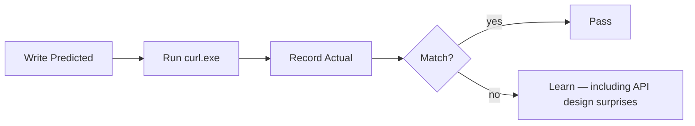

# Month 1 · Week 3 · Day 5
# Tests, Refactor, Documentation — HTTP Lab

**Program:** Full-Stack Mastery · 18 months  
**Phase:** 1 — Foundations  
**Month index:** [../../README.md](../../README.md)  
**Week 3:** [1](day-01.md) · [2](day-02.md) · [3](day-03.md) · [4](day-04.md) · Day 5 (today) · [6](day-06.md) · [7](day-07.md)  
**Week rhythm today:** Tests + refactor + documentation  
**Study time:** 3–4 focused hours

---

## How to use this textbook

This is not a video transcript and not a tutorial to skim.

1. Read a section. Close it. Say the idea in a full sentence.
2. Write **Predicted** before you run. Filling Actual first is cheating the test.
3. Type every `curl.exe` command. Quote URLs that contain `?`.
4. A test you never saw fail is a souvenir — Block D exists so you see F1 fail.
5. Optional review links at the end are for later rechecking — not for first learning.

---

## How to read this chapter

A test is a **claim that can fail**. Today you write predictions **before** curl, then record reality. Do not fill “Actual” first and then invent a matching prediction.



> **Wrong belief:** “I ran curl and it looked fine.”  
> **Correct:** that is a demo. H1–H6 are tests only if Predicted existed first.

> **Wrong belief:** “200 always means the resource exists as I imagined.”  
> **Correct:** 200 means the server chose success. Read the body. Empty objects lie politely.

> **Wrong belief:** “HTTPS means the site is trustworthy.”  
> **Correct:** HTTPS means the bytes were encrypted to that hostname. It does not mean the server is honest.

H6 is the trap: a hostname that does not exist never produces an HTTP status. If you write 404, you mixed DNS with HTTP. Re-read Week 2 in this book.

---

## What a test is today (full explanation)

A **test** is a claim that can fail. “I ran curl and it looked fine” is not a test.

Every useful test has arrange, act, assert. Arrange: `cd` to the lab, have the JSON file ready. Act: run `curl.exe` or `ConvertFrom-Json`. Assert: Predicted vs Actual, or “parses as JSON” vs throw.

For HTTP you often **predict** a status **before** you run the command, then record the actual status. A wrong prediction is a failed test — then you learn. You cannot honestly assert “example.com will return 200 forever”; the network is not yours. You **can** assert “a name that does not exist does not produce a silent fake 200 from my notes.”

Language test frameworks (later: `node:test`, pytest) still mean the same thing: expected vs actual. This month the “runner” is you plus PowerShell.

### Layers again (because H6 is a layer test)

HTTP is the language **after** DNS, TCP, and (for https) TLS. Predicted “404” is only legal if you expect an HTTP response. DNS failure, connection refused, and TLS errors are **not** statuses. Write the layer name in Actual for H6.

- **NXDOMAIN / curl resolver error** — DNS. No status line.
- **Connection refused** — TCP. Nothing listened. No status line.
- **Certificate error** — TLS. No status line.
- **404** — HTTP ran; the application said no such resource.
- **500** — HTTP ran; the server process failed inside.

Use `curl.exe`, not `curl`. PowerShell’s `curl` may be an alias. Quote query URLs.

### H2 is an API-design lesson, not a broken internet

**H2 lesson:** a fake API may return **404** or **200** with `{}` for a missing user. Both are HTTP. Record **reality**. If it is 200 with `{}`, write “this API does not 404 missing users” — that is an API-design lesson, not a failure of HTTP, and not a failure of your test if you predicted 404 and then updated the notes. The test still did its job: it showed the contract.

REST (Week 3 Day 2) *prefers* honest 404 for a missing noun. Real APIs sometimes return 200 plus empty. Your job today is not to scold JSONPlaceholder. Your job is to notice.

### JSON as a contract

JSON as a contract: `ConvertFrom-Json` throws if you leave a trailing comma. That failure **is** the test. JSON is text: object, array, string, number, `true`/`false`, `null`. Double quotes. No comments. No trailing commas. Keys are strings.

F1 is that contract on `sample-user.json`. If the file does not exist, you write a small valid user object first, then run F1. Creating the file is arrange. Parsing it is act. No throw is assert.

### Office hours

A student fills Predicted after curl because “I did not want to be wrong.” Then every row is PASS and nothing was tested. Write Predicted in ink, then run.

A student records H6 as 404 because “the site does not exist.” The *name* does not exist. DNS never handed an IP. HTTP never started. Re-read Week 2 synthesis in this book.

A student breaks JSON, sees the throw, and then “fixes” F1 by deleting the claim. The claim is the point. Restore the file until F1 passes, after you have recorded the throw.

### Worked Predicted column (write yours first — this is the reasoning, not the answer key)

H1 — existing user on a public fake API. A reasonable prediction is **200**. If you get 503, the network or their process had a bad day; record Actual; the layer is still HTTP if you got a status line.

H2 — a user id that almost certainly does not exist. REST *prefers* **404**. This API may return **200** plus `{}`. Predict 404 if that is what you believe honest APIs do; then record reality. Updating the notes with “this API does not 404 missing users” is learning. Changing Predicted after the run to match Actual, without a note, is cheating the test.

H3 — real host, fake path. DNS will find `example.com`. TCP 443 will likely succeed. TLS will likely succeed. Then the **application** may 404. Predict **404** as HTTP. If you predict “DNS fail,” you mixed H3 with H6.

H4 — collection plus query. Predict **200** and a JSON array if the endpoint exists. Quote the URL. If PowerShell expands `?` and curl hits a weird path, that is your shell, not HTTP. Quote. Re-run.

H5 — POST JSON. Predict **201** (created) or **200**. Send `Content-Type: application/json`. If you omit the header, some APIs 400 — that would be a different test. Today H5 includes the header.

H6 — no such host. Predict **no HTTP status**. Actual should be a resolver error. If Actual is 404, you typed a real host or a filter intercepted the name. Write what happened. Do not keep 404 as “close enough.”

Pass/fail rule: for H1–H5, Pass means you predicted a **class or code** and then recorded the real status; a mismatch is Fail-then-learn, still valuable. For H6, Pass means you did **not** write an HTTP status as the prediction of success. H6 Predicted is already filled in the table on purpose so you cannot “predict 404.”

File tests F1–F3 are not HTTP. They are contracts on *your* repo. F1: JSON parses. F2: Day 4 product exists. F3: no session cookie values. A clone-and-follow engineer needs those as much as they need H1.

---

## Today's contract

I can predict an HTTP status **before** running curl, then confirm. H6 (no such host) is **not** recorded as 404.

**Today's gate**

> Predicted columns were written first. H6 is a DNS/curl error, not 404. F1 fails when JSON is illegal and passes when it is fixed.

---

## Time box

| Block | Minutes | Work |
|---|---|---|
| B | 70 | Predict-then-check H1–H6 and F1–F3 |
| C | 40 | Refactor `week-03/README.md` |
| D | 25 | Deliberate JSON break |
| E | 30 | SECURITY.md + commit |

---

# Block B — Predict-then-check

Create `week-03/TESTS.md`. Write **Predicted** *before* you run.

| ID | Request | Predicted status | Actual | Pass? |
|---|---|---|---|---|
| H1 | `GET https://jsonplaceholder.typicode.com/users/1` | | | |
| H2 | `GET https://jsonplaceholder.typicode.com/users/99999` | | | |
| H3 | `GET https://example.com/this-path-should-not-exist-xyz` | | | |
| H4 | `GET https://jsonplaceholder.typicode.com/posts?userId=1` | | | |
| H5 | `POST jsonplaceholder /posts` with JSON | | | |
| H6 | `GET` a hostname that does not exist | (no HTTP status — DNS/curl error) | | |

H1: an existing user. Many students predict 200. Run and see.

H2: this fake API may return **404** or **200** with `{}`. Record **reality**. If it is 200 with `{}`, write “this API does not 404 missing users” — that is an API-design lesson, not a failure of HTTP.

H3: a missing **path** on a real host. DNS will work. TCP 443 will work. TLS will work. Then HTTP may 404. That is the contrast with H6.

H4: query filter. Quote the URL. Predict a success class if the collection endpoint exists; then read whether the body is an array.

H5: POST with JSON. Predict 201 or 200 — fake APIs vary. Send `Content-Type: application/json`.

H6: if you wrote 404, you mixed layers. Re-read Week 2 synthesis in this book.

Use `curl.exe -i` (and quote query URLs). Typed lab:

```powershell
cd ~\fullstack-lab
curl.exe -i "https://jsonplaceholder.typicode.com/users/1"
curl.exe -i "https://jsonplaceholder.typicode.com/users/99999"
curl.exe -i "https://example.com/this-path-should-not-exist-xyz"
curl.exe -i "https://jsonplaceholder.typicode.com/posts?userId=1"
```

H5, if you have `week-03/post-body.json` or `week-03/memory/book.json`:

```powershell
curl.exe -i -X POST "https://jsonplaceholder.typicode.com/posts" -H "Content-Type: application/json" --data-binary "@week-03/post-body.json"
```

Example for H6 — pick a name that will not resolve:

```powershell
curl.exe -i "https://this-host-should-not-exist-xyz-1234.example"
```

You should see a resolver error, not `HTTP/1.1 404`.

### How to read each capture (do this before you mark Pass)

H1 — status line `HTTP/1.1 200` or `HTTP/2 200` is still 200. Body should be a user object, not HTML. If you see HTML, you are not on JSONPlaceholder or you followed a surprising redirect. Write Actual honestly.

H2 — look at **both** status and body. `200` plus `{}` is a design choice. `404` plus an error object is another. Either is HTTP. “Empty” without a status is not.

H3 — `example.com` should resolve. A 404 here proves the contrast with H6: missing **path** vs missing **name**. If H3 is a resolver error, you mistyped the host.

H4 — after quoting, you should get a JSON array (possibly long). First line still a status. If PowerShell ate `?`, the URL never reached the server as a query. Quote. Re-run. Do not mark Pass on a wrong URL.

H5 — request must include the JSON header and a body. Response often includes an `id`. That id is fake-API theater. The status is still real.

H6 — red text, “Could not resolve host,” or similar. No `HTTP/1.1`. If you see 404, you did not use a nonexistent name, or a filter answered. Write the layer you actually hit.

`--data-binary "@file"` reads the file as bytes. `@` is required. Without it, curl may send the path as the body string. Then the server is parsing a path as JSON and you will invent a theory about Windows. Check the command.

File claims:

| ID | Claim |
|---|---|
| F1 | `sample-user.json` parses as JSON |
| F2 | `http-log/COMPARE.md` exists |
| F3 | No week-03 file contains real `Cookie:` values |

```powershell
Get-Content ~\fullstack-lab\week-03\sample-user.json -Raw | ConvertFrom-Json
```

If this throws, F1 fails. Fix the JSON (trailing comma, single quotes, comments).

If `sample-user.json` does not exist yet, write a small valid user object (`id` number, `name` string, `email` string) and then run F1.

F2: `Test-Path ~\fullstack-lab\week-03\http-log\COMPARE.md` should be `True`. If false, Day 4 is unfinished — do not skip; create COMPARE.md from yesterday’s three-tool work.

F3: search your notes. Header **names** (`Cookie`, `Set-Cookie`) in explanations are fine. Values that look like session tokens are not.

```powershell
cd ~\fullstack-lab\week-03
Select-String -Path * -Pattern 'Cookie:' -SimpleMatch
```

Judgment: a teaching sentence is fine. A pasted `Cookie: session=...` is a fail. Fix the file, not the claim.

---

# Block C — Refactor documentation

`week-03/README.md` must list: what HTTP is (one paragraph from Day 1), how to run curl examples with **`curl.exe`**, which API client you chose, how to run TESTS.md.

A clone-and-follow README is a test of your documentation. If a sentence requires Day 4 still being open in your head, write the sentence.

HTTP, in one paragraph you can own: HTTP is the request/response language on the connection after DNS, TCP, and TLS. A request has a method, a path, headers, and an optional body. A response has a status, headers, and an optional body. 404 means that language worked. Connection refused means TCP never got there.

How to run tests: open `TESTS.md`, write Predicted, run the `curl.exe` lines, fill Actual. Do not say “run the tests” with no verb.

---

# Block D — Deliberate break

Break `sample-user.json` (trailing comma). Run ConvertFrom-Json. Confirm F1 fails. Restore. Re-run. JSON’s rules (quoted keys, no trailing comma) are in Week 3 Day 2 of this book.

```powershell
Get-Content ~\fullstack-lab\week-03\sample-user.json -Raw | ConvertFrom-Json
```

Record the throw message in TESTS.md (one line). Then restore. A test you never saw fail is a souvenir.

If you break the file and F1 still “passes” because you did not re-run `ConvertFrom-Json`, you did not break-test. Run it. See red. Restore. See parse succeed.

---

# Block E — Security notes in-repo

Add `week-03/SECURITY.md`:

- GET URLs are logged and bookmarked — no passwords in the query string.
- HTTPS encrypts the HTTP messages on the path; HTTP on a café network does not.
- Cookies that represent a login are credentials; never commit them.
- Caching: private responses should not be stored (`Cache-Control: no-store` as an idea). You are not implementing a CDN.

Write those as full sentences from this month’s explanations, not as a copied bullet list you cannot teach. Query strings appear in logs, history, and `Referer`. That is why identity can live in the path and secrets must not live in the query. `Set-Cookie` asks the browser to store; later requests send `Cookie`. Treat that as a credential even when the value looks like random noise.

H6 vs H3, one more time, because this is the week’s gate: H3 is a real name and a fake path — HTTP can 404. H6 is a fake name — DNS fails; there is no status. If both Actual columns say 404, you did not run H6.

F3 search: a markdown sentence “never commit Cookie values” is fine. A line `Cookie: sid=abc` is not. Delete the value. Keep the teaching sentence.

```powershell
git add week-03
git commit -m "Add Week 3 HTTP tests and security notes."
```

Deliberate-break record in TESTS.md (one line is not enough): what you changed in `sample-user.json` (trailing comma after which field); the `ConvertFrom-Json` error text; that F1 failed; that you restored; that F1 then passed. If you cannot show the fail, you did not test.

README clone-and-follow: a classmate should be able to run H1 from the README’s `curl.exe` example without opening Day 4. If the README says “run the tests” with no table and no `curl.exe`, G8’s cousin failed — fix the README today (this week’s G8 is Week 4; this week’s clone-and-follow is still the README).

---

## Definition of done

- [ ] Predictions written before runs
- [ ] H6 is not recorded as 404
- [ ] JSON parse test exists
- [ ] SECURITY.md exists and is written from this month’s explanations
- [ ] README complete

SECURITY.md is not a cargo-cult file. Each bullet must be a sentence you can teach: query strings are logged; HTTPS encrypts on the path; cookies are credentials; `no-store` is for private bodies. If you cannot expand a bullet, rewrite it from Week 2 and Week 3 Day 2 in this book.

H2’s empty object is still a passed *HTTP* test if you recorded reality.
It is a failed *REST honesty* story. Write both in TESTS.md.
That is the adult version of “the test passed.”

Predicted columns are the test. Actual columns are the world.
If you fill Actual first, you wrote a diary, not H1–H6.

F1 is local. The network cannot excuse a trailing comma.
F2 is Day 4’s product. If COMPARE.md is missing, finish Day 4.
F3 is judgment. Header names are fine. Session values are not.

H6 Predicted is already “no HTTP status.” Do not “correct” it to 404
after a surprising filter. Write the layer you actually hit.

H3 is a missing path on a real host. H6 is a missing name. Contrast them
in TESTS.md so future-you cannot mix them.

---

## Optional review links

Testing and HTTP security are explained in this chapter. These pages are for later checking, not for first learning.

- [Week 3 Day 1](day-01.md) — 404 vs connection refused
- [Week 2 Day 7](../../week-02/day-07.md) — layers
- [Week 3 Day 2](day-02.md) — JSON rules and cookies

---

## Tomorrow

Independent REST design on paper (`library-api.md`) plus a live GET you have not copied from Day 3.
