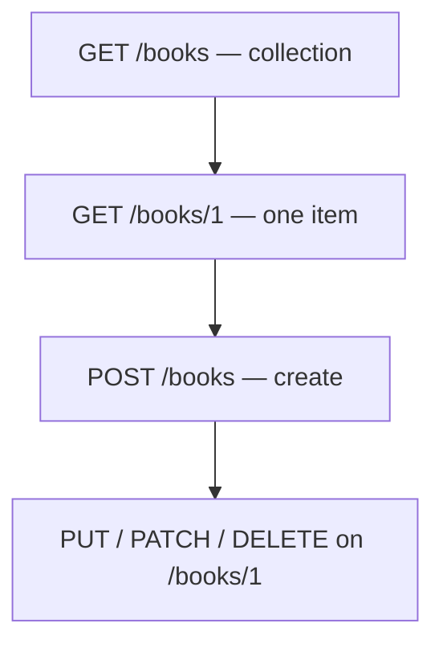

# Month 1 · Week 3 · Day 6
# Independent HTTP / API Work

**Program:** Full-Stack Mastery · 18 months  
**Phase:** 1 — Foundations  
**Month index:** [../../README.md](../../README.md)  
**Week 3:** [1](day-01.md) · [2](day-02.md) · [3](day-03.md) · [4](day-04.md) · [5](day-05.md) · Day 6 (today) · [7](day-07.md)  
**Week rhythm today:** Independent project work  
**Study time:** 3–4 focused hours  
**Days 1–5 files:** closed during challenges. Repair from **this book’s Week 3 Days 1–2**, not from MDN.

---

## How to use this textbook

This is not a video transcript and not a tutorial to skim.

1. Read the complete explanation. Close it. Say each REST rule in a full sentence.
2. Type the live GET yourself. Do not copy Day 3’s `todo-1.txt`.
3. `catalog.json` must parse. A pretty file that `ConvertFrom-Json` rejects is a failed challenge.
4. AI may not write `library-api.md` for you.
5. Optional review links at the end are for later rechecking — not for first learning.

---

## How to read this chapter

You are not writing FastAPI yet. You **are** writing a **contract**. Days 1–5 stay closed during the challenges. This file contains the REST rules you need.



Identity stays in the **path**. Filters stay in the **query**. Tokens stay out of both.

> **Wrong belief:** “REST means JSON and `/api` in the URL.”  
> **Correct:** REST here means resources as nouns, methods as verbs, honest statuses, and JSON with a matching `Content-Type`.

> **Wrong belief:** “DELETE in the browser address bar is how users delete books.”  
> **Correct:** browsers navigate with GET. DELETE is a method clients send (curl, API client, later JavaScript `fetch`). You can still **design** DELETE `/books/1`.

> **Wrong belief:** “401 and 403 are both access denied.”  
> **Correct:** 401 means we do not know who you are. 403 means we know, and you still may not.

---

## Complete explanation (REST design you will use in Month 9)

You are not writing FastAPI yet. You **are** writing a **contract**.

HTTP recap, because the contract rides on it. A request has a method, a path (and query), headers, and an optional body. A response has a status, headers, and an optional body. That language starts **after** DNS, TCP, and TLS. A 404 is HTTP succeeding. Connection refused is TCP. NXDOMAIN is DNS.

A **resource** is a noun the API exposes: a book, a borrower, a list of books. The URL names it:

- collection: `GET /books` — 200 + JSON array  
- one item: `GET /books/1` — 200 + object, or 404  
- create: `POST /books` with JSON body — 201 + created object (or 200, if you document it)  
- replace: `PUT /books/1`  
- partial update: `PATCH /books/1`  
- delete: `DELETE /books/1` — 204 or 200  

**Query string** adjusts the representation: `GET /books?q=http&inPrint=true` (search and filter). Identity stays in the **path** (`/books/1`), not `GET /getBook?id=1` (RPC style). Both exist in the wild; this program prefers resources.

**401** = we do not know who you are (or credentials missing). **403** = we know who you are and you still may not delete that book (not staff / not owner).

Do not put tokens or passwords in the query string (logs, history, Referer). GET URLs are bookmarked. A password in `?token=` is a leak waiting for a screenshot.

JSON for `GET /books/1` might look like:

```json
{
  "id": 1,
  "title": "The Internet",
  "inPrint": true,
  "authorIds": [4, 9]
}
```

`Content-Type` on a JSON response should be `application/json`. If a client tries to `JSON.parse` HTML, it failed to check that header or the status. Double quotes. No comments. No trailing commas. `ConvertFrom-Json` throwing is the file, not Windows.

**Stateless idea (beginner):** each request carries what the server needs to understand it (path, query, headers, body). The server does not rely on “this TCP connection already logged you in” as the only memory. Cookies (session ids) are still sent **on the request**; that is the client carrying a credential, not a hidden server conversation. You will implement sessions in Month 13. Today you only need the idea.

**RPC vs REST:** `GET /getBook?id=1` names an **action**. `GET /books/1` names a **thing**. This program prefers things so Month 9 routes stay guessable: same noun, different methods.

**HEAD vs GET:** HEAD asks for the same headers as GET without the body. `curl.exe -I` is the flag you use to see headers. Stretch today compares `-I` and `-i`. Always type **`curl.exe`**. Quote URLs that contain `?`.

Three tools, one protocol: browser, `curl.exe`, API client. The GUI is not REST by itself. Naming a request `create-book` in Thunder Client does not make POST `/books` correct — the **URL and method** do.

Worked contrast. A library checkout as RPC: `GET /doCheckout?bookId=1&userId=9` — wrong method for a change, secrets and ids in the query, action in the path. As a resource: `POST /loans` with `{ "bookId": 1, "borrowerId": 9 }` — a noun, a body, a status you can document as 201. You do not build the server today. You refuse the RPC shape on paper.

Office hours. A student designs `GET /books/delete/1`. That is a noun wearing a verb in the path, and browsers will cache or prefetch GET. Use DELETE `/books/1`. Another student puts `?apiKey=...` on every example. Challenge 1 item 7 exists so you delete that. A third student writes `catalog.json` with a trailing comma after the second book and then POSTs it in their head. Parse it for real.

### Worked library contract (change the sentences; keep the shape)

Resource URLs you can defend:

| Resource | Collection | One item |
|---|---|---|
| Book | `GET /books` | `GET /books/{id}` |
| Borrower | `GET /borrowers` | `GET /borrowers/{id}` |
| Loan | `GET /loans` | `GET /loans/{id}` |

Create with POST on the collection (`POST /books`, `POST /loans`). Replace with PUT on the item. Partial update with PATCH. Delete with DELETE on the item — not with GET, not with `/deleteBook`.

Success statuses you can defend: 200 for reads; 201 for creates if you return the new object; 204 for a delete with no body; 404 when the id does not exist; 401 when the client sent no usable credential; 403 when the credential is fine and the rule still says no.

Query examples that are filters, not identity: `GET /books?q=http`, `GET /books?inPrint=true`, `GET /loans?borrowerId=9`. `borrowerId` as a **filter on loans** is a query. The loan’s own id stays in the path: `/loans/31`.

Why not `GET /getBook?id=1`: the path names an action (`getBook`) instead of a thing (`books`); GET should be safe to repeat and cache; identity belongs in the path so `GET /books/1` is one resource. RPC exists in the wild. This program prefers the noun.

JSON rules again, because Challenge 3 will fail on a comma. Two books:

```json
[
  {"id": 1, "title": "The Internet"},
  {"id": 2, "title": "The Machine"}
]
```

Illegal: a comma after the second object; `'id'` with single quotes; `// comment`; `True` capitalized as in PowerShell. `ConvertFrom-Json` is the judge.

Live GET notes: for each header you list, write the **job**, not only the name. `Content-Type` tells the client how to parse the body. `Date` is the server’s time for this response. `Cache-Control` talks about reuse. `User-Agent` identifies the client. `Host` names the site. If GitHub returns 403, you may be unauthenticated or rate-limited — that is **403 or a related 4xx**, still HTTP. 401 would mean “we do not accept you as a user yet.” Do not add a PAT to chase 200.

---

## Today's contract

A new JSON resource, a new API inspection, and a REST design on paper.

**Today's gate**

> `library-api.md` uses nouns and honest methods. A live GET is on disk. `catalog.json` parses. Three tools are named as HTTP clients.

---

## Time box

| Block | Minutes | Work |
|---|---|---|
| 1 | 50 | Challenge 1 — `library-api.md` |
| 2 | 40 | Challenge 2 — live GET |
| 3 | 25 | Challenge 3 — `catalog.json` |
| 4 | 25 | Challenge 4 — three tools |
| S | 20 | Stretch HEAD vs GET (if time) |
| | 15 | Commit |

---

# Challenge 1 — Design a tiny REST API (required)

`week-03/independent/library-api.md` — library with books and borrowers. Using **only** the explanation above, write:

1. Resource URLs  
2. Methods and success statuses  
3. JSON example for `GET /books/1`  
4. Query examples  
5. Why not `GET /getBook?id=1`  
6. 401 vs 403 if only staff may delete  
7. What you would not put in a query string  

```powershell
cd ~\fullstack-lab
New-Item -ItemType Directory -Force -Path week-03\independent | Out-Null
```

Borrowers are a second noun (`/borrowers`, `/borrowers/1`). A checkout might be `POST /loans` with `{ "bookId", "borrowerId" }` — still a resource, not `GET /doCheckout`. You do not need a full library product. You need honest URLs.

Write full sentences for items 5–7. “RPC is bad” is not enough. Say that the path should name a thing, that GET should not checkout a book, that query strings are logged.

Staff-only DELETE: missing Cookie or token → **401**. Logged in as a borrower, not staff → **403**. Staff → 204 or 200. If you swap 401 and 403, rewrite item 6 from this chapter.

A contract that will fight you later: `GET /doDelete?id=1&token=secret`. GET should not delete. Tokens should not be in the query. The path names an action. Rewrite that shape whenever you catch it on paper.

A contract that will help Month 9: `DELETE /books/1` with a session cookie, 401 if the cookie is missing, 403 if the user is not staff, 204 if the book is gone. Same noun as `GET /books/1`. Different method. Honest status.

You do not need a full library product. You need those sentences in `library-api.md` in **your** wording, with borrowers as a second noun and loans as a third if you mention checkout.

---

# Challenge 2 — Inspect a public GET (required)

Pick one:

- `https://jsonplaceholder.typicode.com/comments?postId=1`
- `https://api.github.com/repos/microsoft/vscode` (may 403 rate-limit; that is still a valid HTTP capture)

`curl.exe -i` to `week-03/independent/live-get.txt`.

Notes: method, status, content-type, one path or query param, three headers **and what each does** (Host, Content-Type, User-Agent, Date, Cache-Control, … — jobs are in Week 3 Day 2). No tokens. If GitHub 403, explain 403 vs 401 from the complete explanation.

```powershell
cd ~\fullstack-lab
curl.exe -i "https://jsonplaceholder.typicode.com/comments?postId=1" -o week-03/independent/live-get.txt
```

Quote the URL. GitHub may want a `User-Agent`; if curl already sends one, you are fine. Do not add a personal token to “fix” a 403.

Open the file. Point at the status line. If you used `curl` not `curl.exe`, you may not have a status line. Delete. Re-run.

`postId=1` is a **query** filter: comments for that post. The path `/comments` is the collection. Identity of one comment would be `/comments/17` — you did not need that for this GET.

---

# Challenge 3 — JSON authoring (required)

`independent/catalog.json`: array of **two** book objects. Valid: double-quoted keys, no trailing comma. Prove with `ConvertFrom-Json`.

```powershell
Get-Content ~\fullstack-lab\week-03\independent\catalog.json -Raw | ConvertFrom-Json
```

Two objects inside `[ ... ]`. Each book needs at least `title` (string) and `id` (number). Match the spirit of Challenge 1’s JSON example.

If this throws, read the error. Trailing comma after the second object is the usual cause. Fix the file. Do not “fix” Windows.

---

# Challenge 4 — Three tools (required)

`independent/three-tools.md`: how you GET Challenge 2’s URL in **browser**, **curl.exe**, and **your API client**. All three send HTTP. The GUI is not REST by itself.

Write the exact URL. Write the method. Write where you look for status in each tool (Network tab status column; first line of a `curl.exe -i` capture; the GUI status badge). Do not paste cookies.

---

# Stretch

`curl.exe -I` vs `curl.exe -i` on JSONPlaceholder. HEAD should not include a body; `-I` asks for headers. Write what you observed.

```powershell
curl.exe -I "https://jsonplaceholder.typicode.com/todos/1"
curl.exe -i "https://jsonplaceholder.typicode.com/todos/1"
```

The `-i` capture includes a JSON body. The `-I` capture should stop after headers (or show a tiny/empty body). If a server ignores HEAD and still sends a body, write that — servers misbehave; the **intent** of HEAD is headers only.

three-tools.md quality: name the three programs; say each sends HTTP; say where status appears; paste no cookies. If you only used two tools, Day 4 is unfinished — install the GUI or write the markdown-list fallback from Day 4, then complete Challenge 4.

`live-get.txt` must be a `curl.exe -i` capture you ran today, not Day 3’s `todo-1.txt` renamed. Open it. If the first line is not `HTTP/`, you used the alias.

```powershell
git add week-03/independent
git commit -m "Add independent REST design and HTTP inspection."
```

---

## Before you commit Challenge 1–4

Read `library-api.md` aloud. Every URL should sound like a noun. Every method should sound like a verb. If you hear “getBook,” stop and rename. If you hear “doCheckout,” stop and name a loan. If you hear “token in the query,” delete that example.

Prove `catalog.json` one more time:

```powershell
Get-Content ~\fullstack-lab\week-03\independent\catalog.json -Raw | ConvertFrom-Json
```

Two objects. `id` number. `title` string. No trailing comma after the second object.

Open `live-get.txt`. Point at: method (in your notes — curl `-i` shows the response; you already know you sent GET), status line, `Content-Type`, one query or path piece (`postId=1` or a GitHub path), three header **jobs**. If GitHub 403, write whether that is “we know who you are” (403) or “we do not accept you yet” (401). Rate limit without a login is often 403. Still HTTP. Still no PAT.

`three-tools.md` names browser, `curl.exe`, and the GUI you installed on Day 4. If you skipped Day 4, do the GUI now; independent day does not erase the roadmap’s three tools.

---

## Definition of done

- [ ] REST design uses the rules written in this file
- [ ] Live GET captured
- [ ] Valid JSON array of two books
- [ ] Three-tools note

If `library-api.md` still contains `GET /getBook?id=1` as the *recommended* shape, Challenge 1 failed. RPC may be mentioned as a contrast. It must not be the design.

If `catalog.json` parses in your editor’s syntax highlighter but `ConvertFrom-Json` throws, trust PowerShell. Fix the comma.

If Challenge 2 used GitHub and you added a PAT to “make it 200,” undo that.
403 is a valid capture. Tokens do not belong in this repo.

HEAD vs GET once more: `-I` asks for headers. `-i` includes the body.
JSONPlaceholder usually sends JSON on GET. HEAD should not need that body.
If the server sends a body anyway, write what you saw. The *intent* of
HEAD is still “headers only.”

Borrowers are a second noun. Loans are a third if you mention checkout.
Two nouns minimum. One RPC verb in the path is a failed contract.

`POST /loans` with a JSON body is a checkout. `GET /doCheckout` is not.
Staff DELETE uses 403 for a logged-in non-staff user and 401 for no
session. Swap those numbers and Challenge 1 item 6 is wrong.

Query strings are logged, bookmarked, and copied into `Referer`.
That is why tokens do not live there. Identity lives in the path.

`catalog.json` is an array of two objects. Prove it with ConvertFrom-Json
before you commit. A highlighter is not a parser.

three-tools.md names browser, curl.exe, and your GUI. All three send HTTP.
The GUI is a client. REST is the contract on paper in library-api.md.
Do not copy Day 3’s todo-1.txt into live-get.txt. New capture today.
Quote the query URL. Always curl.exe, never the PowerShell alias.

---

## Optional review links

REST and HTTP inspection are explained in this chapter. These pages are for later checking, not for first learning.

- [Week 3 Day 2](day-02.md) — REST basics
- [Week 3 Day 4](day-04.md) — three tools
- [MDN: REST](https://developer.mozilla.org/en-US/docs/Glossary/REST)

---

## Tomorrow

Week 3 review: speak the synthesis, mini-inspect, debug A–E, fix `library-api.md` once, re-run TESTS.md.
