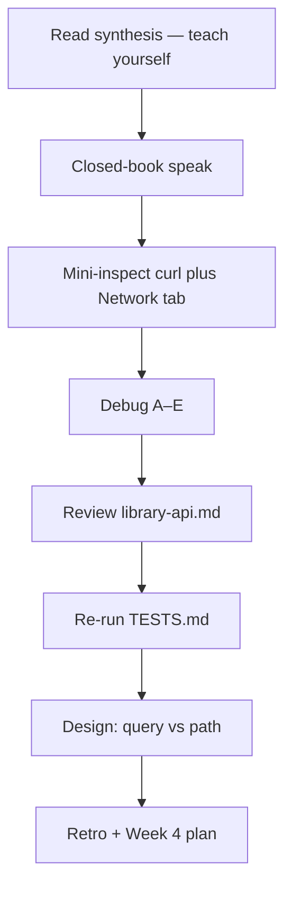
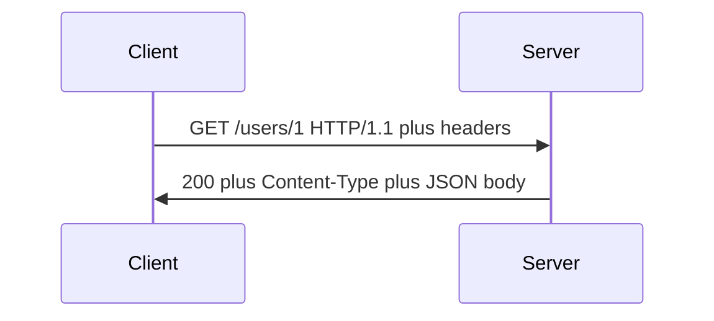

# Month 1 · Week 3 · Day 7
# Week Review — HTTP and APIs

**Program:** Full-Stack Mastery · 18 months  
**Phase:** 1 — Foundations  
**Month index:** [../../README.md](../../README.md)  
**Week 3:** [1](day-01.md) · [2](day-02.md) · [3](day-03.md) · [4](day-04.md) · [5](day-05.md) · [6](day-06.md) · Day 7 (today)  
**Week rhythm today:** Review, repair, plan Week 4  
**Study time:** 3–4 focused hours

Do not start Week 4 because the calendar moved. Start Week 4 because this file’s gate is true.

---

## How to use this textbook

This is not a video transcript and not a tutorial to skim.

1. Read the synthesis. Close it. Speak it in full sentences.
2. During blocks 1–3, other day files stay closed. If you go blank, re-read **this synthesis**.
3. Type the mini-inspect. Do not copy Day 3’s `todo-1.txt`.
4. AI may not write debug.txt.
5. Optional review links at the end are for later rechecking — not for first learning.

---

## How to read this chapter

This file is the **review and the teacher**. The synthesis is written so a student whose Days 1–6 notes are foggy can still re-learn HTTP from **today’s pages**, then prove it with the seven blocks.



> **Wrong belief:** “404 means the internet is down.”  
> **Correct:** 404 is an HTTP response. The connection and TLS already worked.

> **Wrong belief:** “POST is REST.”  
> **Correct:** POST is a method. REST is the resource design.

> **Wrong belief:** “If I survived the week, I can start Week 4 on Monday.”  
> **Correct:** you start Week 4 when this file’s gate is true. A calendar is not a gate.

---

## Week synthesis (the lesson, in this book)

HTTP is the language on the connection after DNS/TCP/TLS.

**Request:** method, path, query, headers, optional body.  
**Response:** status, headers, optional body.



A simplified request still has a request line, headers, an empty line, and an optional body. `Host:` names the site. The browser used that host for DNS and TLS too. They must agree.

**Methods:** GET (read), HEAD (like GET, no body), POST (process/create — not generally idempotent), PUT (replace), PATCH (partial update), DELETE (remove), OPTIONS (what is allowed). Browsers navigate with GET; forms often POST. curl and API clients can send any method. Repeating GET should not create a second order. Repeating POST might.

**Statuses:** 2xx success, 3xx look at `Location`, 4xx your request, 5xx server. Memorize: 200, 201, 204, 301, 304, 400, 401, 403, 404, 405, 500. **401** = not authenticated (credentials missing/wrong). **403** = authenticated but forbidden. **404** = no such resource — and HTTP **worked**. Connection refused ≠ 404. NXDOMAIN is DNS. Certificate errors are TLS. 204 is success with an empty body — do not parse JSON. 304 means reuse a previous body.

**Headers** are metadata (`Content-Type`, `Host`, `Cache-Control`, `Set-Cookie`, `Location`, `User-Agent`). **Body** is the payload. `Content-Type: application/json` must match a JSON body. Parsing HTML as JSON is ignoring that header or ignoring an error page.

**JSON** is text: object, array, string, number, `true`/`false`, `null`. Double quotes. No comments. No trailing commas. `ConvertFrom-Json` throwing is the test.

**Query vs path:** `/users/42?include=posts` — `42` is identity in the path; `include=posts` is a filter in the query. Query strings are logged. No passwords there. PowerShell treats `?` as a wildcard — quote the URL. Always type **`curl.exe`**.

**Cookies:** `Set-Cookie` on the response asks the browser to store; later requests send `Cookie`. Treat as credentials. Do not commit values or HAR files with sessions.

**Cache (concept):** `Cache-Control`, `ETag`, `304 Not Modified` mean reuse a previous body. `no-store` for private responses. You are not building a CDN.

**REST:** nouns in URLs, methods as verbs, honest statuses, JSON with matching type, each request carries what it needs. Not “we have `/api`.” Not “we used JSON.” RPC (`GET /getBook?id=1`) exists; this program prefers `/books/1`.

**Tools:** Network tab (browser client), `curl.exe` (Windows: not the `curl` alias), API client (GUI HTTP client). All three speak HTTP. The GUI is not REST.

**Security:** no secrets in GET URLs; HTTPS for credentials on the path; do not commit cookies, tokens, or HAR files with sessions. HTTPS encrypts to a hostname; it does not make the site honest.

Office-hours stories you will answer in debug.txt.

A. A frontend calls `JSON.parse` on a response. The terminal shows HTML. They ignored `Content-Type` (and probably ignored a 4xx/5xx error page). Check status and type before parsing.

B. They typed `curl https://...` in PowerShell and got an object that is not a raw HTTP message. PowerShell’s `curl` may be `Invoke-WebRequest`. Fix: `curl.exe`.

C. `/users/1/` 404s and `/users/1` is 200. Trailing slash is part of the path the server matches. HTTP worked both times if you got statuses. The path is the bug.

D. POST without `Content-Type: application/json` on a strict API. The body is not parsed as JSON. Often 400 or 422. The header is not decoration.

E. A HAR file from DevTools in git. It may contain cookies. Treat it as a credential dump. Do not commit it.

### Speak-aloud spine (use this, then close it)

HTTP sits after DNS, TCP, and TLS. The client sends a method, a path, headers, and maybe a body. The server sends a status, headers, and maybe a body. GET reads. POST processes or creates. PUT replaces. PATCH patches. DELETE removes. HEAD is GET without a body.

200 is OK. 201 is created. 204 is success with no body. 301 says look at `Location`. 304 says reuse a cached body. 400 is a bad request. 401 is not authenticated. 403 is authenticated but forbidden. 404 is no such resource — and the protocol worked. 500 is the server process failing inside.

JSON is text with strict rules. Query is a filter. Path is identity. Cookies are credentials. Cache headers are an idea, not a CDN you will build today. REST is nouns plus methods plus honest statuses. Three tools, one protocol. `curl.exe` on Windows.

If you cannot expand each sentence in that spine to a second true sentence, write the topic in `weak.txt` and re-read that paragraph in this file. Week 4 will not reteach 404 vs connection refused.

Mini-inspect expected shape, so you know you finished Block 2: `users-2.txt` starts with `HTTP/` and a status; `mini.md` names GET, that status, `application/json` or whatever `Content-Type` you actually saw, and one field such as `id` or `email`; DevTools notes name method and status for the document request on `example.com` without cookie values. If `users-2.txt` is a PowerShell object, you used the alias. Redo.

---

## Today's contract

Closed-book, you can inspect HTTP and explain REST from this synthesis.

**Today's gate**

> I can speak Week 3, capture a GET, answer debug A–E from this model, and leave `library-api.md` with nouns and honest methods.

---

## Time box

| Block | Minutes | Work |
|---|---|---|
| 0 | 20 | Read the synthesis; speak it |
| 1 | 30 | Closed-book explanation |
| 2 | 35 | Independent mini-inspect |
| 3 | 25 | Debugging A–E |
| 4 | 25 | Review `library-api.md` |
| 5 | 20 | Re-run TESTS.md |
| 6 | 20 | Design |
| 7 | 20 | Retro + Week 4 plan |

---

# 1. Closed-book explanation

Every Week 3 topic, aloud, from the synthesis.

Cover: request/response shape; methods; status classes plus 401/403/404/500; headers vs body; JSON rules; query vs path; cookies; cache idea; REST; three tools; `curl.exe` vs `curl` on Windows; no secrets in git.

If a topic is under two true sentences, write it in `week-03/review/weak.txt` and re-read that section **in this file**. If you say “and then the API…” name the method, the path, and the status class.

# 2. Independent mini-inspect

New shell. `curl.exe -i https://jsonplaceholder.typicode.com/users/2`  
`week-03/review/mini.md`: method, status, content-type, one JSON field.  
Network tab on `https://example.com`: document request method+status.

```powershell
cd ~\fullstack-lab
New-Item -ItemType Directory -Force -Path week-03\review | Out-Null
curl.exe -i "https://jsonplaceholder.typicode.com/users/2" -o week-03/review/users-2.txt
```

Do not copy Day 3’s `todo-1.txt` notes. New capture. No cookie values in mini.md. Open `users-2.txt` and point at the status line before you write mini.md. If the file is a PowerShell dump, you used `curl`. Delete. Use `curl.exe`.

On example.com, count requests on one reload. The document is one journey. CSS and images are more. That is Week 2’s lifecycle, visible in the Network tab.

# 3. Debugging

`week-03/review/debug.txt`

**A.** Client JSON parse error; curl shows HTML. Which header did they ignore? (`Content-Type`)  
**B.** `curl https://...` in PowerShell is not curl. Fix: `curl.exe`.  
**C.** 404 on `/users/1/` vs `/users/1` — trailing slash / routing (the server’s path matching).  
**D.** POST without `Content-Type: application/json` on a strict API — body not parsed as JSON, often 400/422.  
**E.** HAR file from DevTools in git — may contain cookies.

Write **full sentences** for cause and fix. The labels in parentheses are the exam keys; your file must still explain them. “Content-Type” alone is not an answer for A — say the client parsed a body as JSON without checking that the server said `application/json`, and HTML is not JSON.

Worked fixes you may adapt (still write your own file):

A. Cause: the client assumed the body was JSON. The server sent HTML, often an error page, and said so with `Content-Type: text/html`. Fix: check status and `Content-Type` before parsing. If status is 4xx/5xx, do not parse as the success object.

B. Cause: PowerShell’s `curl` alias. Fix: type `curl.exe`. Confirm with `Get-Command curl` vs `Get-Command curl.exe`.

C. Cause: the path string is exact. `/users/1/` is not `/users/1` unless the server treats them as equal. Fix: use the path the API documents. A 404 here is HTTP working.

D. Cause: missing or wrong `Content-Type`. The server’s JSON parser never ran, or ran on the wrong media type. Fix: `-H "Content-Type: application/json"` and a valid body.

E. Cause: HAR is a transcript of real requests, including `Cookie` values. Fix: do not `git add` HAR. Write header **names** in notes if you must.

# 4. Review `library-api.md` — nouns? honest methods? One fix. Commit.

Open `week-03/independent/library-api.md`. Check: resources are nouns; GET does not delete; 401 ≠ 403; no tokens in query examples. Make **one** real fix (a URL, a status, a sentence). That fix is the review.

If Day 6 is missing, write a stub with `/books`, `/books/1`, POST create, DELETE staff-only, and 401 vs 403 — then you still owe Day 6’s live GET. Do not start Week 4 with an empty independent folder.

# 5. Re-run TESTS.md.

H1–H6 and F1–F3. H6 still must not be 404. If a live status changed, record the new Actual — the network is not yours; the **layer** still is.

```powershell
cd ~\fullstack-lab
curl.exe -i "https://this-host-should-not-exist-xyz-1234.example"
Get-Content ~\fullstack-lab\week-03\sample-user.json -Raw | ConvertFrom-Json
```

If F1 throws, fix JSON, do not delete the claim. If H2 is 200 with `{}`, that is still HTTP. Record it.

# 6. Design

`week-03/review/design.txt` — why filters in query and identity in path; REST is a choice (RPC and GraphQL exist). Where cookies sit: stored on client, set by server, sent automatically.

Write full sentences. Identity in the path makes `GET /books/1` cacheable and guessable. Filters in the query make `GET /books?q=http` a variant of the same collection, not a new verb. Cookies: `Set-Cookie` on a response; `Cookie` on later requests; treat as credentials; never commit values.

REST is a **choice**. RPC (`GET /getBook?id=1`) exists and can be clear. GraphQL exists and will not be this month. This program prefers resource URLs so methods stay guessable when you reach an application server. Your design.txt should say that out loud: we are choosing a style, not discovering a law of physics.

Cookies sit on the **client**, in the browser’s cookie jar for that site. The **server** sets them. The browser **sends** them on later requests to that site. The application server then authenticates (who is this session?) and authorizes (may they do this?). That is Weeks 3 and 4 talking. You will implement it in Month 13. You must not mix the words today.

# 7. Retro + Week 4 plan

Week 4: Git in depth (repo, commit, diff, log, remote, push/pull, gitignore) **explained in Week 4 day files**, then architecture boxes. GitHub account before Day 2. No secrets.

`week-03/review/retro.md`: hours this week, solid topics, weak topics with a day-file repair, whether COMPARE.md and TESTS.md exist.

Repair the weakest topic **today**. If JSON is weak, break and restore `sample-user.json` again. If layers are weak, re-read Week 2 Day 7 in this book and rewrite H6’s Actual in your own words.

library-api.md review examples of a **real** fix: change `GET /deleteBook` to `DELETE /books/1`; split “access denied” into 401 vs 403; move `?token=` out of the examples; rename `/getBooks` to `/books`. A spelling tweak in a comment is not the review.

mini.md must not be a copy of Day 3. `users/2` is a different resource than `todos/1`. If you cannot find `email` or `id` in users-2.txt, you did not capture JSON.

```powershell
git add week-03/review week-03
git commit -m "Record Week 3 HTTP review."
```

---

## If a topic was mush, here is the repair (still this file)

**Methods.** GET reads. POST processes or creates and is not generally safe to repeat. PUT replaces. PATCH patches. DELETE removes. HEAD is GET without a body. Browsers navigate with GET.

**Statuses.** 2xx success. 3xx look at `Location`. 4xx your request. 5xx their process. 401 not authenticated. 403 authenticated but forbidden. 404 no such resource — HTTP worked. Connection refused is TCP. NXDOMAIN is DNS. Certificate errors are TLS.

**JSON.** Double quotes. No comments. No trailing commas. `ConvertFrom-Json` is the judge. HTML is not JSON even if it contains curly braces in a script tag.

**Query vs path.** `/books/1?q=http` — `1` is identity; `q=http` is a filter. No passwords in the query. Quote `?` in PowerShell.

**Cookies.** `Set-Cookie` then `Cookie`. Credentials. No HAR in git.

**REST.** Nouns, methods, honest statuses, matching `Content-Type`. Not `/api`. Not “we used JSON.” Not the GUI.

**Tools.** Network tab, `curl.exe`, API client. All HTTP clients. Always `curl.exe` on Windows.

Write the mush topic in `weak.txt` with two corrected sentences from the list above. That is repair. Opening a random cheatsheet is not.

library-api.md one-fix ideas again: GET must not delete; 401 ≠ 403; tokens out of query examples; collections are plural nouns.

---

## Week 3 definition of done

- [ ] Inspect HTTP in Network tab and curl without a tutorial
- [ ] API client used at least once
- [ ] JSON written and parsed
- [ ] REST described as resources + methods from this book
- [ ] Cookies and cache explained
- [ ] No secrets in git

---

## Tomorrow

Week 4 Day 1: Git in depth — repository, commit, diff, log, gitignore — explained in that file. Create a GitHub account before Day 2 if you do not have one. No secrets in the repo. Do not open Week 4 until this gate is true.

---

## Optional review links

Repair from this synthesis first. These pages are for later checking.

- [Week 3 Day 1](day-01.md)
- [Week 3 Day 2](day-02.md)
- [Week 4 Day 1](../week-04/day-01.md) — after this gate is true
- [MDN: HTTP overview](https://developer.mozilla.org/en-US/docs/Web/HTTP/Overview)

---

## If this week is still weak

Redo Day 1 (messages + curl) or Day 2 (JSON + REST) in this textbook. Do not “learn HTTP from a random cheatsheet.” Week 4 will not reteach status codes.

If COMPARE.md or TESTS.md is missing, that is not a retro item for “someday.” Create them from Days 4–5 today, then re-run H6. Week 4 Git will not invent HTTP for you.

If you still call connection refused a 404, stay in Week 2 Day 7 of this book
for an hour, then return to debug C in this file.

Status class drill you can still fail tomorrow:
2xx success, 3xx `Location`, 4xx your request, 5xx their process.
401 who are you. 403 we know you and still no. 404 no such resource.
204 success with no body — do not parse JSON. 304 reuse a cached body.

JSON drill: double quotes, no comments, no trailing commas.
`ConvertFrom-Json` throwing is the file.

Three tools still: Network tab, `curl.exe`, API client. If you never
installed a GUI, Day 4 is unfinished. The review does not waive it.

Cookies: `Set-Cookie` then `Cookie`. Cache: `304` and `no-store` as ideas.
REST: nouns plus methods plus honest statuses.

If `library-api.md` still uses GET to delete, that is today’s one fix.
If TESTS.md still records H6 as 404, that is today’s repair, not Week 4.

GitHub account before Week 4 Day 2. No secrets in this repo this week
either. HAR files still do not belong in git.

Speak every Week 3 topic from this synthesis. If a topic is under two
true sentences, it goes in weak.txt. Repair today.

---

---
