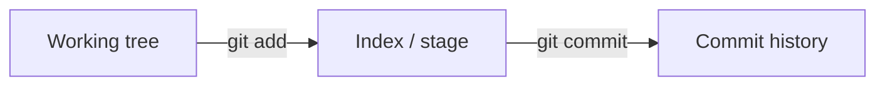

# Month 1 · Week 4 · Day 1
# Git: Repository, Commit, Diff, Log, gitignore

**Month index:** [../../README.md](../../README.md)  
**Week 4:** Day 1 (today) · [2](day-02.md) · [3](day-03.md) · [4](day-04.md) · [5](day-05.md) · [6](day-06.md) · [7](day-07.md)  
**Week rhythm today:** Learn + small exercises  
**Study time:** 3–4 focused hours

You have used `init`, `add`, `commit` since Week 1. Today you learn what those commands **are**, plus `diff`, `log`, and `.gitignore` — the Week 4 Git list except remotes (Day 2).

---

## How to read this chapter

This file is the Git model. Type every command in `~\fullstack-lab`. Do not nest a second `git init` inside it except where a lab says to use a throwaway folder **outside** the lab.



`git status` compares those three places. `git diff` is unstaged; `git diff --staged` is the next commit. Remotes, `push`, and `pull` are [Day 2](day-02.md).

**Wrong belief:** “Git is GitHub.”  
**Correct:** Git is the local history tool. GitHub is a host you will add tomorrow.

---

## Today's contract

1. Explain a **repository**, the **working tree**, the **index (staging area)**, and a **commit**.
2. Read `git status`, `git diff`, `git diff --staged`, `git log`.
3. Write a `.gitignore` that is intentional, not cargo-cult.
4. Recover from the beginner mistakes: forgot to add, committed the wrong file, need to see what changed.

**Today's gate**

> Git is a local history of snapshots. `add` chooses what goes into the next snapshot. `commit` records it. `diff` shows unrecorded changes. The remote is not required for Git to exist — it is Day 2.

---

## Time box

| Block | Minutes | Work |
|---|---|---|
| A | 45 | Theory |
| B | 55 | Guided Git lab (use a throwaway clone inside lab) |
| C | 70 | Practice on fullstack-lab with discipline |
| D | 30 | gitignore audit |
| E | 15 | Recall |

---

# Block A — Theory

## 1. Why Git exists

Without Git: `project-final-FINAL-v2.zip`. You cannot answer “what changed?” or “when did we break tests?”

Git stores **commits**: snapshots of files plus metadata (author, time, message, parent commit). History is a chain (later: a graph with branches — Month 4).

Git is **distributed**: every clone has the full history. GitHub is a **host** for remotes, not Git itself.

---

## 2. Three places (memorize)

```
Working tree     Index (stage)     Last commit
(files you edit) (next snapshot)   (history)
```

| You do | Git area |
|---|---|
| Edit `README.md` in the editor | Working tree changes |
| `git add README.md` | Index matches that file |
| `git commit` | New commit from the index; HEAD moves |

`git status` tells you which area each file is in. Read it **every time** before `add` or `commit`.

**Wrong belief:** “`git commit` saves whatever I have open in the editor.”  
**Correct:** `commit` records the **index**. Unstaged and untracked files stay out until `git add`.

Typical lines, in plain language:

- `On branch main` — you are recording history on the branch named `main`.
- `No commits yet` — `init` happened; `commit` has not.
- `Untracked files` — files on disk that Git has never been asked to snapshot. They will **not** go into the next commit until `git add`.
- `Changes not staged for commit` — Git already tracks this file; the working tree differs from the index. `git add` to include the new bytes.
- `Changes to be committed` — the index has bytes that are not in the last commit yet. `git commit` will record them.
- `nothing to commit, working tree clean` — working tree, index, and last commit match.

**HEAD** is the name Git uses for “the commit you are on now” (usually the tip of the current branch). You do not type hashes this month. When a command says `HEAD`, think “the latest commit on this branch.”

---

## 3. Anatomy of a commit

A commit has:

- a **hash** (SHA-1/SHA-256 id) — unique id of that snapshot
- **parent** pointer(s)
- **author**, date
- **message**
- a tree of files

You almost never type hashes by hand this month. `git log --oneline` is enough.

Good messages (roadmap: useful commit messages start now, deepen Month 4):

- Imperative: `Add PATH diagnostic to inspector`
- One logical change when you can
- Not: `update`, `fix`, `asdf`

---

## 4. `diff` — what changed

A **diff** is a line-by-line comparison.

| Command | Meaning |
|---|---|
| `git diff` | Working tree vs index (unstaged edits) |
| `git diff --staged` | Index vs last commit (exactly what the next commit will contain) |
| `git diff HEAD` | Working tree vs last commit (staged + unstaged together) |

How to read the output:

- A header names the file (`--- a/README.md` old, `+++ b/README.md` new).
- `@@` marks a **hunk**: a region of the file that changed, with nearby line numbers.
- A line starting with `-` was removed (red in most tools).
- A line starting with `+` was added (green).
- A line starting with a space is context: unchanged, shown so you can see where you are.

If `git diff` is empty but `git status` still shows a change, the change is probably **staged**. Look at `git diff --staged`.

This is how you review **yourself** before commit — the seed of code review. If you cannot explain a `+` line, do not commit it.

---

## 5. `log`

```powershell
git log
git log --oneline
git log --oneline -5
git log --stat
```

- `git log` — full view: hash, author, date, message. The pager (`less` style) may fill the screen. Press **space** to page down, **q** to quit. That is not a crash.
- `--oneline` — one line per commit: short hash + message. Use this daily.
- `-5` — only the newest five commits.
- `--stat` — which files changed in each commit, with a rough insert/delete count.

Newest commits appear **first**. The parent of a commit is the one below it in this default view.

---

## 6. `.gitignore`

A file listing **patterns** Git should treat as untracked even if they exist on disk.

Git still **sees** the files in the working tree. Ignore only means: do not nag in `status`, do not add them with `git add .`.

Why ignore:

- generated files (`machine-report.txt`) — they can be rebuilt
- OS junk (`Thumbs.db`, `.DS_Store`)
- secrets (`.env`) — **even if the file does not exist yet**, list it so a future you cannot add it casually
- dependencies (`node_modules/` — Month 5) — huge and reinstallable

How patterns work (complete enough for this month):

| Pattern | Meaning |
|---|---|
| `*.log` | any file ending in `.log` in any folder |
| `week-01/machine-report.txt` | that path from the repo root |
| `temp/` | a directory named `temp` and its contents |
| `.env` | a file named `.env` |
| `.env.*` | `.env.local`, `.env.production`, … |
| `!keep-me.txt` | exception: do **not** ignore this one (optional; you may skip `!` this month) |

Rules that bite:

- `.gitignore` itself **should be committed**. It is shared policy.
- Patterns apply to **untracked** files. If you already committed a secret, adding it to `.gitignore` does **not** remove it from old commits. Prevention is the skill today.
- Do not ignore `*.md` globally — you would hide your notes and README.

**Wrong belief:** “I added `.env` to `.gitignore` after committing it, so the secret is gone.”  
**Correct:** ignore only affects **untracked** files. History still has the blob. Prevention is the skill today.

---

## 7. `git restore` and unstaging (complete)

- `git restore --staged README.md` — copy from last commit into the **index**, so the file is no longer staged. The working tree (your editor) still has the edits.
- `git restore README.md` — throw away **working tree** edits and make the file match the index (destructive to unsaved intent). Do not use this unless you mean to discard.
- Old Git: `git reset HEAD README.md` unstages, similar to `restore --staged`.

This month: unstage with `--staged`. Do not discard work unless the scratch was intentional.

---

## 8. What we will not do today

- `rebase`, `bisect`, merge conflicts — later
- `push` — Day 2
- `commit --amend` of old pushed history — not this month’s habit

---

# Block B — Guided lab

Work in `~\fullstack-lab`. Do not `git init` a second repo inside it.

### Lab 1 — Status literacy

```powershell
cd ~\fullstack-lab
git status
git log --oneline -10
```

**Write:** how many commits? What is the latest message?

### Lab 2 — A deliberate unstaged change

```powershell
Add-Content -Path README.md -Value "`n<!-- git-day1-scratch -->"
git status
git diff
```

**Write:** is `README.md` staged or not? What does the diff show?

### Lab 3 — Stage, inspect, unstage

```powershell
git add README.md
git status
git diff
git diff --staged
```

Now `git diff` may be empty (all changes staged). `--staged` still shows the scratch comment.

Unstage (does not destroy the file edit):

```powershell
git restore --staged README.md
```

If `git restore` is missing (very old Git):

```powershell
git reset HEAD README.md
```

**Write:** after unstage, `git status` again.

Remove the scratch comment in the editor. `git status` should go clean. Do not commit junk.

### Lab 4 — Throwaway file and ignore

```powershell
Set-Content -Path week-04-scratch.tmp -Value "ignore me"
git status
```

Add to `.gitignore`:

```
*.tmp
```

```powershell
git status
```

`week-04-scratch.tmp` should disappear from untracked. Then:

```powershell
git add .gitignore
git diff --staged
git commit -m "Ignore temporary .tmp files."
```

Delete the `.tmp` file so it does not clutter:

```powershell
Remove-Item week-04-scratch.tmp
```

### Lab 5 — Confirm you can explain without a man page

You already have the explanations in Block A. Do **not** open `git help` to learn. In `week-04/git-notes.md` write, from this chapter:

1. What `git status` is comparing (three places).
2. How to tell a staged change from an unstaged one using `diff` vs `diff --staged`.
3. What a `+` line in a diff means.
4. Why `.gitignore` is committed and `.env` is listed before the file exists.

If a sentence is missing, re-read Block A of **this file**, not git-scm.com.

---

# Block C — Independent discipline on the real repo

1. `week-04/git-notes.md` — explain working tree / index / commit in your words with a tiny diagram.
2. Make a **real** one-line improvement to `week-03/README.md` (clarity). `git diff`, then `git add -p` if you have it (`-p` is patch staging — if it is interactive and awkward on Windows, skip and `git add` the file). Commit: `Clarify Week 3 README.`
3. Run `git log --oneline` and confirm the ignore commit and this commit both exist.

---

# Block D — gitignore audit

Read `.gitignore`. List in `week-04/gitignore-audit.md`:

- each line and **why**
- generated reports still ignored?
- anything that looks like it might hide source you **want** tracked? (do not ignore `*.md` globally)

If `.env` is not listed, add it **now** as prevention:

```
.env
.env.*
```

Commit: `Ignore environment files so secrets cannot be added casually.`

---

# Block E — Recall

1. Three areas of Git.
2. `diff` vs `diff --staged`.
3. Why ignore secrets **before** they are committed.
4. Git vs GitHub.

---

## Definition of done

- [ ] I can name the three areas (working tree, index, last commit) without notes
- [ ] I can tell staged from unstaged using `git diff` vs `git diff --staged`
- [ ] I can read a `+` / `-` hunk
- [ ] `.gitignore` lists `.env` and is itself committed
- [ ] I did not `git init` inside an existing repo

---

## Optional review links

Use only after this chapter is already clear.

- [Pro Git book, chapters 1–2](https://git-scm.com/book/en/v2)
- [gitignore](https://git-scm.com/docs/gitignore)
- [git-diff](https://git-scm.com/docs/git-diff)

---

## Tomorrow

Remotes, GitHub, `push`, `pull`. Create a GitHub account if you do not have one. You will **push `fullstack-lab`**. Make sure no secrets are in `git log -p` (spot-check).
