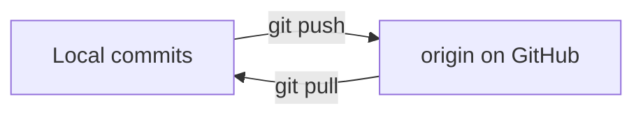
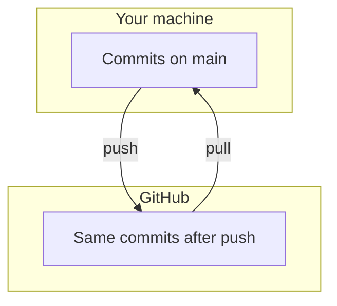

# Month 1 · Week 4 · Day 2
# Remotes, GitHub, Push, Pull — and Debugging Git

**Program:** Full-Stack Mastery · 18 months  
**Phase:** 1 — Foundations  
**Month index:** [../../README.md](../../README.md)  
**Week 4:** [1](day-01.md) · Day 2 (today) · [3](day-03.md) · [4](day-04.md) · [5](day-05.md) · [6](day-06.md) · [7](day-07.md)  
**Week rhythm today:** Exercises + debugging  
**Study time:** 3–4 focused hours

The Month 1 gate: **create and push a Git repository**. Today is that skill.

---

## How to read this chapter

Day 1 made Git local (working tree, index, commit, diff, log, gitignore). Today adds a **remote**: a named URL you can push to and pull from. Type every command. Do not force-push.



**Wrong belief:** “Until I push, I do not have Git.”  
**Correct:** you have had Git since `git init`. Push copies commits to a host.

Audit for secrets **before** the first push. A private repo is not an excuse for committed passwords.

---

## Today's contract

1. Explain **remote**, `origin`, `push`, `pull`.
2. Create a GitHub repository (empty, no README if you already have local history).
3. `git remote add` + `git push -u origin` your branch.
4. Debug: rejected push, auth failure, “unrelated histories,” accidental extra README on GitHub.

**Today's gate**

> A clone on GitHub matches my local `fullstack-lab` history. I can explain every command I used. The repo is public **or** private by my choice, and it contains no secrets.

---

## Time box

| Block | Minutes | Work |
|---|---|---|
| A | 35 | Theory |
| B | 70 | GitHub + first push |
| C | 50 | Pull / second machine simulation |
| D | 30 | Debug catalog |
| E | 15 | Verify on the website |

---

# Block A — Theory

## 1. Remote

A **remote** is a named URL Git can fetch from and push to.

Default name: `origin`.

```powershell
git remote -v
```

Empty until you add one.

HTTPS example:

```
https://github.com/YOUR_USER/fullstack-lab.git
```

SSH example:

```
git@github.com:YOUR_USER/fullstack-lab.git
```

Either is fine. Git for Windows + GitHub.com typically uses **HTTPS + Git Credential Manager** (a login popup / browser). SSH needs a key pair (optional stretch).

The URL is not a password. Putting `https://github.com/you/fullstack-lab.git` in `REMOTE.md` is fine. Putting a personal access token in that file is a leak.

## 2. Push vs pull

| Command | Direction |
|---|---|
| `git push` | Send your commits **to** the remote |
| `git pull` | Fetch commits **from** the remote and merge them into your current branch |

`git pull` = `git fetch` + merge (by default). Fetch downloads; merge integrates. Month 4 will deepen merge vs rebase. Today: pull means “update me from GitHub.”



Push does **not** send uncommitted files. If `git status` is dirty, those edits stay local until you commit (or you lose them by mistake). Status first, then push.

## 3. Branch name

Newer Git: default branch `main`. Older: `master`.

```powershell
git branch
git status
```

When pushing the first time:

```powershell
git push -u origin main
```

`-u` sets **upstream** so later `git push` / `git pull` know where.

If your branch is `master`, use `master` consistently or rename:

```powershell
git branch -M main
```

Do this **before** the first push if you want `main`.

## 4. GitHub vs Git

GitHub is a company product: hosting, PRs, issues, Actions (Month 16).  
Git is the tool.

You can use GitLab or elsewhere later. The commands stay the same; the URL changes.

**Wrong belief:** “I signed up for GitHub, so I know Git.”  
**Correct:** GitHub stores copies of Git repositories. `status`, `diff`, and `commit` still happen on your machine.

## 5. Authentication (complete explanation)

GitHub will not accept your **account password** as the password for `git push` over HTTPS. That is a platform rule to stop leaked passwords from being reused in Git.

Three honest methods:

**A. Git Credential Manager (recommended on Windows with Git for Windows)**  
When you `git push`, a browser or a small window asks you to sign in to GitHub. After success, GCM stores a credential in Windows. Later pushes reuse it. You are not putting a token in a file in the repo. If the popup never appears, Git may be using a different credential helper — run `git config --show-origin --get credential.helper` and you should see `manager` or `manager-core`.

**B. Personal access token (PAT)**  
GitHub lets you create a token (a long random string) with limited permission (`repo`). When Git asks for a password, you paste the **token**, not your GitHub password. Treat the token like a password: never commit it, never put it in `REMOTE.md`, never paste it into chat. If it leaks, revoke it on GitHub and make a new one.

**C. SSH keys**  
You generate a key pair on your machine. The **public** half goes to GitHub. The **private** half stays in your user folder and is never committed. Remotes look like `git@github.com:USER/REPO.git`. Optional this month. If HTTPS + GCM works, you are done.

Never put a token in this repository. Never screenshot a token.

## 6. Public vs private

- **Private:** only you (and people you invite). Fine for a lab.
- **Public:** anyone can read. Must have **zero secrets**, and you accept that notes are visible.

Month 1 lab: **private is reasonable**. Public is OK if you audited. The gate is **push**, not “must be public.”

Private does not hide history from future you making it public, from a screenshot, or from a collaborator. Ignore `.env` **before** it is added. Day 1 already said: gitignore after the fact does not erase old commits.

---

# Block B — First push (guided)

### B1 — Audit before the network

```powershell
cd ~\fullstack-lab
git status
git log --oneline
```

Search for secrets:

```powershell
git grep -i "token" 
git grep -i "password"
git grep -i "secret"
```

False positives are OK. Real tokens are not. If you find a real secret, **stop**. Remove the file, add gitignore, and do **not** push until history is clean. If it was already committed, ask a human/docs about rotating the secret; do not push.

### B2 — Account and empty repo

1. Create a GitHub account if needed: https://github.com/signup  
2. New repository: **do not** add README, `.gitignore`, or license if your local repo already has commits (avoids unrelated histories).
3. Copy the HTTPS URL.

“Empty” means GitHub has **no** first commit. If the website already shows a README you did not write, you are on the unrelated-histories path (debug D).

### B3 — Connect and push

```powershell
cd ~\fullstack-lab
git branch -M main
git remote add origin https://github.com/YOUR_USER/YOUR_REPO.git
git remote -v
git push -u origin main
```

Replace the URL. Sign in when asked.

If `remote origin already exists`:

```powershell
git remote remove origin
```

Then add again. Only do this if the old origin is wrong.

### B4 — Confirm

Open the GitHub URL in the browser. Files should match. Commits should match `git log --oneline`.

Write `week-04/REMOTE.md`:

- repo URL (the `https://github.com/...` is not a secret)
- branch name
- public or private
- date of first push

---

# Block C — Pull (simulate)

Make a **trivial** change **on GitHub** in the web UI: edit `REMOTE.md` or README — add a line `Edited on GitHub to practice pull.` Commit on the website.

Then locally:

```powershell
git status
git pull
```

You should see the line. This is `pull`.

If you also had local uncommitted changes on the same lines, you would get a **conflict**. Avoid that today: keep the web edit tiny and pull before you edit the same file locally.

**Wrong belief:** “Pull downloads files like a zip.”  
**Correct:** pull fetches **commits** and integrates them into your branch. Your working tree updates to match that history (when clean).

---

# Block D — Debug catalog

`week-04/git-debug.md` — write cause + fix **in your words**:

**A.** `failed to push some refs` / remote has work you do not  
→ `git pull` then push (or fetch and merge). Do not `--force` this month.

**B.** `Authentication failed`  
→ credentials; PAT; GCM; wrong account.

**C.** `remote origin already exists`  
→ `git remote -v` then remove/add.

**D.** GitHub created a README and you have local commits: unrelated histories  
→ empty GitHub repo is the prevention. If it already happened, GitHub docs on pulling unrelated histories — last resort; messy. Prefer delete GitHub repo (if new and empty of unique work) and recreate empty.

**E.** `error: src refspec main does not match any`  
→ you have no commits, or branch is not named `main`. `git status`, `git log`, `git branch`.

**Do not** use `git push --force` to GitHub `main` this month.

Force-push rewrites published history. Anyone (including future you on another folder) who cloned the old history is punished. Month 4 will explain revert vs rebase. Today the rule is simple: **no force**.

---

# Block E

Visit the GitHub repo. Copy the commit list. Confirm it matches local.

```powershell
git add week-04 README.md .gitignore
git commit -m "Document GitHub remote and pull practice."
git push
```

If push works without `-u`, upstream was set. Good.

---

## Security

- Private repo still is not an excuse for committed passwords (leaks happen via clones, screenshots, later making it public).
- `.env` ignored.

---

## Definition of done

- [ ] `git remote -v` shows `origin` with a GitHub URL
- [ ] `git push` succeeded at least once
- [ ] GitHub commit list matches `git log --oneline`
- [ ] `REMOTE.md` exists (URL, not a token)
- [ ] `git-debug.md` has A–E in my words
- [ ] I did not `git push --force`

---

## Optional review links

Remotes, push, pull, and GitHub authentication are explained in this chapter. These pages are for later checking, not for first learning.

- [GitHub: adding a local repository to GitHub](https://docs.github.com/en/migrations/importing-source-code/using-the-command-line-to-import-source-code/adding-locally-hosted-code-to-github)
- [git-remote](https://git-scm.com/docs/git-remote)
- [git-push](https://git-scm.com/docs/git-push)
- [git-pull](https://git-scm.com/docs/git-pull)

---

## Tomorrow

From memory: explain Git’s three areas; on a **new empty folder**, init → commit → (describe) push steps. Architecture starts Day 4; Day 3 is Git from memory.
