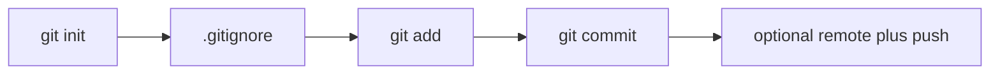
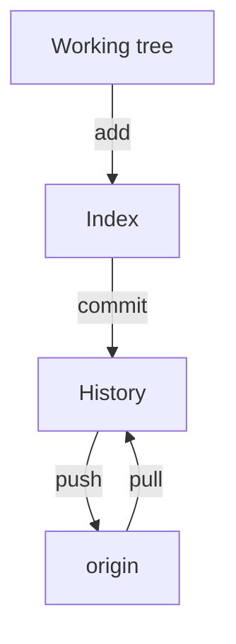

# Month 1 · Week 4 · Day 3
# Git From Memory

**Program:** Full-Stack Mastery · 18 months  
**Phase:** 1 — Foundations  
**Month index:** [../../README.md](../../README.md)  
**Week 4:** [1](day-01.md) · [2](day-02.md) · Day 3 (today) · [4](day-04.md) · [5](day-05.md) · [6](day-06.md) · [7](day-07.md)  
**Week rhythm today:** Implement from memory  
**Study time:** 3–4 focused hours  
**Days 1–2 of this week:** closed during the drills. If you forget a fact, re-open **this recap first**, then those day files in this textbook. Do not use `git help` or git-scm as the teacher.

---

## How to use this textbook

This is not a video transcript and not a tutorial to skim.

1. Read the complete explanation. Close it. Say each Git area in a full sentence.
2. Type every command in the throwaway repo. Do not paste Day 1’s lab.
3. The throwaway repo lives **outside** `fullstack-lab` so you do not nest repositories.
4. Read `git status` before every `git add`.
5. Optional review links at the end are for later rechecking — not for first learning.

---

## How to read this chapter

Days 1–2 stay closed while you type. This recap **is** the Git lesson you may look at. The throwaway repo lives **outside** `fullstack-lab` so you do not nest repositories.



> **Wrong belief:** “I will `git init` inside `fullstack-lab` again to practice.”  
> **Correct:** that creates a nested repo and breaks the lab. Use `$HOME\git-memory-lab`.

> **Wrong belief:** “`git add .` is always safe.”  
> **Correct:** it stages everything not ignored. `git status` first. `.env` must already be ignored.

> **Wrong belief:** “Force-push is how you fix a rejected push.”  
> **Correct:** rejected usually means the remote has commits you do not. Pull, then push. Force rewrites published history.

Stuck 25 minutes: open Day 1 or Day 2 in this book only. Record lookups.

---

## Complete explanation (Git + remote)

This recap is enough to relearn Week 4 Days 1–2. The throwaway repo is the exam.

### Why Git exists

Without Git: `project-final-FINAL-v2.zip`. You cannot answer “what changed?” or “when did we break tests?” Git stores **commits**: snapshots of files plus metadata (author, time, message, parent). History is a chain. Git is **distributed**: every clone has the full history. **GitHub** is a **host** for remotes, not Git itself.

### Three places (memorize)

**Working tree** — files you edit. **Index / stage** — what `git add` chose for the next snapshot. **Commits** — history. `HEAD` is the current commit.

```
Working tree     Index (stage)     Last commit
(files you edit) (next snapshot)   (history)
```

| You do | Git area |
|---|---|
| Edit `README.md` in the editor | Working tree changes |
| `git add README.md` | Index matches that file |
| `git commit` | New commit from the index; HEAD moves |

**`git status`** compares the three. Untracked / modified / staged / clean. Read it **every time** before `add` or `commit`.

**`git diff`** unstaged (working tree vs index). **`git diff --staged`** what the next commit will be (index vs last commit). `-` removed, `+` added. A diff is not a commit. It is a preview.

**`git log --oneline`** newest first. A commit is a snapshot plus metadata (message, parent, author). You do not need to memorize hashes this month. You do need two commits in the throwaway log so history is a chain, not a single dump.

### gitignore

**`.gitignore`** patterns (`*.log`, `.env`) keep files untracked. Commit the ignore file. Ignoring after a secret was committed does not erase history. `git check-ignore -v path` prints **why** a path is ignored. If it prints nothing, the file is **not** ignored.

`waste.log` in today’s lab should be ignored by `*.log`. It should not appear in `git status` as a file you must add. If it appears, the ignore file is missing, in the wrong directory, or was added after Git already tracked the log — today you create ignore **before** the log, or at least before `git add`.

### Remote, push, pull

**Remote** is a named URL (`origin`). **`git push`** sends commits to it. **`git pull`** fetches and integrates. **`-u`** sets upstream so later push/pull know the branch.

**Git** is the tool. **GitHub** is a host. HTTPS remotes look like `https://github.com/USER/REPO.git`. GitHub sign-in for push is Credential Manager or a PAT — never the account password, never a token in the repo.

**`git branch -M main`** renames the current branch to `main`. First push: `git push -u origin main`.

If the remote already has a commit you lack, push is rejected. **`git pull` then push**. Do not `git push --force` this month. Force rewrites published history others may have cloned.

Empty GitHub repo (no extra README) if you already have local commits — avoids unrelated histories. If GitHub added a README you did not have locally, histories diverged at the first commit. Pull (or clone fresh) — do not force.



### PATH still matters

If `git` is not recognized, that is Week 1: PATH, reopen the terminal, `Get-Command git`. It is not a GitHub problem. It is not “reinstall Windows.”

Office hours. A student `git init`s inside `fullstack-lab\week-04` to “practice.” Now there are two repositories. Commands in the inner folder do not see the lab history. Delete the inner `.git` only if you are sure you created it today and have no unique commits there — or ask before destroying history. Today: practice in `$HOME\git-memory-lab`.

A student `git add .` and stages a `.env` they created to try secrets. `.gitignore` must list `.env` **before** add. If it was committed, assume leaked; do not push; rotate later when you have real secrets. This month there should be no real secrets.

A student gets “rejected — remote contains work you do not have” after editing README on GitHub. The remote is ahead. `git pull` then `git push`. Force-push would drop the GitHub commit from the branch you publish.

### How to read `git status` (you will do this ten times today)

Typical lines, in engineer language:

- **Untracked files** — Git sees a name that is not in any commit and not ignored. `git add` if you want it in history. Put it in `.gitignore` if it is a log, a report, or a secret.
- **Changes not staged for commit** — the working tree differs from the index. `git diff` shows that. `git add` copies the file into the index.
- **Changes to be committed** — the index differs from `HEAD`. `git diff --staged` shows the next snapshot. `git commit` records it.
- **working tree clean** — the three places agree for tracked files. Untracked ignored files may still exist on disk (`waste.log`).

Worked two-commit story for `git-memory-lab`. First commit: `README.md`, `notes.txt`, `.gitignore`. Second commit: only the change to `notes.txt`. `git log --oneline` then shows two lines, newest first. If you see one commit, you skipped the second save-add-commit. If you see `waste.log` in the first commit, ignore failed — the log became history. Do not force-rewrite this month; note it and do not do that in `fullstack-lab`.

What `git remote -v` should look like when Day 2 is done, on `fullstack-lab`: two lines (fetch and push) named `origin`, URL `https://github.com/YOUR_USER/fullstack-lab.git` or SSH equivalent. Empty output means no remote. A URL that contains a PAT is a leak — remove it, rotate the token, use Credential Manager.

Unrelated histories, in one paragraph. GitHub’s “create repository” checkbox that adds a README creates a first commit on the host. Your local `git init` plus commits is a different first commit. Push is rejected. Empty GitHub repo (no README, no `.gitignore` on the website) if you already have local commits. That is Day 2, restated so today’s optional push does not surprise you.

---

## Today's contract

I can take a folder of files to a GitHub repo without a tutorial, and I can read status/diff/log.

**Today's gate**

> `git-memory-lab` has two local commits, `*.log` is ignored, and I can still `git push` `fullstack-lab`.

---

## Time box

| Block | Minutes | Work |
|---|---|---|
| A | 15 | Oral Git |
| B | 70 | Throwaway local repo |
| C | 30 | fullstack-lab fluency |
| D | 40 | Debugging from memory + commit/push |

---

# Block A — Oral Git (5 min)

Working tree, index, commit, remote, push, pull, gitignore — from the complete explanation.

Speak for five minutes. If `origin` and “GitHub” come out as the same word, say the pair again: Git is the tool; GitHub is a host. If you cannot tell `git diff` from `git diff --staged`, say: unstaged vs what the next commit will contain.

---

# Block B — Throwaway local repo (required)

**Outside** `fullstack-lab` (do not nest repos):

```powershell
cd $HOME
mkdir git-memory-lab
cd git-memory-lab
```

From memory, using only the explanation above:

1. `git init`
2. Create `README.md` and `notes.txt`
3. `.gitignore` with `*.log`
4. Create `waste.log` — confirm it does not appear as something you must add
5. `add` + `commit`
6. Change `notes.txt`, `status`, `diff`, commit again
7. `git log --oneline`

Typed spine (you still type it; this is the order, not a paste-to-submit without thinking):

```powershell
git init
git branch -M main
Set-Content README.md "Git memory lab"
Set-Content notes.txt "first notes"
Set-Content .gitignore "*.log"
Set-Content waste.log "this should be ignored"
git status
git add README.md notes.txt .gitignore
git status
git commit -m "Initial files and gitignore for memory lab."
Set-Content notes.txt "first notes`nsecond line"
git diff
git add notes.txt
git diff --staged
git commit -m "Add a second line to notes."
git log --oneline
```

Write `~\fullstack-lab\week-04\memory-git.md` describing every command.

You should see **two** commits in the log. `waste.log` should stay untracked (ignored), not appear in `git status` as a file you must add. If `waste.log` is listed, `*.log` did not apply — is `.gitignore` in `git-memory-lab`, committed or at least present, and spelled with the asterisk?

Optional: empty GitHub repo, `git remote add origin URL`, `git push -u origin main`. Put the GitHub URL (not a token) in `memory-git.md`.

If you push the throwaway repo, it can be private. Still no secrets — there should be none.

`memory-git.md` should name commands in order and say what you **saw**, not what you hoped. Example shape (your paths and hashes will differ): `git init` created a `.git` directory; `git status` showed untracked `README.md` and `notes.txt`; after writing `.gitignore`, `waste.log` did not appear as something to add; first commit recorded the three files; `git diff` after editing `notes.txt` showed a `+` line; second commit recorded only that change; `git log --oneline` listed two commits, newest first.

If `git init` warned you are already in a repository, you nested inside `fullstack-lab`. `cd $HOME` first. Nested repos make `fullstack-lab` ignore the inner files as a gitlink. That is a mess. Do not practice init in the lab folder.

Commit messages in the throwaway repo: say why. “Initial files and gitignore for memory lab.” is better than `update`. The lab repo’s Day 3 commit message is specified below. Use that exact string for `fullstack-lab`.

# Block C — fullstack-lab fluency

```powershell
cd ~\fullstack-lab
git status
git remote -v
git log -3
git diff
```

If dirty, explain each file: commit or discard on purpose.

This is the gate repo. Do not `git init` here. If `origin` is missing, Day 2 is unfinished — add the remote and push before you leave today. If `git` is not recognized, Week 1 PATH — `Get-Command git`, reopen the terminal.

Dirty tree discipline: generated reports (`machine-report.txt`) should already be ignored. A half-edited `architecture.md` from peeking at Day 4 does not belong in today’s memory commit. `memory-git.md` and `memory-debug.md` do. `git status` is how you know. `git add week-04` is broad — look at the list before you commit.

If `git push` of `fullstack-lab` is rejected, do not open a blog. Read the error. Remote ahead → `git pull` then push. Unrelated histories → you created a README on GitHub that local does not have; Day 2 already named that trap. Auth failure → Credential Manager or PAT, never a password in the repo. Force is still forbidden.

# Block D — Debugging from memory

`week-04/memory-debug.md`:

1. Push rejected because GitHub is ahead. → pull then push.  
2. `git` not recognized. → PATH / reopen terminal (Week 1).  
3. `git pull` after a web edit on a clean repo. → fetch + merge of that commit.  
4. Why force-push is forbidden this month. → it rewrites published history others may have cloned.

Write full sentences. “Pull then push” without saying **why** the remote was ahead is incomplete. The remote was ahead because it has a commit your local branch does not — a GitHub README, a web edit, or a push from another clone.

```powershell
cd ~\fullstack-lab
git add week-04
git commit -m "Week 4 Day 3: Git from-memory lab notes."
git push
```

If push fails, debug with the explanation in this file. Read the error. If rejected, pull then push. Never force. Do not paste a PAT into `memory-debug.md`.

memory-debug.md full-sentence bar:

1. GitHub is ahead because it has a commit you lack (web README, web edit, other clone). `git pull` integrates that commit; then `git push`. Force would drop or rewrite what others may have.
2. `git` not recognized is PATH in **this** process. Reopen the terminal after install. `Get-Command git`. Not a GitHub outage.
3. A web edit on a clean repo becomes a commit on origin. Pull fetches and merges it into your branch. Status should be clean after a successful pull if you had no local edits. If you had local edits, you may need to finish a merge — still no force.
4. Force-push rewrites published history. A classmate who cloned the old history has a divergent repo. This month you do not have a reason that is worth that.

---

## Definition of done

- [ ] `git-memory-lab` has two commits locally
- [ ] ignore works for `*.log`
- [ ] memory notes written
- [ ] `fullstack-lab` still pushes

Nested-repo check before you leave: `git-memory-lab` is under `$HOME`, not under `fullstack-lab`. `fullstack-lab` still has one `.git` at its root. If you created `.git` inside `week-04`, stop and undo that init. This course has one lab history.

Two commits in the throwaway log means two snapshots, not `git commit`
run twice on the same index with nothing new. `git log --oneline` must
show different messages and a change to `notes.txt` in the second.

`git status` before every add. Untracked `waste.log` after `*.log` is
success — ignored files are allowed to exist. Tracked `waste.log` is
a failed ignore. Do not force-rewrite `fullstack-lab` to hide a mistake
in the throwaway repo. They are different histories.

`origin` is a name. GitHub is a host. Git is the tool. Say the three
apart in `memory-debug.md`.

Optional GitHub for the throwaway repo: empty remote, no extra README,
`git remote add origin URL`, `git push -u origin main`. Put the URL in
`memory-git.md`, never a token. Private is fine. `fullstack-lab` must
still push after this practice. Do not nest init.

`git diff` is unstaged. `git diff --staged` is the next commit.
If you cannot say which is which, speak Block A again.

`HEAD` is the current commit. The index is the next snapshot. The working
tree is what you edit. `git status` compares the three. Read it every time.

`.gitignore` is committed. `*.log` and `.env` are patterns. Ignoring after
a secret was committed does not erase history. Do not force-push to hide it.

`git push -u origin main` sets upstream once. Later `git push` is enough.
Rejected means pull then push. Never `--force` this month.
The throwaway repo is outside fullstack-lab. Do not nest `.git`.
`waste.log` stays ignored. Two local commits. Then fullstack-lab still pushes.
Write memory-git.md from commands you ran, not from a hoped-for log.
Optional remote on the throwaway repo is extra; fullstack-lab push is not.

---

## Optional review links

Repair from this chapter and Week 4 Days 1–2. These pages are for later checking, not for first learning.

- [Week 4 Day 1](day-01.md) — three areas, diff, log, gitignore
- [Week 4 Day 2](day-02.md) — remote, push, pull
- [Pro Git: Git Basics](https://git-scm.com/book/en/v2/Git-Basics-Recording-Changes-to-the-Repository)

---

## Tomorrow

Architecture: frontend, backend, API, database, authentication, authorization, web server, application server. You will draw the boxes. You will not build FastAPI today.
