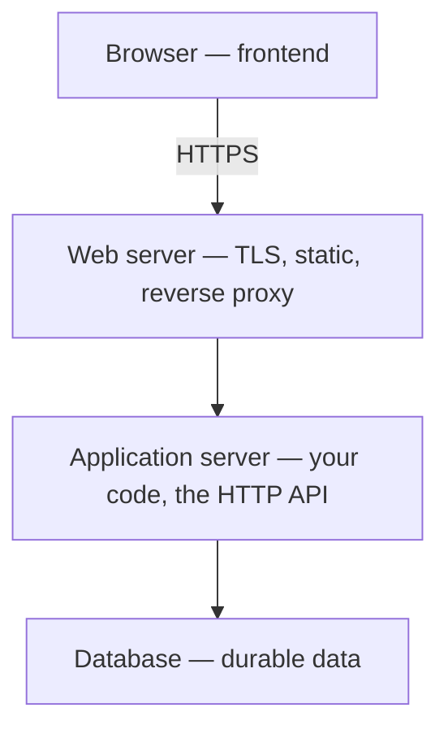
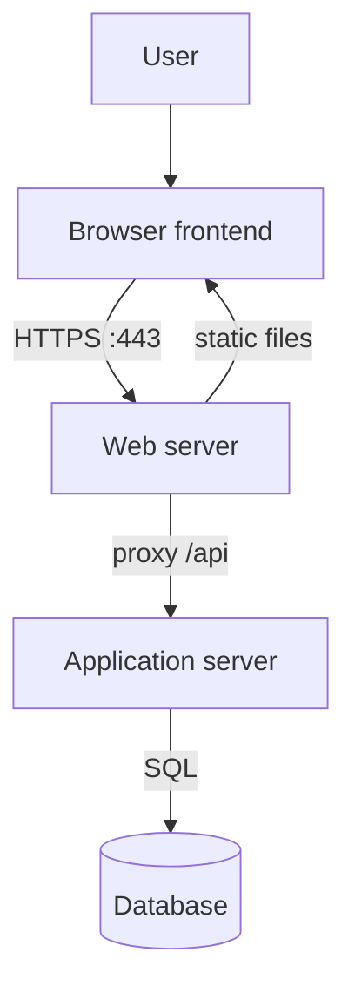

# Month 1 · Week 4 · Day 4
# Web Architecture: Frontend, Backend, API, Database, Auth, Servers

**Program:** Full-Stack Mastery · 18 months  
**Phase:** 1 — Foundations  
**Month index:** [../../README.md](../../README.md)  
**Week 4:** [1](day-01.md) · [2](day-02.md) · [3](day-03.md) · Day 4 (today) · [5](day-05.md) · [6](day-06.md) · [7](day-07.md)  
**Week rhythm today:** Add a real project feature  
**Study time:** 3–4 focused hours

The Month 1 gate: **draw a simple frontend / API / database architecture.**

The roadmap list: frontend, backend, API, database, authentication, authorization, web server, application server.

You will not build this stack today. You will **name every box** so Months 2–16 have a place to hang.

---

## How to read this chapter

This file is the architecture lecture. Read Block A as you would Day 1 of Week 1: close a section, say it, then draw. The lab is `architecture.md` in git — definitions, diagram, walkthrough, failure table.



**Wrong belief:** “The backend is the database.”  
**Correct:** the backend is code on a machine you control. The database is a **separate** process with files. The API is the **contract** on the backend, not a third computer by default.

---

## Today's contract

1. Define each architecture term in engineer language.
2. Draw the request path for a logged-in page: browser → web server → app → API logic → database.
3. Distinguish authentication vs authorization.
4. Store the diagram and a legend in `fullstack-lab` and push.

**Today's gate**

> I can point at each box and say what process it is, what data it stores, and what happens if it dies.

---

## Time box

| Block | Minutes | Work |
|---|---|---|
| A | 50 | Theory |
| B | 40 | Map this program’s future stack onto the boxes |
| C | 70 | Draw + write architecture.md (the feature) |
| D | 25 | Git push |
| E | 15 | Teach-back |

---

# Block A — Theory

## 1. Frontend

The **frontend** is the software that runs on the **user’s machine**, usually in the **browser**: HTML, CSS, JavaScript (later TypeScript, React).

It:

- renders UI
- captures input
- sends HTTP requests to a backend
- stores some state (memory, `localStorage` — later)

It is **not** trusted. Anyone can modify the JavaScript in DevTools. Security-critical rules belong on the server (Month 13).

Month 2–7 of this program are mostly frontend (then you keep it).

The frontend is still a **process** on the client computer (Week 1): CPU, RAM, files in the browser cache. When you “open a site,” you are running that process. It talks HTTP (Week 3) after DNS/TCP/TLS (Week 2).

**Wrong belief:** “Frontend means ‘the design.’”  
**Correct:** design is how it looks. Frontend is **which machine runs the UI code** — the user’s.

---

## 2. Backend

The **backend** is software that runs on a **server machine** you control (or a cloud provider). It:

- receives HTTP
- enforces rules
- talks to databases, email, files
- does not draw pixels (except if it returns HTML — still backend)

Month 8–11: Python, FastAPI, PostgreSQL.

**Full-stack** means you can work both sides and the contract between them.

“Backend” is a **role**, not a brand. FastAPI is one backend. A Python script that never speaks HTTP can still be backend-ish (a worker). This month, think: **server-side program that enforces rules**.

---

## 3. API

An **API** (Application Programming Interface) is the **contract**: URLs, methods, JSON shapes, status codes.

In this program “the API” usually means the **HTTP API** implemented by FastAPI. The React app is an API **client**. curl is also a client. PostgreSQL has a protocol too — a different API. Be precise: **HTTP API**.

The API is not a separate physical computer by default. It is the **surface** of the backend process.

Week 3 REST rules still apply: nouns, methods, honest statuses, `Content-Type`. The architecture diagram does not replace REST; it shows **where** that contract lives.

**Wrong belief:** “We added `/api` so we have an API.”  
**Correct:** `/api` is a path prefix. An API is the documented behavior: what GET `/projects` returns, what 401 means, what JSON fields exist.

---

## 4. Database

A **database** is a process (and files on disk) specialized for storing data with queries, durability, and concurrency.

This program’s system of record: **PostgreSQL** (Month 10–11). **Redis** is not the system of record; it is fast ephemeral/cache (Month 11). **MongoDB** only if the data model needs it.

If the API process dies, data in PostgreSQL **remains** (like Week 1: process vs files). If the disk is lost without backups, data is gone (Month 18 backups).

The frontend **should not** talk to the database directly from the browser. The browser would need database passwords. That would be a disaster. Path: frontend → HTTP API → database.

PostgreSQL listens on a **port** (often 5432) on a network the **application server** can reach — usually a private network, not the public internet. The public internet talks **HTTPS to the web server**, not raw PostgreSQL.

**Wrong belief:** “Saving in localStorage is my database.”  
**Correct:** localStorage is data on **one browser**. Another device, another user, a cleared cache — gone. The system of record is the database behind the API.

---

## 5. Authentication vs authorization

**Authentication (authn):** who are you? (login, passwords, sessions, tokens)

**Authorization (authz):** what may you do? (admin vs user; your order vs someone else’s)

HTTP shadow: **401** (not authenticated) vs **403** (not authorized).

You will implement this in Month 13. Today you must **not** mix the words.

Example: you are logged in as Ada (authenticated). You cannot delete another user’s project (not authorized).

Login is usually `POST` with a body (not a password in the query string — Week 3). Success may `Set-Cookie` a session. Later `GET`s send `Cookie`. The **application server** checks that cookie (authn) and then checks whether Ada may see project 9 (authz).

**Wrong belief:** “401 and 403 are both ‘access denied,’ so they are the same.”  
**Correct:** 401 means the server does not accept you as a known user yet. 403 means it does, and still says no.

---

## 6. Web server vs application server

These two get mixed constantly. Separate them.

**Web server** (examples: Nginx, Caddy, IIS, sometimes Caddy in front of Docker):

- accepts TCP 80/443
- TLS termination (HTTPS certificates) often happens here
- serves **static files** (HTML, CSS, JS bundles, images) efficiently
- **reverse proxy**: forwards API paths to the application process
- may load-balance (Month 17)

**Application server** (examples: Uvicorn/Gunicorn running FastAPI; Node running an app):

- runs **your code**
- knows routes, validation, business rules
- talks to PostgreSQL

In development, you often run **only** the application server (`uvicorn` on 8000, Vite on 5173) and hit it directly. In production (Month 15–16), a web server or platform sits in front: HTTPS, static files, proxy to Uvicorn.

```
Internet
   → Web server (TLS, static, proxy)
        → Application server (FastAPI)
             → Database
```

Vite/React in production is often **built into static files** that the web server hosts; the API remains the application server.

**Wrong belief:** “Nginx is my API.”  
**Correct:** Nginx forwards `/api` to FastAPI; FastAPI **is** the API.

**Reverse proxy (beginner):** the browser talks only to the web server (one host, one certificate). The web server **forwards** some paths to another process on localhost or a private network. The user never types `:8000`. That is production hygiene and TLS in one place.

---

## 7. One picture (the one you must be able to draw)

```
[Browser]
  frontend: HTML/CSS/JS (React later)
     |  HTTPS
     v
[Web server]  ← TLS, static files, reverse proxy
     |
     +-- static: JS/CSS/images
     |
     v
[Application server]  ← FastAPI (your backend code)
     |                    authentication & authorization live here
     v
[Database]  ← PostgreSQL files + process
```



Redis, queues, email: extra boxes **when a problem needs them** (roadmap Rule 6). Do not draw Kubernetes.

---

## 8. Where Week 1–3 sit

- Browser is a **process** on the client computer (CPU/RAM).
- FastAPI is a **process** on the server (listening on a **port**).
- PostgreSQL is another **process** (port 5432).
- HTTP is the **language** on the connection after DNS/TCP/TLS.

Architecture is those processes plus **responsibilities**.

If the application server dies, TCP to its port is **connection refused** (Week 2) — or the web server returns **502** (it is up; the upstream app is not). If DNS dies, you never reach the web server. If only the database dies, the app may return **500** or 503: HTTP ran; the query did not.

---

## 9. What each box stores (so “if it dies” is not mush)

| Box | Runs where | Stores |
|---|---|---|
| Frontend JS | User’s browser | UI state in RAM; maybe localStorage |
| Web server | Your server / cloud edge | Certificates, static files, proxy config — not the user table |
| Application server | Your server | Code, in-memory request state; **not** the system of record |
| Database | Your server | Tables/files that survive the API process restart |

Cookies that represent a login are **credentials on the client**, set by the application (via `Set-Cookie` on the HTTP response), often with `HttpOnly` so JS cannot read them. Still do not commit them.

---

# Block B — Map the 18-month stack

In notes, assign each primary technology from the roadmap header to a box:

HTML, CSS, JavaScript, TypeScript, React, React Router, TanStack Query, Python, FastAPI, PostgreSQL, SQLAlchemy, Alembic, Redis, Docker, Linux, Git/GitHub, GitHub Actions, AWS

Example: React → frontend; FastAPI → application server; PostgreSQL → database; GitHub Actions → CI (not in today’s diagram — Month 16); Docker → packaging processes (Month 15).

You do not need perfect AWS mapping yet (load balancer ≈ web server role). Honest “I will learn this in Month 16” is better than a fake box.

SQLAlchemy talks to PostgreSQL **from the application server**. Alembic migrates the database schema — still not the frontend. TanStack Query is a frontend library that **calls** the HTTP API. Redis, if you add it later, sits beside the app as cache or session store — optional today.

---

# Block C — The lab feature

Create `week-04/architecture.md` containing:

1. Definitions: all eight terms (frontend, backend, API, database, authentication, authorization, web server, application server).
2. ASCII or Mermaid diagram of the picture above.
3. Walkthrough: “User logs in and loads their project list” in 8–12 numbered steps (DNS included from Week 2; HTTP POST login; session cookie; GET /projects; SQL query; JSON; React render). You have not learned React — say “frontend JS” if you want. The **sequence** matters.
4. Failure table:

| If this dies | User sees |
|---|---|
| DNS | |
| Web server | |
| Application server | |
| Database | |
| Frontend JS has a bug | |

5. Security: why the database password is never in the React app; HTTPS on the web server; authn vs authz.

This file **is** the Week 4 project feature.

Optional: `architecture.png` if you draw on paper and photograph. Keep it readable.

Suggested walkthrough spine (write **your** sentences): type URL → DNS → TCP 443 → TLS → GET static frontend → POST `/login` JSON → app checks password hash in DB → `Set-Cookie` → GET `/projects` with Cookie → app authorizes → SQL → JSON array → frontend renders. Name 401 if the cookie is missing. Name 403 if the cookie is valid but the list is not theirs.

---

# Block D

```powershell
cd ~\fullstack-lab
git add week-04/architecture.md
git commit -m "Add frontend-API-database architecture writeup."
git push
```

Update root README with a link to the architecture doc.

---

# Block E

90 seconds: explain the diagram to a camera or a wall. If you say “the backend database API server” as one mush word, rewrite section 1.

---

## Definition of done

- [ ] Eight terms defined in `architecture.md` (not one mush sentence)
- [ ] Diagram with frontend, web server, application server, database
- [ ] Login/list walkthrough includes DNS and HTTPS
- [ ] Failure table filled
- [ ] Authn ≠ authz
- [ ] Pushed to GitHub

---

## Optional review links

Architecture is defined in Block A of this file. These pages are not required to learn it. If you read them later, keep **web server** and **application server** separate even when a page blurs them.

- [MDN: Server-side web programming first steps](https://developer.mozilla.org/en-US/docs/Learn/Server-side/First_steps)
- [MDN: What is a web server](https://developer.mozilla.org/en-US/docs/Learn/Common_questions/Web_mechanics/What_is_a_web_server)

---

## Tomorrow

Tests for the architecture doc (required headings), refactor the diagram for clarity, documentation pass for the whole Month 1 repo.
