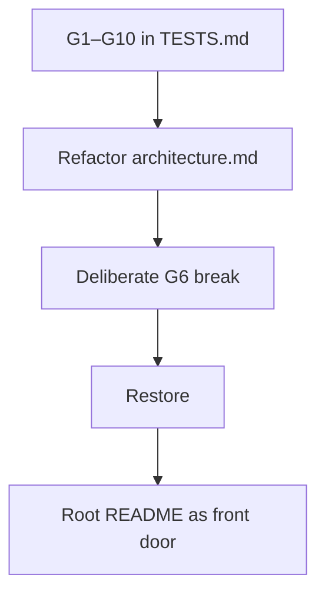

# Month 1 · Week 4 · Day 5
# Tests, Refactor, Documentation — Git + Architecture

**Program:** Full-Stack Mastery · 18 months  
**Phase:** 1 — Foundations  
**Month index:** [../../README.md](../../README.md)  
**Week 4:** [1](day-01.md) · [2](day-02.md) · [3](day-03.md) · [4](day-04.md) · Day 5 (today) · [6](day-06.md) · [7](day-07.md)  
**Week rhythm today:** Tests + refactor + documentation  
**Study time:** 3–4 focused hours

---

## How to use this textbook

This is not a video transcript and not a tutorial to skim.

1. Read a section. Close it. Say each architecture term in a full sentence.
2. Fill G1–G10 by running and reading, not by wishing.
3. See G6 fail on purpose, then restore. A test you never saw fail is a souvenir.
4. The README is written from this month’s explanations, not from tool homepages.
5. Optional review links at the end are for later rechecking — not for first learning.

---

## How to read this chapter

Today’s tests are **clone-and-follow** claims: another engineer can read the README and find Git, HTTP labs, and the architecture drawing. G1–G10 stay the IDs. Record pass/fail; do not skip G6 by waving at a mush paragraph.



> **Wrong belief:** “The diagram is in my notebook, so G6 passes.”  
> **Correct:** G6 reads **`architecture.md` in the repo**. Headings and definitions must be in that file.

> **Wrong belief:** “`git grep -i password` must return nothing.”  
> **Correct:** teaching sentences (“never commit a password”) may match. G9 is **judgment**: no real secret values.

> **Wrong belief:** “The backend is the database, and Nginx is my API.”  
> **Correct:** the backend is code on a machine you control. The database is a separate process with files. The web server forwards; the application server **is** the HTTP API.

---

## What we are testing (explained)

A **test** is a claim that can fail. “I glanced at architecture.md and it looked fine” is a demo. “`architecture.md` contains a heading and a definition for authentication” is a test.

A **clone-and-follow** test: another engineer (or future you) can read the README and know what this lab is, how to run scripts, and where the architecture drawing lives. Arrange: clone exists on disk (you already have `~\fullstack-lab`). Act: run the commands in the G1–G10 table. Assert: PASS or FAIL written down.

Git tests: `status` understood, `origin` set, history is more than one dump commit, `.gitignore` lists `.env`, no real password in `git grep`. Architecture tests: the eight terms are **defined**, and a failure table exists. Documentation test: the root README is a front door.

A claim that cannot fail is not a test. G6 fails if you rename `## Authentication` to `## Login stuff` and the eight terms are gone. That is why Block “Deliberate break” exists.

### The eight terms (enough to pass G6 from this file)

You defined these on Day 4. Today G6 checks that `architecture.md` still contains them **and** a definition for each. If Day 4 is thin, repair the file using this recap — then G6 is a real test, not a memory of a lecture.

**Frontend** — UI code running on the user’s machine, usually in the browser (HTML/CSS/JS). Not trusted. Anyone can edit JavaScript in DevTools. Security-critical rules belong on the server.

**Backend** — code on a machine you control. Enforces rules. Talks to databases. Does not paint the user’s pixels (except when it returns HTML). “Backend” is a role, not a brand.

**API** — the **contract** (URLs, methods, JSON, statuses). Usually the HTTP surface of the backend process, not a separate computer. `/api` as a prefix is not enough. Behavior is the API.

**Database** — a process + files specialized for durable data (later: PostgreSQL). Frontend must not use the database password. Data in one browser’s `localStorage` is not the system of record.

**Authentication** — who are you? Login, passwords, sessions, tokens. HTTP shadow: **401** (not authenticated).

**Authorization** — what may you do? Admin vs user; your row vs someone else’s. HTTP shadow: **403** (authenticated but forbidden).

**Web server** — TLS, static files, reverse proxy (Nginx, Caddy, or a cloud equivalent). Accepts 80/443. Forwards API paths. Serves JS/CSS efficiently. Not your business rules.

**Application server** — your code (later: Uvicorn + FastAPI). Routes, validation, talks to the database. In development you often hit this process directly. In production a web server sits in front.

Default picture:

```
Browser (frontend)
  --HTTPS--> Web server (TLS, static, proxy)
               --forward /api--> Application server
                                   --> Database
```

If the **application server** dies, the web server may still serve static files, but API calls fail (502 or connection refused through the proxy). If the **database** dies, the app may still answer “I am up” and then 500 on queries — data in RAM on the app is not the system of record. If DNS dies, you never reach the web server (Week 2). If only frontend JS has a bug, the API may still be healthy.

Git recap for G1–G5 and G10: working tree, index, commits; `origin` is a remote name; `git push` sends commits; `git pull` then push if rejected; never force this month; `.gitignore` lists `.env` **before** secrets are added. Ignoring after a commit does not erase history.

### Office hours

A student writes one paragraph: “the frontend backend API database server logs you in.” G6 fails even if all eight words appear as a mush. Definitions need headings or clear term-and-sentence pairs.

A student has four commits total and “passes” G3 by lowering the claim to “at least one commit.” Do not invent fake commits. Do the missing labs. G3 is a history smell test.

A student `git grep`s `password`, sees this textbook’s teaching sentence in a note, and fails G9. Judgment: teaching prose is fine. `password=hunter2` is not.

### What pass and fail look like (so G1–G10 are not vibes)

**G1 pass:** `git status` says clean, or you list every dirty file and say commit vs discard. **G1 fail:** “it’s probably fine” with a dirty tree you cannot explain.

**G2 pass:** `origin` and a GitHub URL. **G2 fail:** empty `git remote -v`.

**G3 pass:** `git log --oneline` prints more than five commits. **G3 fail:** one “Initial commit” dump. Do not `git commit` empty noise to game the number.

**G4 pass:** the GitHub page loads for you (private is allowed). **G4 fail:** 404 on the URL, or you never created the repo.

**G5 pass:** `.gitignore` has a line that ignores `.env`. **G5 fail:** you remember you meant to add it.

**G6 pass:** eight terms, each with a definition a beginner could use. **G6 fail:** a mush paragraph, or `authorization` missing.

**G7 pass:** a failure table with filled “user sees” cells. **G7 fail:** headers only.

**G8 pass:** a stranger can clone, run inspectors, and find architecture.md from README alone. **G8 fail:** README is a list of logos.

**G9 pass:** no real secret values. **G9 fail:** a token, a password assignment, a dumped `.env`.

**G10 pass:** `git push` succeeds or is already up to date. **G10 fail:** rejected and you force, or you ignore the error.

README front door, the sentences it must be able to support: this repo is Month 1 lab work (machine, network traces, HTTP log, architecture). Setup: Windows PowerShell, Git on PATH, `curl.exe`, execution policy `RemoteSigned` for CurrentUser if scripts are blocked. PATH is an ordered list of directories the shell searches for programs. Run `inspect-machine.ps1` from `week-01` with `.\`. Run `trace-url.ps1 -HostName example.com` from `week-02`. Tests live in each week’s `TESTS.md`. Do not publish generated reports or cookies. Clone URL is the `origin` URL.

Authn vs authz table you may add to `architecture.md` during refactor (your words):

| | Authentication | Authorization |
|---|---|---|
| Question | Who are you? | What may you do? |
| HTTP | 401 | 403 |
| Example | No session cookie | Session valid, not staff |

---

## Today's contract

The Month 1 repo can be understood from README alone. Architecture terms are headings with definitions.

**Today's gate**

> G1–G10 recorded. README is a front door. `architecture.md` uses the eight Day 4 terms as defined terms. Remote is up to date.

---

## Time box

| Block | Minutes | Work |
|---|---|---|
| A | 20 | Read G1–G10; predict which might fail |
| B | 50 | Run and record G1–G10 |
| C | 50 | Refactor architecture.md + README |
| D | 25 | Deliberate G6 break; restore |
| E | 20 | Commit and push |

---

# Block A — Predict which claims might fail

Before you run, write one line: which of G1–G10 do you already distrust? Dirty tree? No origin? `architecture.md` missing **authorization** as a word? README that only lists tool names? That prediction is not a grade. It is arrange for Block B.

---

# Block B — Run G1–G10

`week-04/TESTS.md`

| ID | Claim | How |
|---|---|---|
| G1 | `git status` is clean or I can explain every dirty file | run |
| G2 | `git remote -v` shows origin | run |
| G3 | `git log` has more than 5 commits | run |
| G4 | GitHub page loads the repo | browser |
| G5 | `.gitignore` contains `.env` | read |
| G6 | `architecture.md` contains all eight terms **and** a definition for each | read |
| G7 | `architecture.md` contains a failure table | read |
| G8 | Root README explains clone, purpose, how to run inspectors | read |
| G9 | `git grep -i password` does not reveal a real password | run + judgment |
| G10 | `git push` works | run |

```powershell
Select-String -Path ~\fullstack-lab\week-04\architecture.md -Pattern 'frontend|backend|authentication|authorization|web server|application server|database|API'
```

Run the Git claims from the lab root:

```powershell
cd ~\fullstack-lab
git status
git remote -v
git log --oneline
Select-String -Path .gitignore -Pattern '\.env'
git grep -i password
```

G3: more than five commits means a history, not one “initial commit” dump. If you have fewer, you skipped weeks — do not invent fake commits; do the missing labs.

G4: open the URL from `REMOTE.md`. Private repos still “load” when you are logged in.

G6: `Select-String` finding the word `API` inside `application` is not a definition. Open the file. Each of the eight terms needs a sentence that would teach a beginner. If **authorization** is missing, add it from this chapter, then re-run G6.

G7: a table with “if this dies / user sees” for DNS, web server, application server, database (and frontend JS if you wrote it). Empty cells fail G7.

G10: a successful `git push` (or “everything up-to-date”). If it fails, debug with Day 2 — pull then push; never force. If `git` is not recognized, Week 1 PATH.

Record PASS/FAIL in TESTS.md. A failed claim is a failed test. Fix the repo, not the ID.

---

# Block C — Refactor `architecture.md`

One diagram, one legend, authn vs authz as a two-column table, numbered walkthrough. Second commit: `Clarify architecture diagram and term definitions.`

Root README must include: purpose, setup (PowerShell, Git, curl.exe, execution policy), week layout, how to run `inspect-machine.ps1` and `trace-url.ps1`, link to architecture.md, how to run TESTS.md, limitations, privacy, clone URL.

The README is documentation **from this month’s explanations**, not a list of tool homepages. Say what PATH is in a sentence if you mention it. Say `curl.exe` not `curl`. Say HTTP is the language after DNS/TCP/TLS if you mention Week 3. Say Git is the local history tool and GitHub is a host.

Typed checks after you edit:

```powershell
cd ~\fullstack-lab
Test-Path .\README.md
Test-Path .\week-04\architecture.md
Test-Path .\week-01\inspect-machine.ps1
Test-Path .\week-02\trace-url.ps1
```

A command in the README must work in a new PowerShell. Example spine the README may show (adjust if your paths differ):

```powershell
cd ~\fullstack-lab\week-01
.\inspect-machine.ps1
cd ~\fullstack-lab\week-02
.\trace-url.ps1 -HostName example.com
```

README limitations paragraph (write your own, this is the bar): inspectors print local usernames and paths — do not gist the report. `trace-url.ps1` is not a port scanner. `Test-NetConnection` is slow. HTTP labs use `curl.exe` and a fake API; they need a live network. Architecture.md is a drawing, not running software. GitHub may be private.

Privacy: no `.env`, no cookies, no PATs, no HAR. Generated `machine-report.txt` should be gitignored if it exists.

G8 fails if the README says “see Day 4” with no link and no terms. Put a link to `week-04/architecture.md` and one sentence: frontend runs on the user’s machine; the application server runs your API; the database is the system of record.

---

# Block D — Deliberate break

Rename a heading so G6 fails. Record it. Restore. Re-run G6.

Example: change `## Authentication` to `## Login`. `Select-String` should miss `authentication`. Write one line in TESTS.md: what you changed, that G6 failed, that you restored. Then G6 must pass again.

```powershell
Select-String -Path ~\fullstack-lab\week-04\architecture.md -Pattern 'authentication'
```

After the break, that command should find nothing (or only a mush leftover). After restore, it should find the heading and the definition. If **no** claim fails when you rename the heading, G6 was too vague. Tighten G6 until the eight terms as defined terms are required.

A test you never saw fail is a souvenir.

The architecture clarify commit may be separate (message exactly: `Clarify architecture diagram and term definitions.`) **before** this documentation commit, or you make two commits in this order: clarify first, then README/TESTS.

```powershell
cd ~\fullstack-lab
git add week-04/architecture.md
git commit -m "Clarify architecture diagram and term definitions."
git add README.md week-04
git commit -m "Document Month 1 lab for clone-and-follow use."
git push
```

If push is rejected, pull then push. Never force. Do not add `.env`. Do not add a screenshot of GitHub that shows a token.

G1–G10 is a **suite**. One FAIL means the suite is not green. Fix that claim. Do not average. G6 failing after a heading rename is the point of Block D; G6 failing at the end of the day because authorization is still missing is unfinished work.

Clone-and-follow, imagined: a classmate clones your GitHub URL, opens README, runs `.\inspect-machine.ps1` from week-01, runs the tracer, opens architecture.md, and can explain authn vs authz without you on call. If that story is fantasy, G8 failed even if you checked the box.

architecture.md refactor checklist, so “clarify” is not a synonym for “I stared at it”:

1. One diagram (ASCII or Mermaid), not three competing pictures.
2. A legend that names frontend, web server, application server, database.
3. Authn vs authz as a two-column table (question, HTTP status, example).
4. Numbered walkthrough that includes DNS and TLS, not only “user clicks login.”
5. Failure table with filled cells.
6. The word **authorization** spelled as that word, with a definition.

Second commit message, exact: `Clarify architecture diagram and term definitions.`

---

## Definition of done

- [ ] G1–G10 recorded
- [ ] README is a real front door written from this month’s explanations
- [ ] Architecture uses roadmap vocabulary **defined in Day 4**
- [ ] Remote is up to date

G9 judgment examples: `never commit a password` in SECURITY.md is PASS. `password=s3cret` in a sample `.env` is FAIL. `POSTGRES_PASSWORD=` with a real value is FAIL. Teaching the word “password” is not a leak.

G10 “everything up-to-date” is PASS. A rejected push you ignored is FAIL. A force-push is a process fail even if GitHub looks right.

G6 after restore must pass. If you renamed Authentication to Login and
left it that way, you finished Block D halfway. Restore the heading and
the definition. `Select-String` for `authentication` should hit.

README must say `curl.exe`, not `curl`. PATH is an ordered directory
list if you mention it. Inspectors run with `.\` from their folders.

G3: more than five commits is a history. Do not invent empty commits
to game the number. Do the missing labs instead.

---

## Optional review links

Repair from [Day 4](day-04.md) and [Day 1](day-01.md). These pages are for later checking, not for first learning.

- [Week 4 Day 2](day-02.md) — origin, push
- [Week 3 Day 5](../../week-03/day-05.md) — what a test is

---

## Tomorrow

Independent product architecture (a domain that is not Day 4’s example) plus Git ops without a checklist.
