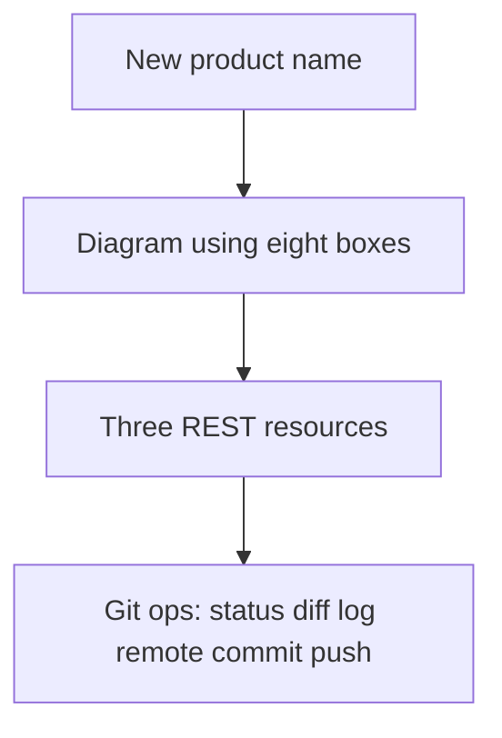
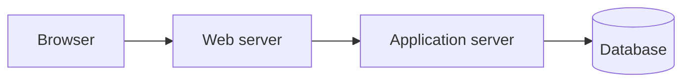

# Month 1 · Week 4 · Day 6
# Independent: Git + Architecture

**Program:** Full-Stack Mastery · 18 months  
**Phase:** 1 — Foundations  
**Month index:** [../../README.md](../../README.md)  
**Week 4:** [1](day-01.md) · [2](day-02.md) · [3](day-03.md) · [4](day-04.md) · [5](day-05.md) · Day 6 (today) · [7](day-07.md)  
**Week rhythm today:** Independent project work  
**Study time:** 3–4 focused hours  
**Textbook closed** during challenges. Repair from **this file first**, then Week 4 Days 1, 2, and 4 in this book.

---

## How to use this textbook

This is not a video transcript and not a tutorial to skim.

1. Read the complete explanation. Close it. Say each box in a full sentence.
2. Pick a **new** product domain. Do not paste Day 4’s login-walkthrough sentences.
3. Type every Git command. Read `git status` before `git add`.
4. AI may not write `product-architecture.md` for you.
5. Optional review links at the end are for later rechecking — not for first learning.

---

## How to read this chapter

Days 1–5 stay closed during the challenges. This file has the eight boxes and the Git ops you need. Pick a **new** product domain.



> **Wrong belief:** “I will diagram a todo app because every tutorial does.”  
> **Correct:** pick project management, inventory, scheduling, CRM, issue tracking, or a learning platform — a domain with at least two nouns.

> **Wrong belief:** “I deleted `.env` in a new commit, so GitHub is clean.”  
> **Correct:** `git log -p` can still show the old blob. Assume leaked; rotate; do not push secrets in the first place.

> **Wrong belief:** “Authentication and authorization are both login.”  
> **Correct:** authentication is who you are. Authorization is what you may do. 401 vs 403.

---

## Complete explanation (architecture boxes)

**Frontend** — UI code running on the user’s machine, usually in the browser (HTML/CSS/JS). Not trusted. It renders UI, captures input, sends HTTP. It must not hold the database password.

**Backend** — code on a machine you control. Enforces rules. Talks to databases. Does not paint the user’s pixels (except when it returns HTML). Full-stack means you can work both sides and the contract between them.

**API** — the **contract** (URLs, methods, JSON, statuses). Usually the HTTP surface of the backend process, not a separate computer. Week 3 REST rules still apply: nouns, methods, honest statuses, `Content-Type`. `/api` as a prefix is not an API by itself.

**Database** — a process + files specialized for durable data (later: PostgreSQL). Frontend must not use the database password. Path: frontend → HTTP API → database. If the API process dies, data in the database **remains** (Week 1: process vs files). If the disk is lost without backups, data is gone.

**Authentication** — who are you?  
**Authorization** — what may you do?  
HTTP: **401** vs **403**. Logged in as Ada (authenticated). Cannot delete another user’s project (not authorized).

**Web server** — TLS, static files, reverse proxy (Nginx, Caddy, or a cloud equivalent).  
**Application server** — your code (later: Uvicorn + FastAPI).

Default picture:

```
Browser (frontend)
  --HTTPS--> Web server (TLS, static, proxy)
               --forward /api--> Application server
                                   --> Database
```



**Reverse proxy (beginner):** the browser talks only to the web server (one host, one certificate). The web server **forwards** some paths to the application process. The user never types `:8000`.

Redis, queues, Kubernetes: **not** this month. Add a box only when a problem needs it (roadmap Rule 6). Redis might cache or store sessions later; it is not required in a first diagram.

If the **application server** dies, the web server may still serve static files, but API calls fail (502 or connection refused through the proxy). If the **database** dies, the app may still answer “I am up” and then 500 on queries — data in RAM on the app is not the system of record. If DNS fails, you never reach the web server (Week 2). Connection refused to the app port is TCP, not HTTP 404 (Week 2–3).

Worked domain sketch (change the nouns when you write yours). An **inventory** product: frontend is the warehouse UI in the browser; web server terminates TLS; application server exposes `GET /items`, `GET /items/1`, `POST /items`; database stores counts that another device must see. Theme toggle is frontend-only. Staff-only DELETE is 403 for a logged-in clerk without permission, 401 if there is no session. That sketch is the bar. Do not copy it as your product if you pick inventory — write **your** items and rules.

REST reminder: identity in the path (`/items/1`); filters in the query (`?q=`); no tokens in the query; GET does not delete; JSON with matching `Content-Type`.

---

## Complete explanation (Git ops)

Three places: working tree → index (`git add`) → commits (`git commit`). `git status` compares them. `git diff` is unstaged; `git diff --staged` is the next commit. `git log` reads the chain.

`status`, `diff`, `log`, `remote -v`, small commit, `push`. If push fails: read the error; if remote is ahead, `pull` then `push`; never force this month. `.env` ignored. Making a repo public after committing `.env` leaks secrets even if you later delete the file in a new commit — history still has it. That is why ignore-before-add matters.

Git is the tool. GitHub is the host. `origin` is the default remote **name**. The URL is not a token. HTTPS remotes look like `https://github.com/USER/REPO.git`. Never put a PAT in `git-ops.md`.

If `git` is not recognized, that is PATH (Week 1). Reopen the terminal. `Get-Command git`.

Office hours. A student diagrams “the cloud” as one box. Split it: web server, application server, database. A student uses Day 4’s login walkthrough with the names swapped. The independent day failed. New domain, new sentences. A student commits `update` as the message for Challenge 2. The tiny commit should say *why* — a one-line clarification in the architecture file, named in the message.

### Walkthrough you must invent for *your* nouns

Day 4 asked for a login-and-list walkthrough. Today you write a different product’s walkthrough in `product-architecture.md`, numbered, using Week 2 and Week 3:

1. User types the site name. DNS finds an A/AAAA record.
2. Browser opens TCP 443 to that IP. TLS checks the certificate **name**.
3. Web server returns static frontend files (HTML/CSS/JS).
4. Frontend JS sends `POST /login` with JSON (password in the **body**, not the query).
5. Application server authenticates (401 if credentials are wrong or missing).
6. Response `Set-Cookie` (you do not invent a cookie **value** in the notes).
7. `GET /your-collection` with `Cookie`. Application server authorizes (403 if the list is not theirs).
8. Application server queries the database. JSON array in the response. Frontend renders.

If you skip DNS or TLS, the walkthrough is a UI cartoon, not architecture. If you skip 401/403, you mixed authn and authz again.

Frontend-only vs database, more examples so item 4 is not one line. Frontend-only: selected tab, unsaved draft in RAM, light/dark preference in `localStorage` on **this** browser. Database: the project’s title another teammate must see, the inventory count, the appointment time, the issue status. If it must survive a refresh on another device, it is not frontend-only.

Redis later (item 6): might cache a hot JSON response, or hold session ids, or rate-limit. Optional today because you do not have that performance problem yet, and Rule 6 says do not add boxes for résumé reasons. If you draw Redis now, you must say it is **not** the system of record.

Git ops reading: `git status` before add. `git diff` to see the walkthrough you just wrote. `git log -5` to see that history is a chain. `git remote -v` to see `origin`. Then a small commit whose message names the clarification. Then `git push`. Confirm on the GitHub website that the new file is there. If push is rejected, the remote is ahead — pull then push. If `git` is not recognized, PATH. If origin is missing, Day 2 is unfinished.

---

## Today's contract

A **new** architecture for a product that is not a todo app, plus Git operations without a checklist.

**Today's gate**

> New domain, eight boxes, authn ≠ authz, and `git push` succeeded.

---

## Time box

| Block | Minutes | Work |
|---|---|---|
| 1 | 70 | Challenge 1 — product architecture |
| 2 | 40 | Challenge 2 — Git without a net |
| 3 | 25 | Challenge 3 — explain GitHub |
| S | 20 | Stretch cookie 401/403 |
| | 15 | Commit and push |

---

# Challenge 1 — Product architecture (required)

Pick: project management, inventory, scheduling, CRM, issue tracking, or learning platform.

```powershell
cd ~\fullstack-lab
New-Item -ItemType Directory -Force -Path week-04\independent | Out-Null
```

`week-04/independent/product-architecture.md`:

1. Name and purpose  
2. Diagram using the boxes above  
3. Three API resources (REST URLs + methods — Week 3)  
4. Database vs frontend-only data  
5. One authentication moment and one authorization rule  
6. What Redis **might** do later and why it is optional today  
7. Application server dies vs database dies  

New product. Do not paste Day 4’s example sentences.

Example resource shape (change the nouns): `GET /items`, `GET /items/1`, `POST /items`. Filters in the query (`?q=`). Identity in the path. Staff-only DELETE is 403 for a logged-in non-staff user, 401 if there is no session.

Frontend-only data: theme toggle, unsaved form draft in memory. Database: the inventory count, the appointment, the issue status — anything another device must see.

Write item 7 in full sentences. Application server dead: static page may load; `GET /items` fails with 502 or connection refused through the proxy. Database dead: the app process may still bind the port; queries 500; the system of record is unreachable. Do not call either of those “DNS is down.”

Web server dead: nothing answers 443. TLS never starts. The user sees a browser error, not an HTTP 500 from your app — your app never got the request. DNS dead: `Resolve-DnsName` fails; stop talking about 502. Frontend JS bug: the API may still 200 in curl; the page looks broken. That split is why the eight boxes exist.

Domain choice, restated. Project management: projects, tasks, members. Inventory: items, locations, counts. Scheduling: appointments, rooms, attendees. CRM: contacts, notes, owners. Issue tracking: issues, comments, projects. Learning platform: courses, lessons, enrollments. Pick one. Name two nouns minimum. Three REST resources can be collection + item + a second noun, or collection + item + a join resource like loans.

Do not paste Day 4’s “user logs in and loads their project list” if you picked inventory. Write warehouse receiving. If you picked scheduling, write booking a room. The HTTP sequence is the same shape. The nouns are not.

---

# Challenge 2 — Git without a net (required)

`week-04/independent/git-ops.md` — perform and record: status, diff, log -5, remote -v, a tiny commit, push, confirm on GitHub. Debug in writing until push works.

```powershell
cd ~\fullstack-lab
git status
git diff
git log -5
git remote -v
```

The tiny commit can be a one-line clarification in `product-architecture.md` after you write it — not `update` as the message. Then `git push`. If rejected, pull then push. Record the error text if any (no tokens).

Read `git status` before `git add`. If `.env` appears, stop. Ignore it. Do not add it.

# Challenge 3 — Explain GitHub (required)

In `git-ops.md`: Git vs GitHub; what `origin` is; what goes wrong if `.env` was committed then the repo is made public.

Full sentences. Git is the local snapshot tool. GitHub is a host. `origin` is a name for a URL. Public after a committed `.env` means anyone who can clone can read history, including old blobs, even if a later commit deleted the file. Assume leaked. Rotate. Prefer ignore-before-add.

# Stretch

Login POST → Set-Cookie → GET resource → 403 if wrong user. Tie to Week 3 statuses.

Write the sequence as numbered HTTP messages (method, path, status). No cookie **values**. 401 if Cookie missing. 403 if Cookie valid but the resource belongs to someone else.

Example spine (change paths to **your** nouns):

1. `POST /login` with JSON body (not a password in the query) → 200 or 204, `Set-Cookie`  
2. `GET /items/1` with `Cookie` → 200 and JSON  
3. `GET /items/1` with no Cookie → 401  
4. `DELETE /items/1` as a logged-in non-staff user → 403  

HTTPS on the path for production. Localhost HTTP is an honest dev exception (Week 2).

Git vs GitHub in Challenge 3, expanded so the paragraph cannot be one line. Git recorded commits on your disk in Week 1. GitHub is a website that hosts a copy when you push. `origin` is the default name for that URL, like a contact name, not a second Git. If `.env` was committed and the repo is public, clones include history. Deleting the file later is a new commit; `git log -p` can still show the old contents. Treat it as leaked. This month you should have no real `.env`. The explanation is the skill.

Confirm on GitHub: open the repo in a browser, find `week-04/independent/product-architecture.md`. If it is missing, you committed locally and did not push, or you pushed a different folder. `git remote -v` then `git log origin/main -1` (or `origin/master` if that is the branch) compared to `git log -1`.

Failure table for *your* product (put it in product-architecture.md, not only Day 4’s file): DNS fail, web server fail, application server fail, database fail, frontend JS bug. User-sees sentences must differ. If every cell says “error,” you have not designed.

Authorization example you can steal the *shape* of, not the nouns: authenticated clerk may `GET /items/1` (200) and may not `DELETE /items/1` (403). Unauthenticated caller gets 401 on both if the API requires a session. Public catalogs may allow GET without a session — then document that; 401 is not mandatory on every GET.

```powershell
git add week-04/independent
git commit -m "Add independent product architecture and Git ops notes."
git push
```

---

## Diagram checklist (before you call Challenge 1 done)

Your `product-architecture.md` is done when a stranger can answer, from that file alone:

- What product is this, in one sentence, with a domain that is not a generic todo list?
- Which box runs in the browser, and why that code is not trusted?
- Which box terminates TLS and serves static files?
- Which box runs *your* HTTP API?
- Which box is the system of record?
- What is one authentication moment (who are you?) and one authorization rule (what may you do?) with 401 vs 403?
- What dies if the application server dies, versus the database?

If any answer is “the backend,” split the word. Backend is a role. Web server and application server are different processes. The API is the contract on the application server. The database is not “the backend.”

Scheduling example of item 3 (change this if you did not pick scheduling): `GET /rooms`, `GET /rooms/12`, `POST /appointments` with `{ "roomId", "startsAt", "endsAt" }`. Filter `GET /appointments?on=2026-08-17`. Staff `DELETE /appointments/88` is 403 for a member who is only a guest. Missing session is 401. Do not copy this paragraph into an inventory file.

CRM example of item 4: the contact’s email another salesperson must see is database. The unsaved note in a text box is frontend RAM. If the tab crashes, the note is gone unless you POST it.

Issue tracking example of item 5: login is authentication. “Only the assignee may close the issue” is authorization. HTTP 401 vs 403 follow those questions, not a single “access denied” blob.

You are still not writing SQL, React, or FastAPI today. You are naming boxes so those tools have a place to hang in later months.

## Git ops transcript (Challenge 2)

`git-ops.md` should read like a lab notebook:

1. `git status` — what was dirty, in words.
2. `git diff` — which file changed; a `+` line you care about.
3. `git log -5` — five messages, newest first; history is a chain.
4. `git remote -v` — `origin` and a GitHub URL, not a token.
5. Tiny commit — message that says why.
6. `git push` — success, up-to-date, or the error you then repaired with pull-then-push.

If step 6 never happened, the gate is false. Local architecture that never reached GitHub is a Day 2 failure wearing Day 6 clothes.

---

## Definition of done

- [ ] New domain architecture using this file’s boxes
- [ ] Push succeeded
- [ ] Authn ≠ authz

If the diagram is a single cloud blob, split it. If Redis is drawn without a problem, remove it. If the three API resources are `GET /getItem`, rewrite them as nouns. If push never ran, the gate is false.

Tomorrow’s exam will ask architecture with the same eight words.
Independent day is when those words become *your* product’s words.

Frontend is not trusted. Database passwords never go in the browser.
The API is a contract, not a third computer by default.
Authentication is who. Authorization is what. 401 then 403.
Web server: TLS, static, proxy. Application server: your code.
If the app dies, static may still load. If the database dies, queries 500.

Git: status, diff, log, remote, small commit, push. Pull then push if
rejected. Never force. `.env` ignored before it is added.

Pick a domain with two nouns. Draw eight boxes. Write three REST
resources with identity in the path and filters in the query.
Push. Confirm the file on GitHub. That is the independent day.

Do not paste Day 4’s login walkthrough. Change the nouns. Keep 401 vs 403.
Keep identity in the path. Keep secrets out of the query and out of git.

The Month 1 exam file is the teacher tomorrow. Other day files stay closed
during exam blocks. If eight boxes are still mush, repair from this file now.

Authn ≠ authz in the file you wrote, not only in Day 4.

---

## Optional review links

Repair from this chapter and Days 1, 2, and 4. These pages are for later checking, not for first learning.

- [Week 4 Day 4](day-04.md) — eight terms
- [Week 3 Day 6](../../week-03/day-06.md) — REST contract
- [Week 4 Day 2](day-02.md) — push / pull

---

## Tomorrow

Month 1 exam. The gate is five claims, not “I opened the files.” Synthesis in the exam file is the teacher; other day files stay closed during the exam blocks.
