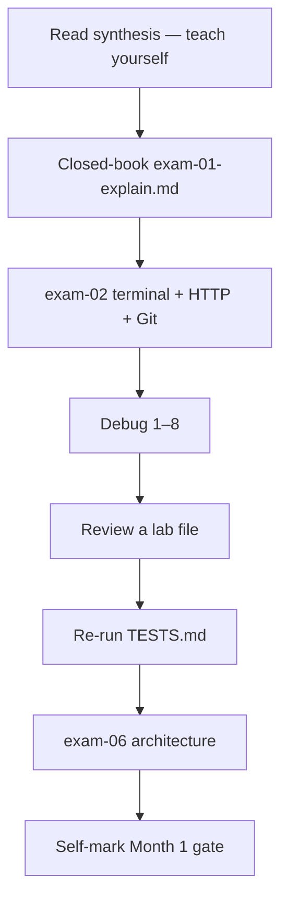
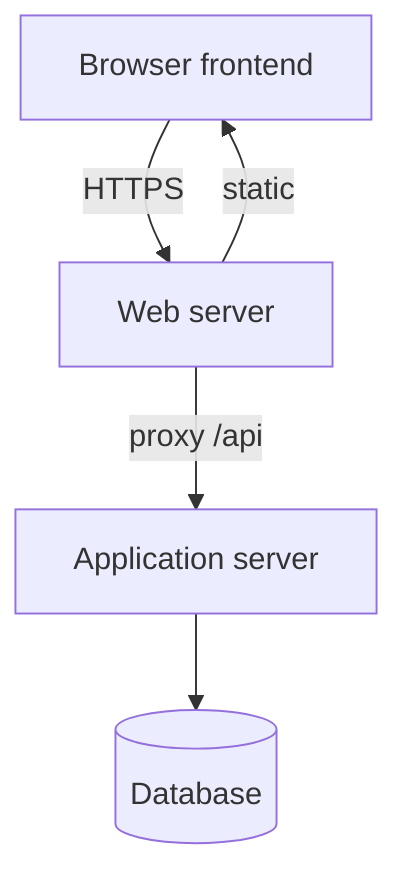
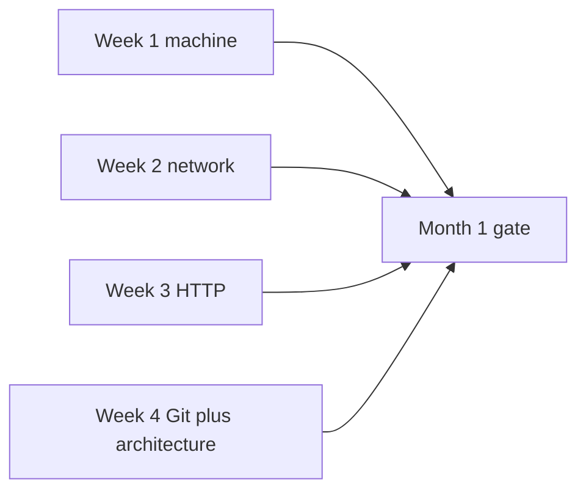

# Month 1 · Week 4 · Day 7
# Month 1 Exam

**Program:** Full-Stack Mastery · 18 months  
**Phase:** 1 — Foundations  
**Month index:** [../../README.md](../../README.md)  
**Week 4:** [1](day-01.md) · [2](day-02.md) · [3](day-03.md) · [4](day-04.md) · [5](day-05.md) · [6](day-06.md) · Day 7 (today)  
**Week rhythm today:** Review — this is the **monthly exam** from the roadmap  
**Study time:** 3–4 focused hours (use the full window)

This file is the examination **and the teacher**. Textbook files stay **closed** except:

- **this file** (synthesis + exam blocks + self-mark),
- [Month 1 README](../../README.md) **for the gate table wording**.

Repair forgotten facts from **this synthesis**, not from Week 1–4 day files and not from a random Git/HTTP blog.

Work in `~\fullstack-lab\month-01-exam\` for exam evidence. Do **not** start Month 2 because the calendar moved.

You pass Month 1 only if the **Month 1 Gate** is true. Repair before Month 2.

---

## How to read this chapter

The synthesis is written so a student whose Weeks 1–4 notes are foggy can still re-learn the month from **today’s pages**, then prove it with the seven blocks and the gate.



During blocks 1–3, other day files stay closed. If you go blank, re-read **this synthesis**. AI may not write exam-01, the mini files, or DEBUG answers.

---

## Today's contract

Teach Month 1 aloud from this synthesis and show evidence for every gate row.

**Today's gate** is the Month 1 Gate table at the end — not “I attended four weeks.”

---

## Time box

| Block | Minutes | Work |
|---|---|---|
| 0 | 25 | Read the complete explanation; speak it |
| 1 | 40 | Closed-book `exam-01-explain.md` |
| 2 | 45 | Independent build (terminal + HTTP + Git) |
| 3 | 25 | Debugging 1–8 |
| 4 | 20 | Code review |
| 5 | 20 | Testing challenge |
| 6 | 25 | Architecture diagram + questions |
| 7 | 20 | Retro + self-mark |

---

## Month 1 Gate (roadmap)

You can:

1. Explain what happens when a URL is entered.
2. Inspect an HTTP request.
3. Use terminal basics.
4. Create and push a Git repository.
5. Draw a simple frontend / API / database architecture.

The seven exam parts below produce the evidence.

Work in `~\fullstack-lab\month-01-exam\`.

---

## Month 1 synthesis (the lesson, in this book)

**Machine (Week 1):** A computer stores data and follows instructions. **CPU** executes. **RAM** holds what is in use now (volatile). **Storage** holds files when power is off. The **OS** (kernel + system programs) runs processes, owns the filesystem, shares the CPU. The desktop is not the OS.

A **file** is a name + bytes + metadata. A **path** is how you point at it (absolute vs relative; `.` / `..` / `~`). A **program** is a file of instructions. A **process** is a running instance with a PID, memory, and (often) open files and ports. One program, many processes.

The **terminal** is a text UI to the OS. It has a **current directory**. **Environment variables** are name/value pairs for the process (`$env:NAME` in PowerShell). **PATH** is the list of directories the shell searches for commands. `git` not recognized after install usually means this window was opened before PATH updated — reopen the terminal.

**Wrong belief:** “Memory means disk space.”  
**Correct:** memory = RAM. Disk space = storage.

**Network (Week 2):** **Client/server** — two programs; request then response. **IP** addresses a machine/interface. Loopback `127.0.0.1`. **Port** 0–65535; 443 is HTTPS. **Domain** is a human name. **DNS** maps name → IP (NXDOMAIN means that name does not exist). **TCP** connects to `IP:port` (refused = nothing listening). **TLS** encrypts and checks the certificate hostname **before** HTTP on HTTPS. **HTTPS** is HTTP over TLS, default port 443 — not a honesty badge.

**URL journey:** Browser → parse URL → DNS → TCP → TLS → HTTP → server process → HTTP response → browser (more requests, then render with CPU/RAM). If DNS fails, stop talking about 404. If TCP fails, HTTP never started. If TLS fails, you never got a status line. If you got 404, the protocol worked.

**HTTP (Week 3):** After the connection, **HTTP** is method + path/query + headers + optional body, then status + headers + optional body.

Methods: GET read; HEAD like GET without body; POST process/create (not generally idempotent); PUT replace; PATCH partial; DELETE remove; OPTIONS what is allowed.

Statuses: 2xx success, 3xx `Location`, 4xx your request, 5xx server. **401** not authenticated; **403** authenticated but forbidden; **404** no such resource; **500** unhandled server failure. Connection refused ≠ 404.

**Headers** are metadata (`Content-Type`, `Host`, `Cache-Control`, `Set-Cookie`). **Body** is the payload. **JSON** is text: `{}` `[]` strings numbers booleans `null`; double quotes; no comments; no trailing commas. **Query** (`?a=1&b=2`) filters — logged; no passwords. **Path** holds identity (`/users/42`). **Cookies:** `Set-Cookie` then `Cookie`; credentials; do not commit. **Cache (idea):** `Cache-Control` / `ETag` / `304` reuse a body; `no-store` for private. **REST:** nouns + methods + honest codes + JSON with matching `Content-Type`. Not “we used JSON.”

**Tools:** Network tab, **`curl.exe`** (PowerShell `curl` is often `Invoke-WebRequest`), API client GUI. All three are HTTP **clients**. The GUI is not REST.

**Wrong belief:** “`curl` in PowerShell is curl.”  
**Correct:** type `curl.exe`.

**Git (Week 4):** Three places — working tree → index (`git add`) → commits (`git commit`). `git status` compares them. `git diff` unstaged; `git diff --staged` next commit; `+` added, `-` removed. `git log --oneline` newest first. **`.gitignore`** keeps patterns untracked; commit the ignore file; ignore after a secret was committed does **not** erase history. List `.env` before it exists.

A **remote** is a named URL (`origin`). **`git push`** sends commits; **`git pull`** fetches and integrates. First push: `git push -u origin main`. Git is the tool; **GitHub** is a host. Empty GitHub repo if you already have local commits. Rejected push: pull then push. **No `git push --force`** this month. Auth: Git Credential Manager or PAT — never the GitHub account password as the Git password, never a token in the repo.

**Architecture (eight terms):** **Frontend** — UI on the user’s machine (browser). Not trusted. **Backend** — code on a machine you control; enforces rules. **API** — the HTTP **contract** (usually the surface of the backend process, not a separate PC). **Database** — process + durable files (later PostgreSQL); frontend must not hold the DB password. **Authentication** — who are you? **Authorization** — what may you do? **Web server** — TLS, static files, reverse proxy. **Application server** — your code (later Uvicorn + FastAPI).



If the app dies, API calls fail (connection refused or 502). If the database dies, data in PostgreSQL is the system of record — the app cannot honestly answer list queries. Redis is optional later; do not draw Kubernetes.

**Wrong belief:** “Nginx is my API.”  
**Correct:** Nginx forwards `/api` to FastAPI; FastAPI **is** the API.



---

# Complete explanation — speak this (Block 0)

Out loud, this file open once, then closed:

1. CPU vs RAM vs storage.  
2. Program vs process; PATH.  
3. DNS vs TCP vs TLS vs HTTP.  
4. 401 vs 403 vs 404 vs connection refused.  
5. JSON rules; query vs path; Cookie vs Set-Cookie.  
6. Three HTTP clients.  
7. Working tree / index / commit; diff; gitignore.  
8. Remote, push, pull; Git vs GitHub.  
9. Eight architecture boxes; authn vs authz.  
10. Why the database password is never in frontend JS.

If a topic is under two true sentences, it is weak — it will show up on the self-mark.

---

# 1. Closed-book explanation (40 min)

Record audio or write `exam-01-explain.md` as if teaching a beginner. You must cover:

**Week 1:** OS, CPU, RAM, storage, files, paths, process vs program, terminal, environment variables, PATH  

**Week 2:** client/server, IP, DNS, domains, ports, TCP, TLS, HTTPS, full URL journey  

**Week 3:** methods, headers, body, JSON, query/path params, cookies, status codes, cache headers concept, REST, Network tab, curl, API client  

**Week 4:** Git three areas, diff, log, remote, push/pull, gitignore; frontend, backend, API, database, authn, authz, web server, application server  

If a topic is missing, it is a fail for that topic — repair list at the end, not a silent skip.

Include one drawn URL journey (Mermaid or ASCII) and one architecture diagram.

---

# 2. Independent build (45 min)

Textbook closed. Official docs allowed.

**2a. Terminal.** Create `month-01-exam/build/` with a file `hello.txt` containing one sentence: what PATH is. Copy it to `hello-copy.txt`. Show `Get-ChildItem`. Leave the commands in `exam-02-commands.txt` (type them from memory into that file as a script of what you ran).

**2b. HTTP.** `curl.exe -i` a public JSON URL you have used. Save to `exam-02-http.txt`. In `exam-02-http-notes.md` list method, status, content-type, one header’s purpose.

**2c. Git.** You already have `fullstack-lab` on GitHub. Evidence: paste `git remote -v` and `git log -1 --oneline` into `exam-02-git.txt`. If you never pushed, **do it now** — the gate requires it. If you cannot create a GitHub account today, write why and what you will do within 48 hours; that is a **gate fail** until push exists.

Do not paste tokens. The GitHub URL is not a secret.

---

# 3. Debugging challenge (25 min)

`exam-03-debug.md` — diagnose. Do not look at previous debug files.

1. `The term 'git' is not recognized` in a brand-new PowerShell after installing Git without reopening the terminal.  
2. `curl https://example.com` behaves like `Invoke-WebRequest`.  
3. Browser NXDOMAIN after a typo.  
4. `Connection refused` to `localhost:8000`.  
5. HTTP 404 vs connection refused.  
6. `failed to push some refs`.  
7. React app (later) contains a database password. Which architecture rule did they break?  
8. Student says 401 and 403 are the same.

Write full sentences. Causes live in this synthesis (PATH, `curl.exe`, DNS, no process on the port, HTTP vs TCP, pull then push, frontend must not hold DB secrets, authn vs authz).

---

# 4. Code review (20 min)

Review **your** `inspect-machine.ps1` **or** `trace-url.ps1` **or** `architecture.md`.

`exam-04-review.md`: one strength, one defect, one security/privacy note, one change you make today (small). Commit that change after the exam file exists.

---

# 5. Testing challenge (20 min)

Run **one** week’s `TESTS.md` of your choice plus `week-04/TESTS.md`.

Then **break** something tiny (a heading or a JSON trailing comma) and show which claim fails. Restore.

`exam-05-tests.md`: what you ran, pass/fail, the deliberate break.

G6 and H6 still mean what they meant: architecture terms present; missing host is not 404.

---

# 6. Architecture question (25 min)

`exam-06-architecture.md`

**Required diagram** (ASCII is enough): frontend, web server, application server, API-as-contract, database.

Walk one user action (login or load a list) across the boxes, including DNS and HTTPS.

Answer:

- Why the browser must not use the database password  
- Authn vs authz with an example  
- When you would add Redis (and when you would not)  
- Alternative you reject: “put the API and the database in the browser”

---

# 7. Retrospective (20 min)

`exam-07-retro.md`

- Hours actually studied in Month 1 (honest)
- Solid topics
- Weak topics with **specific** repair (which day file to redo)
- AI use: did you keep any explanation you cannot repeat? If yes, that topic is incomplete.
- Ready for Month 2 HTML/CSS? Yes/no with evidence from the gate

Roadmap: do not repeat the entire month for one weak detail. Repair the prerequisite.

---

# Self-mark (after the seven parts)

Open this table only when the exam files exist.

| Gate item | Evidence file | Pass? |
|---|---|---|
| URL journey | exam-01 + exam-06 | |
| Inspect HTTP | exam-02-http | |
| Terminal basics | exam-02-commands + Week 1 labs in repo | |
| Push a Git repo | exam-02-git + GitHub URL | |
| Architecture diagram | exam-06 | |

All five must be pass.

Fill the same table in `exam-07-retro.md`. Wishful ticking is a failed exam.

Commit and push the exam:

```powershell
cd ~\fullstack-lab
git add month-01-exam week-04
git commit -m "Complete Month 1 exam evidence."
git push
```

---

## Definition of done

- [ ] exam-01-explain.md covers every synthesis row plus two diagrams
- [ ] exam-02 terminal, HTTP (`curl.exe -i`), and Git evidence exist
- [ ] exam-03-debug.md has items 1–8 in full sentences
- [ ] Self-mark table filled honestly
- [ ] All five gate rows true, or you stopped before Month 2
- [ ] Commit exists in fullstack-lab for exam evidence

---

### How to fail honestly (examples)

- URL journey fail: exam-01 skips TLS or treats NXDOMAIN as 404.  
- HTTP fail: used PowerShell `curl` alias; no status line captured.  
- Terminal fail: cannot copy a file or explain PATH.  
- Git fail: no `origin`, or never pushed; or a token in the repo.  
- Architecture fail: “backend database API” as one box; 401 = 403; DB password in frontend.

Passing is not a vibe. It is ticks with paths.

---

## If you failed

Redo the matching week’s Day 7 and the weak Day 1–2 theory. Re-sit **only** the failed gate items. Do not start Month 2 HTML until the five boxes are true.

---

## If you passed

Month 2 is HTML, CSS, accessibility, responsive design, and **Project 1 — Accessible Responsive Portfolio**. This textbook will not give you the portfolio source. The requirements live in `full_stack_project_requirements_2026/project_01_accessible_responsive_portfolio.md`.

You will write every tag yourself.

Open [Month 2](../../month-02/README.md) only when every gate row is true.

---

## Horizontal skills check (Month 1)

- [ ] Debugging: errors read, not feared  
- [ ] Documentation: this textbook first; optional Git/MDN/Microsoft pages only to recheck after you can already explain the idea  
- [ ] Communication: README exists  
- [ ] CS: process, memory vs disk, client/server  
- [ ] Security: HTTPS, gitignore secrets, cookies as credentials, no DB in the browser  
- [ ] Tests: claims that can fail, in TESTS.md files  

---

## Optional review links

Repair from this synthesis first. These pages are for later checking after the exam.

- [Month 1 README](../../README.md)
- [Month 2 README](../../month-02/README.md)
- [Week 3 Day 7](../../week-03/day-07.md) — HTTP recap (only if you failed HTTP and this synthesis was not enough)
- [Week 4 Day 4](day-04.md) — architecture lecture (repair only)

---

You have finished the Month 1 textbook. The program’s standard is not “I read the files.” It is the gate.
