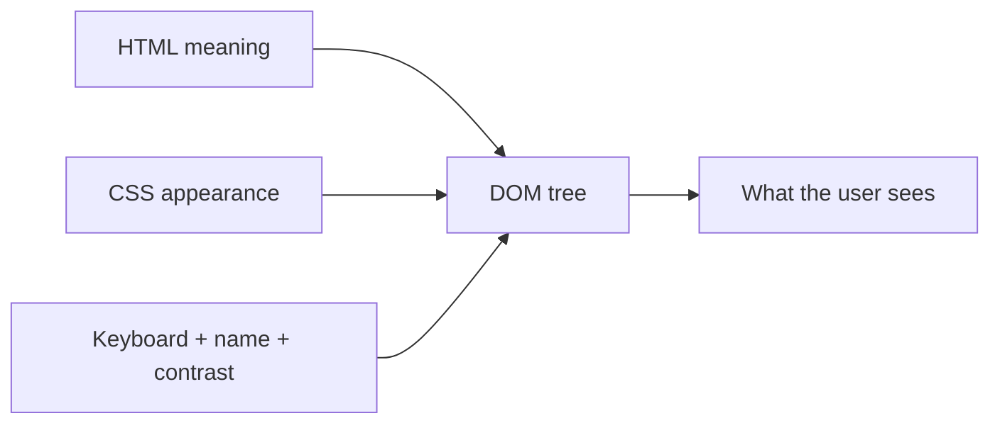

# Month 2 — HTML, CSS, Accessibility, Responsive Design

**Program:** Full-Stack Mastery Textbook  
**Phase:** 1 — Foundations  
**Length:** 4 weeks · 7 days each · 3–4 focused hours/day  
**Prereq:** Month 1 gate passed  
**This month’s job:** Make the browser’s document and visual language *yours* — semantic HTML, accessible forms, CSS you can reason about, responsive layout without a framework.

If you study only this month’s textbook plus `full_stack_project_requirements_2026/project_01_accessible_responsive_portfolio.md`, you must be able to build Project 1 **yourself** and pass the **Month 2 Gate**. This textbook will not give you the portfolio source.

**This textbook is the lesson.** HTML, CSS, accessibility, Flexbox, Grid, and responsive rules are explained in the day files the same way Month 1 explained the machine: slowly, in full sentences, with pictures, then labs. If a day ever feels like a checklist, that day is incomplete — stay on it until you can teach the idea out loud.

MDN links at the end of a day are for **later rechecking**, not for first learning. Do not skip a theory section because a link looks official.

---

## How this textbook is organized

```
month-02/
  README.md     ← you are here
  week-01/      HTML document, semantics, text, links, images, lists, tables, metadata
  week-02/      Forms, validation, keyboard, focus, accessibility tree, ARIA
  week-03/      CSS: selectors, cascade, specificity, inheritance, typography, units, box model, flow, display, positioning
  week-04/      Flexbox, Grid, media queries, mobile-first, responsive images, transitions, animations
                + Project 1 (you build) + Month 2 exam
```

Labs: `~\fullstack-lab\month-02\`.  
Project 1: **its own Git repository** from the first commit.

---

## How HTML and CSS fit (picture)



HTML is meaning. CSS is appearance. Accessibility is whether a human — including a keyboard and a screen reader — can use the same document. JavaScript is Month 3. Do not add a framework this month.

---

## Month 2 Gate

You pass only when all are true **without a tutorial**:

1. Rebuild the **supplied layout** in Week 4 Day 7 from the spec alone (the roadmap’s “screenshot” exercise).
2. Explain semantic HTML and heading hierarchy.
3. Explain cascade, specificity, and the box model with an example you can draw.
4. Explain Flexbox vs Grid and when you choose each.
5. Keyboard-navigate a form you built; visible focus; real `<label>`s.
6. Make a layout work at ~375, 768, 1024, and wide desktop with no accidental horizontal scroll.
7. Use Git from the first commit of Project 1 and **deploy** the portfolio publicly (HTTPS).

If any item is false, do not start Month 3.

---

## What this month must teach (complete list)

| Week | Must learn | Must practice |
|---|---|---|
| 1 | Document structure, semantic elements, headings, text, links, images, lists, tables, metadata | Valid HTML documents; inspect in DevTools Elements |
| 2 | Form controls, labels, validation, keyboard navigation, semantic structure, focus, accessibility tree, ARIA basics and when **not** to use ARIA | Accessible form; keyboard-only pass; contrast check |
| 3 | Selectors, cascade, specificity, inheritance, typography, units, box model, normal flow, display, positioning | Debug layout with DevTools; fix cascade bugs |
| 4 | Flexbox, Grid, media queries, mobile-first, responsive images, transitions, basic animations | Responsive page; Project 1; deploy |

**Project 1** (you write every file): accessible responsive portfolio. No React, no Tailwind, no Bootstrap, no copied template.

Horizontal skills this month:

- **Debugging:** Elements + Computed + box model overlay; specificity wars.
- **Documentation:** this textbook first; MDN only to verify after you can already explain the chapter.
- **Security:** forms are user input — never treat submitted text as HTML; `mailto:`/no backend yet; do not leak email-harvesting tricks as “clever.” Output encoding mindset: what you put in HTML is structure; user content later must be text, not markup.
- **Tests:** HTML validity, keyboard checklist, contrast checklist, viewport checklist — claims that can fail.
- **Git:** small commits on Project 1 from day one of that work.

---

## Weekly rhythm and daily time box

Same as Month 1 (see `../month-01/README.md`). Day 1 learn. Day 2 exercises. Day 3 from memory. Day 4 lab feature. Day 5 tests/docs. Day 6 independent. Day 7 review. Week 4 Day 7 is the Month 2 exam + gate layout rebuild.

| Minutes | Block |
|---|---|
| 30–45 | Concepts from **this textbook** |
| 45–60 | Focused exercises |
| 60–90 | Independent work |
| 30–60 | Lab / Project 1 |
| 15 | Notes / recall |

---

## Tools

| Tool | Use |
|---|---|
| Cursor / VS Code | Edit HTML/CSS |
| Browser (Chrome or Edge) | DevTools, screen sizes, accessibility tree |
| Git + GitHub | Project 1 history + Pages or other static host |
| Static host | GitHub Pages, Cloudflare Pages, or Netlify — HTTPS required |

No CSS framework. No component library.

---

## Labs vs Project 1

Typed labs live under `~/fullstack-lab/month-02/` (or a `month-02` folder in your lab repo).

**Project 1** is its **own Git repository** from the first commit. Follow the project requirements file. The textbook teaches every skill; it does not contain `index.html` of the portfolio.

---

## Start

Open [week-01/day-01.md](week-01/day-01.md).

When Month 2’s gate is true, continue with [Month 3](../month-03/README.md).
