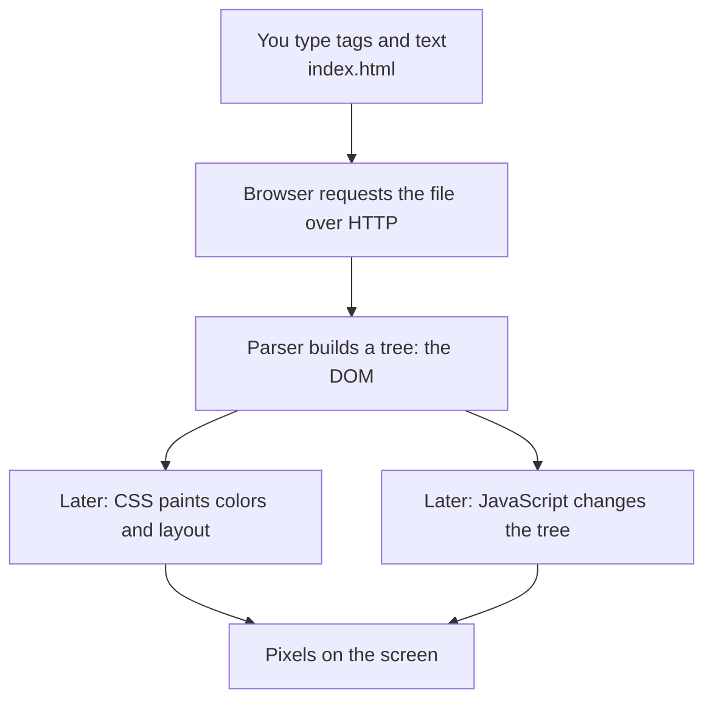

# Month 2 · Week 1 · Day 1
# The HTML Document: Structure, Semantics, Headings

**Program:** Full-Stack Mastery · 18 months  
**Phase:** 1 — Foundations  
**Month index:** [../../README.md](../../README.md)  
**Week 1:** Day 1 (today) · [2](day-02.md) · [3](day-03.md) · [4](day-04.md) · [5](day-05.md) · [6](day-06.md) · [7](day-07.md)  
**Week rhythm today:** Learn + type-along  
**Student state:** Month 1 gate passed. Total beginner at HTML.  
**Study time:** 3–4 focused hours  
**Machine today:** Windows, Chrome or Edge, Cursor / VS Code, PowerShell

**This week covers:** document structure (`doctype`, `html lang`, `head`, `body`, charset, viewport), semantic elements (`header`, `nav`, `main`, `section`, `article`, `aside`, `footer`), headings `h1`–`h6` (one `h1`, hierarchy), text, links, images, lists, tables, metadata.

Today is the document model and the first valid page you type yourself. Text, links, and images are Day 2. Do not skip them later.

---

## How to use this month

Same rules as Month 1. This is not a video transcript.

1. Read a section. Close it. Say the idea in your own words.
2. Type every tag yourself. Do not paste.
3. If the page looks wrong, open DevTools. The Elements tree is the truth, not your hope.
4. Do not keep an explanation you cannot repeat without looking.
5. AI may explain or review. It may not write your HTML.

Labs live in `~\fullstack-lab\month-02\`. Project 1 (the portfolio) does **not** start this week. That project is its own Git repository in Week 4. This textbook will not give you the portfolio source.

---

## Today's contract

By the end of this day you will be able to:

1. Explain what HTML is, what it is not, and what the browser does with it.
2. Write a complete HTML document: doctype, `html lang`, `head`, `body`, charset, viewport, title.
3. Explain why those pieces exist — not recite the boilerplate.
4. Choose semantic landmarks (`header`, `nav`, `main`, `section`, `article`, `aside`, `footer`) on purpose.
5. Build a heading outline with exactly one page-level `h1` and no skipped levels.
6. Open the page over **http**, not only `file://`, and inspect the DOM in DevTools.

**Today's gate.** You pass Day 1 when you can explain, closed-book:

> What is the difference between a `div` and a `main`? Why does the document need `lang`, charset, and viewport? What does “one `h1`” actually mean for a screen reader and for you?

If you cannot answer that, you are not done. Re-read. Re-do the lab. Do not start Day 2.

---

## Time box

| Block | Minutes | Work |
|---|---|---|
| A | 50 | Theory: HTML, the tree, document skeleton, semantics, headings |
| B | 55 | Guided lab: type a complete page; inspect it |
| C | 70 | Independent lab: rebuild a second page from a description |
| D | 25 | Lab folder + Git commit in `fullstack-lab` |
| E | 15 | Closed-book recall |

---

# Block A — Theory

## 1. What HTML is

**HTML** means HyperText Markup Language.

It is not a programming language. It does not loop, compute, or make decisions. It **marks up** content: this is a heading, this is a paragraph, this is a link, this is the main content of the page.

If that still feels abstract, use this picture. A book has a title, chapters, and paragraphs. HTML is how you tell the browser *which words are the title* and *which words are a chapter*. You are not drawing the cover yet (that is CSS). You are labeling the manuscript.



The browser:

1. Requests the file (HTTP — Month 1).
2. **Parses** the markup into a tree of nodes — the **DOM** (Document Object Model).
3. Combines that tree with CSS (Week 3) and later JavaScript (Month 3).
4. Paints pixels on the screen.

What you type is source. What the browser *uses* is the tree. Those can differ if your markup is invalid. DevTools shows the tree. When something “looks wrong,” you inspect the tree, not your hope.

**A tag is a label, not a style.** `<h1>Hours</h1>` means “this is the document’s main heading.” It may happen to look big because the browser’s default stylesheet sizes headings. You could make a `div` look just as big with CSS and it would still **not** be a heading. Screen readers, outline tools, and your future self all read the tag name.

**Wrong belief:** “HTML is how the page looks.”  
**Correct:** HTML is the document’s meaning and structure. CSS is appearance. Confusing them is how you get `<div class="heading">` instead of `<h1>`.

---

## 2. Why a full-stack engineer must know this

Every later tool — React, markdown pipelines, email templates, server-rendered pages — **emits HTML**. If you cannot read the output as a document, you cannot debug accessibility, SEO, or “why is this not a real button.”

A portfolio, a form, a dashboard: all of them are documents first. Layout is Week 4. Components are Month 6+. The document is this week.

---

## 3. The document is a tree

HTML is nested. A parent contains children. Children close before the parent closes.

```html
<body>
  <header>
    <p>Child of header, which is a child of body.</p>
  </header>
</body>
```

Rules you will break if you rush:

- Tags nest. They do not interleave: `<h1><em>Yes</em></h1>` is legal. `<h1><em>No</h1></em>` is not.
- Most elements have an **opening tag**, content, and a **closing tag**.
- A few are **void**: they never wrap content. `meta`, `img`, `br`, `input`, `link`, `hr` are the ones you will use soon. Write `<meta charset="utf-8">` — no `</meta>`.
- Attribute values belong in quotes: `lang="en"`, not `lang=en` as a habit.

The browser will often “fix” broken nesting. That is not kindness. It is a guess. Your job is not to need the guess.

**Wrong belief:** “If it looks fine in the browser, the HTML is fine.”  
**Correct:** browsers repair garbage. Validity and semantics are contracts you keep even when the paint looks acceptable.

---

## 4. The document skeleton

Every page you write this month starts from this shape. Type it until you can do it from a blank file.

```html
<!DOCTYPE html>
<html lang="en">
  <head>
    <meta charset="utf-8">
    <meta name="viewport" content="width=device-width, initial-scale=1">
    <title>Page title in the tab</title>
  </head>
  <body>
    <!-- visible document goes here -->
  </body>
</html>
```

Memorize what each line **does**.

### 4.1 `<!DOCTYPE html>`

A preamble. It tells the browser: parse this as **HTML5**, in standards mode.

Without a doctype, some browsers use quirks left over from the 1990s. You will not debug box-model ghosts this month because you forgot the doctype. Put it on line 1. Nothing before it — not a comment, not a BOM you added on purpose.

### 4.2 `<html lang="en">`

The root element. `lang` is the language of the document (BCP 47 tag: `en`, `en-US`, `es`, …).

Screen readers choose a voice. Browsers choose hyphenation and default fonts. Translation tools get a hint. If you omit `lang`, assistive technology guesses. Guessing is not a feature.

If a passage is in another language, mark that passage: `<p lang="fr">Bonjour</p>`.

### 4.3 `<head>` vs `<body>`

| Region | Job |
|---|---|
| **`head`** | Metadata for the machine: charset, title, viewport, description, links to CSS. Not the article. |
| **`body`** | The document the user reads and navigates. |

Do not put visible headings only in `head`. Do not put `<meta>` in `body`.

### 4.4 Charset

```html
<meta charset="utf-8">
```

**Character encoding:** how bytes become characters. UTF-8 can represent English, accents, CJK, emoji.

Place charset **early** in `head` (first child is the usual rule of thumb). If the browser has already guessed the encoding before it sees this tag, you can get mojibake (`café` → `café`). Historically, a late charset also interacted badly with UTF-7 XSS tricks. Early charset is both correctness and hygiene.

Save your files as UTF-8 in the editor.

### 4.5 Viewport

```html
<meta name="viewport" content="width=device-width, initial-scale=1">
```

Phones used to pretend they were 980px-wide desktops and shrink the whole page. This meta says: the layout viewport is the device width; start at zoom 1.

Without it, your CSS “mobile layout” in Week 4 will not run at 375px. You will think media queries are broken. They are not. The viewport is.

Do not use `user-scalable=no` or a tiny `maximum-scale`. That blocks zoom. Zoom is an accessibility feature.

### 4.6 `<title>`

The document’s name. It appears in the tab, in history, in search results, and as the default name when someone bookmarks the page.

It is **not** the visible `h1`, though they often say the same thing in different words.

- Bad: `Document`, `Untitled`, `page`
- Better: `Week 1 lab — HTML document structure`

One `<title>` in `head`. Required for a serious page.

**Wrong belief:** “Boilerplate is magic I copy once.”  
**Correct:** each line is a decision. You can explain all six pieces without looking.

---

## 5. `file://` versus HTTP

Double-clicking `index.html` opens `file:///C:/Users/.../index.html`.

That is a local file URL, not a web server. It will *seem* fine for a single HTML file with inline everything. It will betray you when:

- paths and base URLs confuse you
- you later load ES modules or `fetch()` (Month 3) — browsers block many of those on `file://`
- you deploy to GitHub Pages / Cloudflare Pages, which serve **HTTP(S)**

From this day, prefer a **local HTTP server**.

PowerShell, from the folder that contains your HTML:

```powershell
python -m http.server 5500
```

If `python` is not installed, use:

```powershell
npx --yes serve -p 5500
```

Then in Chrome or Edge open `http://127.0.0.1:5500/`. Stop the server with Ctrl+C when you are done.

Cursor / VS Code “Live Preview” or a Live Server extension is the same idea: the browser talks HTTP to your machine.

**Wrong belief:** “Opening the file in the browser is how websites work.”  
**Correct:** websites are HTTP resources. Practice that locally now so Month 3 is not a surprise.

---

## 6. Semantic HTML

**Semantics** means the tag names the *role* of the content, not its look.

`<p>` is a paragraph. `<h1>` is the page’s top heading. `<nav>` is navigation. `<div>` and `<span>` mean *nothing*. They are boxes for when no HTML element fits. Default to a meaning-bearing tag.

### 6.1 Landmarks you will use this month

| Element | Meaning | Typical use |
|---|---|---|
| `header` | Introductory content for a page or a section | Site banner: name + nav. Also allowed inside `article` / `section` for that block’s intro |
| `nav` | A block of **major** navigation links | Primary site menu. Not every list of links |
| `main` | The unique primary content of **this** page | One per page. Not wrapped in `article` as a habit |
| `section` | A thematic grouping that has a heading | “About”, “Skills” — only if you can name the theme |
| `article` | Content that could stand alone (syndication test) | A blog post, a project write-up, a comment with its own heading |
| `aside` | Tangentially related to the main flow | Pull quote, related links, a note — not “the sidebar because I wanted two columns” |
| `footer` | Footer for the nearest sectioning ancestor | Page footer: copyright, secondary links. Also allowed on `article` |

`main` is the landmark assistive tech users jump to. Do not put the site-wide header, nav, or footer inside `main`.

### 6.2 `div` is not a crime. Unthinking `div` is.

```html
<!-- Meaningless -->
<div class="header">
  <div class="nav">...</div>
</div>

<!-- Meaningful -->
<header>
  <nav aria-label="Primary">...</nav>
</header>
```

You will still need `div` for layout grouping in Week 4 when no landmark fits. You will not need it to fake a heading.

### 6.3 `section` vs `article` vs `div`

Ask:

1. Does this have a heading and a theme? If yes, consider `section`.
2. Could I paste this block onto another site and it would still make sense as a unit? If yes, consider `article`.
3. If neither — `div`.

Do not wrap every heading+paragraph in `section` for sport. Extra sections pollute the accessibility tree.

**Wrong belief:** “Semantic tags are for SEO and optional for real apps.”  
**Correct:** they are the default accessibility API of the page. SEO is a side effect of a clear document.

---

## 7. Headings: outline, not font size

### 7.1 The rule

- Exactly **one** `h1` per page: the title of **this** document.
- `h2` is a top-level section under that `h1`.
- `h3` is a subsection of the preceding `h2`. And so on to `h6`.
- **Do not skip levels** (`h1` then `h3`).
- Do not choose `h3` because it “looks smaller.” CSS will size text in Week 3. Today the tag is rank, not appearance.

Screen reader users navigate by headings the way you navigate by a table of contents. A skipped level is a missing chapter number. Multiple `h1`s are multiple books.

### 7.2 A legal outline

```
h1  Course lab: semantic HTML
  h2  What I built
  h2  How I tested it
    h3  Keyboard
    h3  Headings
  h2  What I still cannot explain
```

### 7.3 An illegal outline

```
h1  Welcome
h1  About me          ← second h1
h3  Skills            ← skipped h2
```

### 7.4 Headings are not `b` or `div`

```html
<p><strong>About</strong></p>   <!-- a loud paragraph, not a heading -->
<div class="title">About</div>  <!-- nothing -->
<h2>About</h2>                  <!-- a heading -->
```

`strong` means importance, not outline position. Day 2 treats text-level tags.

**Wrong belief:** “The biggest text on the page is the `h1`.”  
**Correct:** the `h1` is the document title. CSS may make a subtitle larger. The outline does not care.

---

## 8. Comments, whitespace, and what the browser ignores

```html
<!-- This is a comment. The user does not see it. -->
```

Do not put secrets in comments. The user can View Source.

Whitespace between tags mostly collapses in HTML text. A blank line in the source is not a blank paragraph. A new paragraph is `<p>`.

---

## 9. DevTools: Elements is the parsed tree

In Chrome or Edge:

1. Open `http://127.0.0.1:5500/` (your lab).
2. F12, or Ctrl+Shift+I, or right-click → Inspect.
3. **Elements** panel: the DOM.
4. Click a node. The page highlights it.
5. On the node, open the **Accessibility** pane (Elements, beside Styles — you may need the `>>` menu). Week 2 uses this heavily. Today: confirm `main` is a main landmark and your `h1` is a heading level 1.

If the tree does not match your source, the parser repaired you. Fix the source.

---

## 10. One picture to keep

```
HTTP response (text)
        ↓ parse
   DOM tree (nodes with names, attributes, children)
        ↓ later: CSS, then paint
   Pixels
```

You are responsible for the source matching the tree you intended. Semantics are node names. Headings are ranks in that tree.

---

# Block B — Guided lab

Create the lab folder. Type every command and every tag.

```powershell
cd ~
cd fullstack-lab
mkdir month-02
cd month-02
mkdir week-01
cd week-01
mkdir day-01
cd day-01
```

If `fullstack-lab` does not exist, create it and `git init` as in Month 1. Month 2 labs belong in that repo, not in Project 1.

Open the folder in your editor. Create `index.html`. Type the following **by hand**. Change the name in the header to yours.

```html
<!DOCTYPE html>
<html lang="en">
  <head>
    <meta charset="utf-8">
    <meta name="viewport" content="width=device-width, initial-scale=1">
    <title>Day 1 — Document structure lab</title>
  </head>
  <body>
    <header>
      <p>Month 2 · HTML lab</p>
      <nav>
        <ul>
          <li><a href="#main">Skip to content</a></li>
        </ul>
      </nav>
    </header>

    <main id="main">
      <h1>Document structure lab</h1>

      <section>
        <h2>What this page is</h2>
        <p>
          This is a practice document. It is not Project 1. It exists so I can
          type a valid HTML5 skeleton, landmarks, and a heading outline.
        </p>
      </section>

      <section>
        <h2>Landmarks on this page</h2>
        <p>The header, nav, main, and footer are labeled by their tag names.</p>
        <aside>
          <h3>A related note</h3>
          <p>
            This aside is tangential. It is not a second main. If I deleted it,
            the article would still make sense.
          </p>
        </aside>
      </section>

      <article>
        <h2>A stand-alone note</h2>
        <p>
          This article could be copied into a list of notes and still be
          understandable. That is why it is an article, not a nameless div.
        </p>
      </article>
    </main>

    <footer>
      <p>Lab only. Not a public site.</p>
    </footer>
  </body>
</html>
```

The skip link is a one-line preview of Week 2. It jumps to `main`. You will style it later. Today it must exist as a real `href`.

### Lab 1 — Serve over HTTP

```powershell
cd ~\fullstack-lab\month-02\week-01\day-01
python -m http.server 5500
```

If Python is missing, `npx --yes serve -p 5500` from the same folder.

Open Chrome or Edge: `http://127.0.0.1:5500/`

**Write in `notes.txt` (create it beside `index.html`):** Does the tab title match your `<title>`? What is the full URL in the address bar? Is the protocol `http` or `file`?

Leave the server running for the next labs. Use a second PowerShell window for Git later.

### Lab 2 — Inspect the tree

DevTools → Elements.

**Write:**

1. Is `<!DOCTYPE html>` visible in the tree? (Often shown as `#document` / `<html>`.)
2. Click `<html>`. What is `lang`?
3. Click `<main>`. In the Accessibility pane, what is the role?
4. Click the `h1`. What is the heading level?

### Lab 3 — Break the outline on purpose, then repair

Temporarily change the inner `h3` (“A related note”) to `h5`. Refresh.

In the Accessibility pane, confirm the level is 5. That skip is the bug.

Change it back to `h3`. Refresh. Confirm.

**Write:** Why is `h5` wrong here even if you later make the text small with CSS?

### Lab 4 — `div` versus `main`

Temporarily replace `<main id="main">` with `<div id="main">` and `</main>` with `</div>`. Refresh.

Accessibility pane on that node: you should **lose** the main landmark (or see a generic grouping).

Restore `<main>`. This is the whole semantic argument in one experiment.

### Lab 5 — A command that should look ugly, not “broken”

View Source (Ctrl+U). Compare to Elements.

**Write:** one difference you notice (browser-injected nodes such as `head` defaults, or whitespace). Source is what you typed. Elements is what was parsed.

---

# Block C — Independent lab

Textbook may stay open for **ideas**. Do not copy Block B’s page. New file: `~\fullstack-lab\month-02\week-01\day-01\library.html`.

### Task 1 — Specified document

Build a page titled (tab): `Northside Branch — Hours`. Visible `h1`: `Northside Branch`.

Required structure:

- `header` with the branch name as text (not a second `h1`) and `nav` with two links: `#hours` and `#location` (in-page fragments)
- `main` containing:
  - `section#hours` with `h2` Hours, and a paragraph of fake weekday hours
  - `section#location` with `h2` Location, a paragraph with a fake address
  - `aside` with `h3` Holiday notice and one sentence
- `footer` with a one-line copyright

Rules:

- Full skeleton: doctype, `lang`, charset, viewport, title
- Exactly one `h1`
- No skipped heading levels
- No `<div>` unless you can write one sentence in `notes.txt` justifying it
- Serve it: `http://127.0.0.1:5500/library.html`

### Task 2 — Outline on paper

In `notes.txt`, write the heading outline of `library.html` as a nested list (like section 7.2). Then check it against the file. If they disagree, the file is wrong.

### Task 3 — Explain each landmark

In `notes.txt`, one sentence each: why `header`, `nav`, `main`, `section`, `aside`, `footer` are the right tags on this page — not “because the textbook said so,” but what would be lost if you used `div`.

### Task 4 — Deliberate invalid nesting

In a **copy** `broken.html`, create this mistake (type it):

```html
<p>This paragraph <strong>never closes before the paragraph does.</p></strong>
```

Open it. Inspect. **Write:** where did the browser close `strong` and `p`? Then delete `broken.html` from your mental model of “good pages.” Keep the file as a warning, or delete it — your choice. Record what you saw.

---

# Block D — Git

```powershell
cd ~\fullstack-lab
git status
git add month-02/week-01/day-01
git commit -m "Month 2 Day 1: HTML document skeleton and landmarks."
```

If this is the first commit on a new clone, set local user.name / user.email as in Month 1. Do not invent a second repo for these labs.

Project 1 remains uncreated. Do not copy today’s page toward a portfolio.

**Write in notes:** In one sentence each, what `lang`, charset, and viewport prevent.

---

# Block E — Closed-book recall

Close this file. Answer out loud or on paper:

1. What does the browser build from HTML source?
2. Why is `<!DOCTYPE html>` line 1?
3. Why `lang` on `<html>`?
4. Why charset early in `head`?
5. Why viewport?
6. `head` vs `body`?
7. `main` vs `div`?
8. `section` vs `article` vs `aside`?
9. Heading skip: why is `h1` then `h3` a defect?
10. Why serve over `http://127.0.0.1` instead of double-clicking the file?

Reopen and mark misses. Re-study only those parts.

---

## Definition of done

Check each box only if it is true.

- [ ] I can explain HTML vs CSS vs the DOM without reading.
- [ ] I typed a full skeleton: doctype, `lang`, charset, viewport, title, body.
- [ ] I can explain each of those six pieces.
- [ ] I used `header`, `nav`, `main`, `section`, `article`, `aside`, `footer` on purpose.
- [ ] I have exactly one `h1` on each page I keep, and no skipped levels.
- [ ] I opened the lab over HTTP and inspected Elements + Accessibility.
- [ ] I proved that replacing `main` with `div` loses the main landmark.
- [ ] I committed the lab to `fullstack-lab`.
- [ ] I did not paste markup. I typed it.

If any box is false, stay on Day 1.

---

## Common failures on Day 1

| What happened | What it usually means |
|---|---|
| Page is blank | File not in the folder you are serving, or you opened a different port |
| Title is `file:///...` in your notes | You double-clicked instead of using HTTP |
| `python` / `npx` not recognized | Program not installed, or PATH — Month 1 Week 1 Day 2 |
| Two `h1`s | You used `h1` for the site name *and* the page title. Site name in the header can be a `p` or a link; one `h1` in `main` |
| “Semantic HTML is just for screen readers” | Screen readers are a primary consumer. So is every tool that reads the DOM. So are you, in six months |

---

## What we did *not* do today

On purpose:

- no CSS beyond browser defaults
- no forms (Week 2)
- no tables, images, or definition lists (Days 2 and 4)
- no Project 1 portfolio
- no ARIA except noticing the Accessibility pane

---

## Tomorrow — Day 2

**Week rhythm:** Exercises + debugging.

Text-level tags, links, images, lists. You will break pages on purpose and read the DOM. Security preview: user-supplied text is never HTML.

Prepare by answering today’s gate in 60 seconds.

---

## Optional review links

The document model, landmarks, and headings are explained in this chapter. These pages are for later checking, not for first learning. If a sentence here and an official page disagree, note it — and still be able to explain the idea from this book.

- [MDN: HTML basics](https://developer.mozilla.org/en-US/docs/Learn_web_development/Core/Structuring_content/Basic_HTML_syntax)
- [MDN: Document and website structure](https://developer.mozilla.org/en-US/docs/Learn_web_development/Core/Structuring_content/Document_and_website_structure)
- [MDN: `<html>`](https://developer.mozilla.org/en-US/docs/Web/HTML/Element/html)
- [MDN: Using the HTML lang attribute](https://developer.mozilla.org/en-US/docs/Web/HTML/Global_attributes/lang)
- [MDN: Viewport meta](https://developer.mozilla.org/en-US/docs/Web/HTML/Viewport_meta_tag)
- [MDN: Heading elements](https://developer.mozilla.org/en-US/docs/Web/HTML/Element/Heading_Elements)
- [MDN: `<main>`](https://developer.mozilla.org/en-US/docs/Web/HTML/Element/main)
