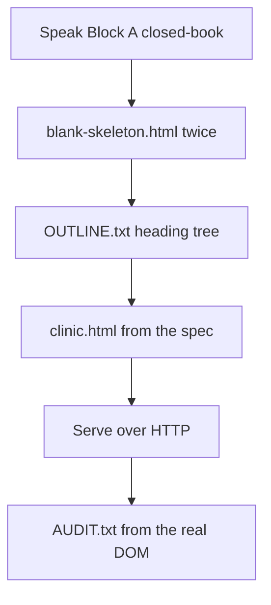

# Month 2 · Week 1 · Day 3
# Implement From Memory: A Semantic Document

**Month index:** [../../README.md](../../README.md)  
**Week 1:** [1](day-01.md) · [2](day-02.md) · Day 3 (today) · [4](day-04.md) · [5](day-05.md) · [6](day-06.md) · [7](day-07.md)  
**Week rhythm today:** Implement from memory  
**Study time:** 3–4 focused hours  
**Prereq:** Day 2 gate passed.  
**Student state:** You typed a skeleton and a text/links/images lab. Today those ideas must still live in your head — from **this file**.

---

## How to read this chapter

Day 1 and Day 2 had type-along markup. During the drills they stay **closed**. This file contains a recap so you are not sent to another site to learn.

Today is not a new topic. It is **ownership**. Read the complete explanation once. Speak Block A. Then type the spec **without** copying Day 2’s library page. The page is specified. You write it. There is **no complete page solution** in this file.



Allowed:

- The complete explanation in this file
- Your own notes in `fullstack-lab`
- The error in front of you (404, broken image, parser tree)

Not allowed:

- Pasting a finished HTML file from AI
- Copying `day-01/index.html` or `day-02/index.html`
- Browsing MDN or a tutorial as the teacher
- Starting Project 1 (wrong week)

If you are stuck **more than 25 minutes** on one task, open **only** the matching Day 1 or Day 2 section **in this textbook**, read it, close it, continue from memory. Record what you had to look up in `lookups.txt`. That list is tomorrow’s repair list.

Serve over **HTTP**, not `file://`.

---

## Complete explanation (HTML you must be able to write)

**HTML** marks up **meaning**. It is not a programming language. It does not loop or decide. It labels: this is a heading, this is a paragraph, this is a list of items.

The browser **parses** your source into a **DOM tree**. DevTools Elements shows that tree. Invalid markup can produce a **different** tree than you typed. When something is wrong, inspect the tree, not your hope.

### Document frame

A complete document needs:

1. `<!DOCTYPE html>` — HTML5 parsing mode, not quirks mode.
2. `<html lang="en">` (or the real language of the page) — screen readers pronounce correctly; translation tools get a hint. Wrong `lang` is an accessibility defect.
3. `<head>` with **charset** (`utf-8`, as early as possible), **viewport** (`width=device-width, initial-scale=1` so phones do not pretend the page is 980px wide), **title** (tab text — unique per page), and preferably a **description** meta.
4. `<body>` with the content.

Serve over **HTTP** (`http://127.0.0.1:...`), not `file://`. Relative URLs and “how the web actually loads a page” assume a server.

**Wrong belief:** “Double-clicking the file is the same as a website.”  
**Correct:** `file://` is a local disk path. This course serves HTTP so links, later CSS, and later JS modules behave like the web.

### Landmarks

`header`, `nav`, `main` (exactly **once** per page), `section`, `article`, `aside`, `footer` name **landmarks**. Assistive tech can jump by landmark.

A `div` is a box with **no** meaning. Use it only when you need a hook for CSS/JS and no semantic element fits. `span` is the inline equivalent. If you cannot say why a `div` exists, delete it.

- `section` — a themed chunk that **has a heading**.
- `article` — independently distributable content (a post, a card that could stand alone).
- `aside` — tangentially related (a staff note, a tip). Not “the sidebar because I wanted two columns.” Columns are Week 4.

**Wrong belief:** “Landmarks are for later, when I add CSS.”  
**Correct:** landmarks are meaning. CSS is Week 3. The outline must be honest today.

### Headings

Headings are an **outline**, not a font size. Exactly one page-level `h1`. Do not skip levels (`h1` then `h3`). CSS will style size later; today, the tag is the **rank**.

Write the outline **before** HTML. If the outline is messy, the page will be messy.

### Text

`<p>` for paragraphs. `<strong>` is **importance**. `<em>` is **stress**. `<b>`/`<i>` are presentational leftovers — do not prefer them. `<br>` is a line break inside a line (an address, a poem), not a way to space paragraphs. `<small>` is side comments, not “make it tiny.” `<abbr title="...">` expands an abbreviation. `<time datetime="...">` marks a date or time so machines can parse it.

`<blockquote>` is a quotation from another voice — not a way to indent. `<pre>` + `<code>` show computer text; if you show an HTML tag as an example, **escape** `<` as `&lt;` or the parser will think you opened that tag.

**Wrong belief:** “If it looks like a heading, I can use a big `p`.”  
**Correct:** looks are CSS. Meaning is the tag.

### Links

`<a href="...">` with **descriptive text** (not “click here”). The accessible name of a link is usually its text.

- `href="#id"` jumps to that `id`.
- Relative paths (`../day-02/index.html`) stay on your lab server.
- External `target="_blank"` needs `rel="noopener"` (and usually `noreferrer`) so the new tab cannot script the opener.

### Images

Every `img` has `src`, `alt`, and preferably `width`/`height` (aspect-ratio hint before load).

| Situation | `alt` |
|---|---|
| Image conveys information | Describe what it **conveys** (not “image of…”) |
| Decorative (purely visual) | `alt=""` (empty: assistive tech should skip it) |
| Missing `alt` attribute | **Error** — not the same as empty |

A broken `src` is a 404 in the Network panel. Fix the path. Serve HTTP so relative paths resolve from the page URL.

### Lists

- `ul` + `li` — unordered (services, ingredients).
- `ol` + `li` — ordered (arrival steps).
- `dl` / `dt` / `dd` — term and definition (Emergency vs Routine hours).

Do not fake lists with dashes inside a `p`. The DOM will not know they are items.

### Security start

You type the markup. Do not treat imaginary “user comments” as HTML. Later, user content must be text, not markup (Month 3: `textContent` vs `innerHTML`).

---

## Today's contract

Rebuild Week 1 skills as if this were a lab exam.

**Today's gate**

> Using the editor, the browser, this recap, and my notes, I produced a valid-shaped document with landmarks, one `h1`, real lists, one informative image, one decorative image, and descriptive links — and I can explain every tag I used.

---

## Time box

| Block | Minutes | Work |
|---|---|---|
| A | 20 | Closed-book oral review (no typing yet) |
| B | 50 | Memory drills (skeleton + outline) |
| C | 90 | Build `clinic.html` from the spec |
| D | 35 | Defect hunt on your own file |
| E | 15 | Record lookups |

---

# Block A — Speak first

Out loud, no notes:

1. What belongs in `head` vs `body`?
2. Why `lang`, charset, viewport?
3. `main` vs `div`.
4. Heading hierarchy: one `h1`, no skips.
5. Informative `alt` vs `alt=""`.
6. Why not `click here`?
7. Why serve over HTTP?
8. When is a `blockquote` honest vs fake indent?

If any answer is mush, write a two-sentence correction in `~\fullstack-lab\month-02\week-01\day-03\lookups.txt` **after** you try. Then go to Block B.

---

# Block B — Memory drills

Create `~\fullstack-lab\month-02\week-01\day-03\`.

### Drill 1 — Skeleton from nothing

Create `blank-skeleton.html` with **only** the document frame: doctype, `html lang`, `head` (charset, viewport, title), empty `body`. No copy-paste from older labs. Open it over HTTP. Confirm the tab title.

Then delete the file’s contents (keep the file) and type the skeleton a second time. The second time must not feel like invention.

### Drill 2 — Outline on paper first

On paper or in `outline.txt`, write a heading outline for a page titled **Harbor Veterinary Clinic**.

Required ranks:

- one `h1` (clinic name as page title)
- `h2` Services
- `h2` Visiting
  - `h3` Parking
  - `h3` What to bring
- `h2` Staff note (this one will live in an `aside` or a small `article` — you decide, and you must justify the tag in one sentence in `outline.txt`)

Do not skip to HTML until the outline exists.

---

# Block C — Spec: `clinic.html`

Build `~\fullstack-lab\month-02\week-01\day-03\clinic.html` plus any media files you need.

The textbook does not provide this markup. If you find yourself reproducing Day 2’s library page, stop. This is a clinic.

### Required document features

1. Full Day 1 skeleton. Title in the tab must include the clinic name.
2. `header` with a short wordmark (not a second `h1`) and `nav`:
   - in-page links to Services, Visiting, Contact line
   - one relative link to `../day-02/repaired.html` **or**, if that file is missing, to `../day-02/index.html` — link text must describe the destination
3. `main` with the outline from Block B
4. Services: an **unordered** list of at least four services (invent them: vaccinations, dental, etc.)
5. Visiting: an **ordered** list of arrival steps (at least three)
6. A `dl` with two terms: `Emergency` and `Routine` — hours as the descriptions (invent)
7. One paragraph that correctly uses `em`, `strong`, `small`, `abbr`, and `time`
8. One `blockquote` that is an actual quotation (invent a one-sentence client quote). Not a fake indent.
9. One `pre`/`code` sample: a **single** HTML start tag shown as text, properly escaped
10. Images:
    - Create an SVG (or use a tiny PNG you export) as a **logo-like** graphic. Informative or decorative: **you choose**, and your `alt` must match that choice. Write the choice in `outline.txt`.
    - A second image that is definitely decorative (`alt=""`)
11. `footer` with an external MDN link. If `target="_blank"`, include `rel="noopener noreferrer"`
12. Exactly one `h1`. No skipped heading levels. No `<div>` unless `outline.txt` justifies it in one sentence
13. Serve at `http://127.0.0.1:5500/clinic.html` (or whatever port your static server uses — the scheme must be `http`, not `file`)

### Constraint

Do not add CSS beyond what the browser does. Do not add a form (Week 2). Do not add a table (Day 4). Do not paste Project 1.

---

# Block D — Defect hunt (your file)

With `clinic.html` open in DevTools, fill `~\fullstack-lab\month-02\week-01\day-03\AUDIT.txt`:

1. Count of `h1` (must be 1).
2. Heading sequence as a nested list (copy from the Accessibility pane / by reading source).
3. Every `img`: `src`, `alt` value (write `(empty)` if `alt=""`), informative or decorative.
4. Every `a`: link text, `href`, whether `target` is set.
5. Landmark list: header, nav, main, footer, plus any article/aside/section you used.
6. One thing you would fail a classmate for.

If you find a defect, fix it **before** Block E. Do not explain a bug as a feature.

Then introduce **one** deliberate defect, refresh, write what the Accessibility pane shows, restore. That is proof you can see failures.

---

# Block E — Lookups

`lookups.txt` must contain:

- Every tag or attribute you opened MDN or the textbook for
- Every 25-minute peek at Day 1 / Day 2
- One paragraph: which idea is still not automatic (skeleton, `alt`, lists, landmarks, escaping)

If `lookups.txt` is empty because you truly did not look, write `none — then list the two ideas you are least sure about anyway`. Empty files are not honesty; they are a skipped retrospective.

---

## Git

```powershell
cd ~\fullstack-lab
git add month-02/week-01/day-03
git commit -m "Month 2 Day 3: clinic page from memory."
```

---

## Definition of done

- [ ] Oral Block A completed before typing the clinic page
- [ ] Outline existed before `clinic.html`
- [ ] `clinic.html` meets the spec; I can explain every tag without opening Day 1–2
- [ ] `AUDIT.txt` is filled from the real DOM, not from memory of the spec
- [ ] `lookups.txt` exists and is honest
- [ ] Page served over HTTP
- [ ] Commit exists
- [ ] I did not paste a solution or Project 1

If the page only works because you reopened Day 2 and copied, you are not done. Delete `clinic.html`, wait five minutes, type it again from the spec.

---

## Tomorrow — Day 4

**Week rhythm:** Lab feature.

Tables (`table`, `thead`, `tbody`, `th` + `scope`, `caption`) and metadata (`title`, meta description, favicon concept, Open Graph as concept). You will extend a real lab page — still not Project 1.

---

## Optional review links

Repair from Days 1–2 of this textbook, not from a tag catalog. These pages are for later checking.

- [MDN: HTML elements reference](https://developer.mozilla.org/en-US/docs/Web/HTML/Element)
- [MDN: `alt` attribute](https://developer.mozilla.org/en-US/docs/Web/API/HTMLImageElement/alt)
- [MDN: HTML sections and outlines](https://developer.mozilla.org/en-US/docs/Web/HTML/Element/Heading_Elements)
