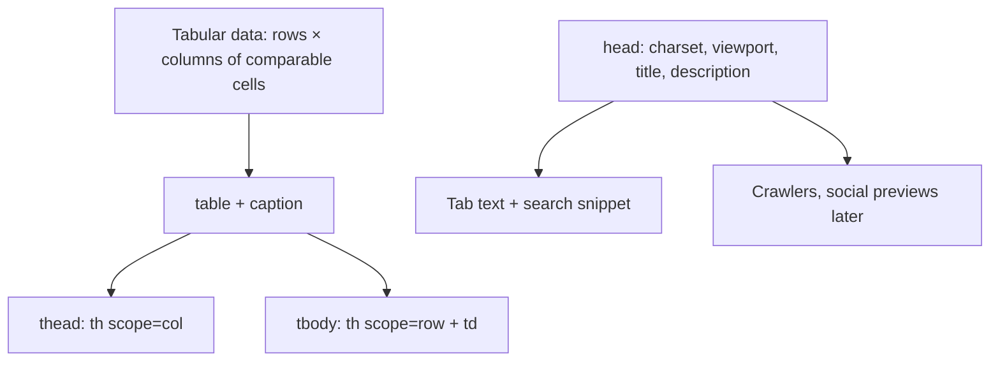
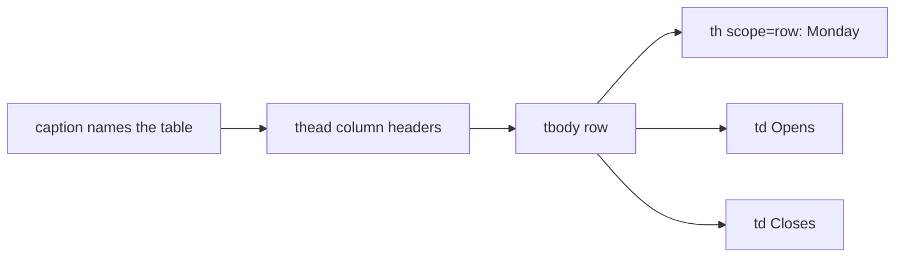

# Month 2 · Week 1 · Day 4
# Tables and Metadata — A Real Lab Page

**Month index:** [../../README.md](../../README.md)  
**Week 1:** [1](day-01.md) · [2](day-02.md) · [3](day-03.md) · Day 4 (today) · [5](day-05.md) · [6](day-06.md) · [7](day-07.md)  
**Week rhythm today:** Add a real project feature  
**Study time:** 3–4 focused hours  
**Prereq:** Day 3 gate. You can write a semantic document from a spec.  
**Student state:** You have a clinic page from memory. Today you add **tabular data** and honest **document metadata** — still in the lab, still not Project 1.

This is **not** Project 1. You extend the HTML lab with tables and document metadata. This textbook will not give you the portfolio source.

---

## How to read this chapter

A table is a **matrix of comparable cells**, not a way to draw two columns on a page. Metadata is what machines read in `head` before they care about your layout.

Imagine a spreadsheet printed into the page: every value sits under a column name and beside a row name. Screen readers use those names. If you fake the spreadsheet with `div`s, the spreadsheet disappears for them. If you fake the **page layout** with `<table>`, you have used 1998’s CSS.

Read each section. Close it. Say it in one sentence. Then type the hours table. In DevTools Accessibility pane, select a `td` and confirm the headers are associated. If they are not, you forgot `scope`.



Serve over **HTTP**, not `file://`.

---

## Today's contract

By the end of this day you will be able to:

1. Decide when a table is correct (tabular data) and when it is a layout crime.
2. Build a **data table** with `caption`, `thead`, `tbody`, `th` + `scope` — not a layout grid of `<div>`s.
3. Explain `scope="col"` vs `scope="row"` so someone else can hear which cells are headers.
4. Add metadata: `title`, `meta name="description"`, `lang`, charset, viewport, favicon **concept**, Open Graph **concept**.
5. Inspect a data cell in the Accessibility pane and see associated headers.

**Today's gate**

> A table is for tabular data. `th scope="col"` or `scope="row"` tells assistive tech what the header applies to. Metadata is for humans *and* machines that never look at your CSS.

If you cannot say that, stay here. Day 5’s tests will break a `scope` on purpose — you need to know what it was for.

---

## Time box

| Block | Minutes | Work |
|---|---|---|
| A | 55 | Theory: tables + metadata (read slowly) |
| B | 50 | Type-along table |
| C | 70 | Feature: clinic or new hours table + head metadata |
| D | 30 | README stub + git |
| E | 15 | Explain the table aloud |

---

# Block A — Theory

## 1. When a table is correct

Use `<table>` when the content is **rows and columns of related data**: hours, comparison, scores, invoices, a course catalog, fees.

Each cell answers the same *kind* of question as the cell next to it. Monday’s “Opens” is comparable to Tuesday’s “Opens.” That comparability is what makes it a table.

Do **not** use tables to position a hero next to an image. That was 1998. Layout is CSS (Weeks 3–4). A “sidebar plus article” is two landmarks, not two `<td>`s.

**Wrong belief:** “Tables are old; never use them.”  
**Correct:** Layout tables are wrong. Data tables are required for accessibility of tabular data.

**Wrong belief:** “I’ll use a list of paragraphs instead; tables are hard.”  
**Correct:** a list cannot express “this number is the Close time for Wednesday.” You lose the two-axis relationship.

Project 1 might include a small skills or hours table. It might not. Either way you must be able to write one. Do not paste a portfolio.

---

## 2. Anatomy — the pieces and why each exists

```html
<table>
  <caption>Clinic hours this week</caption>
  <thead>
    <tr>
      <th scope="col">Day</th>
      <th scope="col">Opens</th>
      <th scope="col">Closes</th>
    </tr>
  </thead>
  <tbody>
    <tr>
      <th scope="row">Monday</th>
      <td>08:00</td>
      <td>18:00</td>
    </tr>
  </tbody>
</table>
```

| Element | Job |
|---|---|
| `caption` | Title of the table. **First child.** Visible and announced. Not a nearby `h2` pretending to be the table’s name (an `h2` is good for the page outline; the caption is tied to *this* table). |
| `thead` / `tbody` / `tfoot` | Header rows, body rows, optional footer (totals). They group; they do not replace `th`. |
| `tr` | One row. Do not put `td` directly in `table`. |
| `th` | Header cell. Needs `scope="col"` or `scope="row"` (or a more advanced `headers` id pattern you do not need yet). |
| `td` | Data cell. |

`colspan` / `rowspan`: know they exist. Avoid them today unless the data truly spans. They are easy to get wrong for screen readers. A merged “Weekdays 08:00–18:00” cell looks clever and often breaks header association.



When a screen reader is on the `18:00` cell, it should be able to announce something like **Monday, Closes, 18:00** — because `scope="row"` on Monday and `scope="col"` on Closes tied those headers to that cell.

**Wrong belief:** “Bold text in the first row is a header.”  
**Correct:** `<th scope="col">` is a header. `<td><strong>Day</strong></td>` is a data cell that looks loud.

---

## 3. `scope` — the association, not decoration

- `scope="col"` — this `th` describes the **column** (every cell beneath it in that column).
- `scope="row"` — this `th` describes the **row** (every cell to its right, in LTR).

A hours table usually needs **both**: days as row headers, Opens/Closes/Notes as column headers.

If you skip `scope`, some browsers still *guess* from position. Guessing is not a test you can pass. Day 5 will mismatch or remove `scope` and you will watch the Accessibility pane get worse. Write `scope` on purpose today.

Simple rule for this month:

- Header row at the top: each `th` gets `scope="col"`.
- First cell of each body row that names the row: `th scope="row"`.
- Other cells: `td`.

---

## 4. Metadata in `head` — the document’s business card

The **body** is what people read. The **head** is what browsers, search engines, and social crawlers read first. A beautiful body with a missing charset still garbles a name like “Café.” A missing viewport still makes phones pretend the page is 980px wide.

| Tag | Required this month? | Job |
|---|---|---|
| `meta charset="utf-8"` | Yes | Decoding. Put it **early** in `head`, before any non-ASCII is interpreted. |
| `meta name="viewport" content="width=device-width, initial-scale=1"` | Yes | Mobile layout: use the real device width. |
| `title` | Yes | Tab, bookmarks, search result title. Unique per page. “Document” on every file is a defect. |
| `meta name="description"` | Yes on lab pages from today | Short summary (~150 characters). Not a keyword dump. Must be **true**. |
| `html lang="..."` | Yes | Pronunciation, hyphenation, translation hint. Wrong `lang` is an accessibility defect. |
| `link rel="icon"` | Concept + optional file | Favicon in the tab. |
| Open Graph (`og:title`, `og:image`, …) | Concept only | How Slack/Twitter/Facebook preview a link. Not required to pass Project 1. You must know it exists. |

```html
<head>
  <meta charset="utf-8">
  <meta name="viewport" content="width=device-width, initial-scale=1">
  <title>Harbor Veterinary Clinic — Hours</title>
  <meta name="description" content="Weekday and weekend hours, emergency line, and visiting notes for Harbor Veterinary Clinic.">
  <!-- Favicon: a 32×32 PNG or SVG named favicon.ico / icon.svg -->
  <!-- <link rel="icon" href="favicon.svg" type="image/svg+xml"> -->
</head>
```

**Title vs `h1`:** they often share words (the clinic name) but they are different jobs. `title` is the tab. `h1` is the page’s outline root. Do not skip `h1` because `title` exists.

**Description:** write a sentence a human would want under a search result. “clinic vet hours harbor veterinary dogs cats emergency weekend” is a keyword dump. Refuse it.

### Favicon (concept)

Browsers look for an icon to show in the tab. You may add a tiny SVG:

```html
<link rel="icon" href="favicon.svg" type="image/svg+xml">
```

The file must be next to the HTML (relative URL) and served over HTTP. A missing icon is not an accessibility fail. A 404 icon is noise in the Network panel — either add the file or omit the `link`.

### Open Graph (recognize, do not require in labs)

```html
<meta property="og:title" content="Harbor Veterinary Clinic">
<meta property="og:description" content="Hours and visiting notes.">
<meta property="og:image" content="https://example.com/share.png">
```

Those image URLs must be **absolute** on a real site (`https://…`). Local `file://` previews will not look like production. Social crawlers do not run your CSS. They read these tags.

**Wrong belief:** “Metadata is SEO trickery; I can skip it until I have a brand.”  
**Correct:** charset, viewport, `lang`, and `title` are document correctness. Description is honesty. Open Graph is optional awareness.

## 5. `lang` again

`html lang="en"` (or your language). It affects hyphenation, screen-reader pronunciation, and translation tools. Mark a French quotation with `lang="fr"` on that element if the page is otherwise English. Wrong page-level `lang` is an accessibility defect — the voice engine will mispronounce everything.

---

## 6. Tables are not CSS

You will not style the table today beyond what the user agent does. Borders may look faint. That is fine. Meaning is the tags. Week 3 may paint header backgrounds. Week 4 may make a table scroll on a narrow viewport (`overflow: auto` on a wrapper) — still a **data** table, not a layout table.

**Wrong belief:** “Without CSS the table looks ugly so I should use cards instead.”  
**Correct:** cards are a layout. Comparable hours belong in a table even if they are unstyled.

---

# Block B — Type-along

Create `~\fullstack-lab\month-02\week-01\day-04\hours.html`.

Type a complete document (doctype through footer) whose **main** content is a hours table:

- Caption
- Columns: Day, Opens, Closes, Notes
- At least 7 rows (a week)
- First column `th scope="row"`
- Header row `th scope="col"`
- `meta name="description"` that is true of *this* page
- Unique `title` that includes the clinic or lab name
- `header` / `nav` / `main` / `footer` as on Day 1
- Exactly one `h1` (the page title). The caption is the table’s title, not a second `h1`.

Serve over HTTP (`http://127.0.0.1:.../hours.html`). In DevTools Accessibility pane, select a `td` and see if the row and column headers are associated.

If they are not, you forgot `scope`.

Write `PANE.txt`: the text you see for one Wednesday Closes cell (headers + value). That is evidence, not a vibe.

---

# Block C — Feature

Either extend Day 3’s clinic (copy `clinic.html` into day-04 **by retyping the parts you still need**, then add the table) or keep `hours.html` as the feature and add:

1. A second small table: **fees** (service, price). Same caption/`scope` rules. Invent three services. Prices are fiction.
2. `month-02/week-01/README.md` listing Day 1–4 files and how to serve them over HTTP (the command you actually use on Windows).

Do not copy-paste an entire previous file from the editor’s history if that means you never look at the tags. Retype the skeleton. You may copy *your* data (the clinic name).

Do not add CSS. Do not add a form (Week 2). Do not use a table for the header/nav.

Optional: a `favicon.svg` (a 32×32-ish square with a letter) and a `link rel="icon"`. If the Network panel shows 404, fix or remove the link.

---

# Block D — Git

```powershell
cd ~\fullstack-lab
git add month-02/week-01
git commit -m "Add semantic hours tables and document metadata."
```

---

# Block E — Recall

Close the file.

1. Why not use a table for the page header?
2. What does `scope="col"` mean?
3. What is `meta name="description"` for?
4. What problem does Open Graph solve? When would you skip it?
5. Why is a caption not the same job as `h1`?
6. What did the Accessibility pane show for a data cell?

---

## Definition of done

- [ ] At least one correct data table with caption and `scope`
- [ ] A second fees table **or** the clinic extension includes the hours table
- [ ] Description meta present and true
- [ ] Accessibility pane shows headers for a data cell (`PANE.txt`)
- [ ] I did not use a table for layout
- [ ] README stub explains HTTP serve
- [ ] Commit exists
- [ ] I did not paste Project 1

---

## Optional review links

Tables, captions, `scope`, and metadata are explained in this chapter. These pages are for later checking, not for first learning.

- [MDN: `<table>`](https://developer.mozilla.org/en-US/docs/Web/HTML/Element/table)
- [MDN: HTML table accessibility](https://developer.mozilla.org/en-US/docs/Learn_web_development/Core/Structuring_content/HTML_table_accessibility)
- [MDN: The document head](https://developer.mozilla.org/en-US/docs/Learn_web_development/Core/Structuring_content/Webpage_metadata)
- [Open Graph protocol](https://ogp.me/) (external spec; optional later reading of the top only)

---

## Tomorrow

Tests, refactor, documentation for the Week 1 HTML lab. You will break a heading or a `scope` on purpose and watch a claim fail.
