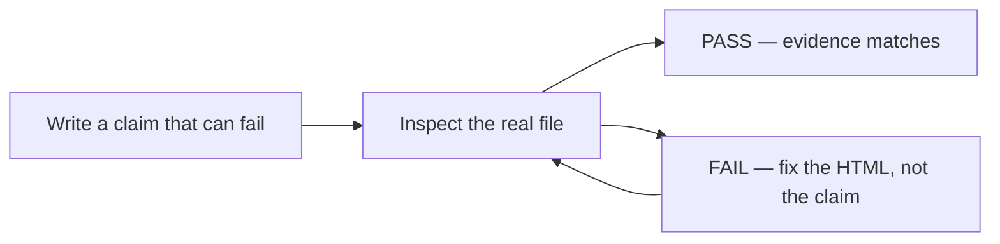

# Month 2 · Week 1 · Day 5
# Tests, Refactor, Documentation — HTML Lab

**Month index:** [../../README.md](../../README.md)  
**Week 1:** [1](day-01.md) · [2](day-02.md) · [3](day-03.md) · [4](day-04.md) · Day 5 (today) · [6](day-06.md) · [7](day-07.md)  
**Week rhythm today:** Tests + refactor + documentation  
**Study time:** 3–4 focused hours  
**Student state:** You have typed real HTML this week — a document skeleton, text and links, a clinic or hours page, a data table. Today you stop “hoping it is fine” and start **claiming** what is true.

There is no Jest yet. A test is still a **claim that can fail**.

---

## How to read this chapter

You already know how to write tags. Today is a different skill: **proving** that a page still has the properties this week required.

Read Block A until you can explain, in your own sentences, the difference between “I looked at it” and “claim H4 failed.” Then fill `TESTS.md` from **real files**, not from memory of what you meant to type. The validator is allowed as a tool. It is not the teacher.

If you finish early, do not add CSS. Do not add a form. Tighten the markup you already have.

---

## Today's contract

By the end of this day you will be able to:

1. State what a **test** is this month: a claim about a file that can be shown false.
2. Run a written checklist on `clinic.html` or `hours.html` (plus Day 1–2 pages) and record PASS or FAIL from evidence.
3. Explain what “valid HTML” and “accessible table” mean as tests, not as vibes.
4. **Refactor** markup for clarity without changing meaning and without adding CSS or forms.
5. Write a README a stranger could follow on a cold start: how to serve, which file to open, how to run the tests, what this week does *not* do.
6. Break one heading or one `scope` on purpose, show which claim fails, then restore it.

**Today's gate.** You pass Day 5 when you can show:

> I can break one heading or one `scope` on purpose and show which checklist item fails. Then I restore it.

If you cannot, you do not yet have tests. You have a wish list. Stay here.

---

## Time box

| Block | Minutes | Work |
|---|---|---|
| A | 25 | What “valid HTML” and “accessible table” mean as tests |
| B | 50 | Write and run `week-01/TESTS.md` |
| C | 70 | Refactor markup (clarity, not new features) |
| D | 40 | Documentation |
| E | 15 | Deliberate break |

---

# Block A — Theory

## 1. What a test is (you already met this in Month 1)

A **test** is a claim about behavior that can fail.

Not a test:

- “I opened the page and it looked fine.”
- “I remember putting `lang` on `html`.”
- “The professor’s example had a table, so mine probably does too.”

A test:

- “This file has `<!DOCTYPE html>` as the first thing the parser sees.”
- “There is exactly one `h1` in the page under test.”
- “Every `th` in the hours table has `scope`.”

Later, a test framework will run claims automatically. Today **you** run them with View Source, DevTools, search, and (optional) the Nu HTML Checker. Same idea as Month 1’s `TESTS.md`: arrange, act, assert.



**Wrong belief:** “If I cannot see a problem, the page is correct.”  
**Correct:** many HTML defects are invisible in pixels. Two `h1`s still look like two large titles. A missing `scope` still draws a grid. The test is about the **DOM and the markup**, not the screenshot.

## 2. Why HTML needs tests this early

HTML is not a program that “throws.” The browser is famously forgiving. It will **invent** a tree if your tags are messy. That is why “it rendered” is almost never evidence of a good document.

You test HTML so that:

1. **You** catch missing `lang`, skipped headings, and unlabeled images before Week 2 forms multiply the damage.
2. **A future you** can change a page and know what must still be true.
3. **Project 1** inherits the habit: claims, not vibes. The portfolio will have its own definition of done. This week’s checklist is practice for that.

## 3. HTML tests this week

| Kind | Example claim |
|---|---|
| Document | File has `<!DOCTYPE html>` and `lang` |
| Outline | Exactly one `h1`; no skipped levels |
| Semantics | `main` appears once |
| Media | Every `img` has `alt` (possibly empty) |
| Tables | Every `th` has `scope` |
| Metadata | `title` and description exist |
| Serve | Page opens over `http://127.0.0.1` |

You check these with your eyes, DevTools, and (optional) the [W3C Nu HTML Checker](https://validator.w3.org/nu/). Paste is allowed **into the validator** for a file you wrote. The validator is a tool, not a tutorial.

### 3.1 What “valid HTML” means as a test

**Valid** here means: the markup matches the HTML living standard well enough that the parser should not have to guess, and the Nu checker reports **no errors**.

Warnings are not the same as errors. A warning might be “consider adding a `main` landmark” or a trailing-slash habit. Read each warning. If you understand it and it is not a course requirement, you may leave it. If you do not understand it, look it up **in this week’s day files**, then decide.

Validity is **not** “I used semantic tags.” You can write a valid page that is a soup of `div`s. You can write an almost-valid page that skips `h2`. This week’s checklist therefore has **both** validity-shaped claims (doctype, charset) **and** meaning claims (one `h1`, `scope` on `th`).

**Wrong belief:** “The validator is the whole test.”  
**Correct:** the validator catches syntax and some structure. It will not fail you for “click here,” a missing description that is still *present but false*, or serving over `file://`. Those are **your** claims.

### 3.2 What “accessible table” means as a test

An accessible data table is not “a grid of cells that looks neat.”

It is a table where:

1. A **caption** names the table so a screen-reader user knows what the grid is before hearing cells.
2. Header cells are **`th`**, not bold `td`.
3. Each `th` has **`scope="col"`** or **`scope="row"`** so assistive tech can say which header belongs to which data cell.
4. The data is actually tabular — comparable rows and columns — not a layout hack.

Claim H9 is that test. If you remove `scope`, H9 must fail. That is the point of Block E.

### 3.3 What “served over HTTP” means as a test

Opening a file from Explorer often produces an address bar that starts with `file:///`. That is **not** how the web loads a page. Relative URLs, later JavaScript modules, and “what a server actually does” all assume **HTTP**.

On Windows you serve a folder, then open `http://127.0.0.1:…` in the browser. Claim H11 is: the address bar shows `http://`, not `file://`.

If you cannot remember the serve command, it belongs in the README you will write in Block D — that is documentation as a test of understanding.

## 4. Refactor

**Refactor** means change structure for **clarity** without changing meaning.

Allowed today:

- Better heading text that still matches the outline rank
- Move a stray `div` to `section` when the region actually has a heading
- Split a too-long `p` into two paragraphs
- Replace `b`/`i` with `strong`/`em` when you meant importance or stress
- Make footer links descriptive (“Clinic hours” instead of “click here”)
- Remove useless wrappers that add no meaning

Not a refactor (do these only if they were already required and missing — that is a **fix**, and it should fail a test first):

- Adding CSS
- Adding a contact form (Week 2)
- A new page of features
- Turning the hours table into `div`s because “tables are old”

Rule you already know from Month 1: correctness → clarity → measurement → optimization. Today is **clarity**. Re-run the checklist after.

**Wrong belief:** “Refactor means make it fancier.”  
**Correct:** refactor means the same document, easier to read and easier to test. Fancy is a feature. Features wait.

## 5. Documentation as a test of understanding

If you cannot write “how to serve / which file to open first / how to run TESTS.md / what this week cannot do,” you do not yet understand the lab. A README is not decoration for GitHub. It is the cold-start script for a human — including you next month.

`month-02/week-01/README.md` must include: purpose, how to serve (the exact command you use), which file to open first, how to run TESTS.md, limitations (no CSS yet).

## 6. Worked example — a claim that fails on purpose

Suppose `hours.html` has this outline:

```html
<h1>Northside Clinic</h1>
<h3>This week’s hours</h3>
```

You skipped `h2`. The page still “looks like a heading” if CSS later makes `h3` large. The **test** does not care about pixels.

- Claim H4: exactly one `h1` — still PASS.
- Claim H5: no heading level skip — **FAIL**.

Fix: change the hours heading to `h2`, or insert a real `h2` section if the outline truly has three ranks. Then H5 PASSes.

That is science. You did not “tweak until it felt right.” You named the claim.

---

# Block B — TESTS.md

Create `~\fullstack-lab\month-02\week-01\TESTS.md`. Fill PASS/FAIL from **real files** (`clinic.html` or `hours.html` plus Day 1–2 pages).

| ID | Claim | How | Result |
|---|---|---|---|
| H1 | Doctype present | View source | |
| H2 | `html` has `lang` | View source | |
| H3 | Charset + viewport in `head` | View source | |
| H4 | Exactly one `h1` in the page under test | DevTools | |
| H5 | No heading level skip | Outline | |
| H6 | One `main` | Search | |
| H7 | All `img` have `alt` | Search `img` | |
| H8 | All links have non-empty, non-“click here” text | Read | |
| H9 | Hours table has `caption` and `scope` | Read | |
| H10 | `meta name="description"` exists | Read | |
| H11 | Served over HTTP | Address bar | |
| H12 | Optional: Nu checker reports no **errors** (warnings OK if you understand them) | validator.w3.org/nu | |

Fix FAILs. Do not weaken the claim.

How to run each kind of check, in this book, so you are not hunting a blog:

**View source.** In Chrome or Edge: right-click the page → View page source, or `Ctrl+U`. You are reading the **file the server sent**, not the live DOM after the parser repaired you. Doctype and `lang` belong here.

**DevTools outline.** Open Elements. Expand `body`. Read heading tags in order: `h1`, then `h2`, then `h3`. If you see `h1` then `h3`, H5 fails. Count `h1` and `main` with search (`Ctrl+F` in Elements).

**Search `img`.** In the editor or in Elements, find every `img`. Each must have an `alt` attribute. Empty `alt=""` is allowed for decorative images. A missing attribute is a FAIL for H7.

**Address bar.** After you start your static server from the lab folder, the URL must begin with `http://127.0.0.1` or `http://localhost`. If it begins with `file://`, H11 fails. Stop. Serve the folder. Do not argue with the claim.

**Nu checker (optional).** Open the checker. Use “text input” or “file upload” for **your** HTML. Errors must go to zero if you tick H12. Warnings: read them; keep a one-line note in TESTS.md if you left any.

Any FAIL: fix the **HTML**, re-run that row, do not edit the claim to make it “nicer.”

---

# Block C — Refactor

Commit the test file first. Then clean **one** page:

- Remove useless wrappers
- Fix any `b`/`i` that should be `strong`/`em`
- Ensure footer links are descriptive

Second commit: `Refactor clinic/hours markup for a clearer outline.`

Before you touch markup:

```powershell
cd ~\fullstack-lab
git add month-02/week-01/TESTS.md
git status
```

Commit tests when they exist, even if some rows are still FAIL — then **fix** until they PASS, then refactor. The refactor commit should be structure, not “I also invented a new section.” After the cleanup, re-run H1–H12 on that page. If a test fails, the refactor changed meaning or you deleted a required piece. Put it back.

---

# Block D — README

`month-02/week-01/README.md` must include: purpose, how to serve (the exact command you use), which file to open first, how to run TESTS.md, limitations (no CSS yet).

Write it so a classmate who never saw your machine can:

1. `cd` to the folder.
2. Start HTTP (not `file://`). Paste the **exact** command you actually use.
3. Open the first HTML file in the browser.
4. Open `TESTS.md` and perform the table.

Limitations to state honestly:

- No CSS. The page looks like 1995. That is correct.
- No forms yet (Week 2).
- No JavaScript.
- The Nu checker is optional; the checklist is not.

If a command in the README would fail in a **new** PowerShell window, the README is wrong. Fix the README. That is a documentation test.

---

# Block E — Deliberate break

Remove `scope` from one `th`. Recheck H9. Restore. Note it in TESTS.md.

This is the same exam skill as Month 1 Week 1 Day 5: *break a feature and show which test catches it.*

Do it slowly:

1. Commit or at least save a known-good page.
2. Delete `scope="col"` (or `scope="row"`) from **one** `th` only.
3. Re-read the hours table. H9 is now FAIL. Write that in TESTS.md: which file, which `th`, which claim.
4. Restore `scope`. Re-check H9. PASS.
5. If you use git to restore: only restore that file; do not wipe TESTS.md notes.

If H9 still PASSes after you remove `scope`, your claim is too vague or you looked at the wrong file. Tighten how you check — “every `th` has `scope`” means **every**, including the one you just broke.

---

## Security / quality

User-typed strings still do not belong as raw markup. You have no backend; do not pretend a contact table is a form (Week 2).

You type the HTML. Later, when a real user types a name into a field, that string is **data**. If you ever paste user data into the page as tags, you hand the browser extra markup to run. Month 3 will name `textContent` vs `innerHTML`. Today: do not invent a “comments” column you fill with fake HTML from an imaginary user.

```powershell
cd ~\fullstack-lab
git add month-02/week-01
git commit -m "Add Week 1 HTML test checklist and markup cleanup."
```

---

## Definition of done

- [ ] TESTS.md has real PASS/FAIL
- [ ] Refactor did not add CSS or forms
- [ ] Deliberate break caught H9 (or equivalent)
- [ ] README can be followed on a cold start

If any box is false, stay on Day 5. Day 6 is independent HTML with the textbook days 1–5 closed. A missing checklist will become a missing habit.

---

## Common failures today

| What happened | What it usually means |
|---|---|
| Every row is PASS without opening a file | You wished. Re-run from the real page |
| Validator errors, checklist still all PASS | You treated H12 as optional and ignored H1–H3; or you validated a different file |
| Refactor added a `<style>` block | That is a feature. Revert it. CSS is Week 3 |
| Deliberate break: H9 still PASS | You removed `scope` from a `td`, or you did not save, or you checked a copy |
| README says “open the file” | That often means `file://`. Write the HTTP command |

---

## Tomorrow

Independent HTML page. Spec only. Textbook days 1–5 closed.

---

## Optional review links

What “valid,” “heading outline,” and “table headers” mean is explained in this chapter and in Days 1–4. These pages are for later checking, not for first learning.

- [W3C Nu HTML Checker](https://validator.w3.org/nu/)
- [MDN: `<th>` and `scope`](https://developer.mozilla.org/en-US/docs/Web/HTML/Element/th)
- [MDN: Heading elements](https://developer.mozilla.org/en-US/docs/Web/HTML/Element/Heading_Elements)
