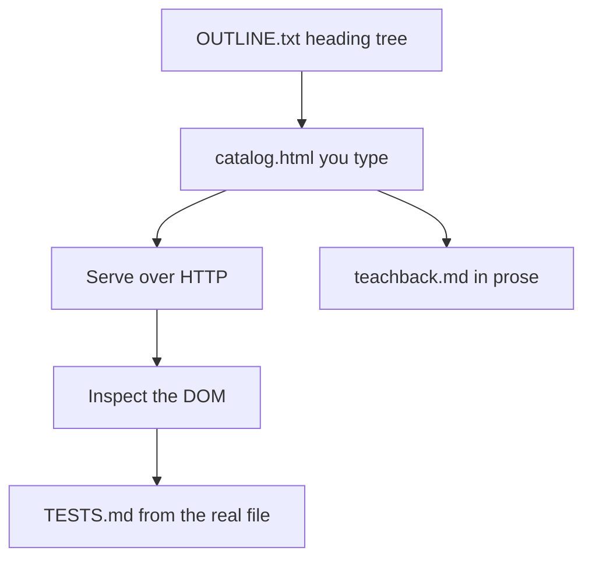

# Month 2 · Week 1 · Day 6
# Independent HTML — Own the Document

**Month index:** [../../README.md](../../README.md)  
**Week 1:** [1](day-01.md) · [2](day-02.md) · [3](day-03.md) · [4](day-04.md) · [5](day-05.md) · Day 6 (today) · [7](day-07.md)  
**Week rhythm today:** Independent project work  
**Study time:** 3–4 focused hours  
**Days 1–5 textbook files:** closed during the *challenges*. If you cannot recall a fact, re-open **Day 1 or Day 2 of this week in this book**, not a tag catalog. This file also contains a full recap so you are not sent elsewhere to learn.

---

## How to read this chapter

Today you prove Week 1 without a type-along. The complete explanation below **is** the lesson. Read a section. Close it. Say it in one sentence. Then write the outline **before** any tags.

If you catch yourself copying `clinic.html` structure blindly, stop. A catalog is a different document. Same *rules*, new *content*.



Keep **this file** open. Keep Days 1–5 closed for the challenges. Repair from the explanation here, or from Week 1 Day 1–2 in this book if you go blank for more than 25 minutes — then log it.

Serve over **HTTP**, not `file://`. Do not start Project 1. The portfolio is a later, separate repo. Today lives in `~\fullstack-lab\month-02\week-01\independent\`.

---

## Complete explanation (this book is the lesson)

You already practiced these ideas. Here they are again in full, so a later review never requires another page.

**HTML** marks up **meaning**. It is not a programming language. It does not loop or decide. It labels: this is a heading, this is a paragraph, this is a table of comparable cells.

The browser **parses** your source into a **DOM tree**. DevTools Elements shows that tree. Invalid markup can produce a **different** tree than you typed. When something is wrong, inspect the tree, not your hope.

### Document frame

A complete document needs:

1. `<!DOCTYPE html>` — HTML5 parsing mode, not quirks mode.
2. `<html lang="en">` (or the real language of the page) — screen readers pronounce correctly; translation tools get a hint. Wrong `lang` is an accessibility defect.
3. `<head>` with **charset** (`utf-8`, as early as possible — before any non-ASCII text is interpreted), **viewport** (`width=device-width, initial-scale=1` so phones do not pretend the page is 980px wide), **title** (tab text, bookmarks, search results — unique per page), and a **description** meta (search snippet; keep it true, ~150 characters, not a keyword dump).
4. `<body>` with the content.

Serve over **HTTP** (`http://127.0.0.1:...`), not `file://`. Relative URLs, later CSS/JS modules, and “how the web actually loads a page” all assume a server.

On Windows, from PowerShell:

```powershell
cd ~\fullstack-lab
python -m http.server 5500
```

Then open `http://127.0.0.1:5500/month-02/week-01/independent/catalog.html`. Do not double-click the file in Explorer.

**Wrong belief:** “Opening the file from disk is good enough for a catalog.”  
**Correct:** relative image paths and later stylesheets are specified against a URL. Practice HTTP today.

### Semantics — landmarks

`header`, `nav`, `main` (exactly **once** per page), `section`, `article`, `aside`, `footer` name **landmarks**. Assistive tech can jump by landmark.

A `div` is a box with **no** meaning. Use it only when you need a hook for CSS/JS and no semantic element fits. `span` is the inline equivalent. If you cannot say why a `div` exists, delete it.

- `section` — a themed chunk that **has a heading**.
- `article` — independently distributable content (a blog post, a card that could stand alone).
- `aside` — tangentially related (a staff note, a tip). Not “the sidebar because I wanted two columns.”

**Wrong belief:** “Landmarks are for later, when I add CSS.”  
**Correct:** landmarks are meaning. CSS is Week 3. The outline must be honest today.

### Headings

Headings are an **outline**, not a font size. Exactly one page-level `h1`. Do not skip levels (`h1` then `h3`). CSS will style size later; today, the tag is the **rank**.

Write `OUTLINE.txt` as a nested list **before** HTML. If the outline is messy, the page will be messy.

### Text

`<p>` for paragraphs. `<strong>` is **importance**. `<em>` is **stress**. `<b>`/`<i>` are presentational leftovers — do not prefer them. `<br>` is a line break inside a line (an address, a poem), not a way to space paragraphs. Empty `p` tags or a pile of `br`s are a defect.

### Links

`<a href="...">` with **descriptive text** (not “click here”, not “read more” with no context). The accessible name of a link is usually its text. Out of context, “click here” is noise.

- `href="#courses"` jumps to `id="courses"`.
- External `target="_blank"` needs `rel="noopener"` (and usually `noreferrer`) so the new tab cannot script the opener.

### Images

Every `img` has `src`, `alt`, and preferably `width`/`height` (aspect-ratio hint before load).

| Situation | `alt` |
|---|---|
| Image conveys information | Describe what it **conveys** (not “image of…”) |
| Decorative (purely visual) | `alt=""` (empty: assistive tech should skip it) |
| Missing `alt` attribute | **Error** — not the same as empty |

**Wrong belief:** “I’ll put a filename in alt.”  
**Correct:** alt is for humans who cannot see the image. `photo1.png` is not a description.

### Lists

- `ul` + `li` — unordered (departments, ingredients).
- `ol` + `li` — ordered (enrollment steps).
- `dl` / `dt` / `dd` — term and definition (tuition vs materials).

Do not fake lists with dashes inside a `p`. The DOM will not know they are items.

### Tables

For **tabular data** only — a matrix of comparable cells — never page layout.

- `caption` names the table (first child, visible and announced).
- `th` with `scope="col"` or `scope="row"` tells assistive tech which header applies.
- `thead` / `tbody` group rows.

If it is not a grid of comparable cells, it is not a table. Two columns of “sidebar + article” is Week 4 layout, not a table.

**Worked fragment** (jobs, not a paste of a whole page):

```html
<table>
  <caption>Evening courses this term</caption>
  <thead>
    <tr>
      <th scope="col">Course</th>
      <th scope="col">Hours</th>
      <th scope="col">Level</th>
    </tr>
  </thead>
  <tbody>
    <tr>
      <th scope="row">Intro HTML</th>
      <td>12</td>
      <td>Beginner</td>
    </tr>
  </tbody>
</table>
```

When you inspect a `td` in the Accessibility pane, you should see the course name and the column name associated. If not, you forgot `scope`.

### Security start

You type the markup. User-supplied strings later must never be pasted in as HTML (Month 3: `textContent` vs `innerHTML`). Today: do not invent a “comments” section of raw HTML you pretend a user typed.

**Wrong belief:** “If it looks like a heading, I can use a big `p`.”  
**Correct:** looks are CSS. Meaning is the tag.

### Worked walk-through — outline then tags

Suppose the school is **North Jetty Evening School**. Outline first:

```
h1 North Jetty Evening School
  h2 Departments
  h2 How to enroll
  h2 Tuition
  h2 Course table
```

Then landmarks: `header` (wordmark + `nav`), `main` (the outline), `footer`. Departments = `ul`. Enroll = `ol`. Tuition = `dl`. Course table = `table` with caption and `scope`. That mapping is the skill. If you open the editor and type `div` soup until it “looks like a catalog,” you skipped the mapping.

A `dl` fragment you can type after the outline exists:

```html
<h2>Tuition</h2>
<dl>
  <dt>Tuition</dt>
  <dd>$180 per evening course</dd>
  <dt>Materials</dt>
  <dd>$25 estimated for printed packets</dd>
</dl>
```

`dt` is the term. `dd` is the description. Two pairs. Not a table (there is no matrix of comparable cells). Not a `ul` of “Tuition: $180” strings.

---

## Office hours — missing meaning, fake lists, and layout tables

Bring these defects to the file, not to a chat thread. They are the same bugs Week 1 Day 7 will ask you to diagnose.

### Missing or dishonest `alt`

You have two images. One conveys information (a campus map, a course badge that is the only place the course name appears). That one needs words in `alt`. The other is a flourish (a divider, a patterned strip). That one needs `alt=""`. Omitting the attribute is not “decorative.” It is an error. Putting `alt="image"` on both is also an error — the informative one said nothing, and the decorative one was announced as noise.

### Heading skip because “h3 looks nicer”

There is no nicer. Rank is the outline. If you want a quieter visual later, Week 3 CSS will size `h2`. Today, Services is `h2` under the page `h1`. Parking under Visiting is `h3`. An `h1` in the header *and* an `h1` in `main` is two page titles.

### Fake lists

```html
<!-- WRONG -->
<p>- Painting
- Printmaking
- Night welding</p>
```

The DOM has one paragraph. Assistive tech cannot jump item to item. Type `ul`/`li`. Same for numbered steps: `ol`, not `1.` inside a `p`.

### Table used as two columns

A “sidebar” cell and an “article” cell is layout. Week 4 will teach Flex and Grid. Today, if the cells are not comparable (course vs hours vs level), it is not a table. Four courses with those columns **are** comparable. That is why the spec asks for a data table.

### “Click here” in nav

The accessible name of a link is its text. A nav that says “here”, “here”, “click here” is three identical names. Write “Course table”, “Day 2 repaired page”, “MDN HTML element reference”.

**Wrong belief:** “I’ll add CSS next week so the outline can be messy today.”  
**Correct:** CSS cannot invent a second `h1` into one, or turn a `p` of dashes into a list. The catalog’s meaning is the tags you type now.

### Inspect before you declare victory

1. Serve HTTP. Confirm the **tab title** matches your unique `<title>`.
2. Elements: one `h1`, landmarks present, table has `caption` and `th` with `scope`.
3. Accessibility pane on a data cell: row header and column header associated.
4. Every `img` shows an `alt` attribute in the tree (empty string counts; missing does not).

If Elements rewrote your tags (a `p` closed early, a `div` inside a `p`), fix the source. The live tree is what users get.

### Common failures on the independent catalog

| What happened | What it usually means |
|---|---|
| Two `h1`s | Wordmark in `header` used `h1`; change it to a `p` |
| Table has no headers in the pane | You used `td` for the first row instead of `th` + `scope` |
| Decorative image announced | You wrote `alt="decoration"` instead of `alt=""` |
| TESTS.md all PASS from memory | You did not open *this* `catalog.html` |
| Page is the clinic with “School” in the title | You copied Day 3. Delete and outline a new school |

---

## Today's contract

By the end of this day you will have a **new** page (not the clinic, not the library) that you can explain tag by tag, a teach-back in prose, and TESTS.md filled from the real file.

**Today's gate**

> I built a new page I can explain tag by tag, including a table and honest metadata, without copying a previous lab’s structure blindly.

---

## Time box

| Block | Minutes | Work |
|---|---|---|
| A | 20 | Read the complete explanation; speak it |
| B | 20 | OUTLINE.txt only — no HTML yet |
| C | 90 | catalog.html |
| D | 40 | teachback.md |
| E | 30 | TESTS.md from the real DOM |
| F | 15 | Git |

---

Create `~\fullstack-lab\month-02\week-01\independent\`.

# Challenge 1 — Course catalog page (required)

Build `catalog.html` for a fictional **evening school** (not the clinic, not the library from Day 2). Invent the school name. Put it in the `title` and the `h1` (one `h1`).

Required:

1. Full document skeleton; unique `title` and `description`
2. Landmarks: `header`, `nav`, `main`, `footer`
3. Exactly one `h1`; `h2`/`h3` without skips
4. Intro `p` using `em` or `strong` correctly once each
5. Unordered list of departments
6. Ordered list of “how to enroll” steps
7. A `dl` of two terms (tuition vs materials)
8. One informative image + one decorative image (`alt` correct)
9. One descriptive external link; `noopener` if `target="_blank"`
10. A **data table**: at least 4 courses, columns Course, Hours, Level, with caption + `scope`
11. No CSS. No forms. No layout tables. No `div` soup.

Write `OUTLINE.txt` **before** HTML (heading tree). If the HTML exists first, you skipped the point.

Nav may link in-page (`#courses`) and to one previous lab with **descriptive** text (not “here”).

Serve at `http://127.0.0.1:.../catalog.html`. Confirm the tab title.

The table needs **four** body rows, not one demo row. Caption names *this* table (“Evening courses this term”), not “Table 1.”

# Challenge 2 — Teach-back (required)

`teachback.md` (400–700 words): what semantic HTML is, why `main` is not a `div`, why tables need `scope`, why `alt=""` is sometimes right. Use the complete explanation above. **Prose**, not a bullet dump. Write as if a classmate missed Week 1.

If your teach-back is a list of tags, rewrite it. If it quotes MDN as the teacher, you used the wrong source — this chapter is the lesson.

# Challenge 3 — Self-audit (required)

Reuse the Week 1 TESTS claims on `catalog.html`. Record in `TESTS.md`. Fill PASS/FAIL from **this** file’s DOM, not from memory.

If something FAILs, fix the HTML, then re-run. Do not weaken the claim.

# Stretch

Add a second table (room assignments) with row headers. Justify in one sentence why it is tabular (comparable cells: room, course, time — not a layout hack).

---

```powershell
cd ~\fullstack-lab
git add month-02/week-01/independent
git commit -m "Add independent catalog page with semantic table."
```

---

## Definition of done

- [ ] Outline existed before markup
- [ ] All required features present
- [ ] TESTS.md filled from the real file
- [ ] Teach-back is prose, not a bullet dump
- [ ] Page served over HTTP
- [ ] No Project 1 portfolio (wrong week)
- [ ] I can explain every tag without opening Day 1

---

## Optional review links

Repair from Days 1–2 and the complete explanation in this file, not from a tag catalog.

- [MDN: HTML elements reference](https://developer.mozilla.org/en-US/docs/Web/HTML/Element)
- [MDN: HTML table accessibility](https://developer.mozilla.org/en-US/docs/Learn_web_development/Core/Structuring_content/HTML_table_accessibility)
- [MDN: `<title>`](https://developer.mozilla.org/en-US/docs/Web/HTML/Element/title)

---

## Tomorrow

Week 1 review: speak the week, mini-build from this book, debug classic HTML defects. Days 1–6 stay closed during that mini-build.
