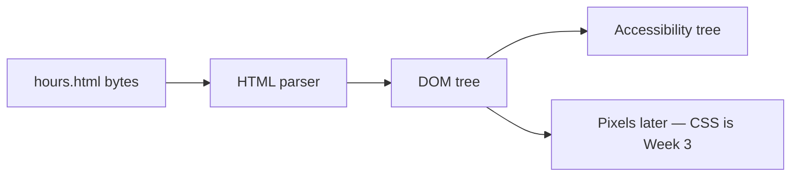

# Month 2 · Week 1 · Day 7
# Week Review — HTML

**Month index:** [../../README.md](../../README.md)  
**Week 1:** [1](day-01.md) · [2](day-02.md) · [3](day-03.md) · [4](day-04.md) · [5](day-05.md) · [6](day-06.md) · Day 7 (today)  
**Week rhythm today:** Review, repair, plan Week 2  
**Study time:** 3–4 focused hours  
**Student state:** You have built documents, lists, links, images, a table, tests, and an independent catalog. Today you prove the ideas still live in your head — from **this file**, not from a tag catalog.

Do not start Week 2 because the calendar moved. Start Week 2 because this file’s gate is true.

---

## How to read this chapter

This is a **closed-book teaching day**. The synthesis below is the lesson, written so you can re-learn Week 1 from this page alone if last week is foggy.

1. Read a section. Close it. Say the idea in one honest sentence.
2. Then do the seven exam blocks in order. During the mini-build, Days 1–6 stay closed. If you go blank, re-read **this synthesis**, not a random article.
3. Repair the weakest topic **today**. Week 2 (forms) assumes headings, labels-as-meaning, and HTTP are automatic.

---

## Week synthesis (the lesson, in this book)

**HTML** is markup, not a program. The browser parses it into a **DOM**. You inspect the tree in DevTools, not by hoping the pixels look right.

**Document:** `<!DOCTYPE html>`, `html lang`, `head` (charset first, viewport, title, description), `body`. Serve over **HTTP**.

**Landmarks:** `header` / `nav` / `main` (one) / `footer`. `section` and `article` when the heading structure actually needs a labeled region. `aside` for tangentially related content. `div`/`span` have no meaning.

**Headings:** one `h1`; no skipped levels. Headings are rank, not size.

**Text:** `p`, `strong` (importance), `em` (stress). Do not use `br` as a paragraph machine.

**Links:** `a` with href and honest text. Fragment `#id`. New tabs: `rel="noopener"`.

**Images:** every `img` has `alt`. Empty alt = decorative. Missing alt = broken.

**Lists:** `ul`/`ol`/`li`; `dl` for terms.

**Tables:** data only. `caption`, `th` + `scope`, `thead`/`tbody`. Never for two-column layout.

**Metadata:** `title` is required and unique per page. Description meta should match the page. Favicon and Open Graph are extras; they do not replace `title`.

**Wrong belief:** “If it looks like a heading, I can use a big `p`.”  
**Correct:** looks are CSS. Meaning is the tag.

The rest of this synthesis unpacks each sentence so a student who only has **today’s file** can still teach the week.

---

## Today's contract

By the end of this day you will be able to:

1. Teach Week 1 HTML aloud from the synthesis, without opening Days 1–6.
2. Build a small valid-shaped page from memory: skeleton, outline, list, image, table, metadata — served over HTTP.
3. Diagnose five classic defects (two `h1`s, alt missing vs empty, table without `th`, `file://`, “click here”).
4. Review one real page from this week: one strength, one defect, one committed fix.
5. Re-run TESTS.md on the mini page and add one new claim.
6. Answer when `section` vs `article` vs “just headings” vs “must not be a table.”
7. Write a retro and a Week 2 plan, then repair the weakest HTML topic today.

**Today's gate.** Closed-book, you can write a skeleton, a heading outline, a list, a link, an image, and a small table, and explain each from the synthesis. Week 2 (forms) assumes this is automatic.

If you cannot, stay on Week 1. A form on a broken document is two problems.

---

## Time box

| Block | Minutes | Work |
|---|---|---|
| 1 | 40 | Closed-book explanation |
| 2 | 40 | Independent mini-build |
| 3 | 30 | Debugging |
| 4 | 25 | Code review |
| 5 | 20 | Testing |
| 6 | 20 | Design question |
| 7 | 30 | Retro + Week 2 plan + weak-area repair |

---

# Complete explanation — HTML you must still own

## 1. Markup, parser, DOM

HTML marks up **meaning**. It is not Python. There is no loop. There is no “run.” You write tags; the browser **parses** the file into a tree of nodes called the **DOM** (Document Object Model). DevTools **Elements** shows that tree — including repairs the parser made when your tags were invalid.

That is why “it showed up on screen” is not proof you wrote what you think you wrote. A missing `</p>` can still produce a paragraph. A stray `div` inside a `p` can close the `p` for you. Inspect the tree.



**Wrong belief:** “The source and the Elements panel are always the same.”  
**Correct:** Elements is the **live tree**. Source is what you sent. If they disagree, the parser guessed. Fix the source.

## 2. The document you always type

A complete HTML5 document has a shape. Memorize the jobs, not a poem.

1. **`<!DOCTYPE html>`** — tells the browser to use HTML5 parsing, not ancient “quirks” mode. It is the first thing in the file.
2. **`<html lang="en">`** (or the real language of the page) — screen readers choose a voice; translation tools get a hint. Missing `lang` is a real defect.
3. **`<head>`** — metadata for the machine and the tab, not the article body.
   - **Charset** (`<meta charset="utf-8">`) as early as possible so the rest of the file decodes correctly.
   - **Viewport** (`width=device-width, initial-scale=1`) so a phone does not pretend the canvas is 980px wide. You will feel this in Week 4. Put it in now.
   - **`<title>`** — tab text, bookmarks, search-result title. Unique per page. Required.
   - **Description meta** — a true sentence about *this* page, not a slogan for the whole site.
4. **`<body>`** — everything a human reads.

Serve it over **HTTP** (`http://127.0.0.1:…`), not `file://`. Relative URLs, later JS modules, and “how the web loads a page” all assume a server. On Windows you start a small static server from the folder, then use the `http://` address. Do not double-click the file in Explorer and call that “deployed.”

**Worked example.** This is a legal skeleton. It is not a clinic and not a catalog — only the shape:

```html
<!DOCTYPE html>
<html lang="en">
<head>
  <meta charset="utf-8">
  <meta name="viewport" content="width=device-width, initial-scale=1">
  <title>Evening hours — Northside Lab</title>
  <meta name="description" content="Lab opening hours for the Northside evening workshop.">
</head>
<body>
  <header>…</header>
  <main>…</main>
  <footer>…</footer>
</body>
</html>
```

Charset before title is the habit. Title before you write a novel in `body`.

## 3. Landmarks — regions with names

Think of the page as rooms, not as a pile of boxes.

| Element | Job |
|---|---|
| `header` | Introductory region (site or section). Often brand + `nav`. |
| `nav` | A block of **navigation links**. Not every list of links. |
| `main` | The unique primary content of **this** page. **One** per page. |
| `section` | A themed region that **has a heading**. Not a wrapper for CSS. |
| `article` | Independently distributable content (a post, a card that could stand alone). |
| `aside` | Tangentially related (a note, related links) — not the main story. |
| `footer` | Footer of the page or of a section: copyright, secondary links. |
| `div` / `span` | **No meaning.** Hook for CSS/JS when no semantic element fits. `span` is inline. |

Skip links in Week 2 will jump to `main`. If you have two `main`s, you have lied about “the” content.

**Wrong belief:** “Semantic HTML means never using `div`.”  
**Correct:** use `div` when you need a box and no landmark fits. Use a landmark when the region *has a job*. Wrapping everything in `section` without headings is not semantics; it is noise.

## 4. Headings are an outline

`h1` through `h6` are **ranks in a table of contents**, not font sizes. CSS will change size in Week 3. Today, the tag *is* the outline.

Rules this course enforces:

- Exactly **one** page-level `h1` (the title of this document).
- Do not skip levels: `h1` then `h3` with no `h2` is a broken outline.
- Subsections of an `h2` are `h3`, and so on.

A screen reader can jump by heading. Two `h1`s are two competing page titles. A big `<p>` that “looks like a heading” is invisible in that jump list.

```
h1  Northside Evening School
  h2  Departments
  h2  How to enroll
    h3  Bring identification
  h2  Course table
```

That ASCII tree is what you should be able to write in `OUTLINE.txt` before you type tags — you did this on Day 6. Do it again on the mini-build.

## 5. Text, importance, stress

- **`<p>`** — a paragraph. New idea, new `p`. Vertical gap is CSS later.
- **`<strong>`** — importance (this warning matters).
- **`<em>`** — spoken stress (this *word* is the point).
- **`<br>`** — a line break **inside** one unit (an address). Not a paragraph machine. Not how you “make space.”
- **`<b>` / `<i>`** — presentational leftovers. Do not prefer them when you mean `strong` or `em`.

**Wrong belief:** “`<br><br>` is how I space sections.”  
**Correct:** sections are headings and paragraphs. Spacing is CSS. `<br>` is a newline inside one element.

## 6. Links

`<a href="…">` is a **hyperlink**. The accessible name is the **text inside the tag** (or an image’s `alt` if the link wraps an image).

- Write **honest, unique text**: “Clinic hours”, “Course catalog”. Not “click here”, not “read more” repeated five times.
- `href="#hours"` jumps to `id="hours"` on the same page (a **fragment**).
- `target="_blank"` opens a new tab. Add `rel="noopener"` (and usually `noreferrer`) so the new page cannot script the opener. That is a small security habit, not decoration.
- A link **navigates**. A button **acts**. Week 2 will punish `div`s that pretend to be either.

## 7. Images

Every `` needs `src` and **`alt`**. Prefer `width` and `height` so the layout does not jump (the numbers are hints; Week 4 will add `max-width: 100%`).

| `alt` | Meaning |
|---|---|
| `alt="Students at the front desk"` | Informative: says what the image **conveys** |
| `alt=""` | Decorative: assistive tech should **ignore** this image |
| missing `alt` | Broken: the machine does not know which of the two you meant |

**Wrong belief:** “Empty alt is the same as no alt.”  
**Correct:** empty means “skip me.” Missing means “I forgot,” and screen readers may read the filename.

## 8. Lists

- **`ul` + `li`** — unordered: departments, ingredients, nav items that are not ranked.
- **`ol` + `li`** — ordered: steps, rankings, numbered procedures.
- **`dl` + `dt` + `dd`** — a term and its definition (tuition vs materials).

Do not fake a list with dashes inside a `<p>`. The list **is** the structure. Nav is often a `ul` inside `nav`.

## 9. Tables are matrices, not layout

Use `<table>` when the content is **rows and columns of comparable data**: hours, courses, prices.

Do **not** use a table to put a sidebar next to a paragraph. That is layout. Layout is CSS (Weeks 3–4).

Required pieces this week:

- **`caption`** — the table’s title, announced before cells.
- **`th` with `scope="col"` or `scope="row"`** — which header applies to which cells.
- **`thead` / `tbody`** — header row group vs body rows.

A grid of only `td` with bold text is not an accessible data table. Claim H9 from Day 5 was this idea as a test.

```html
<table>
  <caption>Studio rooms this term</caption>
  <thead>
    <tr>
      <th scope="col">Room</th>
      <th scope="col">Hours</th>
    </tr>
  </thead>
  <tbody>
    <tr>
      <th scope="row">A</th>
      <td>10</td>
    </tr>
  </tbody>
</table>
```

## 10. Metadata beyond the tab

- **`title`** is required and unique per page. Two pages named “Home” fail humans and search.
- **Description** should match **this** page. A clinic description on a catalog page is a lie.
- **Favicon** and **Open Graph** (`og:title`, `og:image`, …) are extras for browser tabs and link previews. They do not replace `title`. If you skip them this week, say so in the README. Do not pretend a missing `og:image` is a failed heading outline.

## 11. Security start (still true)

You type the markup. User-supplied strings later must never be pasted in as HTML. A name field is text. If you inject it as tags, you did not “display the name”; you gave the browser extra document. Month 3 will make this concrete. Do not practice the bad habit on a fake comments table.

---

# 1. Closed-book explanation (40 min)

Speak every Week 1 topic from the synthesis: document structure, semantic landmarks, headings, text tags, links, images, lists, tables, metadata.

Close Days 1–6. You may keep **this** file open for the first pass, then close it and speak again. If a topic is under two true sentences, it is weak — write it down for section 7.

Cover, out loud:

1. Markup vs program; parser vs DOM  
2. Doctype, `lang`, charset, viewport, title, description  
3. Why HTTP, not `file://`  
4. Landmarks and one `main`  
5. Heading rank, one `h1`, no skips  
6. `p` / `strong` / `em` / not `br` as layout  
7. Honest link text; `noopener`  
8. `alt` informative vs empty vs missing  
9. `ul` / `ol` / `dl`  
10. Data tables: caption, `th`, `scope`  
11. What metadata is for  

---

# 2. Independent mini-build (40 min)

New folder `week-01/review/mini.html`. Days 1–6 closed. A one-`main` page: `h1`, two `h2`, one list, one table (3×3) with caption/`scope`, one image, description meta. Serve over HTTP.

“3×3” means a header row plus two data rows, or three columns of data — a small real table, not a layout. You may use a tiny local image from an earlier lab **or** a placeholder `src` with honest `alt` if the file is missing; do not leave `alt` off.

Serve from the lab folder. Confirm the address bar is `http://…`. Write the command you used in `review/SERVE.txt` so the retro has evidence.

---

# 3. Debugging (30 min)

`review/debug.txt`:

**A.** Two `h1`s — what breaks for a screen reader? (Two competing page titles; outline is unclear.)  
**B.** `alt` missing vs `alt=""` — different meanings. (Missing: unknown; empty: ignore this image.)  
**C.** Table with only `td`, no `th`. (No header association; not an accessible data table.)  
**D.** `file://` vs HTTP — what did Day 1 require and why? (HTTP is how pages load on the web; relative URLs and later JS modules depend on it.)  
**E.** Link text “click here”. (The link’s accessible name is useless out of context.)

Write **your** sentences. The parentheticals are the answer key after you try. If you only copy them, you have not diagnosed.

---

# 4. Code review (25 min)

Review `independent/catalog.html` or `clinic.html`. One strength, one defect, one fix you commit.

Be specific: name a heading, a `scope`, an `alt`, a landmark. “It looks good” is not a review. Commit only the small fix, not a rewrite of the catalog.

---

# 5. Testing (20 min)

Re-run Week 1 TESTS.md on the mini page. Add one new claim.

The new claim must be able to fail. Examples: “mini.html has exactly two `h2`s” or “the table has three `th scope='col'`.” Fill PASS/FAIL from the file. Do not invent a claim you refuse to check.

---

# 6. Design question (20 min)

`review/design.txt`: When is a `section` justified vs a heading plus paragraphs? When is `article` right? When must you **not** use a table?

Write from this week’s definitions: `section` needs a heading and a coherent topic; `article` is independently distributable content; a table is a matrix of comparable cells, not a way to put a sidebar next to a paragraph.

A heading plus paragraphs is enough when you do not need a landmark region — most of a simple page. `section` earns its keep when you would point at “this chunk” as a unit (and it has a heading). `article` earns its keep when that chunk could be syndicated or reused as a card that still makes sense alone. A table is wrong when you are only trying to make two columns; wait for CSS.

---

# 7. Retro + Week 2 plan (30 min)

`review/retro.md` — solid / weak / lookups / repair / hours.

**Week 2:** forms, labels, validation, keyboard, focus, accessibility tree, ARIA and when **not** to use it — all explained in Week 2 day files. You will need a working keyboard (Tab, Shift+Tab, Enter, Space).

Repair the weakest HTML topic **today**. Re-read the matching section **in this synthesis** (or that day’s file if you must), then change a real file until the claim PASSes.

```powershell
git add month-02/week-01/review month-02/week-01
git commit -m "Record Week 1 HTML review."
```

---

## Week 1 definition of done

- [ ] Valid-shaped documents without a tutorial
- [ ] Semantics and heading outline
- [ ] Lists, links, images, tables, metadata
- [ ] HTTP serve + DevTools inspect
- [ ] Tests recorded

If any box is still false after repair, do not pretend Week 1 is finished. Forms will not hide a missing `lang` or a layout table.

---

## Optional review links

The lesson is this chapter. Use these only after you can already explain the synthesis, if you want to verify a tag name.

- [MDN: HTML basics](https://developer.mozilla.org/en-US/docs/Learn_web_development/Getting_started/Your_first_website/Creating_the_content)
- [MDN: Document and website structure](https://developer.mozilla.org/en-US/docs/Learn_web_development/Howto/Solve_HTML_problems/Use_HTML_to_solve_common_problems)
- [MDN: `<table>`](https://developer.mozilla.org/en-US/docs/Web/HTML/Element/table)
