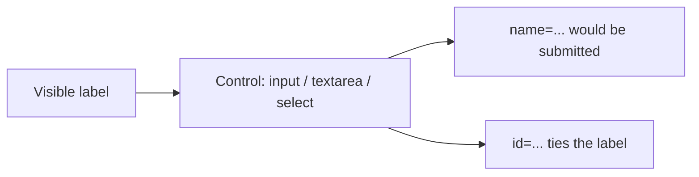
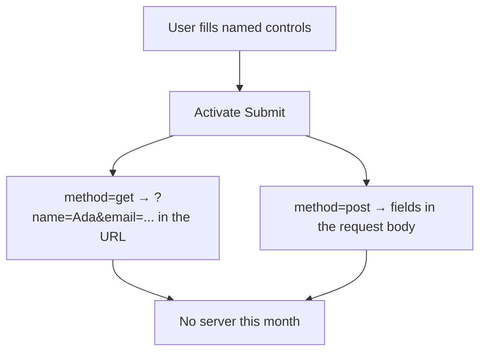

# Month 2 · Week 2 · Day 1
# Forms: Controls, Labels, Names, and Meaning

**Month index:** [../../README.md](../../README.md)  
**Week 2:** Day 1 (today) · [2](day-02.md) · [3](day-03.md) · [4](day-04.md) · [5](day-05.md) · [6](day-06.md) · [7](day-07.md)  
**Week rhythm today:** Learn + type-along  
**Study time:** 3–4 focused hours  
**Prereq:** Week 1 gate. You can write a semantic document without a tutorial.

**This week covers:** form controls, labels, validation, keyboard navigation, semantic structure, focus, the accessibility tree, ARIA basics and when **not** to use ARIA.

Today: how a form is structured and labeled. Validation, keyboard, focus, and ARIA are Day 2. Do not skip them.

This textbook will not give you Project 1’s contact form source. You will own the pattern in the lab.

---

## How to read this chapter

A form is not a pretty box. It is a **list of named questions**. Each question has:

1. A **visible name** for humans (`<label>`).
2. A **control** (textbox, checkbox, radio, dropdown, …).
3. A **`name` attribute** that would be sent to a server later.

If the user cannot tell what a field is, the form has failed — even if it looks stylish in a screenshot.



Clicking the word **Email** must focus the email box. That is not decoration. That is the label working.

Read each section. Close it. Say it in one sentence. Then type the contact form — do not paste. Serve over **HTTP**, not `file://`.

---

## Today's contract

By the end of this day you will be able to:

1. Explain a form as **named controls** that will become an HTTP request later (you have no backend yet).
2. Pair every control with a **visible `<label>`** (or a group `legend`).
3. Choose the right control: text, email, url, tel, password, number, date, checkbox, radio, file, hidden, textarea, select, button.
4. Use `fieldset`/`legend` for radio/checkbox groups.
5. Explain `name` vs `id` vs visible text.
6. Set `autocomplete` tokens on identity fields.
7. Explain why HTML does not email anyone.

**Today's gate**

> A label is not a `placeholder`. `placeholder` is a hint and disappears. If I cannot click the text next to a checkbox and toggle it, the label is broken.

If you cannot demonstrate that click-to-focus, stay here. Day 2 cannot fix a form that has no names.

---

## Time box

| Block | Minutes | Work |
|---|---|---|
| A | 55 | Theory (read slowly — draw name vs id) |
| B | 55 | Type-along contact form (no CSS) |
| C | 70 | Independent: workshop signup form |
| D | 25 | Git |
| E | 15 | Recall |

---

# Block A — Theory

## 1. What a form is

A **form** collects user input. In HTML:

```html
<form action="#" method="get">
  <!-- controls -->
  <button type="submit">Send</button>
</form>
```

- `action` — URL that will receive the data. You have no server. Use `action="#"` or omit submit navigation by handling it later in JS (Month 3). For this month, submitting may reload the page with a query string — that is OK for learning `name`.
- `method` — `get` (query string, visible, bookmarkable, **never for passwords**) or `post` (body; still not encrypted without HTTPS). Project 1 contact form has **no backend**; `action="#"` plus a note in the README is honest.



**Security (Rule 4, first user input):**

- Treat every field as **untrusted text**, not HTML.
- Do not put passwords in `GET`.
- `mailto:` as `action` leaks the user’s client and is fragile. Do not use it as your “backend.” A static form that does not send is acceptable for Project 1 if documented.

**Wrong belief:** “The submit button emails me automatically.”  
**Correct:** HTML does not send email. A server or a third-party form endpoint does. You will build the server in Month 9+.

**Wrong belief:** “`mailto:` is how static sites get mail.”  
**Correct:** `mailto:` opens a mail program, fails on machines without one, and publishes the address to scrapers. Document “does not send.”

---

## 2. The label is the name of the control for humans

```html
<label for="email">Email</label>
<input id="email" name="email" type="email" autocomplete="email">
```

Rules:

1. `for` matches `id`. Clicking the label focuses the input.
2. Visible label text must exist. `placeholder="Email"` is **not** a label.
3. `name` is what would be sent to a server. `id` is for labels, `for`, and later JS. They can be equal; they do different jobs.

Wrapping (implicit label):

```html
<label>
  Email
  <input name="email" type="email">
</label>
```

This also works. Prefer explicit `for`/`id` when the layout splits the text from the control (Week 3–4 CSS often does).

A checkbox whose text is a nearby `<p>` is **not** labeled. Clicking the words will not toggle the box. Wrap the input and the words, or use `for`/`id`.

**Wrong belief:** “The placeholder is visible, so the field is named.”  
**Correct:** placeholders vanish when the user types. The Accessibility **Name** should come from `<label>`. Empty Name means a broken label.

**Wrong belief:** “`id` is what gets sent to the server.”  
**Correct:** `name` is submitted. `id` hooks labels, fragments, and later scripts. A field with `id` and no `name` may be labeled and still **not** appear in the query string.

---

## 3. Control types you must know

| Control | Use |
|---|---|
| `type="text"` | One-line text |
| `email` | Email; mobile shows @ keyboard; browser may validate format |
| `url` | URL |
| `tel` | Telephone (not a real validator of phone numbers) |
| `password` | Masked; never `GET`; never `autocomplete="off"` without a reason |
| `number` | Numeric; still validate server-side later |
| `date` | Date picker where supported |
| `checkbox` | Independent on/off; same `name` allowed for multiple |
| `radio` | **One** of a set; **same `name`**, different `value` |
| `file` | File picker; no real upload this month |
| `hidden` | Value sent but not shown; not a secret store |
| `textarea` | Multi-line |
| `select` + `option` | Choose from a list |
| `button type="submit"` | Submit the form |
| `button type="button"` | Action that must **not** submit (later JS) |
| `button` inside a form with no `type` | Defaults to **submit** — always set `type` |

```html
<button type="submit">Send message</button>
<button type="button">Clear</button>
```

**Wrong belief:** “A `div` with an onclick is a button.”  
**Correct:** Use `<button>`. Keyboard and accessibility come with it. Fake buttons are Day 2’s enemy.

### Radios vs checkboxes — one question vs many

Three checkboxes are three independent yes/no answers. Three radios with the **same** `name` and different `value`s are **one** answer.

If radios do not share `name`, the browser treats them as separate questions and the user can “select” more than one in a confusing way.

### `select` is a labeled list

```html
<label for="slot">Time slot</label>
<select id="slot" name="slot">
  <option value="">Choose a slot</option>
  <option value="thu-18">Thursday 18:00</option>
  <option value="sat-10">Saturday 10:00</option>
</select>
```

Every `<option>` needs visible text. The `<select>` needs a `<label>`. Do not build a fake dropdown from `div`s this month.

### `textarea` vs `input`

A message is more than one line. `<input type="text">` is a single line. `<textarea rows="5">` is the honest box. It still needs `id`, `name`, and a label.

---

## 4. Groups: `fieldset` and `legend`

Radio buttons and related checkboxes need a group name:

```html
<fieldset>
  <legend>Preferred contact</legend>
  <label><input type="radio" name="contact" value="email" checked> Email</label>
  <label><input type="radio" name="contact" value="phone"> Phone</label>
</fieldset>
```

`legend` is the group’s label. Do not skip it and hope a nearby `h2` is enough (an `h2` is not programmatically tied to the radios).

Tab typically lands on the group; **arrow keys** move between radios. That is native HTML. You do not write JS for it.

A **single** confirmation checkbox (“Send me a copy”) can have its own `<label>` without a fieldset.

---

## 5. `autocomplete`

Help the browser fill known data: `autocomplete="name"`, `email`, `tel`, `organization`. This is accessibility and speed. Use tokens that match the field. Do not invent `autocomplete="fullname"` if the standard token is `name`. You can recheck the token list later; today those four are enough.

Password managers look at `autocomplete` and at `type`. Lying (`type="text"` for a password) fights them and fights you.

---

## 6. Buttons vs links (again)

- **Link (`a href`)** — navigation to a URL.
- **Button** — action (submit, open a dialog, later JS).

A “Submit” that is an `<a href="#">` is wrong: it navigates (often to the top of the page); it does not submit names. An “About” that is a `<button>` without JS is wrong: it does nothing useful.

Inside a form, `<button>` **without** `type` defaults to **submit**. That surprises people who add a “clear” control and accidentally send the form. Always write `type`.

---

## 7. `required` — a peek, not Day 2

You may put `required` on fields today so submit does something visible. It is a **browser** check, not a server. Anyone can bypass it. Visible “required” in the label helps people who do not get the user-agent bubble. Whitespace can satisfy `required`; trimming is later (JS). Day 2 goes deeper. Do not invent custom red error `<span>`s with no behavior.

---

# Block B — Type-along

Create `~\fullstack-lab\month-02\week-02\day-01\contact.html`.

Type a full document with `header`, `nav`, `main`, `footer`. In `main`:

```html
<h1>Contact the lab</h1>
<form action="#" method="post">
  <p>
    <label for="full-name">Name</label>
    <input id="full-name" name="name" type="text" autocomplete="name" required>
  </p>
  <p>
    <label for="mail">Email</label>
    <input id="mail" name="email" type="email" autocomplete="email" required>
  </p>
  <p>
    <label for="msg">Message</label>
    <textarea id="msg" name="message" rows="5" required></textarea>
  </p>
  <fieldset>
    <legend>Topic</legend>
    <label><input type="radio" name="topic" value="general" checked> General</label>
    <label><input type="radio" name="topic" value="bug"> Bug report</label>
  </fieldset>
  <p>
    <label>
      <input type="checkbox" name="copy" value="yes">
      Send me a copy (simulated — no backend)
    </label>
  </p>
  <p>
    <button type="submit">Send</button>
    <button type="reset">Reset</button>
  </p>
</form>
```

You may retype this — do not paste. Then:

1. Serve over HTTP.
2. Click the word **Name** — the input must focus.
3. Tab through every control. If Tab skips one, fix the markup (no `tabindex` hacks today).
4. Submit: you may see `?` query or a reload. Write in `NOTES.txt` what happened and why there is no email.
5. In DevTools Accessibility pane, select the email input. Write the **Name**. If it is empty, the label is broken.

Footer: one honest sentence that this page does not email anyone.

---

# Block C — Independent

`workshop.html`: signup for a fictional workshop.

Required fields: name, email, tel (optional), a `select` of three time slots, a `textarea` for goals, a checkbox for “I have read the hours”, submit button.

Every control labeled. One `fieldset` for a radio group “Experience: beginner / some HTML / comfortable.” Unique `id`s. `autocomplete` on name/email/tel.

Also: full skeleton (`lang`, charset, viewport, title, description); skip link is welcome but Day 2 will demand it — you may add it now; serve HTTP.

`NOTES.txt`: `name` vs `id` in your own words (five or more sentences, not a slogan).

Do not copy `contact.html` as a blob and rename the heading. Retype. Do not paste Project 1.

---

# Block D — Git

```powershell
cd ~\fullstack-lab
git add month-02/week-02
git commit -m "Week 2 Day 1: labeled forms with fieldset and autocomplete."
```

---

# Block E — Recall

Close the file.

1. Why placeholder is not a label.
2. Why radio buttons share `name`.
3. Default `button` type in a form.
4. Why Project 1’s contact form still needs labels even with no server.
5. What `legend` is for.
6. Why `mailto:` is refused.

---

## Definition of done

- [ ] Clicking label text focuses the control
- [ ] Radios grouped with `fieldset`/`legend`
- [ ] Tab order is the visual order
- [ ] I can explain name vs id
- [ ] NOTES.txt records submit-with-no-email
- [ ] No `div`-as-button
- [ ] Served over HTTP
- [ ] Commit exists

---

## Optional review links

Forms, labels, `name` vs `id`, and control types are explained in this chapter. These pages are for later checking, not for first learning.

- [MDN: HTML forms](https://developer.mozilla.org/en-US/docs/Learn_web_development/Extensions/Forms)
- [MDN: `<label>`](https://developer.mozilla.org/en-US/docs/Web/HTML/Element/label)
- [MDN: `<input>`](https://developer.mozilla.org/en-US/docs/Web/HTML/Element/input)
- [MDN: `autocomplete`](https://developer.mozilla.org/en-US/docs/Web/HTML/Attributes/autocomplete)

---

## Tomorrow

Validation, keyboard, focus, skip links, accessibility tree, ARIA’s first rule.
