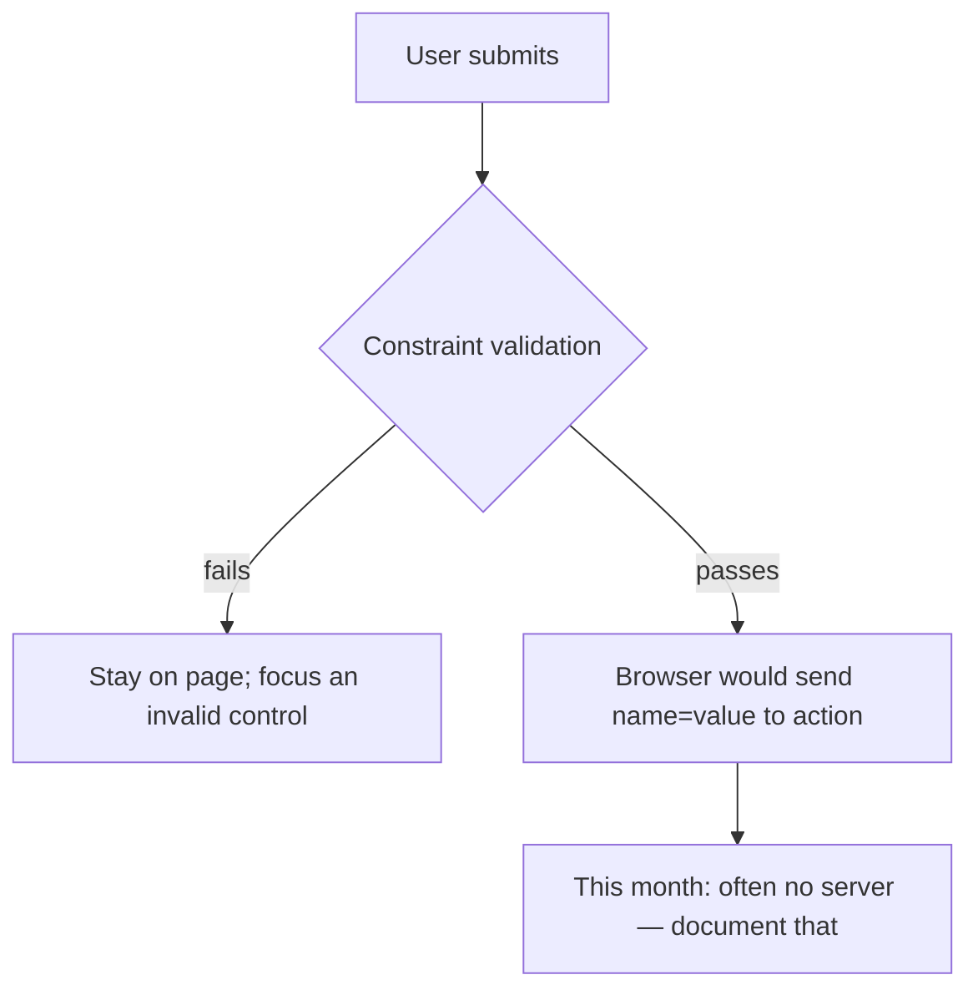

# Month 2 · Week 2 · Day 2
# Validation, Keyboard, Focus, Accessibility Tree, ARIA

**Month index:** [../../README.md](../../README.md)  
**Week 2:** [1](day-01.md) · Day 2 (today) · [3](day-03.md) · [4](day-04.md) · [5](day-05.md) · [6](day-06.md) · [7](day-07.md)  
**Week rhythm today:** Exercises + debugging  
**Study time:** 3–4 focused hours  
**Student state:** Yesterday you labeled named controls. Today you learn what the **browser** checks on submit, how a **keyboard** user moves, what **focus** must look like, and why **ARIA** is usually the wrong next step.

---

## How to read this chapter

A form that “works with a mouse” can still be unusable. Today you will unplug the mouse (or ignore it) and watch three trees at once:

1. The **DOM** — tags you typed.
2. The **tab order** — which control receives keys, in which sequence.
3. The **accessibility tree** — role, name, and state that assistive tech reads.

Read each theory section. Close it. Say it in one sentence. Then type the drills. When a checkbox does not toggle from its text, the label is broken — that is not a CSS problem.

---

## Today's contract

1. Use native validation (`required`, `type`, `minlength`) and know its **limits**.
2. Navigate a form **keyboard-only**; see **visible focus**.
3. Inspect the **accessibility tree**.
4. State ARIA’s first rule and three attributes you might use later — and when you must **not**.

**Today's gate**

> If the HTML already has a name, do not add `aria-label`. If a custom widget is a `div` pretending to be a checkbox, you already lost — use `<input type="checkbox">`.

If you cannot say that closed-book, stay on this chapter. Day 3 is a form from memory. ARIA folklore will make that form worse.

---

## Time box

| Block | Minutes | Work |
|---|---|---|
| A | 45 | Theory |
| B | 55 | Keyboard + focus + validator drills |
| C | 70 | Repair a broken form (you will type the broken one first) |
| D | 25 | Notes + git |
| E | 15 | Recall |

---

# Block A — Theory

## 1. Validation

**Constraint validation** is the browser checking the form before submit:

| Attribute | Meaning |
|---|---|
| `required` | Must not be empty |
| `type="email"` | Must look like an email (weak check) |
| `minlength` / `maxlength` | Length |
| `min` / `max` / `step` | For `number`/`date` |
| `pattern` | Regex; easy to get wrong — avoid unless you can explain it |

```html
<input type="email" required minlength="3">
```

Limits:

- This is **client-side**. Anyone can bypass it. Real validation is later on the server (Month 9) and again in the client for UX.
- Browser bubbles are often inaccessible or unclear. Project 1 may use native validation **plus** visible instructions in the label (`Name (required)`).
- Empty/whitespace: `required` treats spaces as filled. Month 3 you will trim in JS. Today: mention it in NOTES.

**Wrong belief:** “`required` means the data is safe.”  
**Correct:** it means a typical browser user cannot submit empty. Attackers and other clients are not typical browser users.

### 1.1 What the browser is actually doing

When you click Submit (or press Enter in a text field), the browser walks the controls and asks: does this control satisfy its constraints? If not, it **cancels** the submit, focuses a failing control, and may show a bubble.

That is helpful for honest humans. It is not a security boundary.



A person can disable JavaScript (validation still often runs; it is not JS), edit the DOM, or send a request with another tool. **You** will still write `required` because it is good UX for typical users. You will **not** tell a client “the form is secure because of `required`.”

`type="email"` checks a **shape** (`x@y` roughly). It does not prove the mailbox exists. `minlength` counts characters, not “a real name.” `pattern` is a regular expression. One wrong `pattern` locks out valid people (names with apostrophes, plus-addressing in email). Skip `pattern` unless you can explain the expression and the people it excludes.

**Worked example.** Field: `type="email" required`.

| Typed value | Typical browser |
|---|---|
| (empty) | Blocked: required |
| `   ` (spaces) | Often **allowed** — whitespace is not empty |
| `hi` | Blocked: not email-shaped |
| `hi@there` | Often **allowed** — shape passed; mailbox unproven |
| `student@school.edu` | Allowed |

Write that table in `NOTES.txt` after you try it yourself. Do not memorize a vendor’s bubble text; vendors differ. Memorize the **limits**.

## 2. Keyboard

A keyboard-only user must reach every control and every link.

| Key | Usual job |
|---|---|
| Tab | Next focusable |
| Shift+Tab | Previous |
| Enter | Activate link; submit form (from an input) |
| Space | Toggle checkbox/button |
| Arrow keys | Move within a radio group |

Do **not** set `tabindex="1"` (or 2, 3…) to “fix” order. Fix the **DOM order**. `tabindex="0"` makes a non-focusable element focusable — you almost never need it if you used `a` and `button`. `tabindex="-1"` is for programmatic focus (later).

### 2.1 What is focusable by default

Links with `href`, buttons, inputs, selects, textareas, and a few other native controls. A `div` is not. A `span` is not. That is why a “Submit” `div` fails the keyboard: **Tab never lands on it.**

Tab order is the order of those controls in the **DOM** (with a nasty exception: positive `tabindex` creates a separate queue that jumps ahead). If the visual layout later uses CSS to put the button on the left but the HTML still has it last, the keyboard still follows HTML. That is correct. Change the HTML order if the reading order is wrong — do not invent `tabindex="1"`.

**Wrong belief:** “I will set tabindex so the order matches my design.”  
**Correct:** positive `tabindex` is a trap. Reorder the markup. Visual CSS comes in Week 3–4; it must not fight the DOM.

### 2.2 Radio groups and arrows

Radios that share a `name` are one question. Tab lands on the group (often the checked radio, or the first). **Arrow keys** move between options. If each radio is a separate Tab stop in a confusing way, check that they share `name` and sit in a `fieldset` with a `legend`. Day 1 taught that grouping; today you **feel** it with keys.

## 3. Focus

The **focus ring** must be visible. In Week 3 you will style `:focus-visible`. Today: do not add CSS that sets `outline: none` without a replacement. If you cannot see where you are, the page fails.

A **skip link** (first focusable in the page) jumps to `main`:

```html
<body>
  <a class="skip" href="#main">Skip to content</a>
  <header>…</header>
  <main id="main">…</main>
</body>
```

Without CSS it looks visible at the top — that is acceptable today. Later you may visually hide it until focus. Never `display: none` it in a way that removes it from Tab.

### 3.1 Why skip links exist

Keyboard users Tab from the top. If every page starts with twenty nav links, they Tab twenty times before the article. A skip link is the **first** focusable node. Activate it (Enter). Focus moves to `main`. The nav is still there for people who want it.

If `main` lacks `id="main"`, the skip link is a dead fragment. If the skip link is not first in `body`, you have not skipped anything — you added another stop in the middle.

### 3.2 Why `outline: none` is a defect today

Some designers hate the default focus ring. Removing it without a **visible** replacement means keyboard users cannot tell which field they are in. That is not a taste debate. It is a failed page.

Week 3 will teach `:focus-visible { outline: … }`. Until then, **leave the user-agent outline**. You may not “clean up” the form by deleting focus.

**Wrong belief:** “The ring is ugly, so I hide it.”  
**Correct:** the ring is how keyboard users see location. Replace it later; never delete it only.

## 4. Accessibility tree

The browser builds a tree for assistive tech from:

- element roles (a `<button>` has role button)
- names (from `<label>`, text content, `alt`)
- states (checked, disabled)

DevTools: **Accessibility** pane (Chrome/Edge). Click an input. Read **Name**, **Role**, **Keyboard-focusable**.

If Name is empty, the label is broken.

### 4.1 Role, name, state — in sentences

Think of each control as a card the screen reader can read:

- **Role** — what kind of thing it is: textbox, checkbox, radio, button, link, combobox (`select`). Native HTML sets this. You do not assign `role="textbox"` to an `<input>` — it already is one.
- **Name** — how a human refers to it. For an input, the name should be the **visible label text**. For a button, the name is usually the text inside the button (“Send”). For a link, the link text.
- **State** — extra facts: checked, disabled, required, invalid, expanded.

```
Role: textbox
Name: Email
State: required
Keyboard-focusable: yes
```

That card is the **accessible identity** of the field. Pixels can still look perfect while Name is empty. That is why you open the pane.

**Worked example.** Broken markup:

```html
Email
<input type="text">
```

The word “Email” is a text node, not a `<label>`. Accessibility Name for the input is often **empty**. Clicking the word does not focus the box.

Fixed:

```html
<label for="email">Email</label>
<input id="email" name="email" type="email">
```

Name: “Email”. Role: textbox (or similar). Clicking the word focuses the input.

## 5. ARIA — basics and when not to use it

**ARIA** (Accessible Rich Internet Applications) adds names, roles, and states when native HTML cannot express them.

First rule (WAI-ARIA):

> If you can use a native HTML element or attribute with the semantics you need, **do that instead**.

| Sometimes useful | Not a reason to use ARIA |
|---|---|
| `aria-live="polite"` for a later JS status message | Labeling an input that already has `<label>` |
| `aria-labelledby` pointing at existing visible text for a group that cannot use `legend` | `role="button"` on a `div` |
| `aria-expanded` on a disclosure that is not `<details>` | `aria-label="Click here"` |

```html
<!-- WRONG -->
<div role="button">Send</div>
<input aria-label="Email"> <!-- no visible label -->

<!-- RIGHT -->
<button type="submit">Send</button>
<label for="email">Email</label>
<input id="email" type="email">
```

You do **not** need ARIA for Project 1 if your HTML is semantic. If you add ARIA, you must be able to say which gap native HTML could not fill.

**Wrong belief:** “More ARIA is more accessible.”  
**Correct:** Wrong ARIA is worse than none. Native HTML is the default.

### 5.1 Why wrong ARIA is worse than none

Assistive tech **trusts** ARIA. If you put `role="button"` on a `div`, the tree says “button.” Keyboard users still cannot Tab to a `div` unless you also fake `tabindex`, key handlers, and Space/Enter. You have advertised a widget you did not build. A real `<button>` already has role, focus, and activation.

If you add `aria-label="Name"` on an input that already has `<label>Name</label>`, the accessible name may **override** or fight the visible text. Sighted users see “Name.” Some AT users hear only the ARIA. You will do this on purpose in a later lab (Day 3) and then **remove** it.

Three attributes worth recognizing later (do not sprinkle them today):

1. **`aria-live`** — a region that announces when its text changes (form errors after JS). You have no JS status messages this month.
2. **`aria-labelledby`** — this element’s name is the text of another element’s `id`. Useful when a visible heading already names a group and `legend` cannot.
3. **`aria-expanded`** — this control opens something; true/false. Useful for a disclosure that is not `<details>`.

Today’s expected ARIA count on a good form: **zero**.

## 6. Contrast (preview)

Text must be readable against its background. Week 3–4 you pick colors. Check with DevTools or a contrast checker. Aim for WCAG **AA** (4.5:1 for normal text) as the course standard.

You cannot fail a color contrast test on an unstyled form in a useful way — user-agent colors are usually fine. Flag it for Project 1: when you choose `--text` and `--bg`, you will measure. Do not pick light gray on white because it looks “calm.”

---

# Block B — Guided drills

Use `contact.html` from Day 1 (copy into `day-02` by retyping the form).

1. Unplug or ignore the mouse. Tab through. Write the order in `TAB-ORDER.txt`.
2. Focus each control: can you **see** focus with default outline?
3. Submit empty required fields. Write what the browser did.
4. Open Accessibility pane on the email field. Copy Name and Role into `A11Y.txt`.
5. Add a skip link as the first element in `body`. Tab once on load: you should land on it.

Type the form again. Do not paste from Day 1. The point is your fingers learning `label for` and `id`. If Tab order surprises you, the DOM order is the answer — read Elements from top to bottom and compare to `TAB-ORDER.txt`.

---

# Block C — Broken form (type this, then repair)

Create `broken.html` **exactly**, then fix into `broken.fixed.html` without deleting behaviors:

```html
<!DOCTYPE html>
<html>
<head>
  <meta charset="utf-8">
  <title>Broken</title>
</head>
<body>
  <div onclick="#">Home</div>
  <form>
    Email
    <input type="text">
    <input type="checkbox"> I agree
    <div class="btn">Submit</div>
  </form>
</body>
</html>
```

Defects you must name and fix: `lang`, viewport, `label`/`id`, email type, checkbox label, fake links/buttons, no `name`, no submit `button`.

Write `broken.NOTES.txt` with one line per defect **before** you fix, then keep those behaviors in the fixed file:

- Home still goes somewhere (use a real `<a href="#">` or a real URL — a `div` with `onclick` is not a link).
- Email is still collected (now `type="email"` + label + `name`).
- Agreement is still a checkbox (now labeled).
- Submit still submits (now `<button type="submit">`).

Add `lang`, viewport, and a skip link + `main` if you are building a mini-page. Serve over HTTP. Keyboard-pass the fixed file.

---

# Block D

```powershell
git add month-02/week-02
git commit -m "Week 2 Day 2: keyboard, focus, validation, ARIA first rule."
```

In `NOTES.txt` also record: `required` + spaces; whether you could see focus; first rule of ARIA in one sentence.

---

# Block E — Recall

1. First rule of ARIA.
2. Why not `outline: none`.
3. `required` is not server validation.
4. What the accessibility tree’s **Name** should be for a labeled input.

Close the file. Answer aloud. Then reopen. If “first rule” became “add more aria-label,” you have the idea backwards — re-read section 5.

---

## Definition of done

You pass this day when the gate sentence is true and:

- [ ] `TAB-ORDER.txt` lists real Tab stops from a form you typed
- [ ] `A11Y.txt` has Name and Role from the Accessibility pane
- [ ] `broken.fixed.html` uses native `a`, `label`, `button` — not `div` widgets
- [ ] You did not add ARIA to “improve” a labeled input

---

## Optional review links

Validation, keyboard, focus, skip links, the accessibility tree, and the first rule of ARIA are explained in this chapter. These pages are for later checking, not for first learning.

- [MDN: Client-side form validation](https://developer.mozilla.org/en-US/docs/Learn_web_development/Extensions/Forms/Form_validation)
- [MDN: Keyboard-navigable JavaScript widgets](https://developer.mozilla.org/en-US/docs/Web/Accessibility/Guides/Keyboard-navigable_JavaScript_widgets) (principles only; you are not building widgets yet)
- [WAI-ARIA: First rule](https://www.w3.org/TR/using-aria/#MUST)
- [MDN: Skip links](https://developer.mozilla.org/en-US/docs/Web/HTML/Element/a#skip_links)

---

## Tomorrow

From memory: an accessible form. No type-along solution.
