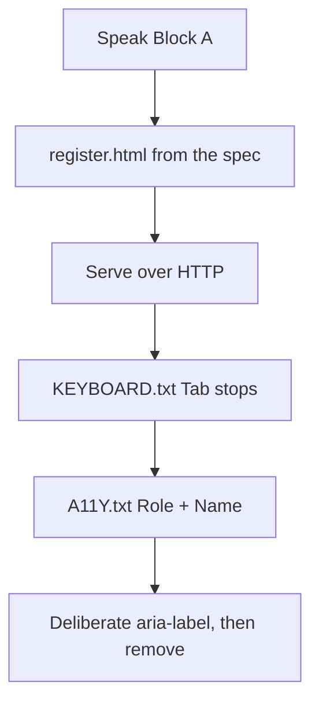
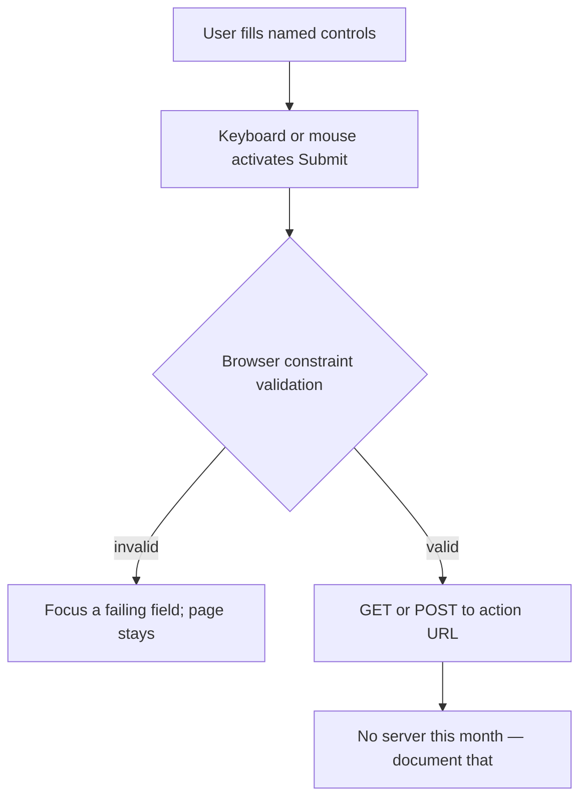

# Month 2 · Week 2 · Day 3
# Implement From Memory: An Accessible Form

**Month index:** [../../README.md](../../README.md)  
**Week 2:** [1](day-01.md) · [2](day-02.md) · Day 3 (today) · [4](day-04.md) · [5](day-05.md) · [6](day-06.md) · [7](day-07.md)  
**Week rhythm today:** Implement from memory  
**Study time:** 3–4 focused hours  
**Days 1–2 of this week:** closed during the drills. If you forget a fact, re-open **those day files in this textbook**. Do not use MDN as the teacher.

---

## How to read this chapter

Today is not a new topic. It is **ownership**. The complete explanation below is the whole lesson, written so you can build `register.html` from this page if Days 1–2 are closed.

Read the explanation once. Speak Block A. Then type the spec **without** copying Day 1’s contact form. When you are stuck, re-read a subsection here — then type. A pasted lab is not from memory.



Serve over **HTTP**, not `file://`. Do not paste Project 1.

---

## Complete explanation (forms + accessibility)

A **form** is a set of **named controls**. On submit, the browser would send those names and values to `action` with `method` `get` (query string — never passwords) or `post` (body — still not secret without HTTPS). This month you often have **no server**: `action="#"` and an honest note that nothing is emailed.

**Label:** every control has a visible `<label>` whose `for` matches the control’s `id`, or the control is wrapped in the label. Clicking the label focuses or toggles the control. **Placeholder is a hint that disappears. It is not a label.**

**`name`** is the submitted key. **`id`** is for labels, fragments, and later JS. They do different jobs.

**Control types (choose on purpose):**

| Type / element | Use |
|---|---|
| `text` | general short text |
| `email` | email shape; still not proven real |
| `url`, `tel`, `password`, `number`, `date` | extra keyboard / UA hints |
| `checkbox` | independent on/off |
| `radio` | **one** of a set — same `name`, different `value`, inside `fieldset` + `legend` |
| `file` | file picker; nothing uploads without a server |
| `textarea` | multi-line |
| `select` + `option` | pick from a list |
| `button type="submit"` | submit the form |
| `button type="button"` | action that must **not** submit |

A `<button>` inside a form **defaults to submit**. Always set `type`. Do not use a `div` with a click handler as a button. Links (`a`) navigate; buttons act.

**`autocomplete`** (e.g. `name`, `email`, `tel`) helps password managers and browsers fill known fields. Use it on identity fields.

**Validation:** `required`, `type="email"`, `minlength` are **browser** checks. Anyone can bypass them. They are not a server. Visible “required” text in the label helps people who do not get the UA bubble. Whitespace can satisfy `required`; trimming is later (JS).

**Keyboard:** Tab / Shift+Tab move focus. Enter submits a form from a text field. Space toggles checkboxes and activates buttons. **Do not** set `tabindex` greater than 0 — it wrecks order. Tab order is **DOM order**. Never `outline: none` without a `:focus-visible` replacement; this week, leave the UA outline.

**Skip link:** first focusable control, visually hidden until focused, `href="#main"`, and `main` has `id="main"` (and `tabindex="-1"` if you need the target to receive focus). It lets keyboard users skip repeated nav. `display: none` on the skip link removes it from Tab — then it is not a skip link.

**Accessibility tree:** each control has a **role** (textbox, radio, button), a **name** (usually from the label), and **state** (checked, required, invalid). If Name is empty, the label is broken.

**First rule of ARIA:** if native HTML can do it, use native HTML. Do not add `aria-label` on an already labeled input (names collide or override). Do not `role="button"` on a `div`. Wrong ARIA is worse than none. Expect **zero ARIA** on today’s form.

**Wrong belief:** “Submit emails me.”  
**Correct:** HTML does not send email.

The rest of this section is the same lesson in full sentences, with pictures and a worked walk-through, so Block B is possible closed-book.

### What happens when someone submits



`method="get"` appends `?name=Ada&email=ada%40school.edu` to the URL. Anyone who sees the address bar sees the data. **Never** put passwords on GET. `method="post"` puts fields in the request body. Without HTTPS, a network observer can still read them. Project 1’s contact form is a **static** page: `action="#"` (or an empty action) plus a footer that says nothing is emailed. That is honest. `mailto:` as `action` is not a backend; it opens a mail program, fails on machines without one, and publishes the address to scrapers.

### Two jobs: `name` vs `id`

```html
<label for="full-name">Full name (required)</label>
<input id="full-name" name="fullName" type="text" autocomplete="name" required>
```

- `for="full-name"` matches **`id`**. That pairing is the label. Clicking “Full name” focuses the box. The Accessibility **Name** should become “Full name (required)” (or similar).
- `name="fullName"` is the **key** in the would-be request. Servers and query strings care about `name`. Screen readers do not use `name` as the spoken label.
- They may be spelled the same. They still do different jobs. A field with `id` but no `name` may be labeled and still **not** submit a value.

**Wrong belief:** “`id` is what gets sent to the server.”  
**Correct:** `name` is submitted. `id` hooks labels, fragments, and later scripts.

### Radios are one question

Three separate checkboxes are three independent yes/no answers. Three radios with the **same** `name` and different `value`s are **one** answer.

```html
<fieldset>
  <legend>Level (required)</legend>
  <label><input type="radio" name="level" value="beginner" required> Beginner</label>
  <label><input type="radio" name="level" value="intermediate"> Intermediate</label>
  <label><input type="radio" name="level" value="advanced"> Advanced</label>
</fieldset>
```

`legend` names the group. Tab lands on the group; arrows move. If you forget shared `name`, the browser treats them as separate questions and the user can “select” more than one in a confusing way. If you skip `fieldset`/`legend`, the Accessibility tree may not expose “Level” as the group name — you get three radios named only “Beginner”, with no question.

A **checkbox** (“I understand there is no backend”) is independent. It gets its own `<label>`. It does not need a fieldset unless it is one of several related checks answering one prompt.

### Buttons vs links vs divs

| You meant | Element |
|---|---|
| Go to another page | `<a href="...">` |
| Submit this form | `<button type="submit">` |
| Do something later with JS, do not submit | `<button type="button">` |
| Neither | not a `div` with a click handler |

Inside a form, `<button>` **without** `type` defaults to **submit**. Always write `type`.

### Skip link, today, without CSS tricks

Day 2 allowed a visible skip link at the top of `body`. That still counts. The spec today says the skip link is first focusable and points at `main`.

```html
<body>
  <a href="#main">Skip to content</a>
  <header>
    <nav>…</nav>
  </header>
  <main id="main">
    <h1>…</h1>
    <form>…</form>
  </main>
</body>
```

If you visually hide it later, hide it in a way that **focus** still reveals it. `display: none` removes it from Tab — then it is not a skip link.

### Validation you may use today

Put `required` on name, email, level, and the honesty checkbox as the spec says. Put the word “required” in the **visible label** too. Native bubbles are inconsistent; the word in the label is not.

Do not rely on `placeholder="Your name"` as the only identifier. Placeholders vanish when the user types, and they are not a substitute Name in the accessibility tree the way a real label is.

**Wrong belief:** “The browser bubble is enough instruction.”  
**Correct:** bubbles are inconsistent and easy to miss. Visible text in the label is the instruction you control.

### Worked example — one field done right

Spec fragment: name, required, autocomplete.

```html
<label for="student-name">Full name (required)</label>
<input
  id="student-name"
  name="studentName"
  type="text"
  autocomplete="name"
  required
>
```

Checks you will run after you type the whole form:

1. Click the words “Full name (required)” — caret appears in the box.
2. Tab from the skip link until this field — you can **see** the outline.
3. Accessibility pane: Role textbox (or equivalent), Name includes “Full name”.
4. No `aria-label` on this input.

If any check fails, do not add ARIA. Fix `for`/`id` or wrap the input in the label.

### Common failures from memory

| What happened | What it usually means |
|---|---|
| Name empty in the pane | `for`/`id` mismatch, or a `<p>` pretending to be a label |
| Two radios can both look selected | They do not share `name` |
| Skip does nothing | `href="#main"` but `id` is missing or spelled `content` |
| Submit fires when you click “Clear” | `button` without `type` |
| Pasted Day 1 contact form | Not from memory. Delete and retype the studio spec |

---

## Today's gate

> Keyboard-only, I can complete a form I built from a spec. Every control has a name in the accessibility tree. No ARIA unless I can justify a gap native HTML cannot fill (expected: **zero ARIA**).

---

## Time box

| Block | Minutes | Work |
|---|---|---|
| A | 20 | Speak the explanation |
| B | 90 | Build `register.html` from the spec |
| C | 40 | Accessibility pane → `A11Y.txt` |
| D | 30 | Deliberate ARIA mistake, then remove it |
| E | 15 | Git + closed-book gate sentence |

---

# Block A — Speak (20 min)

From the complete explanation: label vs placeholder; radio `name`; button `type`; skip link; first rule of ARIA; `required` limits.

Say them out loud. If “placeholder is not a label” takes you more than one sentence of *why* (it disappears; it is a hint; the Name should come from `<label>`), you are not ready to type. Re-read that subsection.

---

# Block B — Spec: `register.html`

`~\fullstack-lab\month-02\week-02\day-03\register.html`

Fictional **studio class registration**. No CSS except you may not remove outlines.

Required:

1. Skip link to `main`
2. Full skeleton: `lang`, charset, viewport, title, description
3. `header`/`nav`/`main`/`footer`
4. Form with: name, email, tel optional, date of class (`type="date"`), `select` of three studios, `textarea` notes, radio group Level (`fieldset`/`legend`), checkbox “I understand there is no backend”, `button type="submit"`
5. `autocomplete` on name, email, tel
6. `required` on name, email, level, checkbox
7. Visible “required” in the label text for required fields
8. No `placeholder` as the only identifier
9. No `div` buttons; no `tabindex` > 0
10. Serve over HTTP; mouse-free pass documented in `KEYBOARD.txt` (list of Tab stops)

Suggested Tab-stop list (yours must match **your** DOM): skip link → nav links → name → email → tel → date → studio select → notes → first radio (then arrows inside the group) → checkbox → submit. If a stop is missing, a control is not a real control.

Footer: one honest sentence that this page does not email the studio.

---

# Block C — Accessibility pane

`A11Y.txt`: for each control, Role and Name from DevTools.

Include the submit button and the select. If Name is empty, stop and fix the label before you write more rows. Do not “fill in” the name you *intended*. Copy what the pane says.

---

# Block D — Deliberate ARIA mistake

Temporarily add `aria-label="Name"` **and** a visible `<label>Name</label>` on the same input. Read the Accessibility pane. Does the name double or override? Write what you observed. **Remove** the redundant ARIA. That is the lesson.

This is the same science as Week 1’s missing `scope`: you **cause** the failure so you will recognize it on Project 1. After you remove `aria-label`, the Name should match the visible label again. Confirm.

```powershell
cd ~\fullstack-lab
git add month-02/week-02/day-03
git commit -m "Month 2 Day 3: registration form from memory."
```

---

## Definition of done

- [ ] Keyboard pass recorded
- [ ] A11Y names match visible labels
- [ ] Zero unjustified ARIA
- [ ] Lookups logged if any
- [ ] Served over HTTP
- [ ] Commit exists
- [ ] I did not paste Day 1 or Project 1

Lookups go in `LOOKUPS.txt`: which fact, which **day file** you re-opened (Day 1 or Day 2 of this week). “I googled a forms tutorial” is not a lookup; it is a skipped lesson. Re-open this textbook instead.

---

## Optional review links

You already have the lesson in this chapter. These are for later checking after the form exists.

- [MDN: `<form>`](https://developer.mozilla.org/en-US/docs/Web/HTML/Element/form)
- [MDN: The HTML `autocomplete` attribute](https://developer.mozilla.org/en-US/docs/Web/HTML/Attributes/autocomplete)
- [MDN: `<fieldset>`](https://developer.mozilla.org/en-US/docs/Web/HTML/Element/fieldset)

---

## Tomorrow

A reusable **contact pattern** in the lab (Project 1 shape, not the portfolio). Design on paper first. No `mailto:`.
