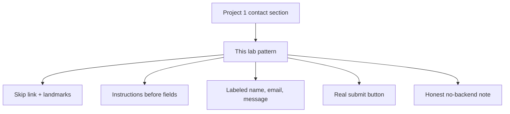

# Month 2 · Week 2 · Day 4
# Lab Feature: Accessible Contact Form (Project 1 Shape)

**Month index:** [../../README.md](../../README.md)  
**Week 2:** [1](day-01.md) · [2](day-02.md) · [3](day-03.md) · Day 4 (today) · [5](day-05.md) · [6](day-06.md) · [7](day-07.md)  
**Week rhythm today:** Add a real project feature  
**Study time:** 3–4 focused hours  
**Student state:** You can register for a fictional studio from memory. Today you distill that skill into a **contact pattern** Project 1 will demand — still in the lab, still not the portfolio.

Project 1 requires a contact form: name, email, message, submit — keyboard usable, real labels. You still **do not** build the portfolio. You build a **reusable form pattern** in the lab. This textbook will not give you `index.html` of the portfolio.

---

## How to read this chapter

A “contact form” on a portfolio is not a plugin. It is HTML you can explain. Read the theory until you can design on paper (`design.txt`) **before** you type `index.html`. Then build. Then record keyboard evidence. If you skip design, you will invent `mailto:` or a fake success message because those feel like features. They are defects.



You will **not** copy `contact-pattern/index.html` into the portfolio as a blob. You will type the portfolio form from the same ideas. Patterns live in your head; files in the lab are practice.

Serve over **HTTP**, not `file://`. On Windows: `cd ~\fullstack-lab` then `python -m http.server 5500`, then open the `http://127.0.0.1:5500/...` URL.

---

## Theory (complete) — what a Project 1 contact form actually is

A contact form is not a widget library. It is HTML:

1. A skip link so keyboard users can jump to `main`.
2. Landmarks and one `h1`.
3. A short instruction paragraph **before** the form: how required fields are marked (for example, “Required fields are marked *”). Do not rely only on a red asterisk with no legend.
4. Fields:
   - **Name** — `input type="text"`, `autocomplete="name"`, visible label, `required` if the spec says so.
   - **Email** — `type="email"`, `autocomplete="email"`.
   - **Message** — `textarea` with rows enough to write in, not a single-line input.
   - **Submit** — `<button type="submit">` with a verb (“Send message”), not a bare “Submit” if you can be clearer.
5. Optional: `select` “How did you hear about this site?” — not required; still labeled.
6. Footer honesty: **this form does not send data to a server yet.** `action="#"` or equivalent. No `mailto:`. No fake success toast that pretends mail went out.

**What happens on submit this month:** the browser may reload with a query string (`method="get"`) or do nothing useful. That is acceptable if documented. You will wire a backend in later months.

**Error strategy this month:** native `required` + visible required markers. Custom error `<span>`s and live regions are later. Do not invent ARIA error plumbing before the labels work.

**What you refuse:**

- `mailto:` as a fake backend (opens a mail client, leaks addresses, fails on machines without mail).
- Placeholder-only fields.
- `div` styled as a button.
- `outline: none`.
- `tabindex="1"`.
- Redundant `aria-label` on labeled inputs.
- CSS frameworks that hide missing HTML.

**Minimal CSS (optional):** if default UA layout makes labels hard to scan, you may add roughly:

```css
label { display: block; margin-top: 0.75rem; }
input, textarea, select { display: block; max-width: 100%; }
```

Keep it tiny. Do not remove focus outlines. Prefer **no CSS** until Week 3 if the form is already usable.

**Keyboard evidence** is part of the feature, not extra credit. Tab through. Record stops. If a control is unreachable, the HTML order is wrong.

The next sections unpack those rules so `design.txt` is not a blank stare.

### Why this pattern exists

Project 1’s requirements file will ask for a contact section with name, email, message, and a submit control that a keyboard user can finish. If you invent that form for the first time on the portfolio, you will copy a template. Today you **own** the pattern in `week-02/contact-pattern/` so the portfolio is a rewrite from understanding, not a paste.

### Instructions before the form — a worked example

Sighted users often guess which fields are required from a red star. Screen-reader users need the same rule in **words**. Put a paragraph *above* the `<form>`:

```html
<p>Required fields are marked with * in the label.</p>
<form action="#" method="get">
  <label for="contact-name">Name *</label>
  <input id="contact-name" name="name" type="text" autocomplete="name" required>
  …
</form>
```

The asterisk in the label **and** the sentence together are the strategy. A star with no legend is a private code. Native `required` still runs; the paragraph does not replace it. It explains it.

**Wrong belief:** “The browser bubble is enough instruction.”  
**Correct:** bubbles are inconsistent and easy to miss. Visible text in the page is the instruction you control.

### Message is a `textarea`, not `input`

A message is more than one line. `<input type="text">` is a single line. `<textarea rows="6" cols="40">` (then CSS later) gives a box people can write in. It still needs `id`, `name`, and a `<label for>`. `cols`/`rows` are hints; `max-width: 100%` later keeps it in the viewport.

```html
<label for="contact-message">Message *</label>
<textarea id="contact-message" name="message" rows="6" required></textarea>
```

Do not put the label text only in `placeholder="Your message"`. Placeholders disappear as soon as someone types.

### Submit copy

“Submit” is a verb, but “Send message” says what will happen. Either can pass if the control is a real `<button type="submit">`. “Click here” cannot. A `div` with a class of `btn` cannot. An `<a href="#">` that looks like a button **navigates** (often to the top of the page); it does not submit names.

**Wrong belief:** “A link styled as a button is fine if it says Send.”  
**Correct:** the Accessibility role is still `link`. Keyboard Enter may navigate instead of submitting the form’s `name`s.

### Why `mailto:` is refused

```html
<!-- WRONG — not a backend -->
<form action="mailto:you@example.com" method="post">
```

What actually happens: the browser tries to open an email program with the fields in a draft. Many users have no mail client. The address sits in HTML for harvesters. You learn nothing about HTTP. Project 1’s honest version is: the form is structured and labeled; **nothing is sent**; the README says so.

**Wrong belief:** “mailto is how static sites get mail.”  
**Correct:** mailto is a brittle client hook. Static hosting plus a later server (or a documented third-party endpoint in a later month) is how mail actually happens. This month: no mail, documented.

### Error strategy — what you are *not* building

You might want a red sentence under Email that says “Please enter a valid email.” That needs JS or a server to stay in sync with reality. Native validation already blocks empty `required` and badly shaped `type="email"` for typical browser users. Custom `aria-live` error lists are a later skill. If you add empty `<span class="error">` elements “for later,” you have invented UI with no behavior. Skip them.

### Optional tiny CSS — what it is for

Default user-agent forms often put the label and the control on one crowded line. `label { display: block; }` stacks the word above the box so Tab focus is easier to see. That is the only reason to add CSS today. You are not starting the visual design system. You are not removing `outline`. You are not importing Bootstrap.

If the unstyled form is already usable, **prefer no CSS**. Week 3 will teach cascade; do not smuggle a half-stylesheet into a forms lab.

### Keyboard evidence as a product requirement

`EVIDENCE.md` is not bureaucracy. It is how you prove the feature. A stranger should be able to:

1. Click the address bar, then Tab into the page.
2. Land on the skip link first.
3. Reach name, email, message, optional select, submit.
4. See focus on every stop.
5. Submit empty required fields and notice the browser blocking (write what you saw).

If step 3 skips message, the `textarea` may lack a real tab slot (disabled? `tabindex="-1"` you added by mistake? not in the DOM?). Fix HTML order.

The address bar is a focus trap of its own. Click it (or `Alt+D` on Windows). Then Tab. You may pass through browser chrome before the **page**. The first **page** stop should be the skip link.

### Unique `id`s on a page that already has nav

If the nav has `id="contact"` for an in-page jump, do not also put `id="contact"` on the form. IDs must be unique. Name the form fields `contact-name`, `contact-email`, `contact-message`. Duplicate IDs break labels and fragments.

---

## Office hours — missing labels, placeholders, and fake buttons

These are the defects that will fail Project 1’s form check. Catch them in the lab.

### Missing labels (the classic)

```html
<!-- WRONG — nearby text is not a label -->
<p>Name</p>
<input type="text" name="name">
```

The Accessibility **Name** of that input is empty. Clicking the word “Name” does nothing. Fix:

```html
<label for="contact-name">Name *</label>
<input id="contact-name" name="name" type="text" autocomplete="name" required>
```

`for` must match `id` **exactly**. `contact-name` and `contactName` are different. Wrapping also works: `<label>Name * <input …></label>`. Nearby `<p>` never works.

**Wrong belief:** “Placeholder is the label on modern sites.”  
**Correct:** placeholder is a hint that vanishes. The Name in the accessibility tree should come from `<label>`.

### Placeholder-only and `aria-label` as a cover-up

If you “fix” an empty Name by adding `aria-label="Name"` and you also have a visible `<label>`, the names can fight. If you have *only* `aria-label` and no visible label, sighted users lose the persistent word next to the box. This course wants a **visible** `<label>`. No ARIA on these fields.

### `tabindex="1"` to “put Name first”

Tab order is DOM order. Move the skip link to the first child of `body`. Move the form controls into the order a human should meet them. Positive `tabindex` creates a second order you will forget when you add the select.

### Optional select — still a labeled control

```html
<label for="contact-source">How did you hear about this site?</label>
<select id="contact-source" name="source">
  <option value="">Choose one</option>
  <option value="search">Search</option>
  <option value="friend">A friend</option>
  <option value="other">Other</option>
</select>
```

Every `<option>` has visible text. The first empty option is not the label. The `<label for>` is. This field is optional: no `required`, no asterisk, unless you decided otherwise in `design.txt`.

### Type-along skeleton (lab only — not the portfolio)

Type this shape yourself in `contact-pattern/index.html`. Change the studio name. Do **not** paste it into `~/portfolio/` later.

```html
<!DOCTYPE html>
<html lang="en">
<head>
  <meta charset="utf-8">
  <meta name="viewport" content="width=device-width, initial-scale=1">
  <title>Contact — Harbor Print Studio</title>
  <meta name="description" content="Contact form pattern for Harbor Print Studio. Nothing is emailed yet.">
</head>
<body>
  <a href="#main">Skip to content</a>
  <header>
    <p>Harbor Print Studio</p>
    <nav>
      <a href="#main">Contact</a>
    </nav>
  </header>
  <main id="main">
    <h1>Contact the studio</h1>
    <p>Required fields are marked with * in the label.</p>
    <form action="#" method="get">
      <label for="contact-name">Name *</label>
      <input id="contact-name" name="name" type="text" autocomplete="name" required>

      <label for="contact-email">Email *</label>
      <input id="contact-email" name="email" type="email" autocomplete="email" required>

      <label for="contact-message">Message *</label>
      <textarea id="contact-message" name="message" rows="6" required></textarea>

      <button type="submit">Send message</button>
    </form>
  </main>
  <footer>
    <p>This form does not send data to a server yet.</p>
  </footer>
</body>
</html>
```

Every `name` would be submitted. Every `id` pairs with `for`. One `h1`. Skip first. Honest footer. That is the feature.

Type it. Then change the studio name and the `title`. If you leave “Harbor Print Studio” as a paste you did not own, you skipped the typing. The portfolio later must be **your** words and **your** `id`s, retyped from this pattern — never this file dropped into `~/portfolio/`.

### Submit with empty fields (what to write in EVIDENCE.md)

Click Send with Name empty. Edge and Chrome typically refuse submit, focus the failing field, and show a bubble. Write the **browser name** and what you saw (“Chrome focused Name and showed ‘Please fill out this field’”). That is native validation, not a backend. If the page reloads with an empty query and no bubble, you forgot `required`, or you used a `div` instead of `type="submit"`.

### Common failures today

| What happened | What it usually means |
|---|---|
| Name empty in the pane | `for`/`id` mismatch or a `<p>` instead of `<label>` |
| First Tab stop is a logo link | Skip link is not first in `body` |
| Submit does nothing useful and README is silent | Honesty missing — write that there is no backend |
| Query string in the address bar after Send | `method="get"` worked; document it, do not panic |
| You opened `file://` | Labels still exist, but you broke the course serve habit |

---

## Today's contract

A form that would pass Project 1’s form + accessibility checks, in `week-02/contact-pattern/`.

**Today's gate**

> A stranger can Tab through, understand every field, and submit (even if nothing is emailed). README states honestly that there is no backend.

---

## Time box

| Block | Minutes | Work |
|---|---|---|
| A | 25 | Design on paper (`design.txt`) |
| B | 80 | Build `index.html` |
| C | 50 | Keyboard + a11y evidence |
| D | 25 | README honesty + git |
| E | 15 | Gate sentence aloud |

---

# Design first (`design.txt`)

1. Fields and which are required  
2. Error strategy: native validation + visible required markers  
3. What happens on submit this month  
4. What you refuse to do (`mailto`, fake ARIA, `outline: none`)

Write complete sentences. “Name required, email required, message required, select optional” is the field list. “Browser `required` plus * in labels plus a legend paragraph” is the error strategy. “GET to `#` may reload; nothing is stored” is submit. The refuse list is a pledge, not a mood.

---

# Build

`~\fullstack-lab\month-02\week-02\contact-pattern\index.html`:

- Skip link, landmarks, one `h1`
- Form: name, email, message (textarea), submit
- Optional: a non-required `select` “How did you hear about this site?”
- Footer note: “This form does not send data to a server yet.”
- Instructions paragraph before the form (how required fields are marked)

No CSS framework.

Also add `autocomplete` on name and email, as in Days 1–3. Put `name` attributes on every control that should submit. Serve over `http://127.0.0.1`, not `file://`.

If you include the optional select, every `<option>` needs visible text. The select needs a `<label>`. A first option “Choose one” is fine; do not use it as the only label.

Full skeleton: `lang`, charset, viewport, title, description. Unique `id`s.

---

# Keyboard + a11y evidence

`EVIDENCE.md`: Tab order, screenshot optional, Accessibility names, contrast not yet designed (note: default UA styles — flag for Week 4).

Suggested `EVIDENCE.md` shape (fill from **your** page):

```markdown
# Contact pattern evidence

## Serve
http://127.0.0.1:..../month-02/week-02/contact-pattern/

## Tab order
1. Skip to content
2. …
3. Send message

## Accessibility names
| Control | Role | Name |
|---|---|---|
| | | |

## Submit with empty required fields
(what the browser did)

## Contrast
Default UA styles. Re-check when Week 3–4 choose colors. Target WCAG AA 4.5:1 for body text.
```

```powershell
cd ~\fullstack-lab
git add month-02/week-02/contact-pattern
git commit -m "Add accessible contact form pattern for Project 1."
```

Put a short `README.md` **in** `contact-pattern/` (or a section of `week-02/README.md`) that states: how to serve, that there is **no backend**, that submit does not email anyone. The gate names that honesty.

---

## Definition of done

- [ ] Matches Project 1 field list (name, email, message, submit)
- [ ] Labels, keyboard, visible focus
- [ ] Honest no-backend documentation
- [ ] design.txt exists before the HTML (or you rewrote it honestly if you cheated the order)
- [ ] No ARIA unless justified in design.txt (expected none)
- [ ] Served over HTTP
- [ ] I did not paste the portfolio

---

## Optional review links

The contact pattern is specified in this chapter. These pages recheck element names after you have a working form.

- [MDN: `<textarea>`](https://developer.mozilla.org/en-US/docs/Web/HTML/Element/textarea)
- [MDN: `<button>`](https://developer.mozilla.org/en-US/docs/Web/HTML/Element/button)
- [Project 1 specification](../../../../full_stack_project_requirements_2026/project_01_accessible_responsive_portfolio.md) — fields; do not copy a template
- [Project 1 workshop](../../../../project_guidance/project-01-accessible-responsive-portfolio/README.md) — you build the portfolio later this month, not today

---

## Tomorrow

Claims that can fail: labels, radios, skip link, no positive `tabindex`. You will mismatch `for`/`id` on purpose and watch the Accessibility Name die.
