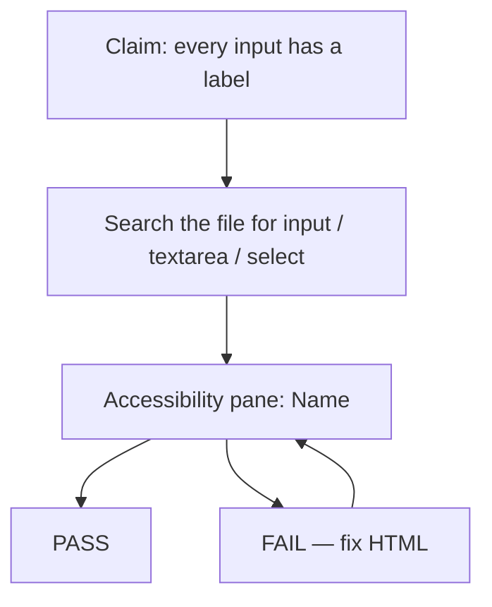

# Month 2 · Week 2 · Day 5
# Tests, Refactor, Documentation — Forms and A11y

**Month index:** [../../README.md](../../README.md)  
**Week 2:** [1](day-01.md) · [2](day-02.md) · [3](day-03.md) · [4](day-04.md) · Day 5 (today) · [6](day-06.md) · [7](day-07.md)  
**Week rhythm today:** Tests + refactor + documentation  
**Study time:** 3–4 focused hours  
**Student state:** You have a registration form, a repaired broken form, and a contact pattern. Today those pages become **claims**, then clearer HTML, then a README a stranger can keyboard-test.

There is no Jest yet. A test is a **claim that can fail**. Today’s claims are about labels, keyboard, and honesty — the same claims Project 1 will have to survive. This textbook will not give you the portfolio source.

---

## How to read this chapter

Week 1 Day 5 taught you to fail a `scope` and watch H9 die. Today you fail a **label pair** and watch the Accessibility **Name** die. That is the whole scientific method for forms this month.

Read “What we are testing” until you can explain F1–F10 in sentences. Then fill `TESTS.md` from a **real file** (prefer `contact-pattern/index.html` or `day-03/register.html`). Then refactor copy, not features. Then break `for`/`id` on purpose.



Serve the page under test over **HTTP**, not `file://`. The Accessibility pane on a `file://` document is still a tree, but this course’s serve habit does not take a day off. On Windows: `python -m http.server 5500` from `~\fullstack-lab`, then `http://127.0.0.1:5500/...`.

---

## What we are testing (explained)

**A labeled control** has an accessible **Name** that matches what a sighted user reads. The Name almost always comes from `<label for>` / wrapping `<label>`. If you break `for`/`id`, the Accessibility pane shows an empty or wrong Name. That is the cheapest automated-feeling check you have this month: **mismatch the pair, watch the Name die, restore it.**

**A radio group** is not “several inputs that look round.” It is the same `name`, different `value`, grouped by `fieldset`/`legend` so the question (“Level”) is the group’s name.

**A submit control** is a `button` with `type="submit"` (or an `input type="submit"` — this course prefers `button`). A `div` is not a control. A link that says Submit is a navigation lie.

**Tab order** is DOM order. `tabindex="1"` (or any positive integer) creates a parallel order that humans and you will forget. Fail the page if you find one.

**Skip link** exists so repeated `nav` is not a prison. It must be the first focusable thing and must point at `main`.

**Focus visible:** if you cannot see where you are, keyboard use is a guess. UA outlines count. `outline: none` fails the test.

**No redundant ARIA:** an extra `aria-label` on a labeled input is not “more accessible.” It fights the visible label.

**README honesty:** if there is no backend, say so. A silent form that “looks like it sent” is a product lie.

Refactor today is **clarity**: shorter labels, consistent required markers, instructions before the form — not new fields.

Those sentences are the claims. The rest of this block is how to **run** them so PASS/FAIL is evidence.

### The test loop for a form

You still use search (the editor, or DevTools). Search finds **structure**. The Accessibility pane finds **meaning**. Both are required for F1. A wrapping `<label>` with no text still “has a label” in a naive search and fails the pane.

How to open the pane in Edge or Chrome on Windows: Inspect the control → **Accessibility** section in the sidebar (or the Accessibility tab). Read **Name**, **Role**, **Keyboard-focusable**. Write those words into TESTS.md. Do not write the Name you *meant*.

### Worked example — F1 and F2 failing together

Good:

```html
<label for="email">Email (required)</label>
<input id="email" name="email" type="email">
```

Broken test case (Block E):

```html
<label for="mail">Email (required)</label>
<input id="email" name="email" type="email">
```

`for="mail"` does not match `id="email"`. Search still finds a `<label>` and an `<input>`. F1 might look like PASS if you only count tags. F2 (“every `id` used in `for` exists once”) **fails** because `mail` is not an id on the page. The Accessibility **Name** for the input is empty or wrong. That is the observation you must record.

Restore the match. Name returns. F1 and F2 PASS.

**Wrong belief:** “I have a label tag nearby, so the field is labeled.”  
**Correct:** the association is `for`/`id` or wrapping. Nearby text is not a label.

### F3 — radios as a set

If your contact pattern has no radios, run F3 on `register.html` (Level) or write N/A **and** name the file you used. Do not mark PASS on a page with no radios. A test with no subject is not a pass.

Shared `name` without `fieldset` is still a weak group. This claim asks for both: shared `name` **and** `fieldset`/`legend`.

```html
<fieldset>
  <legend>Level (required)</legend>
  <label><input type="radio" name="level" value="beginner" required> Beginner</label>
  <label><input type="radio" name="level" value="intermediate"> Intermediate</label>
</fieldset>
```

Tab lands once. Arrows move. If each radio has a unique `name`, F3 fails even if they look round.

### F4 — submit is a button

Search for `<div` near the word Submit. Search for `<a` with button-looking text. Search for `<button`. The winner must be `<button type="submit">`. A `<button>` with no type inside a form is usually submit — this course still wants the type written so you never guess.

### F5 — no positive tabindex

Search `tabindex`. Allowed: none, or `tabindex="-1"` on `main` if you needed the skip target to take focus. **Forbidden:** `tabindex="1"`, `"2"`, any positive integer. If you find one, delete it and fix DOM order.

### F6–F8 — skip, Tab, eyes

F6 is read + Tab: first stop is the skip link; it jumps to `main`. F7 is hands: every control in the form is a stop (radios: group + arrows). F8 is eyes: default outline or an equivalent ring. If you added `outline: none` in Day 4’s optional CSS, F8 fails until you remove it.

### F9–F10 — ARIA and honesty

F9: search `aria-label`. If it sits on an input that already has a visible `<label>`, FAIL. Remove it. F10: open the README. If it implies messages are emailed, FAIL. Write the truth.

### What refactor is allowed

Allowed:

- “Email address (required)” instead of “Type your email here please”
- One consistent * or the word “required”, matching the instructions paragraph
- Moving the instructions paragraph **above** the form if it was buried in the footer
- Fixing a FAIL from the table

Not allowed:

- New fields “for the portfolio”
- A CSS framework
- Custom JS validation
- ARIA live regions “to be extra accessible”

**Wrong belief:** “Tests passed, so I should add features.”  
**Correct:** tests passed, so you may **clarify**. Features are Day 6’s independent spec, not today’s reward.

### How a keyboard test actually starts

The address bar is a focus trap of its own. Click it (or `Alt+D`). Then Tab. You may pass through browser chrome (bookmarks bar, extensions) before the **page**. The first **page** stop should be the skip link. If the first page stop is a nav link, F6 fails even if a skip link exists later in the DOM — “exists” is not “first focusable.”

Shift+Tab from the submit button should walk **back** through message, email, name. If going forward and backward visit different controls, something is `tabindex` or a focus-stealing script. You have no JS this month; it is almost certainly markup order.

Write the list with **visible names**, not tag names: “Skip to content → Home → Name → Email → Message → Send message.” That list is what a human can audit. `input#email` is not a keyboard test.

### F6 defects you will actually see

| What you typed | What Tab does | Fix |
|---|---|---|
| Skip link after `<header>` | First stop is a logo link | Move skip link to first in `body` |
| `href="#content"` but `id="main"` | Activating skip does nothing useful | Match the fragment to `main`’s `id` |
| `display: none` on `.skip` | Skip is not a Tab stop | Do not hide it that way |
| Skip link present, `main` missing | Fragment is a dead end | One `main id="main"` |

---

## Office hours — the Name died and other lab visits

### “I mismatched `for` and nothing changed”

You edited a copy, or DevTools is still highlighting an old node, or the page is cached from `file://`. Click the **input** again after refresh. The Name field should change. If it does not, you did not save, or you broke a different field than the one you inspected.

### Wrapping `<label>` with no text

```html
<label><input id="n" name="name" type="text"></label>
```

Search finds a `<label>`. F1 looks like PASS. The pane Name is empty. Put words in the label: `<label>Name * <input …></label>` or use `for`/`id` with text in the label element.

### Copy refactor — a worked before/after

Before (unclear, still labeled):

```html
<label for="n">Please go ahead and type the name you use</label>
```

After:

```html
<label for="n">Name (required)</label>
```

Same `for`/`id`. Shorter Name in the accessibility tree. The instructions paragraph still explains the asterisk or the word “required.” Do not “refactor” by deleting the visible required marker.

### Security still applies on a test day

You are not adding a comments wall. If you “clean up” by pasting a fake user message that contains `<em>hi</em>` into the HTML as if it were submitted markup, you practiced the wrong lesson. User text later is **text**. Today there is no user text. Do not invent it.

### Common failures today

| What happened | What it usually means |
|---|---|
| F1 PASS, pane Name empty | You counted `<label>` tags, not the `for`/`id` pair |
| F7 FAIL on checkbox | The text is not inside/associated with a label; Tab hits the box but Space on the word does nothing |
| README says “open the HTML file” | You documented `file://`. Write the HTTP serve command |
| Deliberate break: Name unchanged | You edited a copy, or DevTools is still showing the old node — click the input again |
| Added `aria-label` to “fix” F1 | You hid a broken label. Restore `for`/`id` instead |
| F3 PASS on contact-pattern | That page has no radios — run F3 on `register.html` |

**Wrong belief:** “The validator said the form is valid, so labels work.”  
**Correct:** a valid document can still have a `for` that points nowhere. The Accessibility pane is the label test.

**Wrong belief:** “I’ll document the keyboard pass from memory of yesterday.”  
**Correct:** F7 is hands on **today’s** file after refactor. Copy can change Tab order if you move the instructions paragraph.

### Search recipes that actually find FAILs

In the editor, search the **file under test** (not the whole week):

| Search | What a hit means |
|---|---|
| `tabindex="` | Open it. Positive integer → F5 FAIL. `-1` on `main` is the skip target — allowed |
| `aria-label` | On a labeled input → F9 FAIL. Remove it |
| `mailto:` | Fake backend → F10 FAIL even if the README is honest |
| `placeholder=` | Allowed as a hint **with** a `<label>`. If the only identifier is placeholder, F1 FAIL |
| `<div` near Submit | Fake button → F4 FAIL |

Write the search you ran in the How column. “I looked at it” is not How.

### Duplicate `id` is an F2 cousin

F2 says every `for` points at an id that exists **once**. Two `id="email"` (nav fragment plus the input) make `for="email"` ambiguous. The pane may name the wrong node. Rename the input to `contact-email` and keep `id="email"` only if a hash needs it — or hash `#contact` on a heading, not on a field.

```html
<!-- nav jump and field must not share an id -->
<nav><a href="#contact">Contact</a></nav>
<h2 id="contact">Contact</h2>
<label for="contact-email">Email (required)</label>
<input id="contact-email" name="email" type="email" autocomplete="email" required>
```

### What “refactor copy” looks like in the instructions paragraph

If Day 4 said “Required fields are marked *” but some labels say “(required)” and others say nothing, F1 can still PASS while a human cannot learn the rule. Pick one marker. Update the paragraph. Re-run F7: the paragraph is not a Tab stop (it is not a control). The first field still comes after skip and nav.

Serve HTTP. Confirm Network 200 on the HTML. A keyboard test on a stale tab is a diary of yesterday’s DOM.

---

## Today's contract

By the end of this day you will have a filled `TESTS.md`, a clearer form, a keyboard README, and a recorded label-break.

**Today's gate**

Break the label `for`/`id` pair on purpose. Show the Accessibility **Name** go empty or wrong. Restore. That is the test.

---

## Time box

| Block | Minutes | Work |
|---|---|---|
| A | 30 | Read the claims; pick the file under test |
| B | 50 | Fill `week-02/TESTS.md` from that file |
| C | 50 | Refactor copy; re-run F1–F10 |
| D | 40 | README: how to keyboard-test |
| E | 20 | Deliberate `for`/`id` break |

---

Create `~\fullstack-lab\month-02\week-02\TESTS.md`:

| ID | Claim | How |
|---|---|---|
| F1 | Every `input`/`textarea`/`select` has a `<label>` or a wrapping label | Search |
| F2 | Every `id` used in `for` exists once | Search |
| F3 | Radios that are a set share `name` and sit in `fieldset` | Read |
| F4 | Submit control is `<button type="submit">` | Read |
| F5 | No `tabindex` greater than 0 | Search |
| F6 | Skip link exists and points at `main` | Read + Tab |
| F7 | Keyboard can reach every control | Hands |
| F8 | Focus visible on all controls | Eyes |
| F9 | No redundant `aria-label` on already labeled inputs | Read |
| F10 | README states no backend | Read |

Add a **Result** column as you run. Write the **filename** at the top of TESTS.md. Fix FAILs. Do not weaken the claim.

Refactor: tighten copy, fix any FAIL. Document in `week-02/README.md` how to keyboard-test (Tab from the address bar into the page, list every stop, Shift+Tab back).

The README keyboard section should be copy-pasteable:

1. Serve the folder over HTTP.
2. Click the browser address bar.
3. Press Tab until focus is in the page (first stop should be skip link).
4. Tab through; Shift+Tab back; write the list.
5. Open DevTools Accessibility pane on one input; confirm Name.

Deliberate break: mismatch `for` and `id`. Record F1/F2. Restore.

Do it like Week 1’s `scope` break:

1. Save a known-good file.
2. Change one `for` so it does not match.
3. Open the Accessibility pane on that input. Write the Name you see (empty/wrong).
4. Mark F1 and/or F2 FAIL in TESTS.md with a one-line note.
5. Restore. Confirm Name. Mark PASS again.

```powershell
cd ~\fullstack-lab
git add month-02/week-02
git commit -m "Add form accessibility tests and refactor contact pattern."
```

---

## Definition of done

- [ ] TESTS.md has real PASS/FAIL from a real file
- [ ] Deliberate label break was observed in the Accessibility pane
- [ ] README explains the keyboard pass over HTTP
- [ ] No new unjustified ARIA
- [ ] Commit exists

---

## Optional review links

How to read the Accessibility pane and why labels associate is explained above.

- [Chrome: Accessibility pane](https://developer.chrome.com/docs/devtools/accessibility/reference) (vendor UI; the **ideas** are in this chapter)
- [MDN: `<label>`](https://developer.mozilla.org/en-US/docs/Web/HTML/Element/label)

---

## Tomorrow

Independent job-application form from a spec. Days 1–5 closed for the challenges. Repair from this week’s Days 1–2 in this book.
