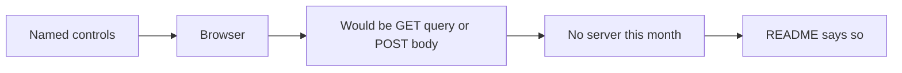

# Month 2 · Week 2 · Day 6
# Independent: Accessible Form

**Month index:** [../../README.md](../../README.md)  
**Week 2:** [1](day-01.md) · [2](day-02.md) · [3](day-03.md) · [4](day-04.md) · [5](day-05.md) · Day 6 (today) · [7](day-07.md)  
**Week rhythm today:** Independent project work  
**Study time:** 3–4 focused hours  
**Days 1–5 textbook files:** closed for the *challenges*. Repair from **Week 2 Days 1–2 in this book**, not from a forms tutorial.

---

## How to read this chapter

The complete explanation is the lesson. You may keep **this file** open while you build. You may not open Day 1–5 markdown for the challenges, and you may not paste `contact-pattern` markup.

Read the explanation once. Speak the gate. Then type `job-application.html` from the spec. Keyboard and Accessibility evidence are part of the build, not homework after you get bored.



Serve over **HTTP**, not `file://`. Do not paste Project 1. The portfolio is a separate repo later. Today is `~\fullstack-lab\month-02\week-02\independent\`.

---

## Complete explanation (this book is the lesson)

A **form** collects named controls. `action` is the URL that would receive data. This month you have no server — `action="#"` and an honest README. `method="get"` puts fields in the query string (never passwords). `method="post"` puts them in the body (still not secret without HTTPS). HTML does not send email. Do not use `mailto:` as a backend.

Every control needs a **visible `<label>`** tied with `for`/`id` or wrapping. **Placeholder is not a label.** `name` is what would be submitted; `id` is for labels and fragments.

**Radios** that are one choice share `name` and live in `fieldset` + `legend`. **Checkboxes** in a set that answers one question (“Which days can you work?”) also belong in a fieldset. A single confirmation checkbox can have its own label without a fieldset.

Buttons: always `type="submit"` or `type="button"`. Default inside a form is submit. Links navigate; buttons act. No `div` click-handlers as buttons.

**`select`** is a labeled list of `option`s. **`textarea`** is multi-line text. **`input type="file"`** lets the user pick a file; without a server, nothing is uploaded — say so in the label or nearby text.

**Validation:** `required` and `type="email"` / `type="url"` are browser checks, bypassable. Visible “required” in the label. They are not a server.

**Keyboard:** Tab / Shift+Tab, Enter to submit, Space on checkboxes and buttons. Do not use `tabindex="1"`. DOM order is Tab order. **Focus** must be visible; never `outline: none` without a `:focus-visible` replacement.

**Skip link** is the first focusable control, pointing at `main`.

**Accessibility tree:** role + name + state. An input’s Name should come from its label. Empty Name means a broken label.

**ARIA first rule:** if native HTML can express it, use native HTML. Do not `aria-label` an already labeled input. Do not `role="button"` on a `div`. Wrong ARIA is worse than none. Project 1 should need **almost no ARIA**.

**`autocomplete`** on name, email, url helps humans and password managers.

Treat every field as **untrusted text**, not HTML. You have no backend yet; you still do not pretend submitted strings are markup.

If last week’s form work is foggy, the subsections below re-teach the same ideas with a picture and a worked field. Then the spec is small.

### The request you are *not* sending yet

A job application **feels** like it should upload a résumé. The file input still only **picks a path in the browser**. Until a server reads `multipart/form-data`, nothing is stored. Label it “Resume (not uploaded)” so you do not train yourself to lie in UI copy. That honesty is a professional habit, not a joke.

### Labels, names, and a URL field

`type="url"` is like `type="email"`: a **shape** hint (and a useful mobile keyboard), not proof the site exists. Still needs a visible label. `autocomplete="url"` (or `autocomplete="off"` if you have a reason) — for a portfolio URL, `url` is the honest token.

```html
<label for="portfolio">Portfolio URL (required)</label>
<input id="portfolio" name="portfolio" type="url" autocomplete="url" required>
```

Placeholder `https://…` may exist **in addition** to the label. It must not be the only identifier.

**Wrong belief:** “URL fields don’t need labels because the placeholder shows https.”  
**Correct:** placeholders disappear. Labels stay. The Accessibility Name comes from the label.

### Checkbox groups vs one checkbox

**One question, several independent answers** (“Which days can you work?”): multiple checkboxes, **different** `name`s *or* `name="days"` with `value` per box depending on how a later server would parse — for this month, `name="days"` with different `value`s is a common pattern, or unique names like `day-mon`. Wrap them in `fieldset`/`legend` named “Days you can work.”

**One confirmation:** “I understand this application is not sent to a server.” One checkbox, one label, `required` if the spec wants a gate. No fieldset required.

Today’s spec allows **checkbox group or one checkbox plus a textarea**. Choose on purpose and write the choice in a one-line comment in `KEYBOARD.md`.

### File input without a server

```html
<label for="resume">Resume (not uploaded)</label>
<input id="resume" name="resume" type="file">
```

The control is still keyboard-reachable. Activating it opens the OS file picker. Canceling is fine. Do not write JavaScript to “preview upload.” Do not `mailto` the file.

### Teach-back is part of the product

`TEACHBACK` (400+ words) is how we know the HTML was not a lucky paste. Prose: labels, keyboard, first rule of ARIA, why Project 1 must not use a CSS framework to hide missing HTML.

A framework can make a `div` look like a button. The Accessibility tree still sees a `div`. Keyboard users still skip it. That is why this course forbids Bootstrap/Tailwind/component paste on Project 1: they hide **missing HTML** behind class names. You are training the opposite reflex: native controls first, paint later.

**Wrong belief:** “If it looks like a form, it is a form.”  
**Correct:** if Tab cannot finish it and Names are empty, it is a picture of a form.

### Worked example — radio group for work mode

```html
<fieldset>
  <legend>Work mode (required)</legend>
  <label><input type="radio" name="mode" value="onsite" required> Onsite</label>
  <label><input type="radio" name="mode" value="remote"> Remote</label>
  <label><input type="radio" name="mode" value="hybrid"> Hybrid</label>
</fieldset>
```

Shared `name="mode"`. Different `value`s. `required` on one radio in the group is enough for the group in typical browsers. Visible “required” in the legend. Tab + arrows. Accessibility: radios named Onsite / Remote / Hybrid, group named Work mode.

### `select` for hours — a labeled list, not a fake dropdown `div`

```html
<label for="hours">Hours per week (required)</label>
<select id="hours" name="hours" required>
  <option value="">Choose hours</option>
  <option value="10">10</option>
  <option value="20">20</option>
  <option value="40">40</option>
</select>
```

The first option with `value=""` plus `required` is a common pattern: the browser treats “Choose hours” as empty. Do not use that first option as the **only** identifier — the `<label>` still names the control. Arrow keys move options once the select is focused; you do not build a custom listbox.

**Wrong belief:** “I’ll style a `div` list because `<select>` is ugly.”  
**Correct:** native `select` is keyboard-complete and has a role in the accessibility tree. A `div` list is a widget you are not qualified to ship this month.

### Cover note is a `textarea`

A cover note is several sentences. `input type="text"` will fight the user. `<textarea id="cover" name="cover" rows="8"></textarea>` with a `<label for="cover">`. `rows` is a hint for height, not a character limit.

### Keyboard walk-through of today’s spec

Ignore the mouse. Expected **page** stops after the address bar (your nav may add links). On Windows, click the address bar or press `Alt+D`, then Tab.

1. Skip to content  
2. Nav link(s)  
3. Name  
4. Email  
5. Portfolio URL  
6. Hours `<select>`  
7. Work-mode radio group (Tab lands; **arrows** change onsite/remote/hybrid)  
8. Checkbox group **or** confirmation checkbox (then maybe a days textarea)  
9. Resume file input  
10. Cover note textarea  
11. Submit button  

If the file input is skipped, it may be `disabled` or not a real `input`. If radios are four Tab stops with no shared `name`, F3 from Day 5 would fail — fix the group before you write more CSS (you should write **no** CSS except you may not remove outlines).

### Untrusted text — even with no server

A cover note will one day be stored and shown on a staff page. If that page injects the string as HTML, an applicant could type tags. You have no staff page yet. You still write the habit in the teach-back: **the value of a field is data, not markup.** `mailto:` does not change that. A fake “preview of your application” that uses innerHTML later is Month 3’s warning; do not prototype it today.

### What the teach-back must contain (prose, not a bullet dump)

Write 400+ words that a classmate could read instead of Days 1–2. Required topics:

1. **Labels** — `for`/`id` vs wrapping; why placeholder fails; click-the-word must focus.  
2. **Keyboard** — Tab order is DOM order; why positive `tabindex` is banned; skip link job; visible focus.  
3. **First rule of ARIA** — native first; wrong ARIA worse than none; expected zero ARIA on this form.  
4. **Frameworks** — a CSS framework can paint a `div` as a button; the tree still says `div`; Project 1 forbids that hide.

If your teach-back is a list of tags with no sentences, rewrite it. If it quotes MDN, you used the wrong teacher — this chapter is the lesson.

### Common failures on the independent form

| What happened | What it usually means |
|---|---|
| File input unlabeled | You used a nearby `<p>` instead of `<label for>` |
| “Resume (not uploaded)” only in the footer | The control’s Name in the pane is still “Choose file” or empty — put it in the label |
| Two radios can both look selected | They do not share `name` |
| Teach-back under 400 words or all bullets | You summarized; you did not teach |
| Pasted contact-pattern and renamed fields | Not independent. Delete and retype from the spec |

---

## Office hours — missing labels on a long form

A job application has more controls than the contact pattern. That is where labels get skipped.

### Instructions paragraph still belongs above the form

```html
<p>Required fields are marked with the word required in the label.</p>
<form action="#" method="get">
```

Do not bury that sentence in the footer. Required markers in labels must match this paragraph: either `*` everywhere or the word “required” everywhere. Mixing both without explaining both is a private code.

### Name, email, URL — three identity fields

```html
<label for="full-name">Full name (required)</label>
<input id="full-name" name="fullName" type="text" autocomplete="name" required>

<label for="email">Email (required)</label>
<input id="email" name="email" type="email" autocomplete="email" required>
```

`id` and `name` may differ. `for` matches **`id`**. Duplicate `id="email"` if you also have a nav fragment `id="email"` will break the label. Name fields `app-email` if you need uniqueness.

### Checkbox group fragment (if you chose days)

```html
<fieldset>
  <legend>Days you can work</legend>
  <label><input type="checkbox" name="days" value="mon"> Monday</label>
  <label><input type="checkbox" name="days" value="tue"> Tuesday</label>
  <label><input type="checkbox" name="days" value="wed"> Wednesday</label>
</fieldset>
```

Independent checks. Different `value`s. Legend is the question. Each box has a visible label. Space toggles.

### File picker on Windows

Tab to the resume control. Space or Enter opens the Windows file picker. Cancel is a valid test — you proved the control is reachable. Do not chase a selected filename in the page with JavaScript today.

**Wrong belief:** “A long form can skip labels on the obvious fields.”  
**Correct:** every `input`, `select`, and `textarea` needs a Name. Obvious to you is empty to the pane.

### Cover note + honesty checkbox (if you chose that option)

```html
<label>
  <input type="checkbox" name="honest" value="yes" required>
  I understand this application is not sent to a server (required)
</label>

<label for="cover">Cover note</label>
<textarea id="cover" name="cover" rows="8"></textarea>
```

The checkbox is one confirmation. It does not need a fieldset. The wrapping `<label>` includes the words; clicking the sentence toggles the box. `required` on the checkbox blocks submit until it is checked — native, bypassable, still useful. Put the same honesty in the footer so a mouse user who never reads the checkbox still sees the product truth.

### `A11Y.md` rows you must not invent

Copy Role and Name from the pane. Typical honest rows:

| Control | Role | Name |
|---|---|---|
| Full name | textbox | Full name (required) |
| Hours per week | combobox (or similar) | Hours per week (required) |
| Onsite | radio | Onsite (group: Work mode) |
| Resume (not uploaded) | button or file upload — **write what the pane says** | Resume (not uploaded) |
| Send application | button | Send application |

If Resume’s Name is “Choose file” only, the visible label is not associated. Fix `for`/`id`. Do not type “Resume” into A11Y.md because you know it is a resume.

### Serve and submit without lying

```powershell
cd ~\fullstack-lab
python -m http.server 5500
```

Open `http://127.0.0.1:5500/month-02/week-02/independent/job-application.html`. After a valid submit, `method="get"` may put fields in the query string. That is not an upload. The file input’s path does not travel as a stored résumé. Write that in the footer and in the teach-back.

**Wrong belief:** “GET in the address bar means the studio received my application.”  
**Correct:** GET showed *you* the names. Nobody stored them. Honesty is the feature.

---

## Today's contract

Build a job-application form you can explain control by control from the explanation above.

**Today's gate**

I built a job-application form I can keyboard-complete, and I can explain every control from the explanation above.

---

## Time box

| Block | Minutes | Work |
|---|---|---|
| A | 20 | Speak labels, radios, file honesty, ARIA first rule |
| B | 100 | Build `job-application.html` from the spec |
| C | 40 | `KEYBOARD.md` + `A11Y.md` |
| D | 40 | Teach-back 400+ words |
| E | 15 | Git |

---

Build `~\fullstack-lab\month-02\week-02\independent\job-application.html` for a fictional studio assistant role.

Required: skip link; name; email; url (portfolio); `select` (hours: 10/20/40); radio group (onsite / remote / hybrid) with fieldset; checkbox group **or** one checkbox plus a textarea; file input labeled “Resume (not uploaded)”; textarea cover note; submit; honest footer.

Also required by this week’s standard, even when the bullet list is short:

- Full skeleton: `lang`, charset, viewport, title, description
- `header` / `nav` / `main` / `footer` (nav may be a single “Home” link)
- Visible “required” in labels for required fields; `autocomplete` on name, email, url
- No placeholder-only fields; no `div` buttons; no `tabindex` > 0; no unjustified ARIA
- Serve over HTTP

Keyboard evidence in `KEYBOARD.md` (every Tab stop). Accessibility names in `A11Y.md` (Role + Name per control). Teach-back 400+ words: labels, keyboard, ARIA first rule, why Project 1 must not use a CSS framework to hide missing HTML. Prose, from this chapter.

No portfolio site. No copied contact-pattern markup as a paste — retype from the spec.

```powershell
cd ~\fullstack-lab
git add month-02/week-02/independent
git commit -m "Add independent accessible job application form."
```

---

## Definition of done

- [ ] Keyboard pass recorded
- [ ] A11Y names match visible labels
- [ ] Teach-back is prose
- [ ] Honest no-upload / no-backend notes
- [ ] Zero unjustified ARIA
- [ ] Served over HTTP
- [ ] Commit exists

---

## Optional review links

The independent spec is fully specified above. Recheck control names later if you need a reminder of `type="file"` attributes.

- [MDN: `<input type="file">`](https://developer.mozilla.org/en-US/docs/Web/HTML/Element/input/file)
- [MDN: `<input type="url">`](https://developer.mozilla.org/en-US/docs/Web/HTML/Element/input/url)
- [MDN: `<select>`](https://developer.mozilla.org/en-US/docs/Web/HTML/Element/select)

---

## Tomorrow

Week 2 review: speak labels and the first rule of ARIA, mini-build a form from this book, debug broken names. Days 1–6 stay closed during that mini-build.
