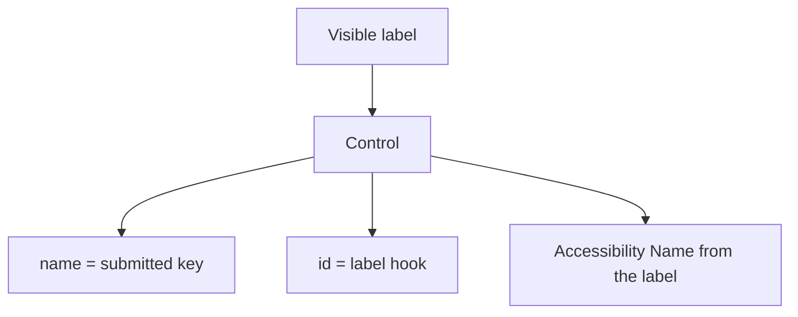

# Month 2 · Week 2 · Day 7
# Week Review — Forms and Accessibility

**Month index:** [../../README.md](../../README.md)  
**Week 2:** [1](day-01.md) · [2](day-02.md) · [3](day-03.md) · [4](day-04.md) · [5](day-05.md) · [6](day-06.md) · Day 7 (today)  
**Week rhythm today:** Review, repair, plan Week 3  
**Study time:** 3–4 focused hours  
**Student state:** You have labeled forms, a contact pattern, tests, and an independent job application. Today you prove the ideas from **this file**, then repair what is still weak.

Do not start Week 3 because the calendar moved. CSS will not hide an unlabeled input. It will paint it.

---

## How to read this chapter

This is a closed-book teaching day. The synthesis is the whole Week 2 lesson, written so you can re-learn forms from this page alone.

1. Read a section. Close it. Say it in one sentence.
2. Speak the synthesis (Block 1). Then mini-build with Days 1–6 closed; if you go blank, re-read **this** file.
3. Repair the weakest forms topic **today**. Week 3 assumes Tab, labels, and “no fake buttons” are automatic.

---

## Week synthesis (learn/review from this book)

A **form** collects named controls. `action` is the URL that would receive data; this month you often have no server — `action="#"` and an honest README. `method="get"` puts fields in the query string (never passwords). `method="post"` puts them in the body (still not secret without HTTPS).

Every control needs a **visible `<label>`** tied with `for`/`id` or wrapping. **Placeholder is not a label.** `name` is what would be submitted; `id` is for labels and fragments.

**Radios** that are one choice share `name` and live in `fieldset` + `legend`. Buttons: always `type="submit"` or `type="button"` — default inside a form is submit. Links navigate; buttons act. No `div` click-handlers as buttons.

**Validation:** `required` and `type="email"` are browser checks, bypassable. They are not a server. Whitespace can satisfy `required`; trim later in JS (Month 3).

**Keyboard:** Tab / Shift+Tab, Enter to submit, Space on checkboxes. Do not use `tabindex="1"`. DOM order is Tab order. **Focus** must be visible; never `outline: none` without a `:focus-visible` replacement.

**Skip link** is the first focusable control, pointing at `main`.

**Accessibility tree:** role + name + state. An input’s Name should come from its label. Empty Name means a broken label.

**ARIA first rule:** if native HTML can express it, use native HTML. Do not `aria-label` an already labeled input. Do not `role="button"` on a `div`. Wrong ARIA is worse than none. Project 1 should need **almost no ARIA**.

Contrast: aim WCAG AA 4.5:1 for body text when you choose colors (Weeks 3–4).

The rest of this chapter unpacks those lines so Block 1 is teaching, not reciting.

---

## Today's contract

By the end of this day you can teach Week 2 at a whiteboard, build a tiny labeled form from memory, diagnose five defects, fix one real file, re-run TESTS.md, and answer when ARIA would (almost never) belong on Project 1.

**Today's gate.** Closed-book: label vs placeholder, radio `name` + fieldset, button `type`, skip link, first rule of ARIA, `required` is not a server. If any of those is mush, stay on this file.

---

## Time box

| Block | Minutes | Work |
|---|---|---|
| 1 | 40 | Closed-book — speak the synthesis |
| 2 | 40 | Mini-build `review/mini-form.html` |
| 3 | 30 | Debug the five defects |
| 4 | 25 | Review independent form — one fix commit |
| 5 | 20 | Re-run TESTS.md |
| 6 | 20 | Design: ARIA on Project 1 |
| 7 | 30 | Retro + Week 3 plan + repair |

---

# Complete explanation — forms you must still own

## 1. A form is named questions, not a pretty box

```html
<form action="#" method="get">
  <!-- labeled controls -->
  <button type="submit">Send</button>
</form>
```

On a real server, submit would become an HTTP request. **GET** puts `name=value` pairs in the query string — bookmarkable, visible, **never for passwords**. **POST** puts them in the body — still cleartext without HTTPS. This month you typically have **no process listening** for that request. `action="#"` plus an honest README is the professional version of “it works.” HTML does not send email. `mailto:` is not a backend.

**Wrong belief:** “Submit emails the owner.”  
**Correct:** a server or a documented endpoint sends mail. A static page does not.



## 2. Labels are the human name of the control

Two legal patterns:

```html
<label for="email">Email (required)</label>
<input id="email" name="email" type="email" autocomplete="email" required>
```

```html
<label>
  Email (required)
  <input name="email" type="email" autocomplete="email" required>
</label>
```

Clicking the word focuses or toggles the control. That is how motor-impaired users and anyone hitting a small checkbox survive.

**Placeholder** is a hint inside the box. It disappears when the user types. It is not a label. A field whose only identifier is `placeholder="Email"` fails this week.

`name` and `id` may match as strings. They still do different jobs. Missing `name` means nothing would be submitted. Missing or mismatched `id`/`for` means the Accessibility **Name** dies.

## 3. Choose the control that already means the question

| Question | Control |
|---|---|
| Short text | `input type="text"` |
| Email shape | `type="email"` |
| Website | `type="url"` |
| Phone | `type="tel"` |
| Secret | `type="password"` — never on GET |
| Number / date | `type="number"` / `type="date"` |
| Independent yes | `checkbox` |
| Exactly one of several | `radio` + shared `name` + `fieldset`/`legend` |
| File pick | `type="file"` — nothing uploads without a server |
| Long text | `textarea` |
| Pick from a list | `select` + `option` |
| Send the form | `button type="submit"` |
| Act without sending | `button type="button"` |

A `<button>` inside a form **defaults to submit**. Always set `type`. A `div` is not a button. An `a` is not a submit control.

Radios without a shared `name` are not a group. Checkboxes that answer one multi-select question belong in a fieldset too. A single confirmation checkbox needs only its own label.

## 4. Validation is a courtesy, not a vault

`required`, `type="email"`, `minlength`, `min`/`max` run in the **browser** before a typical submit. Anyone can bypass them. Spaces often satisfy `required`. `type="email"` does not prove the mailbox exists.

Put “required” in the **visible label** and, on a real product page, a short legend *before* the form (“Required fields are marked *”). Native bubbles are inconsistent.

**Wrong belief:** “The form is safe because of `required`.”  
**Correct:** typical users are blocked from empty submit. That is UX. Safety is later, on a server, with the same rules again.

## 5. Keyboard, focus, skip link

| Key | Job |
|---|---|
| Tab | Next focusable |
| Shift+Tab | Previous |
| Enter | Activate link; submit from a text field |
| Space | Toggle checkbox; activate button |
| Arrows | Move within a radio group |

Tab order **is** DOM order. Positive `tabindex` (`1`, `2`, …) creates a second queue you will forget. Do not use it. `tabindex="0"` is rarely needed if you used real `a` and `button`. `tabindex="-1"` is for programmatic focus (skip target on `main` is a known use).

The **focus ring** must be visible. `outline: none` without a `:focus-visible` replacement fails the page. This week, leave the user-agent outline. Week 3 will style the ring; it will not delete it.

**Skip link:** first focusable node in `body`, `href="#main"`, `main` has `id="main"`. It exists so repeated nav is not a prison. Do not `display: none` it in a way that removes it from Tab.

## 6. Accessibility tree

Assistive tech reads a tree of **role**, **name**, and **state**, not your CSS.

- Role: textbox, radio, button, link — from **native** HTML.
- Name: usually from `<label>`, button text, or `alt`.
- State: checked, disabled, required, invalid.

DevTools **Accessibility** pane is the answer key. Empty Name means fix the label, not add ARIA.

## 7. ARIA — last, and usually never this month

**ARIA** (Accessible Rich Internet Applications) can add roles, names, and states when native HTML **cannot** express them.

First rule: if a native element or attribute already has the semantics, **use it**.

| Do not | Do |
|---|---|
| `role="button"` on a `div` | `<button>` |
| `aria-label` on an already labeled input | `<label for>` |
| `aria-label="Click here"` | Honest visible text |

Wrong ARIA is worse than none, because AT **trusts** it. You advertise a widget you did not implement (no keyboard, no real role behavior).

When would Project 1 add ARIA? Almost never if HTML is right. A later JS status message might use `aria-live`. A custom disclosure that is not `<details>` might use `aria-expanded`. You are not building those this month.

**Wrong belief:** “More ARIA is more accessible.”  
**Correct:** native HTML is the default. ARIA fills gaps. Gaps you invented with `div`s are not filled — they are avoided.

## 8. Contrast preview

When you choose colors in Weeks 3–4, body text vs background should meet WCAG **AA 4.5:1**. Unstyled user-agent forms are usually fine. Light gray on white is a future own-goal. Flag it; do not “fix” it with a random hex today.

## 9. Worked example — a mini form that would pass Block 2

```html
<a href="#main">Skip to content</a>
<main id="main">
  <h1>Workshop ping</h1>
  <p>Required fields are marked *.</p>
  <form action="#" method="get">
    <label for="n">Name *</label>
    <input id="n" name="name" type="text" autocomplete="name" required>
    <label for="e">Email *</label>
    <input id="e" name="email" type="email" autocomplete="email" required>
    <label for="m">Message *</label>
    <textarea id="m" name="message" required></textarea>
    <button type="submit">Send message</button>
  </form>
</main>
```

This is a **shape**, not a paste target for the mini-build. Type your own words, your own ids. Include `lang`, charset, viewport, title, description, header/footer as you already know from Week 1.

---

# 1. Closed-book — speak the synthesis.

Cover, out loud, every bullet in the synthesis at the top, using the complete explanation if you stall. If a topic is under two true sentences, write it as weak for the retro.

---

# 2. Mini-build — `review/mini-form.html`: three fields + submit, skip link, labels, keyboard pass.

Days 1–6 closed. This file may stay open. Serve over HTTP. Write Tab stops in `review/KEYBOARD.txt`. Three fields means three **labeled** controls plus submit — name, email, message is the intended set.

---

# 3. Debug — placeholder-only; `div` submit; radios without shared `name`; `outline: none`; redundant `aria-label`.

Write `review/debug.txt`. For each defect: what the user (or AT) experiences, and the fix in native HTML/CSS-you-must-not-do.

Answer key after you try (do not only copy):

- Placeholder-only: Name empty or weak; hint vanishes; add `<label>`.
- `div` submit: not in Tab order; not a button; use `<button type="submit">`.
- Radios without shared `name`: not one question; share `name`, wrap `fieldset`/`legend`.
- `outline: none`: keyboard location invisible; delete that CSS or replace with `:focus-visible`.
- Redundant `aria-label`: accessible name may override the visible label; remove ARIA; keep `<label>`.

---

# 4. Review independent form — one fix commit.

Open `independent/job-application.html`. One strength, one defect, one committed fix. Specific: a `for`/`id`, a file-input label, a missing `type` on a button. Not “looks fine.”

---

# 5. Re-run TESTS.md.

Run F1–F10 on the mini form **or** the independent form. Record results. Add a claim if one is missing (for example: “file input label includes ‘not uploaded’” when testing the job application).

---

# 6. Design: when would you add ARIA on Project 1? Honest: almost never if HTML is right.

`review/design.txt`. Use this week’s first rule. If you write a long ARIA wish list, you are designing widgets you do not need. A correct answer names **one** hypothetical later gap (live region for JS errors) and refuses `role="button"` on a `div`.

---

# 7. Retro. Week 3 is CSS — explained in Week 3 day files, not on a blog.

`review/retro.md` — solid / weak / lookups (which **day file**) / repair / hours.

Repair the weakest topic **today** by re-reading that section in this chapter and changing a real file until the matching test PASSes.

```powershell
git add month-02/week-02/review
git commit -m "Record Week 2 forms and accessibility review."
```

---

## Week 2 definition of done

- [ ] Every practice form has visible labels and real submit buttons
- [ ] Keyboard pass recorded at least once this week
- [ ] Accessibility Names match visible labels
- [ ] Zero unjustified ARIA on the pages you keep
- [ ] README honesty: no backend, no fake mail

---

## Optional review links

Week 2 is taught in this file and Days 1–2. Recheck later if you want a vendor’s wording.

- [MDN: HTML forms guide](https://developer.mozilla.org/en-US/docs/Learn_web_development/Extensions/Forms)
- [WAI-ARIA: First rule](https://www.w3.org/TR/using-aria/#MUST)
- [WCAG 2.2 Understanding 1.4.3 Contrast (Minimum)](https://www.w3.org/WAI/WCAG22/Understanding/contrast-minimum.html)
