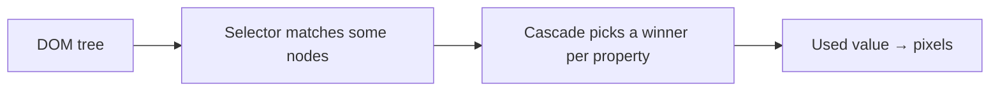
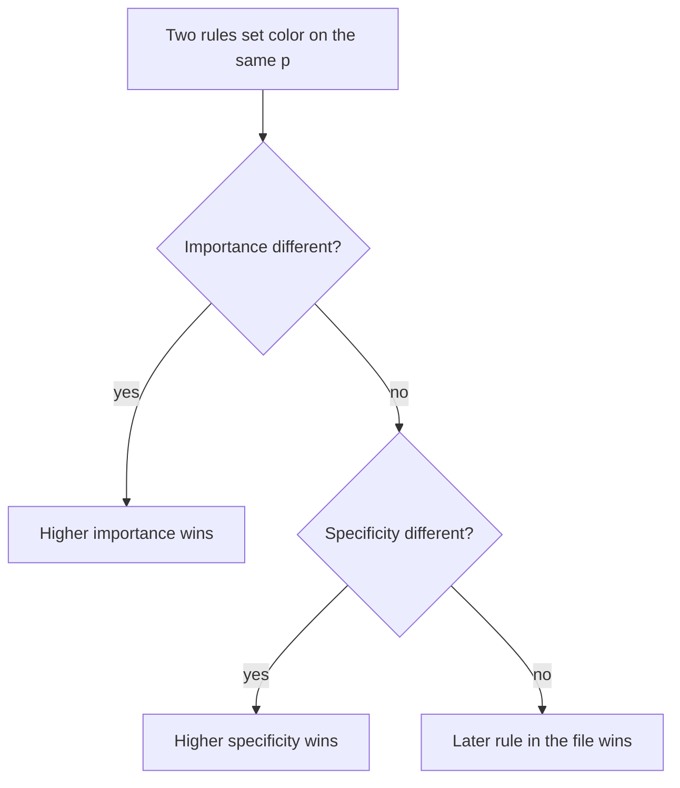

# Month 2 · Week 3 · Day 1
# CSS: Selectors, Cascade, Specificity, Inheritance

**Month index:** [../../README.md](../../README.md)  
**Week 3:** Day 1 (today) · [2](day-02.md) · [3](day-03.md) · [4](day-04.md) · [5](day-05.md) · [6](day-06.md) · [7](day-07.md)  
**Week rhythm today:** Learn + type-along  
**Study time:** 3–4 focused hours  
**Student state:** You can write semantic HTML. The page still looks like 1995. That is correct. Today you learn *how the browser chooses a color*.

**This week covers:** selectors, cascade, specificity, inheritance, typography, units, box model, normal flow, display, positioning.

Today is **who wins** when two rules disagree. Boxes and layout are Days 2–4. Do not skip them. If you skip “who wins,” Flexbox will feel like magic that randomly ignores you.

---

## How to read this chapter

CSS looks like a list of pretty properties. It is not. It is a **decision procedure** over the DOM tree you built in Week 1.

Read each section. Close it. Say it in one sentence. Then type the lab. When the color is “wrong,” you will open **Computed** — that panel is the answer key, not a blog.

---

## Today's contract

By the end of this day you will be able to:

1. Explain CSS as **rules that select elements and assign properties**.
2. Attach CSS with an external file (`<link>`).
3. Write type, class, id, descendant, child, attribute, and `:focus-visible` selectors — and know which ones to prefer.
4. Predict a winner using **importance → specificity → source order**.
5. Compute a simple specificity score and prove it in DevTools **Computed**.
6. Name what **inherits** (color, font) vs what does not (margin, border).
7. Use custom properties (`--accent`) so you do not copy a hex twenty times.

**Today's gate.** Closed-book:

> Specificity is not “the last rule always wins” and not “id always wins without counting.” I can score `p` vs `.note` vs `#special`, then look at Computed to verify.

If you cannot, stay here. Week 4 layout will multiply your confusion, not hide it.

---

## Time box

| Block | Minutes | Work |
|---|---|---|
| A | 55 | Theory (read slowly — this is the week’s core) |
| B | 50 | Type-along: conflicting colors |
| C | 70 | Independent: restyle a Week 1 page |
| D | 25 | Git |
| E | 15 | Recall |

---

# Block A — Theory

## 1. What CSS is — in plain language

**HTML** said *what* each piece of the document *is*. **CSS** says *how those pieces should look*: color, type, spacing, and (later) layout.

Think of HTML as the script of a play (who is the hero, who is the chorus). CSS is the costume and lighting. Changing the lighting does not change who the hero is. Making a `div` *look* like a heading does not make it a heading.

A **rule** has two parts:

```css
selector {
  property: value;
}
```

- **Selector:** which elements this rule talks to.
- **Declaration block:** which properties to set.

```css
p {
  color: #1a1a1a;
  line-height: 1.5;
}
```

In English: “Every `p` should use this text color and this line spacing.”



**Wrong belief:** “CSS is just colors.”  
**Correct:** CSS is a constraint solver over a tree. “The box is too wide,” “the heading is blue but I wanted black,” “the link has no focus ring” — those are CSS until proven otherwise.

---

## 2. How CSS arrives on the page

Three ways. You need all three so you can *read* other people’s pages. You will **write** mostly the first.

| Way | How | When to use |
|---|---|---|
| **External** | `<link rel="stylesheet" href="styles.css">` in `head` | Always, for Project 1 and labs |
| **Internal** | `<style>…</style>` in `head` | Tiny experiments |
| **Inline** | `style="color: red"` on one tag | To *understand* specificity. Not a style system |

External CSS is one file many pages can share. That is the point of a stylesheet.

The `href` is a path, like any other URL. If `styles.css` sits next to `index.html`, write `href="styles.css"`. If you write `href="/styles.css"`, the browser asks the **site root** — on GitHub Pages that is often the wrong folder and the CSS 404s. Relative paths, as in Month 1.

**Wrong belief:** “I’ll put styles in the HTML so it’s simpler.”  
**Correct:** mixed files become unmaintainable by page two. External file. One job each.

---

## 3. Selectors you must be able to write

A selector is a **question**: “which nodes?”

### 3.1 Type

`p`, `h1`, `a` — every element with that tag name.

Good for defaults: “all paragraphs have comfortable line-height.” Bad for “this one paragraph is a warning” — that needs a class.

### 3.2 Class

HTML: `class="note"`. CSS: `.note`.

A class is a **label you invent**. You can put the same class on many elements. You can put several classes on one element: `class="note warning"`.

This is how you style *kinds* of things: `.card`, `.site-header`, `.btn`.

### 3.3 ID

HTML: `id="main"`. CSS: `#main`.

An `id` must be **unique on the page** (HTML rule). Styling with IDs makes the rule very strong (see specificity). Then you cannot override it with a class without `!important` or a mess.

**This course styles with classes.** IDs stay for skip links, `label for`, and in-page `#hours` links.

### 3.4 Combining

| Selector | English |
|---|---|
| `nav a` | an `a` **anywhere inside** `nav` (descendant) |
| `ul > li` | an `li` that is a **direct child** of `ul` |
| `input[type="email"]` | an input whose `type` attribute is `email` |
| `a:hover` | a link while the pointer is over it |
| `a:focus-visible` | a link that should show a **keyboard** focus ring |
| `tr:nth-child(even)` | even rows of a table |
| `h1, h2, h3` | all three (group) |

**`:hover` is not enough.** Keyboard users never hover. Always give `:focus-visible` a visible ring. Never `outline: none` without a replacement.

### 3.5 Why `nav a` vs `main a`

Site nav links and article links should not look identical. `nav a { text-decoration: none; }` and `main a { text-decoration: underline; }` is a real product decision, not decoration.

---

## 4. The cascade — who wins, in order

You will write two rules that both set `color` on the same paragraph. One wins. The procedure has a name: the **cascade**.

In language you can remember:

1. **Importance.** Browser defaults lose to your stylesheet. Your `!important` beats your normal rule (do not use `!important` this month except later reduced-motion).
2. **Specificity.** A more *specific* selector beats a weaker one.
3. **Source order.** If two rules are equally specific, the **one that appears later in the CSS** wins.



That is why “I wrote it but nothing happened” is almost never “CSS is broken.” You **lost**. Computed will name the winner.

**Wrong belief:** “The last rule in the file always wins.”  
**Correct:** last rule wins only among **equal** specificity. An ID earlier in the file still beats a class later.

---

## 5. Specificity — counting, not vibes

Do not memorize folklore (“IDs always win”). **Count.**

Think of a score with four numbers: `(inline, IDs, classes-and-attributes-and-pseudo-classes, types-and-pseudo-elements)`.

Compare left to right, like versions: `1,0,0,0` beats `0,99,0,0`. Inline `style=""` is that leading `1`.

| Selector | Rough score | Why |
|---|---|---|
| `p` | 0,0,0,1 | one type |
| `.note` | 0,0,1,0 | one class |
| `nav a` | 0,0,0,2 | two types |
| `nav .item` | 0,0,1,1 | one class + one type |
| `#main` | 0,1,0,0 | one ID |
| `#main p` | 0,1,0,1 | ID + type |
| `style="color:…"` | 1,0,0,0 | inline |

**Worked example**

```css
p { color: black; }       /* 0,0,0,1 */
.note { color: navy; }    /* 0,0,1,0 */
#special { color: red; }  /* 0,1,0,0 */
p { color: green; }       /* 0,0,0,1 — same as first p, but later */
```

- A plain `p`: both type rules tie on specificity; **green** wins (later).
- `class="note"`: class beats type → **navy**. The later `p { green }` is weaker.
- `id="special"`: ID beats class → **red**.

If this is still foggy: write the four numbers in `PREDICT.txt` *before* you open the browser. Then Computed. Science, not hope.

**`!important`** jumps to a higher importance layer. If you need it against *your own* CSS, your selectors are too strong (usually an ID). Do not start a fight with `!important`.

---

## 6. Inheritance — children can borrow some properties

Some properties **flow down** the tree. Some do not.

**Usually inherited:** `color`, `font-family`, `font-size`, `line-height`.

Set `body { color: #1a1a1a; font-family: system-ui, sans-serif; }` and paragraphs pick it up. You do not set font on every `p`.

**Usually not inherited:** `margin`, `padding`, `border`, `width`, `display`.

`p { margin-top: 2rem }` does **not** give an inner `em` a 2rem top margin. Spacing is per box.

**Wrong belief:** “I set color on `main` so the border of the card should be that color too.”  
**Correct:** `border-color` can follow `color` in some cases, but **width** never inherits. When in doubt, Computed.

---

## 7. Custom properties (tokens)

A **custom property** is a name you invent, starting with `--`, usually on `:root` (the document):

```css
:root {
  --text: #1a1a1a;
  --accent: #0b5fff;
  --space: 1rem;
}

a {
  color: var(--accent);
}
```

`var(--accent)` means “use that token.” Change the token once; every `var(--accent)` updates. Project 1 will thank you.

They **inherit**. Nested components can override `--accent` for a subtree if you ever need that.

---

## 8. DevTools Computed is the truth

1. Inspect an element.
2. **Computed** tab.
3. Find `color` (or `margin-top`).
4. The winning value is listed. Expand it to see **which rule** won.

If you argue with the screen, the screen is right. Your mental cascade was wrong. That is the lesson, not an insult.

---

# Block B — Type-along

Create `~\fullstack-lab\month-02\week-03\day-01\cascade.html` and `cascade.css`. Link the CSS from `head`.

HTML: `header`, `main` with two `p` (one `class="note"`, one `id="special"`), `nav` with two links.

CSS — type **in this order**, predict, then look:

```css
p {
  color: black;
}

.note {
  color: navy;
}

#special {
  color: crimson;
}

p {
  color: green;
}
```

`PREDICT.txt` **before** opening the page:

1. Color of a plain `p`?
2. Color of `.note`?
3. Color of `#special`?
4. Did the second `p { green }` beat the first `p { black }`? Why?

Then Computed. Write ACTUAL. If you missed, write which cascade step you forgot.

Add:

```css
a:focus-visible {
  outline: 3px solid #0b5fff;
  outline-offset: 2px;
}
```

Tab to a link. If you cannot see the ring, the lab is not done.

---

# Block C — Independent

Restyle **your** `hours.html` or `catalog.html` with a **new** `styles.css`. Keep the HTML semantic.

Rules:

- No ID selectors for styling (`#main` in HTML for the skip link is fine)
- `body` font and color; let inheritance work
- `nav a` vs `main a` distinguishable
- One `.note` class
- Custom properties for text and accent
- No `!important`
- No layout tables

`CASCADE.txt`: one conflict you created on purpose, the two scores, who won.

---

# Block D

```powershell
git add month-02/week-03
git commit -m "Week 3 Day 1: cascade and specificity lab."
```

---

# Block E — Recall

Close the file.

1. Three cascade steps.
2. Why we do not style with IDs.
3. What inherits.
4. What Computed is for.
5. Why `:focus-visible` exists.

---

## Definition of done

- [ ] I can explain selector, cascade, specificity, inheritance without a website
- [ ] PREDICT matched Computed, or I wrote why it did not
- [ ] I Tabbed and saw a focus ring
- [ ] Independent page uses classes and tokens, no `!important`
- [ ] Commit exists

---

## Optional review links

The cascade is explained in this chapter.

- [MDN: Cascade](https://developer.mozilla.org/en-US/docs/Web/CSS/CSS_cascade/Cascade)
- [MDN: Specificity](https://developer.mozilla.org/en-US/docs/Web/CSS/CSS_cascade/Specificity)
- [MDN: Inheritance](https://developer.mozilla.org/en-US/docs/Web/CSS/CSS_cascade/Inheritance)
- [MDN: CSS selectors](https://developer.mozilla.org/en-US/docs/Web/CSS/CSS_selectors)

---

## Tomorrow

Every element is a **box**. Mystery space is padding, border, margin, or line-height — not a ghost. You will measure it.
