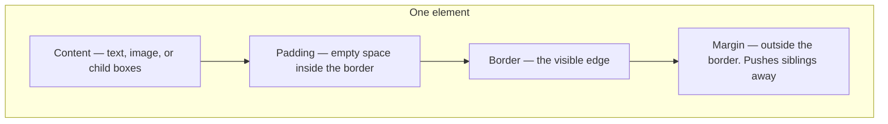
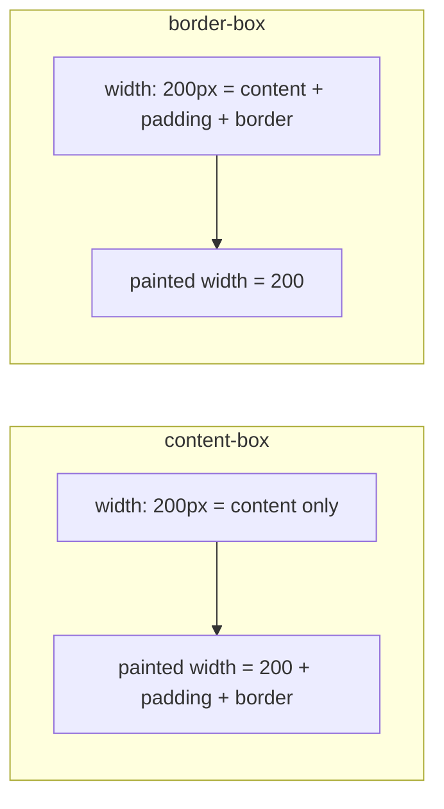

# Month 2 · Week 3 · Day 2
# Typography, Units, and the Box Model

**Month index:** [../../README.md](../../README.md)  
**Week 3:** [1](day-01.md) · Day 2 (today) · [3](day-03.md) · [4](day-04.md) · [5](day-05.md) · [6](day-06.md) · [7](day-07.md)  
**Week rhythm today:** Exercises + debugging  
**Study time:** 3–4 focused hours  
**Prereq:** Day 1 gate. You can predict a specificity fight and prove it in Computed.

Yesterday CSS chose a **color**. Today you learn why a box is **wider than you asked**, why two paragraphs have **less gap than you added**, and why type that looks “fine on your laptop” is unreadable on a phone. Mystery space is almost never “the browser being random.” It is padding, border, margin, line-height, or `box-sizing`. You will measure it.

---

## How to read this chapter

Imagine every HTML element as a **picture frame**.

- The **photograph** is the content (the words, the image).
- The **mat** around the photo is **padding** (empty space inside the frame).
- The **wooden frame** is the **border**.
- The **gap to the next picture on the wall** is **margin**.

If you say “this frame is 200px wide,” you must know whether you meant the photograph, or the photograph plus mat plus wood. That one sentence is the box model.

Read each section. Close it. Say it in one sentence. Then type the lab and **write numbers from DevTools**, not from this page.

---

## Today's contract

By the end of this day you will be able to:

1. Choose a readable type stack, body size in `rem`, and unitless `line-height`.
2. Explain `px`, `rem`, `em`, `%`, `vh`/`vw` — and when each is honest.
3. Draw the box: content → padding → border → margin.
4. Predict total width under **content-box** vs **border-box**.
5. Set the global `box-sizing: border-box` rule and explain why Project 1 requires it.
6. Recognize **margin collapse** when two vertical margins become one.
7. Use the DevTools **box-model diagram** as the answer key.

**Today's gate.** Closed-book:

> Every element is a box. `width` is not always the width you see unless I know `box-sizing`. Mystery gaps are margin, padding, or line-height. I can measure all three in DevTools.

If you cannot, stay here. Flexbox will not save you from a misunderstood rectangle.

---

## Time box

| Block | Minutes | Work |
|---|---|---|
| A | 55 | Theory (read slowly — draw the box on paper) |
| B | 60 | Type-along: measure content-box vs border-box |
| C | 50 | Break and fix: accidental horizontal scroll |
| D | 20 | Git |
| E | 15 | Recall |

---

# Block A — Theory

## 1. Typography — making text readable, not “designed”

Before layout, the page is **words**. If the words are a 90-character line in 12px gray on white, no amount of Flexbox will make the site good.

Start here. You do not need a downloaded font this month.

| Property | Start here | Why |
|---|---|---|
| `font-family` | `system-ui, "Segoe UI", Roboto, sans-serif` | Uses the OS UI font. Fast, familiar, no extra download. |
| `font-size` | Body ≈ `1rem` (usually 16px) | People can enlarge text in the browser. `rem` follows the root. |
| `line-height` | Unitless `1.5` for body | Multiplier of the element’s font size. Inherits sanely. |
| `font-weight` | `400` regular, `700` bold | `<strong>` is already importance. Do not fake importance with CSS alone. |
| Measure | ~45–75 characters per line | `max-width: 40rem` on article text. Edge-to-edge paragraphs are tiring. |

```css
html {
  font-size: 100%; /* respect the user’s default, usually 16px */
}

body {
  font-family: system-ui, "Segoe UI", Roboto, sans-serif;
  font-size: 1rem;
  line-height: 1.5;
  color: var(--text);
}

main {
  max-width: 40rem;
  margin-left: auto;
  margin-right: auto;
  padding-left: 1rem;
  padding-right: 1rem;
}
```

**Wrong belief:** “Headings should be `font-size: 32px` on every `h1`.”  
**Correct:** set a **scale in `rem`**. If the user bumps the root size, headings should grow too. `html { font-size: 100%; }` plus `h1 { font-size: 2rem; }` is the honest start.

**Wrong belief:** “`line-height: 24px` is more precise.”  
**Correct:** a **length** line-height does not scale with nested font sizes the way a **unitless** multiplier does. Body text: `1.5`. Headings can be tighter (`1.2`) because large type already has more space between lines.

---

## 2. Units — what the number is relative to

A CSS length is a number plus a unit. The unit answers: **relative to what?**

| Unit | Relative to | Honest use this month |
|---|---|---|
| `px` | Device pixels (simplified) | Hairline borders (`1px`). Not a type scale. |
| `rem` | **Root** element (`html`) font size | Type, spacing, max-widths. Preferred. |
| `em` | **This element’s** font size (or parent, depending on property) | Useful; easy to **compound** if you nest `font-size: 0.9em` three times. |
| `%` | Containing block (for width) | `width: 100%` means “as wide as the parent’s content box.” |
| `vh` / `vw` | 1% of viewport height / width | Full-height heroes later. Do **not** set body text in `vw`. Mobile browser chrome makes `vh` lie. |

**`rem` vs `em` in one picture.** If `html` is 16px:

- `1.5rem` is always 24px until the user changes the root.
- `1.5em` on a heading whose `font-size` is 32px is 48px. Nested inside another sized box, `em` can surprise you.

A spacing scale you can copy into `:root`:

```css
:root {
  --s-1: 0.25rem; /* 4px at default root */
  --s-2: 0.5rem;
  --s-3: 0.75rem;
  --s-4: 1rem;
  --s-6: 1.5rem;
  --s-8: 2rem;
}
```

Use `var(--s-4)`, not a new magic number every time.

**Wrong belief:** “Pixels are exact; rem is sloppy.”  
**Correct:** pixels ignore the user’s font size. `rem` is how you stay exact **and** respectful.

---

## 3. The box model — four layers

Every element generates a **box**. (Some generate more than one; ignore that this month.)

```
┌──────────── margin ────────────┐
│  ┌──────── border ──────────┐  │
│  │  ┌──── padding ───────┐  │  │
│  │  │                    │  │  │
│  │  │      content       │  │  │
│  │  │                    │  │  │
│  │  └────────────────────┘  │  │
│  └──────────────────────────┘  │
└────────────────────────────────┘
```



- **Content:** the text or replaced content (an image). This is where `width` and `height` apply — **depending on `box-sizing`**.
- **Padding:** space between content and border. Same background as the content area (usually). Clickable area of a button includes padding.
- **Border:** the stroke. Has a width, style (`solid`), and color.
- **Margin:** transparent. Separates this box from others. **Not** part of the background.

You set them like this:

```css
.box {
  width: 200px;
  padding: 20px;
  border: 10px solid #1a1a1a;
  margin: 20px;
}
```

The question that will haunt you: **is the 200px the photograph, or the whole frame?**

---

## 4. `content-box` vs `border-box`

**`box-sizing: content-box`** (the old default):

> `width` is the **content** only. Padding and border **add** to the total.

For the rule above:

| Layer | Size |
|---|---|
| Content | 200px |
| Padding left + right | 40px |
| Border left + right | 20px |
| **Total occupied width** | **260px** |
| Plus left + right margin | +40px more for layout spacing |

If this box is inside a 200px-wide parent, it **overflows**. That is the classic “I set width 100% and padding and now there is a horizontal scrollbar.”

**`box-sizing: border-box`** (what you will use forever):

> `width` includes **content + padding + border**. Margin is still outside.

Same rule: total border-box width is **200px**. The content area shrinks to make room for padding and border (200 − 40 − 20 = 140px of content).

```css
*,
*::before,
*::after {
  box-sizing: border-box;
}
```

Put this at the top of every stylesheet from today. Then `width: 100%` means “as wide as the parent,” even after you add padding.



**Wrong belief:** “`width: 100%` always fits.”  
**Correct:** under content-box, 100% **plus** padding plus border is more than the parent. Under border-box, 100% includes padding and border.

**Margin is never inside `width`.** `box-sizing` does not swallow margin. If you need “this card is 100% of the parent including its outer gap,” you want `gap` on the parent (Week 4) or smaller width, not wishful margin.

---

## 5. Margin collapse — why 24px + 24px can equal 24px

**Vertical** margins of **adjacent block boxes in normal flow** can **combine** into a single margin: the larger of the two (roughly). Horizontal margins do **not** collapse.

```css
p {
  margin-top: 24px;
  margin-bottom: 24px;
}
```

Two such paragraphs stacked: you might expect 48px between them. You often get **24px**. The bottom margin of the first and the top margin of the second **collapsed**.

That is why “I set 20px and 20px and got 20px.” The browser is following the spec, not mocking you.

**When collapse is less likely (you will meet these later):** padding or border on a parent can **stop** collapse through that parent; `overflow` other than `visible` can create a new block formatting context; flex and grid items do **not** collapse margins with each other the same way. Today: measure two `p`s in a normal article. Write the number.

**Wrong belief:** “Use padding for all spacing so collapse never happens.”  
**Correct:** padding and margin do different jobs. Padding is inside the background; margin is outside. Learn collapse; do not hide from it.

---

## 6. Debugging layout — a procedure, not a vibe

When a box is “wrong”:

1. Select the element in the **Elements** panel.
2. Look at the **box-model diagram** (a nested rectangle, usually in the Layout or Computed sidebar). You will see numbers for margin, border, padding, content.
3. In **Computed**, find `box-sizing`, `width`, `display`, `margin-top`.
4. Toggle a declaration **off**. If the bug vanishes, you found a suspect. Do not change five things at once.

If the page has a horizontal scrollbar: find the child whose border-box is wider than the viewport. Common culprits: content-box + `width: 100%` + padding; a large image without `max-width: 100%`; a fixed `width: 1200px`.

---

## 7. Images are boxes too

An `img` is a **replaced** element: it has an intrinsic width and height. Without CSS, a 2000px image is 2000px wide and will blow the page.

You will set this globally in Week 4. Peek now:

```css
img {
  max-width: 100%;
  height: auto;
}
```

HTML `width` and `height` attributes still matter: they hint the aspect ratio before the file loads (less layout jump). They are not a substitute for `max-width: 100%`.

---

# Block B — Type-along: measure, do not guess

Create `~\fullstack-lab\month-02\week-03\day-02\box.html` and `box.css`. Link the CSS. Serve over HTTP.

### Lab 1 — Content-box (the default)

Three `div.box` elements. **Do not** set `border-box` yet.

```css
.box {
  width: 200px;
  padding: 20px;
  border: 10px solid #1a1a1a;
  margin: 20px;
  background: #e8e4db;
}
```

In DevTools, select one `.box`. Read the box-model diagram.

`MEASURE.txt` — write:

1. Content width  
2. Padding (each side)  
3. Border (each side)  
4. **Total width of the border-box** (content + padding + border)  
5. Your prediction before you looked  

If you wrote 200 for total width, you assumed border-box. Look again.

### Lab 2 — Border-box

Add at the **top** of `box.css`:

```css
*,
*::before,
*::after {
  box-sizing: border-box;
}
```

Refresh. Measure the same box. Total width should now be **200**. Write the new content width (it should be smaller — padding and border ate into the 200).

### Lab 3 — Margin collapse

Two `p` elements, no other special CSS except:

```css
p {
  margin-top: 24px;
  margin-bottom: 24px;
  background: #f6f4ef; /* so you can see the content box */
}
```

Measure the **gap between** the two paragraphs (the space between their border-boxes). Is it 24, 48, or something else? Write whether collapse happened.

### Lab 4 — Type scale

```css
html { font-size: 100%; }
body { font-size: 1rem; line-height: 1.5; }
h1 { font-size: 2rem; }
```

In DevTools, change `html` font-size to `20px`. Watch `h1` and `body` scale. Write one sentence: what would have happened if the `h1` were `32px` instead of `2rem`?

---

# Block C — Break and fix

On yesterday’s restyled page (or today’s `box.html` wrapped in a full-width `main`):

1. **Cause** a horizontal scrollbar on purpose: a child with `width: 100%`, `padding: 2rem`, and **without** border-box (comment out the universal rule).
2. Write the computed width of that child vs the parent.
3. **Fix** with the universal `border-box` rule. Confirm the scrollbar is gone.
4. Optional second cause: a wide image. Fix with `max-width: 100%; height: auto`.

`SCROLL.txt`: cause, numbers, fix.

---

# Block D — Git

```powershell
git add month-02/week-03
git commit -m "Week 3 Day 2: box model measurements and typography scale."
```

---

# Block E — Recall

Close the file.

1. Draw content, padding, border, margin. Which is inside `width` under border-box?
2. Why 24px + 24px vertical margins can equal 24px.
3. Why `rem` for type and `px` for a 1px border.
4. What the box-model diagram is for.
5. Why Project 1 will start with `box-sizing: border-box` on `*`.

---

## Definition of done

- [ ] I can draw the four layers without looking
- [ ] MEASURE.txt has **my** DevTools numbers for both box-sizing modes
- [ ] I observed margin collapse and wrote the gap
- [ ] I caused and then fixed horizontal overflow
- [ ] Root font-size change scaled `rem` headings
- [ ] Commit exists

---

## Optional review links

The box model, units, typography, and `box-sizing` are explained in this chapter. These pages are for later checking, not for first learning.

- [MDN: Box model](https://developer.mozilla.org/en-US/docs/Learn_web_development/Core/Styling_basics/Box_model)
- [MDN: Values and units](https://developer.mozilla.org/en-US/docs/Learn_web_development/Core/Styling_basics/Values_and_units)
- [MDN: `box-sizing`](https://developer.mozilla.org/en-US/docs/Web/CSS/box-sizing)
- [MDN: Mastering margin collapsing](https://developer.mozilla.org/en-US/docs/Web/CSS/CSS_box_model/Mastering_margin_collapsing)

---

## Tomorrow

From memory: an article styled with tokens, `border-box`, and a specificity prediction. Days 1–2 closed during the drills. Repair from **those two files in this book**.
