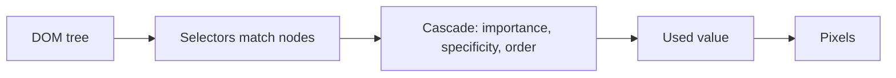

# Month 2 · Week 3 · Day 3
# From Memory: Cascade and Boxes

**Month index:** [../../README.md](../../README.md)  
**Week 3:** [1](day-01.md) · [2](day-02.md) · Day 3 (today) · [4](day-04.md) · [5](day-05.md) · [6](day-06.md) · [7](day-07.md)  
**Week rhythm today:** Implement from memory  
**Study time:** 3–4 focused hours  
**Days 1–2 of this week:** closed during the drills. Repair by re-reading **those two files**, not MDN.

---

## How to read this chapter

Yesterday you measured boxes. The day before, you counted specificity. Today you **style an article** without looking at those labs.

The complete explanation below is the lesson. Keep **this file** open. Keep Days 1–2 closed while you type. Write `PREDICT.txt` **before** you open Computed — that file is the science, not a diary after you already peeked.



Serve over **HTTP**, not `file://`. A 404 stylesheet looks like “CSS doesn’t work.” Check Network.

---

## Complete explanation (CSS choosing values + boxes)

**CSS** assigns properties to elements via **selectors**. A rule is `selector { property: value; }`. Prefer an **external** stylesheet (`<link rel="stylesheet" href="...">`). Inline `style=""` wins fights you will regret. `!important` is an emergency, not a habit.

**Cascade (who wins when two rules set the same property):**

1. **Origin and importance** — user-agent styles, then your author styles. `!important` in author CSS beats a normal author rule. Do not use it in your own CSS this month except the reduced-motion pattern in Week 4.
2. **Specificity** — a four-part count you can compute: inline style; IDs; classes / attributes / pseudo-classes; types / pseudo-elements. `#main` beats `.note` beats `p`. Equal specificity: **source order** — the later rule wins.
3. Style with **classes**, not IDs, so you can reuse and override without painting yourself into a corner.

**Selectors you must be able to write:** type (`p`), class (`.note`), descendant (`main p`), child (`ul > li`), attribute (`input[type="email"]`), pseudo-class (`:hover`, `:focus-visible`, `:not(.x)`). Do not style with IDs.

**Inheritance:** `color`, `font-family`, `font-size`, `line-height` inherit (a `p` inside `main` gets `main`’s color unless overridden). `margin`, `padding`, `border`, `width`, `height` do **not** inherit. `inherit` as a value forces it; you rarely need that this month.

**Custom properties:** `:root { --text: #1a1a1a; }` then `color: var(--text)`. They inherit. Change the token, not twenty copies of a hex.

**Units:** `rem` is relative to the **root** font size (good for type and spacing). `em` is relative to the **element’s** font (compounds in nested elements — be careful). `px` for hairline borders. `%` of the **containing block**. `vh`/`vw` exist; do not make body text `vw` this month.

**Box model:** every box has **content**, **padding**, **border**, **margin**. In the default `content-box`, `width` is only the content — padding and border stick out, which is why “width 100% plus padding” overflows. Set globally:

```css
*,
*::before,
*::after {
  box-sizing: border-box;
}
```

Now `width` includes padding and border. Margin is still outside.

**Margin collapse:** adjacent vertical margins of block boxes in flow can combine into the larger one. That is why “I set 2rem on both and got 2rem total.” Horizontal margins do not collapse.

**Typography this course:** system font stack, `line-height` around 1.5 for body, `max-width` on `main` (~40rem / ~65 characters) so lines do not run edge to edge, horizontal padding so text is not glued to the viewport.

**Links:** color from `--accent`; underline on `:hover`; **`:focus-visible` ring** so keyboard users see focus. Never remove outline without replacing it.

**DevTools Computed** is how you prove who won. The box-model diagram is how you prove padding vs width.

**Wrong belief:** “The last rule in the file always wins.”  
**Correct:** only among equal specificity. An ID earlier in the file still beats a class later.

If Days 1–2 are closed, you still need those ideas in full. The next sections are that lesson, with a picture and a worked fight.

### CSS is a decision procedure

HTML said what each node *is*. CSS asks, for each property on each node: **which declaration wins?** The browser then paints.

You do not “apply CSS to the page” as one blob. You lose or win **per property**. `color` can come from `.note` while `margin` still comes from `p`. Computed lists the winner for each.

### Specificity you can count

Think of four numbers: `(inline, IDs, classes-attributes-pseudos, types)`.

| Selector | Score |
|---|---|
| `p` | 0,0,0,1 |
| `main p` | 0,0,0,2 |
| `.note` | 0,0,1,0 |
| `main .note` | 0,0,1,1 |
| `#special` | 0,1,0,0 |
| `style="color: red"` | 1,0,0,0 |

Compare left to right, like version numbers. `0,0,1,0` beats `0,0,0,2`. That is why `.note` beats `main p` even if `main p` comes later in the file.

**Worked example** (write this into `PREDICT.txt` with *your* colors before you open the browser):

```css
main p { color: var(--text); }   /* 0, 0, 0, 2 */
.note { color: var(--accent); } /* 0, 0, 1, 0 */
```

A paragraph with `class="note"` inside `main`: **`.note` wins** for `color`. Computed should list the `.note` rule, not `main p`. If it does not, you spelled the class wrong or a more specific rule exists.

Style with **classes**. An ID in CSS (`#main { color: … }`) will beat almost every class you write later. HTML `id="main"` for skip links is fine. **Selecting** `#main` in the stylesheet is how you paint yourself into a corner.

**Wrong belief:** “IDs are more professional.”  
**Correct:** IDs are unique hooks for fragments and labels. Classes are for styling kinds of things.

### Inheritance vs the box

Set `color` on `body` or `:root`. Paragraphs pick it up unless a more specific color wins. Set `margin` on `body`; paragraphs do **not** get that margin as their own — they have their own margin defaults.

In `NOTES.txt` you will name one inherited property (`color` or `font-family`) and one that did not (`margin` or `border`). Prove it: change `--text` on `:root` and watch the paragraph change; add padding on `main` and watch a child **not** grow the same padding unless you set it.

### Tokens

```css
:root {
  --text: #1a1a1a;
  --bg: #fafafa;
  --accent: #0b5fff;
  --space: 1rem;
}

body {
  color: var(--text);
  background: var(--bg);
  font-family: system-ui, sans-serif;
}
```

Custom properties inherit. Nested components can override `--accent` for a subtree later. This month, one `:root` sheet is enough. Do not copy `#0b5fff` twelve times.

### Why `border-box` is a course law

Default `box-sizing: content-box`: `width: 40rem` means **content** 40rem. Padding and border add **outside**, so the border-box is wider than 40rem. Put that box in a 40rem-wide main and you get horizontal overflow.

`border-box`: `width: 40rem` includes padding and border. Margin still sits outside (and vertical margins may **collapse** with a sibling’s).

```
content-box:  | pad | CONTENT=width | pad | border |     → total > width
border-box:   | pad | CONTENT       | pad |  = width     → total = width + margin
```

Draw that once on paper. Then trust the DevTools box-model diagram, not your hope.

**Wrong belief:** “`width: 100%` always fits.”  
**Correct:** under content-box, 100% plus padding plus border is more than the parent.

### Type and focus you must include today

- System stack: `system-ui, sans-serif` (or a short honest stack). You are not licensing a display font this month.
- `line-height: 1.5` on body (unitless, so it scales with font-size).
- `main { max-width: 40rem; padding-inline: var(--space); }` so lines are readable and not glued to the window edge. You may center with `margin-inline: auto`.
- Links: `color: var(--accent)`; `:hover { text-decoration: underline; }` if you removed underline on nav later — **body links keep an obvious cue**; `:focus-visible { outline: 2px solid var(--accent); outline-offset: 2px; }`.
- Never `outline: none` alone.

### What `PREDICT.txt` must contain

Write **numbers**, not vibes:

```
main p  →  0, 0, 0, 2   (two types)
.note   →  0, 0, 1, 0   (one class)
Winner for color on <p class="note"> inside main: .note
```

Then, after Computed, add one line: “Computed agreed” or “Computed showed X; I was wrong because Y.” A prediction written **after** you looked is a diary. The lab is science.

### A minimal article stylesheet (jobs, not a paste of Project 1)

You still type this yourself. These are the **jobs** the spec requires, in the order a careful file uses:

1. `box-sizing: border-box` on `*` (and pseudo-elements).  
2. `:root` tokens.  
3. `body` color, background, font, line-height from tokens.  
4. `main` max-width ~40rem, horizontal padding, optional auto side margins.  
5. `.note` color (or background) from `--accent` / a token — this is the class that must beat `main p`.  
6. `a` color; `a:hover`; `a:focus-visible`.

You may set heading `margin-top` in `rem`. You may not select `#main`. You may not add `display: flex` — that is Week 4, and it would hide whether you understand flow.

**Wrong belief:** “If I skip PREDICT and the colors look right, I learned cascade.”  
**Correct:** looking right is luck or a tutorial residue. The prediction is the skill.

### Inheritance check you will write in `NOTES.txt`

1. Change `--text` on `:root`. Body and paragraphs should change. That is **inheritance** of `color` (via `var`, which inherits as a custom property).  
2. Set `padding` on `main` only. A child `p` does **not** gain that padding as its own padding. You should still see the main’s padding *around* the paragraph. That is **not** inheritance; that is the parent’s box.

If you wrote “padding inherits” in NOTES, re-read this paragraph.

### Common failures from memory

| What happened | What it usually means |
|---|---|
| CSS 404 | `href="/article.css"` or you served the wrong folder |
| `.note` still body color | class typo in HTML or CSS; or a more specific rule you forgot |
| PREDICT written after Computed | You inverted the lab. Rewrite PREDICT from memory, then look again |
| Huge line length | `max-width` missing on `main` |
| Focus invisible | you set `outline: none` or never wrote `:focus-visible` |
| Used `#main` in CSS | C4 from Day 5 would fail. Use a class on `main` if you need a hook: `.site-main` |

Serve over HTTP. Confirm in the Network panel (or View source) that `article.css` returns 200, not 404. Relative `href="article.css"`.

---

## Today's contract

Style an article with classes, `border-box`, and tokens, and predict a specificity fight before Computed.

**Today's gate**

I can style an article with classes, `border-box`, and tokens, and I can predict a specificity fight before I open Computed.

---

## Time box

| Block | Minutes | Work |
|---|---|---|
| A | 25 | Speak cascade, specificity, box-sizing, inheritance |
| B | 20 | Write `PREDICT.txt` (specificity of `main p` vs `.note`) |
| C | 90 | Build `article.html` + `article.css` from the spec |
| D | 30 | Prove `.note` in Computed; fill `NOTES.txt` |
| E | 15 | Git |

Write PREDICT **before** the CSS file exists, or at least before you look at Computed. If you reverse that order, the lab failed even if the colors look nice.

---

Build `~\fullstack-lab\month-02\week-03\day-03\article.html` + `article.css`.

Spec:

1. Semantic article page: `h1`, two `h2`, paragraphs, a `.note` aside or paragraph
2. `:root` custom properties for `--text`, `--bg`, `--accent`, `--space`
3. `border-box` globally
4. Body type: system stack, `line-height` 1.5, `max-width` on `main` (~40rem), horizontal padding
5. Links: accent color; `:focus-visible` ring; `:hover` underline
6. **No IDs in CSS**. No `!important`
7. `PREDICT.txt`: write specificity of `main p` vs `.note` before you open the file

Prove in DevTools that `.note` color is not accidentally overridden. `NOTES.txt`: one inherited property and one that did not inherit.

Serve over HTTP. Link the stylesheet with a **relative** `href="article.css"`. If you write `href="/article.css"`, the browser asks the site root and the CSS 404s.

Do not paste Project 1. Do not add Flexbox.

```powershell
cd ~\fullstack-lab
git add month-02/week-03/day-03
git commit -m "Month 2 Day 3: article styles from memory."
```

---

## Definition of done

- [ ] PREDICT.txt written before Computed
- [ ] No ID selectors, no `!important`
- [ ] Focus-visible visible
- [ ] Notes name inheritance correctly
- [ ] Stylesheet 200 over HTTP
- [ ] Commit exists

---

## Optional review links

Cascade, specificity, and the box model are taught in this chapter and in Week 3 Days 1–2. Recheck later if you want a second wording.

- [MDN: Cascade](https://developer.mozilla.org/en-US/docs/Web/CSS/Cascade)
- [MDN: Specificity](https://developer.mozilla.org/en-US/docs/Web/CSS/Specificity)
- [MDN: `box-sizing`](https://developer.mozilla.org/en-US/docs/Web/CSS/box-sizing)

---

## Tomorrow

Normal flow, `display`, and positioning. Flexbox will not save a misunderstood pile of bricks.
