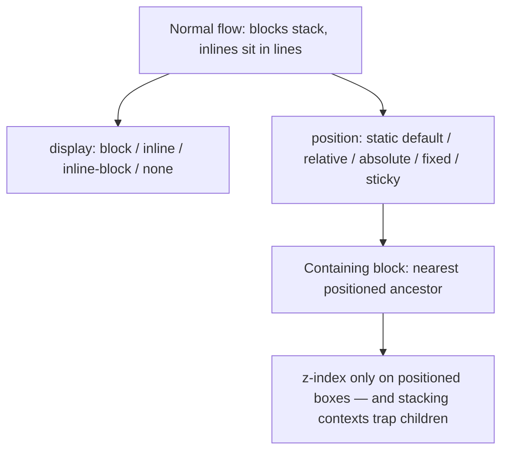
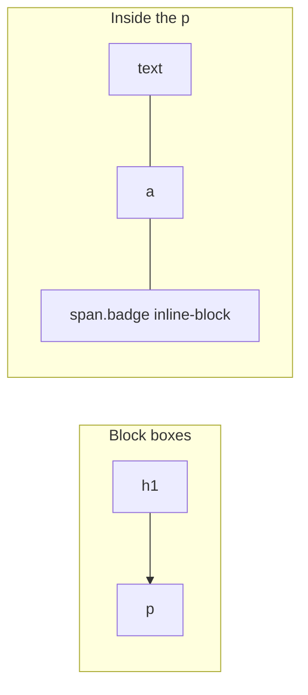
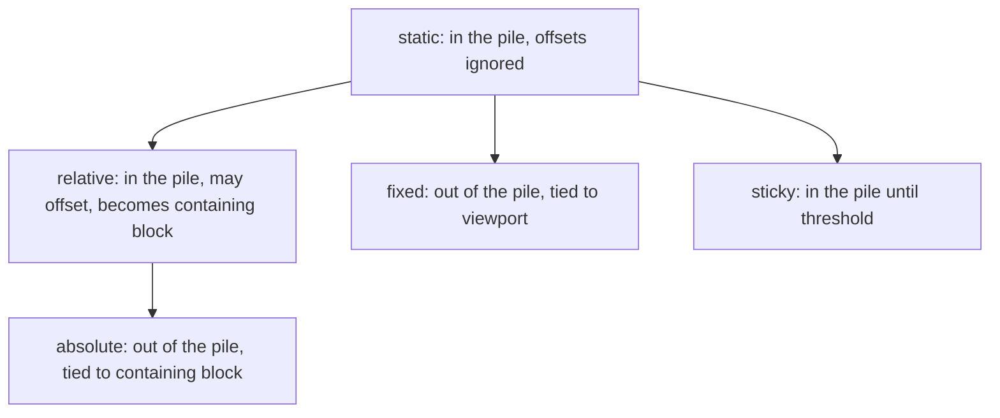

# Month 2 · Week 3 · Day 4
# Normal Flow, Display, Positioning

**Month index:** [../../README.md](../../README.md)  
**Week 3:** [1](day-01.md) · [2](day-02.md) · [3](day-03.md) · Day 4 (today) · [5](day-05.md) · [6](day-06.md) · [7](day-07.md)  
**Week rhythm today:** Add a real project feature  
**Study time:** 3–4 focused hours  
**Prereq:** Day 2 gate. You can draw the box and prove `border-box` in the diagram.  
**Student state:** You can attach a stylesheet, lose a specificity fight on purpose, and measure padding. Today you learn **where boxes go** after they have a size.

Flexbox and Grid are Week 4. Today you must understand **flow**, or Flexbox will feel like magic: you will fight `position: absolute` instead of letting boxes stack. Most of Project 1 is still flow: heading, paragraph, heading, paragraph. This textbook will not give you the portfolio source.

---

## How to read this chapter

Think of the page as a **column of bricks** (block boxes) with **words sitting in lines** inside those bricks (inline boxes). That default is **normal flow**. You do not need a layout library to stack a heading under a nav.

`display` changes **what kind of brick** an element is. `position` is how you **take a brick off the pile** and pin it somewhere. If you pin everything, the pile has no height and the page cannot grow. That is why we do not lay out the whole site with `absolute`.



Read each section. Close it. Say it in one sentence. Then type the lab. When a “New” badge flies to the corner of the **window**, the containing block is not the card — the parent is still `static`. Write that observation in `EXPLAIN.txt`. Do not “fix it” by guessing `z-index: 9999`.

Serve every lab over **HTTP** (`http://127.0.0.1:...`), not `file://`.

---

## Today's contract

By the end of this day you will be able to:

1. Describe normal flow: blocks stack, inlines sit in lines.
2. Predict what `display: block`, `inline`, `inline-block`, and `none` do — including what `none` does to the accessibility tree.
3. Explain why `width` on a default `a` does nothing, and when `inline-block` is the honest badge.
4. Explain `static` vs `relative` vs `absolute` vs `fixed` vs `sticky`.
5. Name the **containing block** for an absolutely positioned badge.
6. Use `sticky` for a header that stays in document order, then pins.
7. Explain why `z-index` on a `static` box does nothing useful, and why a huge number still fails inside a new stacking context.
8. Refuse to lay out the whole page with `absolute`.

**Today's gate.** Closed-book:

> `position: absolute` removes the element from flow. The parent with `position: relative` (or other non-static) is the containing block. Sticky headers are `sticky`, not `fixed`, unless I mean “pinned to the viewport always.” `display: none` is gone from layout **and** from the accessibility tree.

If you cannot say that, stay here. Week 4 will not teach containing block again as a first lesson.

---

## Time box

| Block | Minutes | Work |
|---|---|---|
| A | 70 | Theory — read slowly; draw flow and a containing-block tree |
| B | 70 | Lab: badge, sticky header, callout |
| C | 30 | EXPLAIN.txt |
| D | 20 | Git |
| E | 15 | Recall |

---

# Block A — Theory

## 1. Normal flow — the pile the browser already knows

After CSS has assigned box sizes, the browser **places** boxes. The default placement algorithm is **normal flow**.

In **normal flow**:

- **Block-level** boxes stack vertically. Each starts on a new line and, by default, stretches to the width of its containing block (`p`, `h1`, `div`, `header`, `main`, `article`, `section`, `footer`).
- **Inline-level** boxes sit in **line boxes**, like words (`span`, `a`, `em`, `strong`, and `img` by default). They wrap when the line is full. The next word starts after the previous one, not on a new row of the page.

That is the default page: a column of blocks, with inlines inside the blocks. You do not need Flexbox to stack a heading, a paragraph, and a footer. You do not need Grid either.

Imagine packing a moving truck: large boxes go one on top of another (blocks). Inside a box, folded clothes sit in rows (inlines). If you nail every garment to the truck wall (`absolute`), the stack has no height and you cannot add a sweater without overlapping.

**Wrong belief:** “I need Flexbox to put a paragraph under a heading.”  
**Correct:** that is already flow.

**Wrong belief:** “If I `position: absolute` everything, I control the page.”  
**Correct:** you control a snapshot. Content cannot grow, wrap, or reflow at 375px. Absolute is a **badge**, not a layout system.

Flow still uses the box model from Day 2. Vertical **margin collapse** still happens between adjacent blocks in flow. Flex and Grid items will **not** collapse margins with each other the same way — that is one reason people “fix” mystery gaps by switching to Flex without understanding flow. Learn the gap first.

---

## 2. `display` — what kind of box participates

`display` changes how the element participates in flow. It does not change the HTML meaning. A `span` with `display: block` is still a span in the accessibility tree (generic, no heading rank). Do not fake an `h2` with a styled `div`.

| Value | Behavior |
|---|---|
| `block` | Block box: breaks onto its own line; `width` / `height` / margin apply as a box. Default for `p`, headings, `div`, landmarks. |
| `inline` | Inline box: sits in a line; **`width` and `height` are ignored**; left/right padding and margin can apply; top/bottom padding may paint but often does not push the line box the way you hope. |
| `inline-block` | Sits in a line **and** honors width, height, padding, and border like a box. Honest for badges, chips, and a small “New” pill in a sentence. |
| `none` | Not displayed. **Removed from layout and from the accessibility tree.** Do not use this to “hide” a skip link you need. Do not use it as the only way to hide nav on small screens (Week 4: wrap the nav instead). |
| `flex` / `grid` | New formatting contexts — **Week 4**. You may peek; you may not replace today’s lab with a flex page. |
| `contents` | Advanced: the box disappears but children stay. Not this month. |

A link (`a`) is **inline** by default. That is why `width: 200px` on a link does nothing until you change `display`. Buttons are typically `inline-block` or similar in the user agent — they honor padding. Do not turn a `div` into a button with `display: block` and a click handler. Week 2 still applies.

```css
.badge {
  display: inline-block;
  padding: 0.15rem 0.5rem;
  border-radius: 4px;
  background: #e8e4db;
}
```

That badge can sit after a word in a paragraph. `display: block` on the same class would drop it onto its own line. That is the whole difference you will demonstrate today.

**`visibility: hidden`** hides visually but **keeps the space** in layout. `display: none` collapses the space **and** typically removes the node from the accessibility tree. `opacity: 0` can still be focusable — a keyboard trap if you hide a control that way. Prefer not to invent hide tricks today. For a skip link you will keep it in the tree and reveal it on focus (Week 2 / Week 4).

**Wrong belief:** “`display: none` is how I hide the extra nav on mobile.”  
**Correct:** `none` also hides it from Tab and from the accessibility tree. If those links are the only way to reach Work / About, you just deleted the site for keyboard users. Wrap (`flex-wrap`) first. A hamburger needs a real `button` and usually JS — not today’s pattern.

**Wrong belief:** “I’ll set `width` on the `a` to make a big tap target.”  
**Correct:** change `display` to `inline-block` (or `block` in a stacked menu), then set padding. Width on `inline` is ignored.

---

## 3. Inline vs block — a picture you can redraw

```
Block (p, h1, div):
┌──────────────────────────── viewport width ────────────────────────────┐
│  HEADING                                                               │
├────────────────────────────────────────────────────────────────────────┤
│  Paragraph text with a link and a badge chip in the line.              │
└────────────────────────────────────────────────────────────────────────┘

Inline (a, span, em) inside that paragraph:
[This] [is] [a] [link] [NEW] [in] [the] [sentence.]
         ↑ width on that link does nothing while it stays inline
```



If you need a chip that has padding and a background **in the sentence**, that is `inline-block`. If you need a full-width callout under the paragraph, that is `block` (or a real `aside` which is already block).

---

## 4. `position` — taking boxes off the default placement

`position` does not change `display` by itself. It changes **whether the box stays in the pile** and **what `top` / `right` / `bottom` / `left` mean**.

| Value | In flow? | What `top` / `left` do | Typical job this month |
|---|---|---|---|
| `static` | Yes | **Nothing.** Offsets and (usually) `z-index` are ignored. This is the default. | Almost every element. |
| `relative` | Yes — **space kept** | Offset from where the box **was**. Later siblings still see the original space. Also creates a **containing block** for absolute descendants. | Nudge a box 2px; make a card a containing block. |
| `absolute` | **No** — later siblings pack as if it were gone | Relative to the **containing block** (nearest positioned ancestor, or the initial containing block). | A “New” badge in a card corner. |
| `fixed` | **No** | Relative to the **viewport** (approximately). Stays put when you scroll. | Rare this month. A fixed header **covers** content unless you pad `body`. |
| `sticky` | **Yes**, then pins | Stays in document order until it hits a threshold (`top: 0`), then sticks inside its ancestor scrollport. | Honest site header: in the tree, then pinned. |



### `relative` — still a brick, slightly moved

```css
.nudge {
  position: relative;
  top: 4px; /* down from where it would have been */
}
```

The layout still reserves the original space. You can get a gap and an overlap. Use this sparingly for a 1–2px optical nudge, and **heavily** as `position: relative` on a parent that must contain a badge (`top: 0` not required — `relative` with no offsets is still positioned).

### `absolute` — off the pile

```css
.callout {
  position: relative; /* containing block */
}

.callout .new {
  position: absolute;
  top: 0.5rem;
  right: 0.5rem;
}
```

The `.new` label no longer occupies height in the callout. The callout’s other content must still make the box tall enough, or the badge will sit on an empty sliver. Later siblings of `.callout` do not make room for `.new` — it was never in their pile.

If you forget `position: relative` on `.callout`, the browser walks **up** until it finds a positioned ancestor. If none, the badge is placed against the **initial containing block** (you will experience this as “stuck to the window / page corner”). That is the classic bug. The fix is the parent, not `z-index: 9999`.

**Containing block (absolute):** walk up the tree until you find `relative`, `absolute`, `fixed`, or `sticky`, or certain `transform` / `filter` / `will-change` values that also create a containing block. If you `position: absolute` a “New” badge and it flies to the corner of the **page**, the parent is still `static`. Set the parent to `relative`.

### `fixed` vs `sticky`

`fixed` is “nail it to the glass of the monitor.” Scrolling the document does not move it. A `fixed` header that is `64px` tall **covers** the first `64px` of content unless `body` (or `main`) has `padding-top: 64px`. Skip-link targets can hide under it. Use rarely this month.

`sticky` is “this brick stays in the column until you scroll it to `top: 0`, then it pins **inside its scrolling ancestor**.” It remains in document **order** (keyboard and reading order still make sense). The ancestor that scrolls must not have `overflow: hidden` (or `auto` in a way that makes *that* box the scrollport) if you meant the **page** to be the scroller. If sticky “does nothing,” inspect parents for `overflow`.

**Wrong belief:** “Sticky and fixed are the same: the header stays.”  
**Correct:** `fixed` is out of flow and viewport-tied. `sticky` stays in flow until the threshold. Project 1’s header should be `sticky` unless you have a reason for `fixed` and you pad the content.

**Wrong belief:** “I’ll `position: absolute` the sidebar at `left: 0` and the article at `left: 240px`.”  
**Correct:** that is a poster. At 375px the article will overlap or overflow. Week 4 Grid/Flex keep both pieces **in flow** so they wrap.

---

## 5. `z-index` and stacking — why 9999 often does nothing

`z-index` only applies to **positioned** elements (and later, flex/grid items). A `static` `div { z-index: 10; }` does not jump in front of its sibling. Position it, or — more often — **do not fight paint order**. DOM order already paints later siblings on top of earlier ones in the same stacking context.

A new **stacking context** (often from `opacity` less than 1, `transform`, `filter`, or `z-index` other than `auto` on a positioned element) **traps** children: a child `z-index: 9999` cannot paint above an uncle outside that context.

```
Stacking context of .card (opacity: 0.99 or transform: …)
  .badge { z-index: 9999 }  ← still inside the card’s context
Uncle .toast { z-index: 1 } ← a different context; 9999 does not beat it just because the number is bigger
```

If z-index “does nothing,” you are probably `static`, or you are inside a new context. Do not escalate numbers. Find the context in Computed (`opacity`, `transform`, `filter`, `z-index`).

**Wrong belief:** “Higher `z-index` always wins the whole page.”  
**Correct:** it wins **inside its stacking context**. Contexts do not compare child numbers across the boundary the way students hope.

---

## 6. Overflow — clipping is not a layout strategy

If content is wider than the box, you get overflow. Visible overflow can cause a **page-level horizontal scrollbar** (Week 4 will hunt this at 375px).

| Value | Effect |
|---|---|
| `visible` (default) | Paint outside the box. Can cause page scroll. |
| `hidden` | Clip. Also can **kill `sticky`** and clip **focus rings**. |
| `auto` / `scroll` | A scrollport inside the box. |

Accidental horizontal scroll on the **page** is usually a child wider than the viewport: content-box + `width: 100%` + padding; a large image without `max-width: 100%`; a fixed `width: 1200px`; an absolutely positioned box sticking out.

`overflow: hidden` on `body` or a wrapper to “hide the scrollbar” is cheating. Find the wide child. Day 2 already taught that procedure.

---

## 7. What you will actually use on Project 1 (ideas, not source)

You will **not** paste a portfolio. You will remember:

- The page chrome (`header`, `main`, `footer`) stays in **normal flow**.
- The header is likely `position: sticky; top: 0` with a **background** so text does not show through.
- A “featured” badge on a project card is `position: absolute` inside a `position: relative` card.
- Body copy is still blocks. Flex/Grid next week arrange **groups** of those blocks.

If you cannot explain those three sentences, you are not ready to “just use Flexbox.”

---

# Block B — Lab feature

Create `~\fullstack-lab\month-02\week-03\day-04\badge.html` and `badge.css`. Link the CSS with a **relative** `href`. Serve over HTTP.

Required:

1. A paragraph of text with an `.badge` (`inline-block`, padding, background) that does **not** break like a block. Put the badge **in the sentence**, not on its own line.
2. A `header` with `position: sticky; top: 0;` and a **background** (so content does not show through). Include a couple of in-page links so you can Tab and see `:focus-visible` if you already wrote it; you may add a 2px outline here.
3. A `.callout` with `position: relative` containing an absolutely positioned “New” label in the **corner of the callout**.
4. **Do not** use absolute positioning to lay out the whole page (no `left`/`top` on `header`/`main`/`footer`).
5. Global `box-sizing: border-box` from Day 2. System font. Enough dummy paragraphs that you can **scroll** and see the sticky header pin.
6. Skip link to `main` still counts as good citizenship; keep it in flow (not `display: none`).

If the header has no background, page text will show through — that is a defect. If sticky does nothing, check whether a parent has `overflow: hidden`. If the “New” label sits in the viewport corner, the callout is still `static`.

**Deliberate containing-block experiment (then restore):** temporarily remove `position: relative` from `.callout`. Refresh. Write where the badge went. Put `relative` back.

Optional second experiment: set `.badge { display: block; }` briefly. Confirm it drops to its own line. Restore `inline-block`.

---

# Block C — EXPLAIN.txt

`~\fullstack-lab\month-02\week-03\day-04\EXPLAIN.txt` — full sentences, not bullets only:

1. What would break if the callout were `static` (the badge’s containing block would not be the callout; it would jump to a higher ancestor).
2. What `display: none` would do to a skip link (gone from the accessibility tree and from Tab).
3. Why `width` on a default `a` did nothing until you changed `display` (if you tried) — or why the badge needed `inline-block`.
4. Sticky vs fixed: which stays in flow first? Why your header is sticky.
5. Why you did not absolutely position `main`.

---

# Block D — Git

```powershell
cd ~\fullstack-lab
git add month-02/week-03/day-04
git commit -m "Add sticky header and absolute badge in normal flow."
```

---

# Block E — Recall

Close the file.

1. Blocks vs inlines in one sentence each.
2. Why `width` on a default `a` does nothing.
3. What `display: none` does to the accessibility tree.
4. Containing block for `absolute`.
5. Sticky vs fixed — which stays in flow first?
6. Why not layout the whole page with absolute.
7. Why `z-index: 9999` can still lose.

---

## Definition of done

- [ ] Badge is `inline-block` and sits in a line of text
- [ ] Sticky header pins on scroll and has a background
- [ ] “New” label is positioned against the **callout**, not the viewport
- [ ] I saw the badge jump when the parent was `static`, then restored `relative`
- [ ] EXPLAIN.txt covers static parent and `display: none` on a skip link
- [ ] I did not absolutely position the page chrome
- [ ] Page served over HTTP
- [ ] Commit exists

---

## Optional review links

Flow, `display`, and positioning are explained above. These pages are for later checking, not for first learning.

- [MDN: Normal flow](https://developer.mozilla.org/en-US/docs/Learn_web_development/Core/CSS_layout/Normal_Flow)
- [MDN: Positioning](https://developer.mozilla.org/en-US/docs/Learn_web_development/Core/CSS_layout/Positioning)
- [MDN: `display`](https://developer.mozilla.org/en-US/docs/Web/CSS/display)
- [MDN: Stacking context](https://developer.mozilla.org/en-US/docs/Web/CSS/CSS_positioned_layout/Understanding_z-index/Stacking_context)

---

## Tomorrow

Tests and refactor for Week 3: claims you can prove in **Computed** and the box-model diagram. You will fail an ID selector on purpose. Do not add Flexbox as a “cleanup.”
