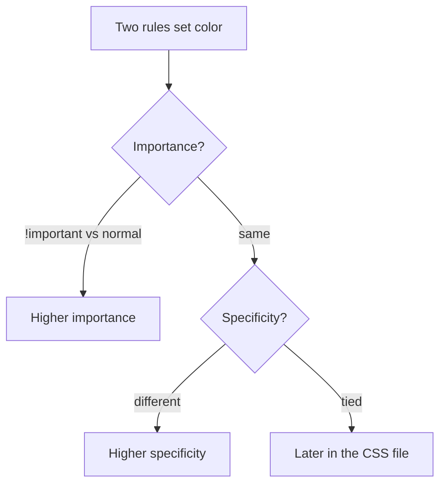

# Month 2 · Week 3 · Day 5
# Tests, Refactor, Documentation — CSS Foundations

**Month index:** [../../README.md](../../README.md)  
**Week 3:** [1](day-01.md) · [2](day-02.md) · [3](day-03.md) · [4](day-04.md) · Day 5 (today) · [6](day-06.md) · [7](day-07.md)  
**Week rhythm today:** Tests + refactor + documentation  
**Study time:** 3–4 focused hours  
**Student state:** You have cascade labs, a box-model lab, an article from memory, and a flow/positioning feature. Today those files become **claims you can prove in Computed**, then cleaner tokens, then a README that teaches a stranger where to look.

---

## How to read this chapter

A screenshot of “it looks fine on my laptop” is not a CSS test. A test is a claim you can fail in **Computed** or the **box-model diagram**.

Read “What we are testing” until you can run C1–C8 without this file open. Then fill `TESTS.md` from **real CSS**. Then replace copied hex with `var(--*)`. Then add an ID selector on purpose, watch `.note` lose, and delete it.



Serve over **HTTP**, not `file://`. Confirm the stylesheet is 200 in Network before you “test” colors. On Windows, start the server from `~\fullstack-lab`, then open `http://127.0.0.1:…` in Edge or Chrome.

This textbook will not give you Project 1’s portfolio source. You are testing **lab** CSS.

---

## What we are testing (explained)

CSS bugs are often **the wrong rule winning** or **the wrong box size**. A test this week is a claim you can prove in **Computed** and the **box-model diagram**, not a screenshot of “it looks fine on my laptop.”

**External stylesheet:** if styles live only as inline `style=""`, you cannot reuse tokens and specificity becomes a pile of inline winners. Claim: there is a `<link rel="stylesheet">`.

**`border-box` on `*`:** without it, `width: 100%` plus padding overflows. Claim: the global rule exists and Computed on a padded box shows the width you expect.

**No `!important` in your author CSS** (except later reduced-motion). If you needed it, a specificity fight was unsolved.

**No ID selectors for styling.** `#main { color: ... }` will beat almost every class. Skip-link `href="#main"` in HTML is fine; styling `#main` is not.

**`:focus-visible`:** keyboard users must see focus. Claim: a rule exists for links or buttons. Prove it by Tabbing.

**Custom properties:** repeated hex codes are a refactor fail. Claim: at least color comes from `var(--*)`.

**Specificity documented:** you predicted a conflict and Computed agreed. That is the scientific method for CSS.

**Positioning demo:** sticky header or relative/absolute callout exists **and** you can explain containing block in a sentence. A mystery “New” label in the corner of the window is a failed containing block.

Refactor: replace copied colors with tokens; delete unused rules; do not add Flexbox/Grid yet.

Deliberate break: an ID selector that overrides `.note` shows why we ban ID styling. Watch Computed. Remove it.

Those claims are the week. The next sections say how to **observe** each one so PASS is not a wish.

### How Computed is the answer key

1. Right-click an element → Inspect. On Windows that is the same in Edge and Chrome (`F12` also opens DevTools).
2. Open **Computed**.
3. Find the property (`color`, `box-sizing`, `width`).
4. Expand it. The **struck-through** rules lost. The top listed author rule (that is not struck) won.

If you cannot name the winning **selector**, you cannot debug CSS. “I changed something and it fixed itself” is not a test.

**Wrong belief:** “Computed is for experts.”  
**Correct:** Computed is how beginners stop guessing. You are a beginner. Open it.

### C1 — the stylesheet is a file

View source. You should see `<link rel="stylesheet" href="…">`. If styles exist only in `<style>` in `head`, this week’s course habit still prefers a file — treat a tiny `<style>` lab as a FAIL for the page you keep, or move it out. Inline `style=""` on tags fails C1 for that page.

Relative `href`. `href="/styles.css"` 404s on many static hosts. `href="styles.css"` next to the HTML is the default.

Confirm in the **Network** panel: click the CSS file. Status **200**. If you see 404, you are testing the user-agent stylesheet and calling it your design. Fix the path, then re-run C1–C8.

### C2 — border-box, proved with a number

Search the CSS for `box-sizing: border-box`. Then **measure**: pick a box with `width` and padding. In the box-model diagram, the width you asked for should include padding and border. If content width + padding + border > specified width, you are still on `content-box` for that element (a more specific rule, or the global rule missing `*::before` / `*::after` — still set it on `*` at minimum).

Type this if it is missing (you may already have it from Day 2):

```css
*,
*::before,
*::after {
  box-sizing: border-box;
}
```

Then inspect a padded `.note` or a padded `main`. Computed → `box-sizing` → `border-box`. The diagram’s width number should match the `width` you set, not that width plus padding.

### C3 and C4 — search, then think

Search `!important`. Search `#` in the CSS file. HTML `id="main"` and `href="#main"` are not CSS ID **selectors**. A selector like `#main` or `#hero` in the `.css` file fails C4.

A color like `#1a1a1a` in a custom property is a **hex value**, not an ID selector. C4 cares about selectors: `#main {`, `#hero {`, `main#content {`. Token values may still use hex until you finish the C6 refactor.

### C5 — Tab, do not only read

A rule in the file is necessary. **Visible** focus is the claim. Tab to a link. If you cannot see a ring, C5 fails even if `:focus-visible` exists with `outline: none`’s cousin.

Minimum you can type:

```css
a:focus-visible {
  outline: 2px solid var(--accent);
  outline-offset: 2px;
}
```

Click the address bar (`Alt+D` on Windows), then Tab until a link in the page has focus. You must see the ring. A mouse click is not this test.

### C6 — tokens

Search `#` hex in CSS. Colors should mostly be `var(--text)`, `var(--bg)`, `var(--accent)`. A one-off `border: 1px solid #ccc` is a refactor candidate, not always a FAIL — the claim says **at least color** (text/background/links) comes from tokens. Tighten until that is true.

Worked refactor (type the left side out of your file; keep the right):

```css
/* before — three copies of the same ink */
body { color: #1a1a1a; }
h1 { color: #1a1a1a; }
p { color: #1a1a1a; }

/* after */
:root { --text: #1a1a1a; }
body { color: var(--text); }
h1 { color: var(--text); }
p { color: var(--text); }
```

Change `--text` once. Three elements change. That is the proof the refactor worked.

### C7 — prediction vs Computed

You need a written prediction: “`.note` is 0,0,1,0; `main p` is 0,0,0,2; `.note` wins color.” Then a screenshot or pasted Computed line. If they disagree, the test failed — your mental model or the file. Fix the file or the prediction; do not delete the conflict so you have nothing to document.

If your article has no conflict, **add a fair one** for the test (two rules, both reasonable), predict, prove, leave it. Do not add an ID to “create” C7 — that is C4’s deliberate break, later.

### C8 — containing block in one sentence

Day 4: `position: absolute` is tied to the nearest **positioned** ancestor (`relative`, `absolute`, `fixed`, `sticky` — not `static`). If the parent is `static`, the badge flies to a higher box (often the viewport-ish containing block) and looks “stuck to the window.”

Sticky: the header stays in document **order**, then pins when you scroll past `top: 0`. It is not `fixed`. Explain which one you used.

**Wrong belief:** “`position: absolute` is how I build layouts.”  
**Correct:** absolute is for a badge, a tooltip, a callout. The page still flows. Flex/Grid are Week 4.

---

## Office hours — specificity wars, overflow, and ID disease

These are the bugs classmates will bring you. Diagnose them in Computed, not in Slack screenshots.

### Specificity war: “I changed `.note` and nothing happened”

Two rules set `color`. You edited the weaker one. Computed still lists the stronger winner. Count:

| Selector | Score |
|---|---|
| `p` | 0,0,0,1 |
| `main p` | 0,0,0,2 |
| `.note` | 0,0,1,0 |
| `main .note` | 0,0,1,1 |
| `#main .note` | 0,1,1,0 |

`.note` beats `main p`. `#main .note` beats `.note`. If the winner is an ID, you do not “add `!important` to `.note`.” You delete the ID selector.

**Wrong belief:** “The last rule in the file always wins.”  
**Correct:** last among **equal** specificity. Count first, then look at order.

### Overflow: “a little horizontal scrollbar”

At this week’s article widths, overflow is usually `content-box` plus `width: 100%` plus padding, or an image without `max-width: 100%`, or a `pre` line that will not wrap. Inspect the wide child. The box-model diagram shows padding sticking out of `width` when you are still on `content-box`.

Do not “fix” it with `overflow-x: hidden` on `body`. That hides the bug and clips focus rings later. Fix the box.

### Missing `:focus-visible` that “exists in the file”

You wrote `a:focus { outline: none; }` in an experiment and a later `:focus-visible` never wins, or you never Tabbed. C5 is eyes on a keyboard stop, not a grep that found the string `focus-visible`.

### Worked example — the deliberate ID override

```css
.note { color: var(--accent); } /* 0,0,1,0 */
#main .note { color: red; }     /* 0,1,1,0 — wins; this is the break */
```

Computed on `.note`: color comes from `#main .note`. That is why we ban ID styling — you cannot override with a reasonable class later without `!important` or a mess. **Remove** the ID selector. Computed returns to `.note`. Record both states in TESTS.md.

Do this **after** C4 is PASS on the real file. The break is a demonstration, not the stylesheet you keep.

### Refactor without Flexbox

Allowed:

- `#1a1a1a` → `var(--text)` everywhere you meant body text
- Delete a commented-out experiment
- Rename `.box1` to `.note` if the class was meaningless
- Shorten a selector that was `body main article section p.note` to `.note` **if** specificity still matches your C7 story

Not allowed:

- `display: flex` or `display: grid` “just to center”
- A new color system with twelve tokens you do not use
- `!important` to beat the ID you are about to add as the deliberate break — the break must **win** in Computed, then you **delete** it

Centering `main` remains `max-width` + `margin-left: auto; margin-right: auto`. That is flow. If you “refactor” by wrapping the page in a flex column, you skipped Week 4 and failed this week’s point.

### How to read one Computed row (worked)

You inspect a `.note` paragraph. Computed → `color` → expand.

You might see:

- `.note` — `#0b5fff` (or your `var(--accent)` resolved)
- `main p` — struck through
- `body` — struck through
- user agent — struck through

The winner is `.note`. That is C7 if you **predicted** `.note` beats `main p`. If the winner is `#main .note`, you already have the ID disease — C4 fails until you remove it (after the deliberate break exercise, not before: the break is supposed to show that winner).

Custom properties resolve to a computed color. Seeing `#0b5fff` in Computed does not mean you failed C6. C6 is whether the **author rule** used `var(--accent)`. Expand the rule in the Styles pane if you are unsure.

### README: serve is still HTTP

A classmate who double-clicks `article.html` may see unstyled HTML because some browsers restrict local stylesheets, or they will see styles but you documented the wrong way to work. Write the **exact** command you use. Example from PowerShell:

```powershell
cd ~\fullstack-lab
python -m http.server 5500
```

Then open `http://127.0.0.1:5500/month-02/week-03/day-03/article.html` (adjust the path to the file you tested). You **open the browser** to HTTP.

### Common failures today

| What happened | What it usually means |
|---|---|
| C2 PASS in search, box diagram still content-box | A later rule set `box-sizing: content-box`, or you inspected a replaced element |
| C4 FAIL after “I only used id in HTML” | You have `#hero {` in the CSS file. Search `#` in `.css` |
| C7 missing | You never wrote a prediction; two colors “just worked” |
| C8: badge in the window corner | containing block is not the card; parent is `static` |
| Refactor added Flexbox | not this week’s refactor |
| Styles look unstyled | CSS 404; C1 is FAIL until Network shows 200 |
| C5 PASS in grep, FAIL on Tab | `outline: none` still present, or you never left the address bar |

**Wrong belief:** “If the page looks fine, C7 is optional.”  
**Correct:** C7 is the only claim that proves you understand the cascade. Looks-fine can be one rule with no opponent.

### Styles pane vs Computed

**Styles** shows every matching rule, struck or not, in cascade order for that node. **Computed** shows the **used** value after cascade, inheritance, and resolution of `var()`. For C7, expand the property in Computed so you see the winning selector. For C6, the Styles pane is easier: you should see `color: var(--text)`, not `color: #1a1a1a` copied on `body`, `h1`, and `p`.

If `var(--accent)` is invalid (typo `--accents`), Computed may show the inherited color instead. That looks like a specificity loss. It is a token typo. Fix the name.

**Wrong belief:** “`!important` on `.note` is how I win C7.”  
**Correct:** C7 is a class beating a type (or a documented equal-specificity order fight). `!important` skips the lesson and fails C3.

---

## Today's contract

Fill TESTS.md from real files, refactor tokens, explain Computed in the README, cause and remove an ID override.

**Today's gate.** An ID selector that overrides `.note` is observed in Computed, then removed. You can say why ID styling is banned.

---

## Time box

| Block | Minutes | Work |
|---|---|---|
| A | 25 | Re-read claims; pick pages (article + positioning demo) |
| B | 50 | Fill `week-03/TESTS.md` |
| C | 50 | Refactor tokens; delete dead rules; no Flex/Grid |
| D | 35 | README: serve + Computed |
| E | 20 | Deliberate ID override |

---

`~\fullstack-lab\month-02\week-03\TESTS.md`:

| ID | Claim |
|---|---|
| C1 | Stylesheet is linked, not only inline |
| C2 | `box-sizing: border-box` on `*` |
| C3 | No `!important` |
| C4 | No ID selectors for styling (skip-link `#main` in HTML is fine) |
| C5 | `:focus-visible` styles exist for links or buttons |
| C6 | Custom properties for at least color |
| C7 | A specificity conflict was documented and matches Computed |
| C8 | Sticky or absolute demo exists and is explained |

Add How / Result columns. Name the files. Fix FAILs. Do not weaken claims.

Pick **two** pages if you can: `day-03/article.html` for C1–C7, and the Day 4 positioning lab for C8. If a claim has no subject on one file, write N/A **and** the other filename. Do not mark C8 PASS on an article with no positioned element.

README: how to serve, what to look at in Computed (property name → winning rule).

Write the README so a classmate can:

1. Start HTTP from the lab folder (exact command).
2. Open the article page.
3. Inspect a `.note`, open Computed, find `color`, name the winning selector.
4. Inspect a padded box, open the box-model diagram, confirm `border-box`.

```powershell
cd ~\fullstack-lab
git add month-02/week-03
git commit -m "Document CSS foundation tests and refactor tokens."
```

---

## Definition of done

- [ ] TESTS.md filled from real files
- [ ] Deliberate ID override observed and removed
- [ ] README explains Computed and HTTP serve
- [ ] No Flex/Grid added as “refactor”
- [ ] Commit exists

---

## Optional review links

How to use Computed and why ID selectors dominate is explained in this chapter.

- [MDN: Inspect and debug CSS](https://developer.mozilla.org/en-US/docs/Learn_web_development/Core/Styling_basics/Debugging_CSS) (after you already ran C7 yourself)
- [MDN: CSS reference — `position`](https://developer.mozilla.org/en-US/docs/Web/CSS/position)

---

## Tomorrow

Independent CSS: a new article or callout page from this week’s rules. Days 1–5 closed for the challenge. Repair from Days 1–2 and 4 in this book.
