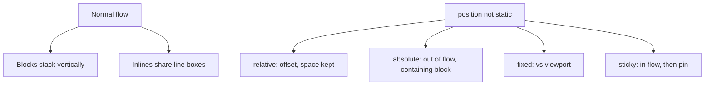

# Month 2 · Week 3 · Day 6
# Independent CSS Foundations

**Month index:** [../../README.md](../../README.md)  
**Week 3:** [1](day-01.md) · [2](day-02.md) · [3](day-03.md) · [4](day-04.md) · [5](day-05.md) · Day 6 (today) · [7](day-07.md)  
**Week rhythm today:** Independent  
**Study time:** 3–4 focused hours  
**Days 1–5 textbook files:** closed for the *challenges*. Repair from **Week 3 Days 1–2 and Day 4 in this book**.

---

## How to read this chapter

The complete explanation is the lesson. Keep **this file** open. Keep Days 1–5 closed while you style. You may restyle Week 1’s `catalog.html` **or** write a fresh semantic page — either way, the CSS requirements are the same, and **no Flexbox or Grid**.

If a box overflows, measure it. If a color is wrong, open Computed. Do not paste a layout framework.

---

## Complete explanation (this book is the lesson)

**CSS** assigns properties via selectors. Prefer an external file.

**Cascade:** importance → **specificity** → source order. Count specificity: inline, IDs, classes/attributes/pseudo-classes, types. Style with **classes**. Avoid `!important`. Avoid ID selectors.

**Inheritance:** `color` and `font-*` inherit; `margin`/`padding`/`border`/`width` do not.

**Tokens:** `:root { --text; --bg; --accent; --space; }` then `var(--text)`.

**Units:** `rem` for type and spacing; `px` for hairline borders; `%` of parent; `em` compounds with nested font-size.

**Box model:** content + padding + border + margin. `box-sizing: border-box` on `*` so `width` includes padding and border. Vertical **margin collapse** can combine adjacent block margins into one.

**Flow:** blocks stack; inlines sit in lines. `display: block | inline | inline-block | none`. `none` removes from layout **and** the accessibility tree. `inline` ignores width/height.

**Position:** `static` default (`top` does nothing). `relative` offsets and creates a containing block; space is kept. `absolute` out of flow, tied to the nearest non-static ancestor. `fixed` vs viewport. `sticky` in flow until a threshold (`top: 0`). `z-index` only on positioned (or flex/grid) items; stacking contexts trap children. Do not lay out the whole page with absolute.

**Type:** system stack, `line-height` ~1.5, `max-width` on `main` (~40rem), padding on the sides. Nav links vs body links should be distinguishable (nav may omit underline; body links keep a real underline or an equally obvious cue).

**Focus:** `:focus-visible` ring. Never `outline: none` alone.

**Tables:** still data tables. CSS may add padding, `border-collapse: collapse`, and a header background. CSS must not turn a table into a layout grid of the page.

**No Flexbox/Grid today.** Center `main` with `max-width` + `margin-left: auto; margin-right: auto`. Stacking is flow.

DevTools **Computed** and the **box model diagram** prove who won.

The subsections below unpack flow and position so today’s sticky header or callout is a choice, not a copy.

### Cascade and specificity (you still need it)

Two rules set `color` on the same paragraph. Winner:

1. Importance (`!important` vs normal — do not use `!important` today).
2. Specificity (count).
3. Source order if specificity ties.

`.note` (one class) beats `main p` (two types). `#main` beats `.note` — that is why you do not style with IDs.

**Wrong belief:** “The last rule always wins.”  
**Correct:** last among **equals**. Count first.

### Boxes and the overflow you will cause

```
+---------------- margin ----------------+
|  +----------- border ---------------+  |
|  |  +------- padding ------------+  |  |
|  |  |         content            |  |  |
|  |  +----------------------------+  |  |
|  +----------------------------------+  |
+----------------------------------------+
```

`content-box`: `width` = content only. `border-box`: `width` = content + padding + border. Course law: set `border-box` on `*, *::before, *::after`.

Vertical margins of adjoining blocks in flow **collapse** to the larger one. Horizontal margins do not. If two `h2`s look “too close,” measure margin in the diagram before you add random padding.

### Normal flow and `display`

**Block** boxes (`h1`, `p`, `div`, `main`) stack. They take the width of the containing block unless you set `width`/`max-width`.

**Inline** boxes (`a`, `span`, `em`) sit in a line. `width` and `height` do **not** apply. Vertical margin/padding behave oddly; do not use inline for a card.

**inline-block** is a box that sits in a line but honors width/height. You might use it for a small badge. You still do not build a gallery with it today if you are about to invent a grid — wait for Week 4.

**`display: none`:** the box is not laid out **and** it is removed from the accessibility tree. Do not hide the only skip link or the only nav this way. `visibility: hidden` hides pixels but may still take space; still not your nav strategy.



### Position — one callout or one sticky header

**`static`:** the default. `top` / `left` do nothing.

**`relative`:** the box stays in flow (its original space remains). `top`/`left` nudge it. Relatives **create a containing block** for absolute children.

**`absolute`:** removed from flow. Siblings close the gap. Offset against the nearest ancestor with `position` other than `static`. If none, it looks “stuck to the page/viewport origin” in a way that surprises you.

**Worked example — badge on a card:**

```css
.card {
  position: relative; /* containing block */
}
.card .badge {
  position: absolute;
  top: 0.5rem;
  right: 0.5rem;
}
```

If you forget `relative` on `.card`, the badge may pin to a higher ancestor. That is C8 from Day 5. Fix the containing block, not `left: 400px` guesses.

**`fixed`:** vs the **viewport**. Scrolls away from document flow. A fixed header overlays content; you must pad `body` or the first section so headings are not hidden. Easy to botch. Prefer **sticky** for a site header this week.

**`sticky`:** stays in flow until its container scrolls to `top: 0` (or whatever you set), then pins. Keyboard order stays the document order. Good for a header.

**`z-index`:** only works on positioned elements (and later flex/grid items). A `z-index` on a `static` box does nothing useful. Stacking **contexts** (opacity, certain positions) trap children — a child cannot paint above a sibling of the parent just because you wrote `z-index: 9999`. Do not fight that today. One positioned badge is enough.

**Wrong belief:** “I’ll absolute everything onto a 1440px canvas.”  
**Correct:** that is a poster, not a web page. Flow first. Position a decoration.

### Type, links, tables, no Flex/Grid

Center the reading column:

```css
main {
  max-width: 40rem;
  margin-left: auto;
  margin-right: auto;
  padding: 1rem;
}
```

That is **not** Flexbox. Auto side margins on a block with a max-width are flow.

Nav links: you may remove underline in `nav a` and keep underline in `main a`. Both need `:focus-visible`.

Table CSS: `border-collapse: collapse;`, cell padding, `thead` background using a token. The markup is still `caption`, `th`, `scope`. You are painting a **data** table, not laying out the homepage in `<tr>`.

Worked table paint (you type it; change token names to yours):

```css
table {
  width: 100%;
  max-width: 100%;
  border-collapse: collapse;
}

th,
td {
  padding: 0.5rem 0.75rem;
  border: 1px solid var(--border, #ccc);
  text-align: left;
}

thead th {
  background: var(--accent);
  color: var(--bg);
}
```

`width: 100%` on a `border-box` table inside a padded `main` should stay in the column. If it overflows, you still have content-box or a cell with nowrap unbreakable text.

### Teach-back rubric (400+ words, prose)

A passing `TEACHBACK.md` can be read instead of Days 1–2:

1. **Cascade** — importance, specificity, source order, in that sequence, with one example.  
2. **Specificity** — you count `p` vs `.note`; you say why IDs are banned in CSS.  
3. **Box model** — content, padding, border, margin; why `border-box`; one sentence on margin collapse.  
4. **Inheritance** — what flows down, what does not.

Bullet dumps fail. “I used rem because MDN said so” fails — this chapter already said rem is root-relative. Write **why** a 65-character line is a `max-width` on `main`, not a `vw` on `p`.

### How you will accidentally invent Flexbox

`display: flex` on `header` to put a logo beside links is Week 4. Today, let the header **stack** (brand, then `nav` as a list). It will look vertical. That is correct. A wrapping nav with `display: flex` is the skill you learn next week — if you steal it today, Day 7 cannot tell whether you understand flow.

Search your CSS for `flex` and `grid` before you commit. If they appear, delete them unless you are quoting the words in a comment that says “not yet.”

**Wrong belief:** “A stacked header means I failed the lab.”  
**Correct:** a stacked header means you used flow. Sticky still works on a stacked header.

### `COMPUTED.txt` shape

```
Element: p.note
Property: color
Rule A: main p        0,0,0,2
Rule B: .note         0,0,1,0
Predicted winner: .note
Computed winner: .note
```

If they disagree, the teach-back must include **why** (typo, extra selector, inheritance you mistook for a rule).

### Common failures

| What happened | What it usually means |
|---|---|
| Horizontal scroll | content-box + 100% width, or a table cell, or an image |
| Sticky header covers the skip target | needs padding/margin on `main`, or skip still works but visually overlaps — note it |
| Absolute badge on the window | missing `position: relative` on the card |
| Teach-back is a CSS file paste | not prose |
| Styled Week 1 catalog in place | Week 1 lab is no longer the unstyled original — copy first |

---

## Today's contract

A catalog (or fresh page) that is readable, tokenized, `border-box`, with one positioned feature, no Flex/Grid, and a prose teach-back.

**Today's gate.** I can explain one Computed conflict on this page, and I did not cheat with Flex or Grid.

---

## Time box

| Block | Minutes | Work |
|---|---|---|
| A | 20 | Speak cascade, box-sizing, flow vs position |
| B | 100 | CSS on catalog or fresh `independent/index.html` |
| C | 40 | Prove one conflict in Computed; note it |
| D | 40 | `TEACHBACK.md` 400+ words |
| E | 15 | Git |

---

Style `week-01/independent/catalog.html` **or** a fresh `week-03/independent/index.html` (semantic HTML you write today).

If you style the Week 1 catalog, copy it into `week-03/independent/` first so Month 2 Week 1 stays the unstyled lab. Do not “improve” Week 1 by adding CSS there.

Required CSS:

- External file, custom properties, border-box
- Readable type (max-width, line-height, system stack)
- Nav vs body links distinguishable
- Focus-visible rings
- One positioned element (sticky header **or** a relative/absolute callout — not both if it gets messy)
- Table: padding, `border-collapse`, header background — still a **data** table
- No Flexbox/Grid **yet** (Week 4). You may use `max-width` + auto margins to center `main`.

`TEACHBACK.md`: cascade, specificity, box model, inheritance — in your words, from the complete explanation. 400+ words, prose.

Also record in `COMPUTED.txt` one property, the two competing selectors, the winner. That is your proof for “Computed can explain one conflict.”

```powershell
git add month-02/week-03/independent
git commit -m "Independently style a semantic catalog without Flexbox."
```

---

## Definition of done

- [ ] Required CSS present
- [ ] No Flex/Grid
- [ ] Teach-back is prose
- [ ] Computed can explain one conflict

---

## Optional review links

Flow, positioning, and the cascade are taught above. Recheck later if you need a property name.

- [MDN: Normal flow](https://developer.mozilla.org/en-US/docs/Learn_web_development/Core/CSS_layout/Normal_Flow)
- [MDN: `position`](https://developer.mozilla.org/en-US/docs/Web/CSS/position)
- [MDN: CSS inheritance](https://developer.mozilla.org/en-US/docs/Web/CSS/Inheritance)
