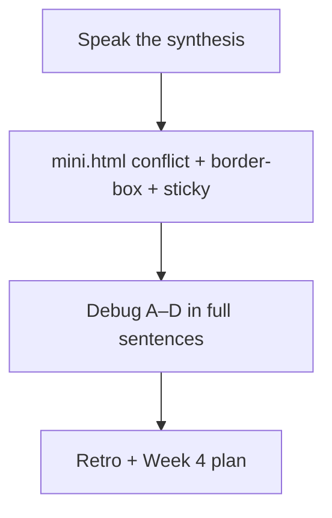
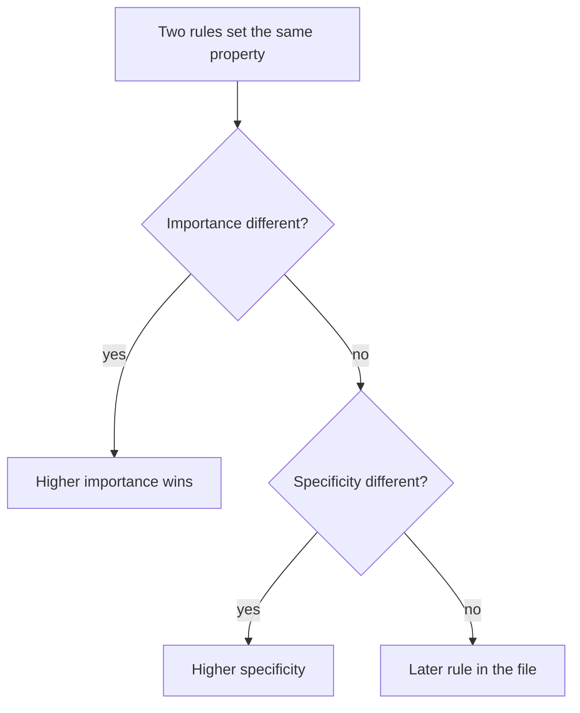

# Month 2 · Week 3 · Day 7
# Week Review — CSS Foundations

**Month index:** [../../README.md](../../README.md)  
**Week 3:** [1](day-01.md) · [2](day-02.md) · [3](day-03.md) · [4](day-04.md) · [5](day-05.md) · [6](day-06.md) · Day 7 (today)  
**Week rhythm today:** Review, repair, plan Week 4  
**Study time:** 3–4 focused hours  
**Student state:** You can attach a stylesheet, lose a specificity fight on purpose, measure a box, and pin a badge. Today you prove those ideas from **this file**. Flexbox is tomorrow’s week, not a way to skip a mushy box model.

Days 1–6 stay **closed** during the mini-build and debug stories. Repair from **this synthesis**.

Labs: `~\fullstack-lab\month-02\week-03\review\`.

---

## How to read this chapter

This is a closed-book teaching day. The synthesis is the Week 3 lesson, written so you can re-learn cascade, boxes, flow, and position from this page alone.

Speak it. Then mini-build. Then debug four classic defects. Then retro. Repair the weakest topic **today**. Week 4 multiplies confusion if “who won” and “how wide” are still vibes.



Serve over **HTTP**, not `file://`. On Windows, `python -m http.server 5500` from `~\fullstack-lab`, then open `http://127.0.0.1:5500/month-02/week-03/review/mini.html`.

Do not start Project 1 tonight. Cascade mush plus a portfolio is two problems.

---

## Week synthesis (this book)

**CSS** assigns properties to elements via **selectors**. A rule is `selector { property: value; }`. Prefer an external stylesheet.

**Cascade:** importance (including `!important` — avoid in your own CSS) → **specificity** → source order.

**Specificity (count):** inline style beats IDs beat classes/attributes/pseudo-classes beat types. `#main` beats `.note`. Style with **classes**, not IDs, so you do not paint yourself into a corner.

**Inheritance:** `color` and `font-*` inherit; `margin`/`padding`/`border`/`width` do not.

**Units:** `rem` for type and spacing (root-relative); `px` for hairline borders; `%` of parent; `em` relative to parent font (compounds). Spacing scale via custom properties `--space`, `--text`, `--accent`.

**Box model:** content + padding + border + margin. `box-sizing: border-box` on `*` so `width` includes padding and border. Vertical **margin collapse** can combine adjacent margins into one.

**Flow:** blocks stack; inlines sit in lines. `display: block | inline | inline-block | none`. `none` removes from layout **and** the accessibility tree.

**Position:** `static` default; `relative` offset + containing block; `absolute` out of flow, tied to positioned ancestor; `fixed` vs viewport; `sticky` until a threshold. `z-index` only on positioned (or flex/grid) items. Do not lay out the whole page with absolute.

DevTools **Computed** and the **box model diagram** are how you prove who won, not a blog post.

The rest of this file is that synthesis in full sentences, with a picture and worked defects, so the mini-build is possible with Days 1–6 closed.

---

## Today's contract

Teach Week 3 aloud, build a small page that contains a specificity fight, `border-box`, and a sticky header, diagnose four layout bugs, and plan Week 4 without pretending Flexbox replaces this week.

**Today's gate.** Closed-book: you can count `p` vs `.note` vs `#special`, draw content-box vs border-box, and say why an absolute badge stuck to the window.

---

## Time box

| Block | Minutes | Work |
|---|---|---|
| 1 | 40 | Closed-book: speak the synthesis |
| 2 | 50 | Mini-build: conflict + border-box + sticky |
| 3 | 30 | Debug four defects |
| 4 | 25 | Review independent CSS — one fix |
| 5 | 20 | Re-run TESTS.md |
| 6 | 20 | Design: when not to use absolute |
| 7 | 25 | Retro + Week 4 plan + repair |

---

# Complete explanation — CSS you must still own

## 1. A rule is a question plus assignments

```css
.note {
  color: var(--accent);
  padding: var(--space);
}
```

The **selector** asks which nodes. The **declarations** assign properties. External file: `<link rel="stylesheet" href="styles.css">` in `head`. Relative path. Inline `style=""` is a specificity nuclear option; do not build a system with it.

**Wrong belief:** “CSS is a list of pretty colors.”  
**Correct:** CSS is a per-property decision procedure over the DOM.



## 2. Count specificity; do not feel it

Four numbers: `(inline, IDs, classes/attributes/pseudo-classes, types/pseudo-elements)`.

| Selector | Score |
|---|---|
| `p` | 0,0,0,1 |
| `.note` | 0,0,1,0 |
| `main p` | 0,0,0,2 |
| `#special` | 0,1,0,0 |

`.note` beats `main p`. `#special` beats `.note`. Equal scores: **later in the file** wins.

`!important` jumps importance. If you need it against *your* CSS, your selectors are too strong (usually an ID). Week 4’s reduced-motion block is a known exception. Color fights are not.

Style with **classes**. HTML ids for skip links stay in HTML.

**Wrong belief:** “The last rule always wins.”  
**Correct:** only among equal specificity.

## 3. Inheritance is a short list

**Usually inherited:** `color`, `font-family`, `font-size`, `line-height`.

**Not inherited:** `margin`, `padding`, `border`, `width`, `height`.

Set text color on `:root` or `body`. Set spacing on the box that needs it. Custom properties inherit: `--text` on `:root` is visible to descendants via `var(--text)`.

## 4. Units

| Unit | Honest use |
|---|---|
| `rem` | Type and spacing relative to **root** font-size |
| `em` | Relative to **this element’s** font-size (nests compound) |
| `px` | Hairline borders |
| `%` | Of the containing block’s size |
| `vw`/`vh` | Viewport; do not set body text to `vw` this month |

`line-height: 1.5` is unitless — it multiplies the element’s font-size. Good.

## 5. The box and the collapse

Every box: content → padding → border → margin.

**content-box:** `width` is content. Padding and border stick out. `width: 100%` + padding overflows.

**border-box:** `width` includes padding and border. Margin still outside. Course law:

```css
*,
*::before,
*::after {
  box-sizing: border-box;
}
```

**Margin collapse:** adjoining **vertical** margins of blocks in flow combine into one (the larger). “I added 2rem + 2rem and got 2rem.” Horizontal margins do not collapse. The box-model diagram tells the truth.

## 6. Flow and display

Blocks stack. Inlines share line boxes. `inline` ignores `width`/`height` — that is a debug item today. `inline-block` honors them but still sits in a line. `none` removes layout **and** accessibility.

Most of a reading page is still flow: heading, paragraph, heading, paragraph, table. You do not need Flexbox to stack those.

**Wrong belief:** “I need Flexbox to put a paragraph under a heading.”  
**Correct:** that is already flow.

## 7. Position without building a poster

| Value | In flow? | Offsets relative to |
|---|---|---|
| `static` | yes | `top` ignored |
| `relative` | yes (space kept) | itself; creates containing block |
| `absolute` | no | nearest positioned ancestor |
| `fixed` | no | viewport |
| `sticky` | yes, then pins | scroll threshold (`top: 0`) |

`z-index` on `static` does nothing useful. Do not lay out the whole page with `absolute`.

**Worked example.** Badge flies to the window corner: parent is `static`. Set `position: relative` on the card. The badge’s containing block becomes the card.

```css
.card { position: relative; }
.badge {
  position: absolute;
  top: 0.5rem;
  right: 0.5rem;
}
```

**Wrong belief:** “Sticky and fixed are the same.”  
**Correct:** sticky stays in flow until the threshold. Fixed is out of flow and viewport-tied.

## 8. Type, focus, tables as paint

System font stack, `line-height` ~1.5, `max-width` ~40rem on `main`, side padding, auto side margins to center. Links: `:hover` cue; **`:focus-visible` ring**; never `outline: none` alone. Tables: collapse borders, pad cells, header background — still data tables.

Type this focus rule if you go blank on the mini-build:

```css
a:focus-visible {
  outline: 2px solid var(--accent);
  outline-offset: 2px;
}
```

---

## Office hours — specificity wars, overflow, and a badge on the window

Week 4 will not forgive these. Repair them in Computed today.

### Specificity war on the mini page

You predicted `.note` (0,0,1,0) beats `main p` (0,0,0,2). Computed shows `main p` winning. Usual causes: the paragraph is missing `class="note"`, the CSS file 404d so you are looking at user-agent color, or a later equally specific rule you forgot. Expand Computed. Name the winning **selector**. Fix that, not a random hex.

If you “won” by adding `#main .note`, you failed C4 from Day 5. Delete the ID selector. Win with a class.

### Overflow on a padded `main`

`main { width: 100%; padding: 1rem; }` under `content-box` is wider than the viewport. Global `border-box` is the fix. `overflow-x: hidden` on `body` is not. Inspect the box-model diagram: padding should sit **inside** the width number.

### Containing block

The badge is in the corner of the **window**. The card is `position: static` (the default). Absolute looks up until it finds a positioned ancestor. Add `position: relative` on `.card`. Do not guess `left: 412px`.

### Mini-build fragments (jobs, not Project 1)

`mini.html` needs enough paragraphs to **scroll** or sticky is invisible. Header needs a **background** or you will not see it pin. Tokens on `:root`. Relative `href="mini.css"`. Skip link. One `h1`. No Flex. No Grid. No ID selectors.

Conflict you can type:

```css
main p { color: var(--text); }   /* 0,0,0,2 */
.note { color: var(--accent); } /* 0,0,1,0 */
```

Sticky you can type:

```css
.site-header {
  position: sticky;
  top: 0;
  background: var(--bg);
}
```

Write `PREDICT.txt` **before** you open Computed: scores, predicted winner, then one line after: agreed or why you were wrong.

---

Closed-book: speak the synthesis.

Cover: external CSS, cascade order, counting specificity, inheritance split, rem vs em, border-box, margin collapse, block vs inline vs none, the five `position` values, Computed as proof.

Write `ORAL.txt`: ok or weak next to each of those topics. Repair a weak one from this file before you call the day done.

---

## Mini-build

A page with a specificity conflict you can explain in Computed; `border-box`; sticky header.

`week-03/review/mini.html` + `mini.css`. Days 1–6 closed; this file may stay open. Include `.note` vs `main p` (or similar), tokens, `:focus-visible`, one `h1`, serve over HTTP. Write `PREDICT.txt` before Computed.

Also: skip link, landmarks, relative `href`, no ID selectors, no Flex/Grid. Enough paragraphs to scroll so sticky is visible. Header needs a background.

This is Days 1–4 in a thinner costume. Write it cold. Do not paste Project 1.

---

## Debug

Margin collapse; content-box overflow; `inline` ignoring width; z-index on `static`.

`review/debug.txt` — cause and fix, from this chapter, **full paragraphs**:

**A. Margin collapse.** Two blocks each `margin-bottom` / `margin-top` 2rem; gap is 2rem. Fix if you *need* 4rem: padding, or a different formatting context later — not “CSS is broken.”

**B. Content-box overflow.** `width: 100%` + padding without `border-box`. Fix: global `border-box`, or stop using 100% plus padding that way.

**C. Inline ignoring width.** `span { width: 200px; }` does nothing useful. Use block or inline-block (or a real block element).

**D. z-index on static.** `div { z-index: 10; }` with `position: static`. No stacking. Position it, or (more often) **do not** fight z-index — fix DOM order / containing block.

Write **paragraphs**. “Collapse = max of margins” is a slogan. A passing answer names *vertical*, *in-flow*, *adjoining*, and why horizontal does not do this.

---

## Review, tests, design, retro

Review yesterday’s independent page. One unused rule to delete, or one hex to convert to a token. Commit that fix.

Re-run `week-03/TESTS.md` on the mini page. Fill results.

Design (`review/design.txt`): When must you **not** use `position: absolute` for layout? Answer from this week: when the page must grow with content, when keyboard order should match reading order, when you need wrapping. Absolute is a badge, not a grid. Flex/Grid arrive Week 4 for 1D and 2D **in-flow** layout. Ten sentences, not a slogan.

Retro (`RETRO.md`): hours this week, solid vs weak (specificity vs boxes vs containing block — be honest), one sentence on Week 4 readiness. **Week 4:** Flexbox, Grid, media queries — explained in those day files. Do not start Project 1 tonight if cascade is still mush.

Repair the weakest idea **today** (usually: specificity counting, or containing block). Re-read that section here. Change a real file until Computed agrees.

```powershell
cd ~\fullstack-lab
git add month-02/week-03/review
git commit -m "Record Week 3 CSS review."
```

---

## Week 3 definition of done

- [ ] I can count a simple specificity fight and prove it in Computed
- [ ] Global `border-box`; I can explain content-box overflow
- [ ] I can explain inheritance vs box properties
- [ ] I can explain sticky vs absolute vs a failed containing block
- [ ] No Flex/Grid required yet — flow still stacks a page
- [ ] DEBUG A–D are paragraphs
- [ ] Commit exists

---

## Optional review links

The lesson is this chapter. Recheck later if you want a second wording.

- [MDN: Cascade and inheritance](https://developer.mozilla.org/en-US/docs/Learn_web_development/Core/Styling_basics/Cascade_and_inheritance)
- [MDN: The box model](https://developer.mozilla.org/en-US/docs/Learn_web_development/Core/Styling_basics/Box_model)
- [MDN: CSS layout — positioning](https://developer.mozilla.org/en-US/docs/Learn_web_development/Core/CSS_layout/Positioning)

---

## If you passed this week

Week 4 is **in-flow layout on one axis and two**, then mobile-first queries. You will still need today’s box and cascade. A Flex nav does not forgive `content-box` overflow.
