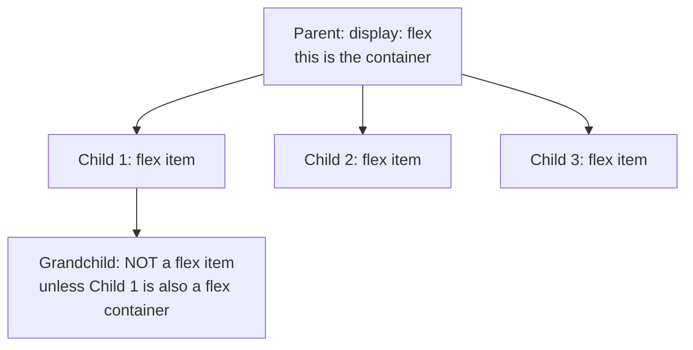

# Month 2 · Week 4 · Day 1
# Flexbox — One Axis, On Purpose

**Month index:** [../../README.md](../../README.md)  
**Week 4:** Day 1 (today) · [2](day-02.md) · [3](day-03.md) · [4](day-04.md) · [5](day-05.md) · [6](day-06.md) · [7](day-07.md)  
**Week rhythm today:** Learn + type-along  
**Study time:** 3–4 focused hours  
**Prereq:** Week 3 gate. You understand cascade, boxes, normal flow, and `display`. Flexbox is a **new formatting context**. If flow is still mush, reopen Week 3 Day 4 before you start.

---

## How to read this chapter

Normal flow already stacks headings above paragraphs. You do **not** need Flexbox for that.

You need Flexbox when siblings must share **one line** (or one column) with controlled gaps, wrapping, and leftover space: logo on the left, links on the right, vertically centered; a title that grows while a button stays small.

**Picture:** a row of boxes on a shelf. The shelf is the **flex container**. The boxes are **flex items**. You decide whether the shelf runs left-to-right (`row`) or top-to-bottom (`column`). Then you decide how leftover shelf space is shared.



Flex does **not** skip a generation. A grandchild is an ordinary child of its parent until that parent also gets `display: flex`.

---

## Today's contract

By the end of this day you will be able to:

1. State the problem Flexbox solves in one sentence (one-dimensional layout).
2. Draw **main axis** vs **cross axis** for `row` and for `column`.
3. Use container properties: `flex-direction`, `flex-wrap`, `justify-content`, `align-items`, `align-content`, `gap`.
4. Use item properties: `flex-grow`, `flex-shrink`, `flex-basis`, `flex`, `align-self`.
5. Explain why `order` is dangerous for nav.
6. Cause and then fix the **`min-width: auto` overflow** bug.

**Today's gate.** Closed-book:

> The flex **container** sets the axis. The **items** grow, shrink, and wrap. `justify-content` is along the main axis; `align-items` is the cross axis. I can draw that without looking.

If you mix up justify and align, every tutorial you paste will feel random. Draw it.

---

## Time box

| Block | Minutes | Work |
|---|---|---|
| A | 55 | Theory (draw axes on paper) |
| B | 70 | Type-along: nav, hero, card footer |
| C | 40 | Overflow bug on purpose |
| D | 20 | Git |
| E | 15 | Recall |

---

# Block A — Theory

## 1. What problem Flexbox solves

In **normal flow** (Week 3):

- Block boxes stack vertically and stretch to the containing block.
- Inline boxes sit in lines of text.

That does **not** easily give you: “wordmark on the left, links on the right, both vertically centered in a 64px header, wrapping on a narrow phone, with even gaps.”

**Flexbox** is a layout mode for a **parent** whose **direct children** are arranged along **one axis**.

```css
header {
  display: flex;
}
```

That `header` is the **flex container**. Its children become **flex items**.

**Wrong belief:** “Flexbox is how I lay out a whole page of cards in rows *and* columns.”  
**Correct:** a **two-dimensional** grid of cards is **Grid** (tomorrow). Flex is the nav, the hero’s internal row, a card’s header+button column, a form row of two fields.

**Wrong belief:** “I put `display: flex` on `body` and now everything is a flex item.”  
**Correct:** only **children** of that `body` are items. Nested `div`s inside `main` are not items of `body`.

---

## 2. Main axis and cross axis — draw this or you will guess forever

`flex-direction` sets the **main axis**:

| Value | Main axis (in left-to-right languages) | Items start |
|---|---|---|
| `row` (default) | left → right | left |
| `row-reverse` | right → left | right — **also reverses visual order vs DOM** |
| `column` | top → bottom | top |
| `column-reverse` | bottom → top | same warning as row-reverse |

The **cross axis** is perpendicular:

- For `row`, cross is **vertical** (up/down).
- For `column`, cross is **horizontal** (left/right).

```
flex-direction: row
Main axis  →→→→→
Cross axis ↓

[ item ] [ item ] [ item ]


flex-direction: column
Main axis ↓
Cross →

[ item ]
[ item ]
[ item ]
```

**`justify-content`** distributes items along the **main** axis.  
**`align-items`** aligns them on the **cross** axis.

If the row is horizontal and you want vertical centering, that is **`align-items: center`**, not `justify-content`. Mix them once, write it on a sticky note, never mix them again.

**Do not use `row-reverse` / `column-reverse` for navigation.** Keyboard Tab order follows the **DOM**, not the visual reverse. A screen reader user and a keyboard user will hit links in HTML order while their eyes see the opposite. Change the HTML order instead.

---

## 3. Container properties (each one, in English)

### `flex-wrap`

- `nowrap` (default): items stay on **one** line. They may shrink or overflow.
- `wrap`: extra items go to a new line.

For Project 1 nav on a phone: **wrap** is the honest pattern. Every link stays visible. You do not need a hamburger menu (that needs a real `button` and usually JavaScript).

### `justify-content` — packing on the **main** axis

| Value | Picture |
|---|---|
| `flex-start` | pack toward the start |
| `flex-end` | pack toward the end |
| `center` | pack in the middle |
| `space-between` | first at start, last at end, equal space **between** |
| `space-around` | space around each item (half-size at the ends) |
| `space-evenly` | equal space everywhere, including ends |

Nav pattern: wordmark at the start, links as a group at the end → often `justify-content: space-between`, with the links themselves in a **nested** flex `nav` with `gap`.

### `align-items` — alignment on the **cross** axis

| Value | Picture |
|---|---|
| `stretch` (default) | items fill the container’s cross size (a tall header stretches children) |
| `center` | center on the cross axis — the usual “vertically center this row” |
| `flex-start` / `flex-end` | pack to one side of the cross axis |
| `baseline` | line up **text baselines** (useful when items have different font sizes) |

A 64px header with `align-items: center` is how the gate layout vertically centers the wordmark and the links.

### `align-content`

Only matters when there are **multiple lines** (`flex-wrap: wrap`) **and** leftover space in the container’s cross size. It spaces **the lines**, not the items inside a line.

If you have one line, `align-content` does nothing useful. Beginners mix this with `align-items`. If wrapping is off, ignore `align-content`.

### `gap`

Space **between** items, not outside the group.

Prefer `gap: 1rem` over `margin-right` on every item. The last item’s extra margin is a classic bug (`gap` does not put space after the last item).

`row-gap` and `column-gap` exist if you need them separately. `gap: 1rem 2rem` is row then column.

---

## 4. Item properties (each one)

These go on a **child**, not on the container.

### `flex-grow` (default `0`)

When there is **extra** space on the main axis, items with grow > 0 take a share. `flex-grow: 1` on a title next to a button makes the title eat leftover space.

If every item has `flex-grow: 1`, they share extra space. If only one has it, that one grows.

### `flex-shrink` (default `1`)

When there is **not enough** space, items shrink. `flex-shrink: 0` means “do not shrink” — a button that should stay whole.

### `flex-basis`

The item’s main-size **before** grow/shrink. `auto` means “look at `width`/`height` or content.” A `12rem` value is an explicit start size.

### `flex` shorthand

`flex: grow shrink basis`. Common values:

| Shorthand | Typical meaning |
|---|---|
| `flex: 1` | grow and shrink; often treated as `1 1 0%` — share space equally from a zero basis |
| `flex: none` | `0 0 auto` — size from content, don’t grow or shrink |
| `flex: auto` | `1 1 auto` |

If the shorthand confuses you, set the three longhands. Clarity beats cleverness.

Two hero children with `flex: 1` each: “split this row.” Tomorrow you may stack them with a media query; today they stay a row so you can see the split.

### `align-self`

Override `align-items` for **one** item. Example: a row of icons centered, but one badge stuck to the top: `align-self: flex-start` on that badge.

### `order`

Changes **visual** order, not DOM order. Screen readers and Tab follow the DOM.

**Do not use `order` to rearrange nav.** Change the HTML order instead. `order` is for rare visual tweaks you can explain; it is not a layout system.

---

## 5. The overflow bug: `min-width: auto`

By default a flex item will not shrink smaller than its **content minimum**. That default is `min-width: auto` (for a row).

A long unbreakable URL, a wide image, or `white-space: nowrap` text can **blow out** the layout and cause horizontal scroll. The item refuses to shrink below the content.

Fixes, in order:

1. Allow wrapping text: `overflow-wrap: anywhere` on the text.
2. On the overflowing item: `min-width: 0` (row) or `min-height: 0` (column). That tells Flex “you may shrink below content size.”
3. `overflow: auto` on the item if it should scroll internally.

You will **cause** this bug in the lab on purpose. If you never see it, you will not recognize it on Project 1.

**Wrong belief:** “Flex always fits things on the screen.”  
**Correct:** Flex respects content minimums unless you say otherwise.

---

## 6. Nested flex — this is normal, not a hack

A flex item can itself be a flex container.

Example:

```css
.site-header {
  display: flex;
  justify-content: space-between;
  align-items: center;
  gap: 1rem;
  flex-wrap: wrap;
}

.site-header nav {
  display: flex;
  gap: 1rem;
  flex-wrap: wrap;
}
```

The header is one flex row (wordmark | nav). The nav is another flex row (link | link | link). Two containers, two axes. That is how real pages work.

---

## 7. Flex vs “I should wait for Grid”

| Situation | Choose |
|---|---|
| Logo + links in a header | Flex |
| Title + button in a card footer | Flex |
| Stacked fields in a form | Flow, or Flex **column** |
| A **catalog of cards** in rows **and** columns | **Grid** (tomorrow) |

You will nest: Grid of cards, each card `display: flex; flex-direction: column`.

---

# Block B — Type-along

Create `~\fullstack-lab\month-02\week-04\day-01\flex.html` and `flex.css`. Full document skeleton. `border-box` on `*`. Custom properties for text and accent. `:focus-visible` rings. Serve over HTTP.

### 1. Nav

`header` is `display: flex; justify-content: space-between; align-items: center; flex-wrap: wrap; gap: 1rem`.

Left: wordmark (a link to `#main` or a `p` — **not** a second `h1`).  
Right: `nav` that is **also** `display: flex; gap: 1rem; flex-wrap: wrap` with three links.

Tab through. Tab order must match reading order. No `order`. No `row-reverse`.

### 2. Hero row

A `div.hero` with two children (a text block and a decorative placeholder `div`). Both children `flex: 1`. Container `display: flex; gap: 2rem; align-items: center`. They stay a **row** today. Stacking is Day 4 media queries.

### 3. Card footer

An `article` that is `display: flex; flex-direction: column`. Inside the last row: a title with `flex: 1` and a button with `flex: none`.

`DRAW.txt`: sketch main vs cross for the **nav** with arrows. Label which property is `justify-content` and which is `align-items`.

No Grid today.

---

# Block C — Overflow on purpose

In the card title, put a long string **without spaces** (a fake URL).

1. Narrow the window until something overflows. Write what you saw.
2. Set `min-width: 0` on the title (the flex item). Write what changed.
3. If text still does not wrap, add `overflow-wrap: anywhere`.

`OVERFLOW.txt`: before, after, one sentence on `min-width: auto`.

```powershell
git add month-02/week-04/day-01
git commit -m "Week 4 Day 1: Flexbox nav, hero, and card footer."
```

---

# Block D — Recall

Close the file.

1. Main vs cross for `flex-direction: row`.
2. `justify-content` vs `align-items`.
3. Why not `row-reverse` on nav.
4. What `gap` prevents vs item margins.
5. Why `min-width: 0` exists.

---

## Definition of done

- [ ] I can draw main vs cross without looking
- [ ] Nav is Flex, wraps, Tab order matches reading order
- [ ] Hero children share space with `flex: 1`
- [ ] I caused and fixed the min-width overflow
- [ ] DRAW.txt exists
- [ ] No Grid
- [ ] Commit exists

---

## Optional review links

Flexbox is explained above. These pages are for later checking, not for first learning.

- [MDN: Flexbox](https://developer.mozilla.org/en-US/docs/Learn_web_development/Core/CSS_layout/Flexbox)
- [MDN: `flex`](https://developer.mozilla.org/en-US/docs/Web/CSS/flex)
- [MDN: `align-items`](https://developer.mozilla.org/en-US/docs/Web/CSS/align-items)

---

## Tomorrow

**Grid** is two-dimensional: rows **and** columns together. Cards are Grid. A card’s internal header+button stays Flex.
