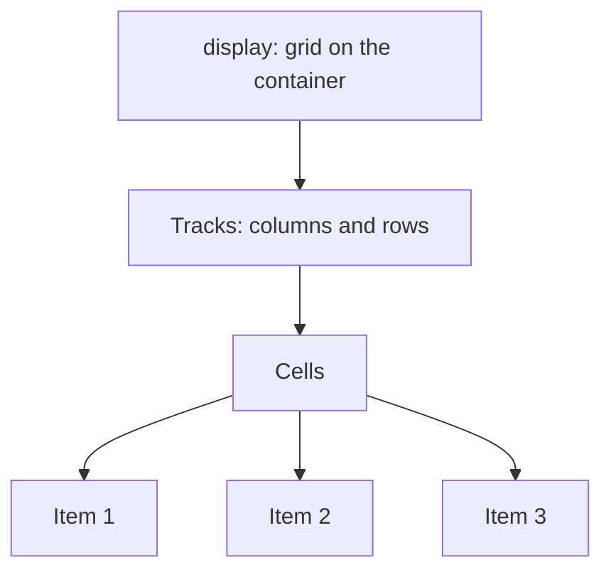

# Month 2 · Week 4 · Day 2
# CSS Grid — Two Axes, On Purpose

**Month index:** [../../README.md](../../README.md)  
**Week 4:** [1](day-01.md) · Day 2 (today) · [3](day-03.md) · [4](day-04.md) · [5](day-05.md) · [6](day-06.md) · [7](day-07.md)  
**Week rhythm today:** Exercises + debugging  
**Study time:** 3–4 focused hours  
**Prereq:** Day 1 Flexbox gate. You can draw main vs cross. Today you add a **second** axis.

---

## How to read this chapter

Flexbox was a **shelf**: one row or one column.

Grid is a **spreadsheet**: columns **and** rows at the same time, with gutters that line up.

A catalog of project cards should look like a table of equal columns, even when card text lengths differ. Flex wrap can **look** like a grid until the last row has two leftover cards that stretch oddly, or gutters fail to line up. That is when you wanted Grid.



The container defines **tracks** (the column widths and row heights). Children become **grid items** and sit in **cells**.

---

## Today's contract

By the end of this day you will be able to:

1. Explain Grid as **two-dimensional** layout (rows and columns together).
2. Define columns with `fr`, `repeat()`, `minmax()`, and `auto`.
3. Use `gap` as the gutter.
4. Place an item across columns with line numbers (`grid-column: 1 / 3`).
5. Build a simple page shell with `grid-template-areas`.
6. Choose Flex vs Grid with a decision rule, not taste.
7. Turn on the DevTools **grid overlay** and read tracks.

**Today's gate.** Closed-book:

> Grid is two-dimensional. `1fr 1fr 1fr` is three equal fractional columns. Cards are Grid; a card’s internal header+button is often Flex. I can say why in one sentence.

---

## Time box

| Block | Minutes | Work |
|---|---|---|
| A | 50 | Theory |
| B | 60 | Type-along: card grid + page areas |
| C | 45 | Observe crush at ~400px (do not media-query yet) |
| D | 20 | Git |
| E | 15 | Recall |

---

# Block A — Theory

## 1. What problem Grid solves

Flexbox is **one** axis. A **catalog of cards** that should line up in columns **and** rows, with aligned gutters, is two axes.

```css
.cards {
  display: grid;
  grid-template-columns: 1fr 1fr 1fr;
  gap: 1.5rem;
}
```

In English: “This container is a grid. Make three columns that share leftover width equally. Put 1.5rem of space between tracks.”

Children fill cells in order, **row by row**, unless you place them.

**Wrong belief:** “I can wrap Flex items and call it a grid.”  
**Correct:** Flex wrap is one-dimensional wrapping. Tracks do not form a true two-axis template. Use Grid for the catalog.

---

## 2. Tracks — the columns and rows you define

`grid-template-columns` and `grid-template-rows` accept a list of sizes:

| Size | Meaning |
|---|---|
| `200px` / `12rem` | fixed track |
| `1fr` | one **fraction** of **free** space (space left after fixed tracks and gaps) |
| `minmax(16rem, 1fr)` | not narrower than 16rem, can grow to take a fraction |
| `repeat(3, 1fr)` | same as `1fr 1fr 1fr` |
| `auto` | size from content |
| `repeat(auto-fit, minmax(16rem, 1fr))` | as many columns as fit — responsive **without** a media query |

**`1fr` is not “one fraction of the whole viewport.”** It is a share of **free** space in the **grid container** after you subtract gaps and any fixed tracks.

Three `1fr` columns: leftover width split equally.  
`200px 1fr 1fr`: first column 200px; the other two share what remains.

**`repeat(auto-fit, minmax(16rem, 1fr))`** is a powerful extra. You will still learn **media queries tomorrow**. Auto-fit is not a reason to skip breakpoints for nav and hero. Project 1 tests 375 / 768 / 1024 on purpose.

**`gap`** is the gutter between tracks. `row-gap` / `column-gap` if you split them. Prefer `gap` over margins on every card.

---

## 3. Lines — how spanning works

Grid **lines** are the numbers **between** tracks.

Three columns have **four** vertical lines: 1, 2, 3, 4.

```
line 1     line 2     line 3     line 4
   |  col1   |  col2   |  col3   |
```

```css
.wide {
  grid-column: 1 / 3; /* start at line 1, end at line 3 — spans two columns */
}
```

`grid-row: 1 / 3` is the same idea vertically.

By default, items auto-place in order. You only write line numbers when one item must span or jump.

**Wrong belief:** “`grid-column: 1 / 3` means columns 1 and 3.”  
**Correct:** it means **from line 1 to line 3**, which is columns 1 **and** 2.

---

## 4. Named areas — a page chrome you can read

```css
.page {
  display: grid;
  grid-template-areas:
    "header"
    "main"
    "footer";
  min-height: 100vh;
}

header { grid-area: header; }
main { grid-area: main; }
footer { grid-area: footer; }
```

Each quoted string is a **row**. Names must form **rectangles** (you cannot make an L-shaped area with one name).

On a wide screen you might later use:

```css
grid-template-areas:
  "header header"
  "nav    main"
  "footer footer";
```

This is **optional** for Project 1. A simple stacked page plus a **card** grid is enough. Named areas are here so you can read other people’s CSS and so a `min-height: 100vh` footer can sit at the bottom when content is short.

---

## 5. Flex vs Grid — a decision rule, not taste

| Situation | Choose |
|---|---|
| One row or one column of siblings | Flex |
| Rows **and** columns that must align | Grid |
| Nav: logo + links | Flex |
| Project cards | Grid |
| Inside a card: image, title, button | Flex column |
| Page header / footer bar | Flex |
| Form: two fields side by side on wide screens | Grid (`1fr 1fr`) or Flex; Grid lines up fields in a template |

You will **nest** them constantly:

```css
.cards {
  display: grid;
  grid-template-columns: 1fr 1fr 1fr;
  gap: 1.5rem;
}

.card {
  display: flex;
  flex-direction: column;
  gap: 0.75rem;
}
```

**Wrong belief:** “Pick one layout mode for the whole site.”  
**Correct:** Grid of cards, Flex inside each card, Flex nav. That is one page.

---

## 6. The overflow cousin: `minmax(0, 1fr)`

A grid track can refuse to shrink below min-content, similar to flex `min-width: auto`. A wide unbreakable item can blow a column.

`minmax(0, 1fr)` (or `minmax(16rem, 1fr)`) tells the track it **may** shrink. You met this family of bug yesterday. Same instinct: content minimums vs available space.

---

## 7. Debugging — the grid overlay

DevTools shows a **grid** badge on the container. Turn on the overlay. You will see tracks, lines, and gaps.

If a third column is crushed on a phone, you used three `1fr` tracks on a 375px viewport. **Tomorrow** you change the template at a breakpoint. Today **observe** the crush and write it down. Observation is the point. Do not “fix” it with a random `display: block` on every card.

---

# Block B — Type-along

Create `~\fullstack-lab\month-02\week-04\day-02\grid.html` and `grid.css`. Semantic document. `border-box`. Tokens. Focus-visible. Serve over HTTP.

### 1. Card grid

`main` contains a heading and a `div.cards` (or a list of `article` — either is fine if headings are honest) with **three** `article` cards.

```css
.cards {
  display: grid;
  grid-template-columns: 1fr 1fr 1fr;
  gap: 1.5rem;
}
```

Each card: Flex column (image placeholder, `h2`, `p`). Nested Flex is required so you practice yesterday **inside** today.

### 2. Page shell with areas

On `body` or a `.page` wrapper:

```css
.page {
  display: grid;
  grid-template-areas:
    "header"
    "main"
    "footer";
  min-height: 100vh;
}
```

Assign `grid-area` on `header`, `main`, `footer`.

Turn on the grid overlay. Screenshot or describe tracks in `OVERLAY.txt`.

---

# Block C — Observe crush (do not media-query yet)

Resize to about **400px** wide (DevTools device mode is fine).

Write in `CRUSH.txt`:

1. What happened to the three columns?
2. Did you get horizontal scroll?
3. Which tracks does the overlay show?
4. One sentence: what you **expect** Day 4 (media queries) to do about this.

Do **not** add `@media` today unless the page is truly unusable (then use a temporary single column and note that you jumped ahead). The lesson is to **see** the two-axis template fight a narrow viewport.

Optional: try `minmax(0, 1fr)` vs `1fr` on a card with a long unbreakable string. Write the difference.

```powershell
git add month-02/week-04/day-02
git commit -m "Week 4 Day 2: Grid cards and page areas."
```

---

# Block D — Recall

1. What `1fr` means (free space, not “the viewport”).
2. How many vertical lines three columns have.
3. Why cards are Grid and card innards are Flex.
4. What the grid overlay is for.
5. Why we wait until Day 4 to fix the phone crush.

---

## Definition of done

- [ ] Three-column card grid exists
- [ ] Each card is a Flex column
- [ ] Named areas page shell exists
- [ ] Overlay observed
- [ ] CRUSH.txt describes ~400px without pretending it is already responsive
- [ ] Commit exists

---

## Optional review links

Grid is explained above. These pages are for later checking, not for first learning.

- [MDN: Grid](https://developer.mozilla.org/en-US/docs/Learn_web_development/Core/CSS_layout/Grids)
- [MDN: `minmax()`](https://developer.mozilla.org/en-US/docs/Web/CSS/minmax)
- [MDN: Grid template areas](https://developer.mozilla.org/en-US/docs/Web/CSS/grid-template-areas)

---

## Tomorrow

From memory: a gallery that nests Grid (cards) and Flex (nav + card body). Then Day 4: **media queries** so the crush becomes a one-column default.
