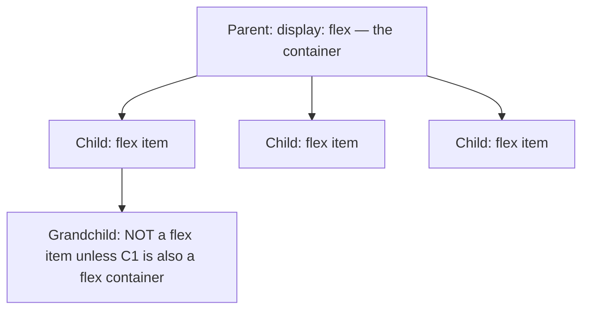

# Month 2 · Week 4 · Day 3
# From Memory: Flex and Grid

**Month index:** [../../README.md](../../README.md)  
**Week 4:** [1](day-01.md) · [2](day-02.md) · Day 3 (today) · [4](day-04.md) · [5](day-05.md) · [6](day-06.md) · [7](day-07.md)  
**Week rhythm today:** Implement from memory  
**Study time:** 3–4 focused hours  
**Days 1–2 of this week:** closed during the drills. Repair from **those day files in this textbook**, not from a layout cheatsheet.

---

## How to read this chapter

Days 1–2 taught one axis, then two. Today you **choose** both on a gallery: Grid for the field of cards, Flex for the nav and for each card’s innards.

The complete explanation is the lesson. Keep **this file** open. Keep Days 1–2 closed while you type. Write `CHOICE.txt` in a sentence **before** you decorate. A cramped three-column grid on a phone is allowed **today** — that crush is tomorrow’s media-query homework, not a reason to paste a breakpoint you cannot explain.



Serve over **HTTP**, not `file://`. Do not paste Project 1. Tomorrow’s exam brand (Northline Studio) is not today’s gallery. Invent a different catalog.

On Windows: `python -m http.server 5500` from `~\fullstack-lab`, then open the gallery at `http://127.0.0.1:5500/...`.

---

## Complete explanation (Flexbox + Grid)

**Flexbox** is **one-dimensional**. You set `display: flex` on a **container**. Its **children** become flex items along one **main axis**. Grandchildren are not items unless their parent is also a flex container.

`flex-direction`: `row` (main = horizontal in LTR) or `column` (main = vertical). Reverse directions also reverse visual order vs DOM — avoid for nav (keyboard order should match reading order).

**Cross axis** is perpendicular to main.

Container properties:

- `justify-content` — packing along the **main** axis (`flex-start`, `flex-end`, `center`, `space-between`, `space-around`, `space-evenly`).
- `align-items` — alignment on the **cross** axis (`stretch` default, `flex-start`, `flex-end`, `center`, `baseline`).
- `flex-wrap` — `nowrap` (default, items may overflow) or `wrap`.
- `align-content` — extra space between **wrapped lines** (only if wrapped).
- `gap` — space between items; prefer this over item margins for gutters.

Item properties:

- `flex-grow` — extra space share (0 = do not grow).
- `flex-shrink` — shrink factor (1 = may shrink).
- `flex-basis` — starting size before grow/shrink (`auto` ≈ content/`width`).
- Shorthand: `flex: 1` ≈ `1 1 0%` (or `1 1 0`); `flex: none` = `0 0 auto`; `flex: auto` = `1 1 auto`.
- `align-self` — override `align-items` for one item.
- `order` — visual reorder; **do not** use it to “fix” keyboard order. Change the HTML order instead.

**`min-width: auto` (the overflow trap):** a flex item will not shrink below its content’s minimum size by default. A long unbreakable string blows the layout. Fix: `min-width: 0` (row) or `min-height: 0` (column) on the item, and/or `overflow: auto`.

**Use Flex for:** nav (logo + links), a card’s internal column (image, title, button at the bottom), a form row of two fields, a hero’s internal alignment.

**Grid** is **two-dimensional**: rows **and** columns at once. `display: grid` on the container.

- `grid-template-columns` / `grid-template-rows` — track list. `1fr` is a share of free space. `repeat(3, 1fr)` three equal columns. `auto` sizes to content.
- `gap` — gutters.
- `grid-template-areas` — named regions (`header / main / footer`) plus `grid-area: header` on children.
- Item placement: `grid-column: 1 / 3` (start line / end line). Lines are numbered from 1.

**`minmax(0, 1fr)`** (or `minmax(16rem, 1fr)`) stops a track from overflowing because of min-content — same family of bug as flex `min-width: auto`.

**Use Grid for:** a **set of cards** in rows and columns; a page shell of named areas. Do not use Grid to space three links in a header — that is Flex.

**Wrong belief:** “Flex vs Grid is a matter of taste.”  
**Correct:** 1D vs 2D. You will nest them: Grid of cards, each card a Flex column.

No media queries required today if you cannot remember them — a cramped 3-column grid on a phone is allowed **today** and is the observation Week 4 Day 4 will fix.

If Days 1–2 are closed, you still need axes and tracks in full. The next sections are that lesson with pictures.

### Flex: the shelf, not the warehouse

Draw this every time you get lost:

```
flex-direction: row
Main  →→→→→     justify-content lives here
Cross ↓         align-items lives here

[ logo ] ........ [ a ] [ a ] [ a ]
```

`justify-content: space-between` on that header puts the wordmark on the start edge and the links on the end edge. `align-items: center` vertically centers them on the cross axis. `gap` separates the links. `flex-wrap: wrap` lets the links drop to a second line on a narrow viewport instead of overflowing.

**Worked example — nav (Flex):**

```css
.site-header {
  display: flex;
  flex-wrap: wrap;
  justify-content: space-between;
  align-items: center;
  gap: 1rem;
}

.site-nav {
  display: flex;
  flex-wrap: wrap;
  gap: 1rem;
}
```

Two flex containers: the header (wordmark | nav), and the nav (the links). Grandchildren (the `a` elements) are items of `.site-nav`, not of the header.

Do **not** `flex-direction: row-reverse` to put the logo on the right “because it looks cool.” Keyboard Tab still follows DOM order; visual reverse is a trap. Change HTML if the reading order is wrong. Do not use `order: 2` on a link to shuffle it.

**Wrong belief:** “`justify-content` is always horizontal.”  
**Correct:** it is always **main axis**. In a column flex, main is vertical, so justify is up/down.

### Flex items: grow, shrink, basis

On a card column (`flex-direction: column`), you often want the text block to grow so the link sits at the bottom:

```css
.card {
  display: flex;
  flex-direction: column;
  gap: 0.75rem;
}

.card p {
  flex: 1; /* grow to fill leftover height */
}
```

`flex: 1` is the shorthand you will use most: take leftover space. `flex: none` means “my size is my content; do not grow or shrink.”

Overflow trap, **row** flex: a child with a long URL. Default `min-width: auto` refuses to shrink below that string. The row blows past the viewport.

```css
.card {
  min-width: 0;
}
```

or `overflow-wrap: anywhere` on the text. Remember this when Day 4 hunts horizontal scroll.

### Grid: tracks and lines

```css
.gallery {
  display: grid;
  grid-template-columns: repeat(3, 1fr);
  gap: 1.5rem;
}
```

Three columns, equal **free** space, gutters from `gap`. Children fill **row by row**. Six articles → two rows of three. That is 2D: columns **and** rows are tracks of one template.

```
line1        line2        line3        line4
   |   col1    |   col2    |   col3    |
   |  card 1   |  card 2   |  card 3   |
   |  card 4   |  card 5   |  card 6   |
```

`1fr` is a share of **free space in the container**, not “one third of the laptop.” Gaps are subtracted first.

**`minmax(0, 1fr)`:** a `1fr` track’s default minimum is `auto` (min-content), which can overflow like flex’s `min-width: auto`. `minmax(0, 1fr)` lets the track shrink. `minmax(16rem, 1fr)` says “don’t go below 16rem” — on a 375px phone three such columns **will crush**. Today that crush is **allowed**. Tomorrow you change the template at a breakpoint.

Named areas (optional today):

```css
.page {
  display: grid;
  grid-template-areas:
    "header"
    "main"
    "footer";
}
.site-header { grid-area: header; }
```

Useful for a page shell. A gallery of six equal cards does **not** need areas — auto-placement is the point.

**Wrong belief:** “I’ll Grid the three nav links.”  
**Correct:** three links on one axis are Flex. Grid is the catalog.

### Nesting — the sentence CHOICE.txt must say

> The **page of cards** is two-dimensional (rows and columns) so it is **Grid**. Each **card’s body** is one column (image, title, text, link) so it is **Flex**.

That sentence is the gate. If you Grid the card innards and Flex-wrap the six articles, you inverted the tools. It might “look OK” at one width. It will fight you on Day 4.

Standing rules this month still apply: skip link, one `h1`, `border-box`, tokens, `:focus-visible`, no ID selectors, no framework, relative CSS path.

---

## Office hours — overflow, inverted tools, and keyboard

### The gallery overflows at 375 and you panic

Today, crush is **allowed**. Write it under the CHOICE sentence. Do not paste a media query you cannot explain. If the overflow is an **image** wider than its cell, that is not “the three-column crush” — that is missing `max-width: 100%` on `img`. Fix images even today.

```css
img {
  max-width: 100%;
  height: auto;
  display: block;
}
```

### You Flex-wrapped the six cards

`display: flex; flex-wrap: wrap` on `.gallery` can look like a grid at one width. It is still 1D wrapping. Tracks do not exist. Equal columns are an accident of item width. R5 tomorrow will fail. Use `display: grid` and `grid-template-columns`.

### You Grid the nav

Three links do not need columns and rows. Flex. If you already wrote `grid-template-columns: repeat(3, auto)` on the header, delete it and use the nav snippet above.

### Keyboard on the nav

Click the address bar (`Alt+D`), Tab to the skip link, then to each nav link. `order` or `row-reverse` will make Tab disagree with what you see. Fix HTML order. Every link must remain a real `<a href>`. A `div` with a click style is not a link.

**Wrong belief:** “If the cards look even, I used Grid.”  
**Correct:** open the CSS. `display: grid` on the gallery parent is the proof. Looks are not the tool.

### Card HTML shape (type it; invent titles)

```html
<article class="card">
  
  <h2>Night etching workshop</h2>
  <p>A six-week studio series for beginners.</p>
  <a href="#etching">Workshop details</a>
</article>
```

Decorative image → `alt=""`. Link text describes the destination, not “click here.” The `h2` is a card title under the page `h1`. Six of these. The parent of the six is the Grid.

### Tokens and border-box still apply (type if you go blank)

```css
*,
*::before,
*::after { box-sizing: border-box; }

:root {
  --text: #1a1a1a;
  --bg: #fafafa;
  --accent: #0b5fff;
  --space: 1rem;
}

body {
  color: var(--text);
  background: var(--bg);
  font-family: system-ui, sans-serif;
  line-height: 1.5;
}

a:focus-visible {
  outline: 2px solid var(--accent);
  outline-offset: 2px;
}
```

You still may not select `#gallery`. You still may not import Bootstrap. Relative `href="gallery.css"`. Confirm 200 in Network before you debug Flex.

### Skinny window: what to write

Resize or set DevTools to 375px. Three `1fr` columns will crush or overflow. One honest line: “375px: three columns crushed; cards unreadable; no media query added (allowed today).” If a **single image** caused sideways scroll, that is a different sentence — fix `max-width: 100%` and do not blame Grid.

**Wrong belief:** “Sticky header requires Flex on `body`.”  
**Correct:** `position: sticky; top: 0` on the header works in flow. Flex on `body` is not today’s spec. Header Flex is for wordmark + nav, not for the whole page.

---

## Today's gate

I can build a gallery whose **page of cards** is Grid and whose **card innards** are Flex, and I can say why in one sentence.

---

## Time box

| Block | Minutes | Work |
|---|---|---|
| A | 20 | Speak 1D vs 2D; draw main vs cross |
| B | 15 | Write `CHOICE.txt` (one sentence) |
| C | 100 | Build gallery.html + CSS from the spec |
| D | 30 | Keyboard nav; optional overflow note |
| E | 15 | Git |

---

Build `~\fullstack-lab\month-02\week-04\day-03\gallery.html` + CSS.

1. Sticky or static header with Flex nav (wordmark + 3 links, wrap, gap)
2. `main` with a Grid of **six** `article` cards, 3 columns
3. Each card: Flex column; image placeholder; `h2`; `p`; a link that is not “click here”
4. Semantic HTML; one `h1`; focus-visible; border-box; custom properties
5. `CHOICE.txt`: one sentence why the card **grid** is Grid and the card **body** is Flex

Also from this month’s standing rules (even when the numbered list is short):

- Skip link to `main`
- `lang`, charset, viewport, title, description
- Serve over HTTP
- Image placeholders: you may use a colored `div` with a word, or an `img` with honest `alt`. If you use `img`, keep `max-width: 100%` so one huge bitmap does not explode a cell.
- No CSS framework. No `order` on nav links. No ID selectors for styling.

Resize the window skinny. Write one line in `CHOICE.txt` under the sentence: what happened to the three columns (they crushed / overflowed). Do **not** add a media query unless you already remember Day 4’s lesson — the spec says cramped is allowed today.

```powershell
cd ~\fullstack-lab
git add month-02/week-04/day-03
git commit -m "Month 2 Day 3: gallery from memory with Flex and Grid."
```

---

## Definition of done

- [ ] Nav is Flex; cards are Grid; card body is Flex
- [ ] CHOICE.txt exists (sentence + skinny-window observation)
- [ ] Keyboard reaches every nav link
- [ ] Served over HTTP
- [ ] No Project 1 paste
- [ ] Commit exists

---

## Optional review links

Flex vs Grid is taught in this chapter and in Week 4 Days 1–2. Recheck later if you need a property name.

- [MDN: Flexbox](https://developer.mozilla.org/en-US/docs/Learn_web_development/Core/CSS_layout/Flexbox)
- [MDN: Grid](https://developer.mozilla.org/en-US/docs/Learn_web_development/Core/CSS_layout/Grids)
- [MDN: `min-width`](https://developer.mozilla.org/en-US/docs/Web/CSS/min-width) (the overflow trap)

---

## Tomorrow

Mobile-first media queries. You will **add** columns as the viewport grows. Today’s crush is the homework prompt, not a defect to hide with a copied breakpoint.
