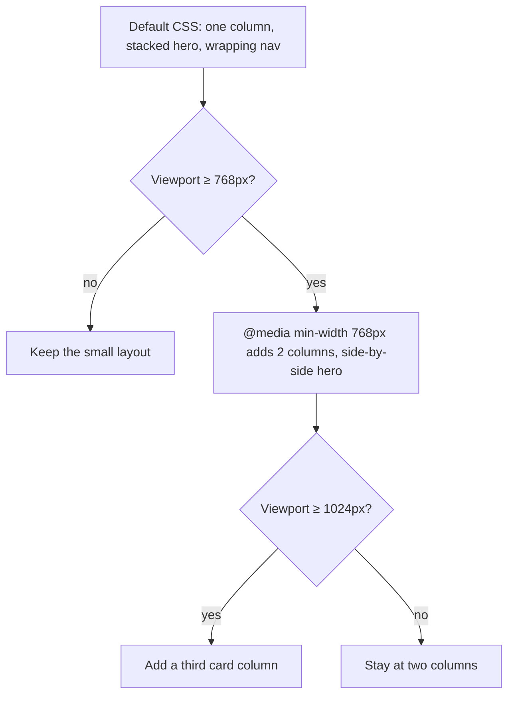

# Month 2 · Week 4 · Day 4
# Responsive UI: Media Queries, Mobile-First, Images

**Month index:** [../../README.md](../../README.md)  
**Week 4:** [1](day-01.md) · [2](day-02.md) · [3](day-03.md) · Day 4 (today) · [5](day-05.md) · [6](day-06.md) · [7](day-07.md)  
**Week rhythm today:** Add a real project feature  
**Study time:** 3–4 focused hours  
**Prereq:** You have a 3-column Grid that **crushes** on a phone. Today you make that crush a **choice**: one column by default, more columns when the viewport earns them.

Project 1 must work at ~375, 768, 1024, and a wide desktop with **no accidental horizontal scroll**. That is not a slogan. It is a checklist you will run with DevTools.

---

## How to read this chapter

A phone is not a different website. It is a **narrow viewport**. A laptop window dragged skinny is the same problem.

**Mobile-first** means: write the CSS for the **small** layout as the default. When the viewport is wide enough, **add** rules. You do not design a desktop masterpiece and then try to crush it with `max-width` queries.



The media query does not *replace* your CSS. It **joins the cascade** when the condition is true. Specificity still applies. A class rule inside a query still beats a type selector outside it the usual way.

---

## Today's contract

By the end of this day you will be able to:

1. Write `@media (min-width: …)` and explain it as a **viewport** condition, not a device name.
2. Build a **mobile-first** card grid: 1 → 2 → 3 columns.
3. Stop images from overflowing (`max-width: 100%; height: auto; display: block`).
4. Keep every nav link visible and keyboard-reachable at 375px (`flex-wrap`, not `display: none`).
5. Test 375, 768, 1024, and ~1400, plus a brief **400% zoom**.
6. Record what you saw — not what you hoped.

**Today's gate.** Closed-book:

> Mobile-first means the **default** CSS is the small screen. `min-width` media queries **add** complexity as the viewport grows. I do not hide an entire nav with `display: none` without a keyboard-accessible replacement.

---

## Time box

| Block | Minutes | Work |
|---|---|---|
| A | 45 | Theory |
| B | 80 | Upgrade the gallery to responsive.html |
| C | 40 | Viewport evidence |
| D | 20 | Git |
| E | 15 | Recall |

---

# Block A — Theory

## 1. What a media query is

A **media query** is a CSS condition. When it is true, the rules inside apply **in addition to** (and competing with) the rest of the cascade.

```css
.cards {
  display: grid;
  grid-template-columns: 1fr; /* default: phone */
  gap: 1rem;
}

@media (min-width: 768px) {
  .cards {
    grid-template-columns: 1fr 1fr;
  }
}
```

`(min-width: 768px)` is true when the **viewport** is at least 768 CSS pixels wide.

It is **not** “if the user bought an iPad.” A narrow desktop window is also small. A phone in landscape might pass 768. Test **widths**, not device names.

`max-width: 767px` is the other direction (“at most this wide”). This course writes **mobile-first**: default = small; `min-width` **adds**. Desktop-first (`max-width` to shrink a desktop design) is the opposite habit. Mixing both randomly is how you fight yourself for an hour.

Queries can combine: `@media (min-width: 768px) and (orientation: landscape)`. You do not need orientation this month.

**`prefers-reduced-motion`** is a media query about an **OS setting**, not width. Day 5 uses it. Same mental bucket: CSS that applies when a condition is true.

**Wrong belief:** “I’ll design desktop then slap a max-width query to shrink it.”  
**Correct:** that is desktop-first. This course is mobile-first. Small CSS is the foundation; large CSS is the extra.

**Wrong belief:** “768px means tablets.”  
**Correct:** 768px means the viewport is at least 768px. Resize a desktop window to see it fire.

---

## 2. Breakpoints this course actually tests

| Width | What you should see (typical Project 1) |
|---|---|
| **375px** | One column. Nav wraps. No horizontal scroll. Buttons may stack. |
| **768px** | Two card columns. Hero may become two columns. |
| **1024px** | Three card columns. Comfortable nav row. |
| **~1400px** | Same template; `max-width` on the page keeps a line length. Content does not stretch into unreadably long paragraphs. |
| **400% zoom** | Content **reflows**, not clips. If zoom breaks, widths or font sizes are too rigid. |

You do not need twenty breakpoints. Three `min-width` queries plus a max content width is enough for this month.

```css
.cards {
  display: grid;
  grid-template-columns: 1fr;
  gap: 1rem;
}

@media (min-width: 768px) {
  .cards {
    grid-template-columns: repeat(2, 1fr);
    gap: 1.5rem;
  }
}

@media (min-width: 1024px) {
  .cards {
    grid-template-columns: repeat(3, 1fr);
  }
}
```

Notice: you **override** `grid-template-columns`. You do not copy the entire `.cards` block. Cascade: same specificity, later (the query) wins when the query is true.

---

## 3. Viewport meta — why phones do not “zoom out” to 980px

You already have this in `head` from Week 1:

```html
<meta name="viewport" content="width=device-width, initial-scale=1">
```

Without it, many phones pretend the page is ~980px wide and shrink the whole canvas. Your 375px media query would **never match**. The layout would look like a tiny desktop. If “mobile” looks like a shrink-ray, check this tag first.

---

## 4. Responsive images

An image file has an **intrinsic** width. A 2000px PNG in a 375px column still **downloads** 2000px unless you provide smaller files. For Project 1, a reasonably sized image plus CSS is acceptable:

```css
img {
  max-width: 100%;
  height: auto;
  display: block;
}
```

| Declaration | Job |
|---|---|
| `max-width: 100%` | Never wider than the parent (stops horizontal scroll) |
| `height: auto` | Keep aspect ratio when width shrinks |
| `display: block` | Images are `inline` by default; that leaves a small gap under them like text. `block` removes it |

HTML `width` and `height` attributes tell the browser the aspect ratio **before** the file loads (less layout jump). They are not a substitute for `max-width: 100%`.

`srcset` and `sizes` let you offer multiple files (`photo-400.jpg 400w, photo-800.jpg 800w`) so the browser picks. Optional this month if you cannot export multiple resolutions.

`object-fit: cover` on a box with a fixed height **crops** the image to fill. Use on decorative heroes. Informative screenshots still need real `alt`.

Decorative images: `alt=""`. Informative: alt that names what the image **conveys**.

**Wrong belief:** “I’ll set `width: 375px` on images so they fit phones.”  
**Correct:** that fights tablets and zoom. Fluid: `max-width: 100%`.

---

## 5. Nav on small screens — keep the links

Project 1 honest pattern: **`flex-wrap`** so all links stay visible.

A hamburger menu hides links behind a control that must be a real `<button>`, keyboard operable, with `aria-expanded`, and usually **JavaScript**. Do not start there this month.

**Do not** `display: none` the entire `nav` on small screens. That removes it from the **accessibility tree**. Keyboard users cannot Tab to missing links. Screen reader users may not find them.

If links wrap to two lines, that is **success**, not failure. A slightly taller header is honest. A hidden nav is a trap.

---

## 6. Horizontal scroll — a bug, not a style

If you can swipe sideways at 375px, something is wider than the viewport.

Usual suspects (you have met them):

1. `width: 100%` + padding without `border-box`
2. An image without `max-width: 100%`
3. Flex item with `min-width: auto` and unbreakable content
4. A grid with three `1fr` columns on a 375px screen (fixed min-content blowing tracks)
5. A child with `width: 1200px` or a large negative margin

Procedure: DevTools → select `body` → look for the overflowing descendant (some browsers highlight overflow). Fix the child; do not `overflow-x: hidden` on `body` to **hide** the crime. Clipping can hide focus rings and sticky bugs.

---

## 7. What you are not doing today

- No CSS framework (Bootstrap, Tailwind, utility paste).
- No hamburger.
- No `max-width` queries that undo a desktop default.
- No `display: none` on nav.

---

# Block B — Feature: make the gallery responsive

Upgrade Day 3’s gallery (retype structure if needed — do not paste a mystery file) into `~\fullstack-lab\month-02\week-04\day-04\responsive.html` + `responsive.css`.

Required:

1. **Mobile-first** card grid: 1 column default; 2 at `min-width: 768px`; 3 at `min-width: 1024px`
2. Images (or placeholders) do not overflow: `max-width: 100%` on `img` if you have images; placeholders `max-width: 100%`
3. Flex nav with `flex-wrap`; every link Tab-reachable at 375px
4. `border-box` on `*`; custom properties; `:focus-visible`
5. Hero: stacked by default; two columns at 768px if you have a hero
6. Viewport meta present
7. No horizontal scroll at 375

Serve over HTTP. Use DevTools device mode **and** drag the window. Device mode can lie if the viewport meta is missing; the window resize does not.

---

# Block C — Evidence

`RESPONSIVE.txt` (or `VIEWPORTS.md`):

| Width | Columns | Nav | Horizontal scroll? | Notes |
|---|---|---|---|---|
| 375 | | | | |
| 768 | | | | |
| 1024 | | | | |
| ~1400 | | | | |

Brief 400% zoom: one sentence — reflow or clip?

If 375 scrolls, **fix it before git**. The table is evidence, not a wish list.

```powershell
git add month-02/week-04/day-04
git commit -m "Add mobile-first media queries and fluid images."
```

---

# Block D — Recall

1. What `(min-width: 768px)` actually tests.
2. Why this course is mobile-first.
3. Why viewport meta matters for queries.
4. Why not `display: none` on nav.
5. Three causes of horizontal scroll.

---

## Definition of done

- [ ] 1 → 2 → 3 column grid is mobile-first
- [ ] No horizontal scroll at 375
- [ ] Nav links all keyboard-reachable at 375
- [ ] RESPONSIVE.txt has four widths from **this** file
- [ ] No framework, no hamburger required
- [ ] Commit exists

---

## Optional review links

Media queries and fluid images are explained above. These pages are for later checking, not for first learning.

- [MDN: Using media queries](https://developer.mozilla.org/en-US/docs/Web/CSS/CSS_media_queries/Using_media_queries)
- [MDN: Responsive images](https://developer.mozilla.org/en-US/docs/Web/HTML/Guides/Responsive_images)
- [Project 1 workshop](../../../../project_guidance/project-01-accessible-responsive-portfolio/README.md) — build the portfolio after this week’s labs; do not paste today’s gallery into `~/portfolio/`

---

## Tomorrow

Motion is optional. If you animate, you must respect **`prefers-reduced-motion`**. Then you write the responsive **test checklist** Project 1 will have to survive.
